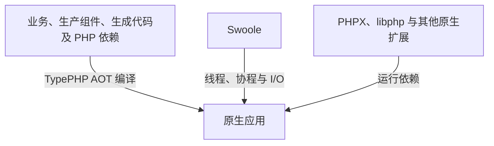

# TypeApp

TypeApp 是以 TypePHP 全量编译、Swoole 驱动运行、Plugins 组合能力的 PHP 应用框架。通信与基础并发必须使用 Swoole 官方能力。

**TypePHP 编译 · Swoole 运行 · Plugins 扩展。** Plugins 是 Composer 管理的 `type-xxxx` 框架组件的统称。其他业务系统用 `type-project` 创建独立应用，再按需安装组件；主仓附带的物联中心是成品案例。

业务、生产组件、生成代码与其他生产 PHP 依赖在构建期交给 [TypePHP](https://github.com/swoole/typephp) 全量编译。Swoole 原生扩展作为运行依赖提供线程、协程、网络与 I/O 能力，不作为 PHP 组件交给 TypePHP 编译。生产运行走已编译入口，仍依赖匹配的 PHPX、libphp 与实际使用的原生扩展。详细关系和编译边界见[系统架构](docs/guide/architecture.md)。

文档站：[iots.top](https://iots.top)。该地址提供项目说明与公开文档；业务 API、管理端和设备接入地址由部署环境决定。

## 已验证平台

**已验证平台：Linux x64 / ARM64、macOS ARM64、Windows x64。** 各平台已完成的原生编译与运行场景见[平台支持表](docs/guide/platforms.md#当前平台状态)。

| 平台 | 已验证范围摘要 |
| --- | --- |
| Linux x64 | 基础命令全量 AOT 与实际运行 |
| Linux ARM64 | 三库独立 ORM 的 PHP、AOT 和无源码运行 |
| macOS ARM64 | 三库 ORM、完整应用 AOT、三库身份 HTTP，以及已记录的通信场景 |
| Windows x64 | Swoole SDK 构建与加载、三库独立 ORM 的 PHP、AOT 和无源码运行 |

三库指 MySQL、PostgreSQL、SQLite。以上结果对应各自记录的源码与产物，完整应用、全部协议及单程序交付仍有待验收项；环境前提、证据身份和剩余限制统一见[平台与验收](docs/guide/platforms.md)。未列出的架构尚无已支持声明。

## 定位

| | 说明 |
| --- | --- |
| TypeApp | 统一应用开发、组件组合、构建和运行约定的 PHP 应用框架 |
| TypePHP | 构建期的 AOT 编译器，将生产 PHP 实现编译为原生代码 |
| Swoole | 运行期的原生扩展，提供线程、协程、网络与 I/O 能力 |
| Plugins | Composer 管理的 `type-xxxx` 框架组件，源码在 `plugin/type-*`；构建与测试工具按开发依赖使用 |
| 运行 | Swoole 是唯一通信与并发底层；进程、线程、协程按角色能力选择，协程上下文与资源边界见[运行时指南](docs/guide/runtime.md) |
| 编译 | 生产源码覆盖门槛为全量 AOT；这不是测试覆盖率，也不是全部 PHP 包或全部平台已验收 |
| 交付 | 一个程序文件加外置配置，原生运行库由程序携带和管理；当前打包仍为目录包，见[构建与部署](docs/guide/deployment.md) |
| 其他业务 | 用 `type-project` 创建独立应用，按需安装 Plugins |
| 物联中心 | 成品案例，不是框架本身；文档见[物联网中心](docs/guide/iot-center.md) |

当前锁定工具链为 PHP 8.5.10 ZTS、TypePHP 0.9.0、PHPX 2.9.0，以仓库中的 `toolchain.lock.json` 与 `composer.lock` 为准。



## 快速开始

开发 CLI 需要 PHP `>=8.4 <8.6`、Composer，以及所选数据库的 PDO 扩展；启动 HTTP 服务还需要匹配的 Swoole 扩展与 Unix 信号能力，见[快速开始](docs/guide/quickstart.md#准备环境)。创建独立应用：

```bash
git clone https://github.com/zoujingli/type-project.git my-app
cd my-app
php configure.php sqlite
composer install --no-scripts --no-plugins
php dev.php help
php dev.php serve
```

按需用 Composer 安装 Plugins，见[组件参考](docs/guide/components.md)与[快速开始](docs/guide/quickstart.md)。生产构建在应用根执行 `composer build`。

运行本仓库附带的成品案例物联中心，见[物联网中心](docs/guide/iot-center.md)。

## 仓库结构

```text
plugin/type-*/       Plugins，可独立组合的 Composer 包
templates/type-project/  独立业务应用起点
app/                 成品案例物联中心（common / admin / broker / iot）
web/                 物联中心 Vben Admin Pro 管理端
config/              成品案例的应用、数据库配置与路由声明
docs/guide/          公开使用指南（发布到 iots.top）
docs/development/    实现规范与验收方法，不进入公开站点
tests/               契约、真实依赖与原生验收
```

HTTP 路由来自控制器 `#[Route]` 或 `config/route.php`；`#[Transactional]`、`#[Cacheable]` 等声明同样在构建期生成显式代码。运行时不扫描未知目录，也不做 AOP 拦截。

## 文档

| 读者 | 入口 |
| --- | --- |
| 框架开发 | [公开指南](https://iots.top) · [快速开始](docs/guide/quickstart.md) · [系统架构](docs/guide/architecture.md) · [运行时指南](docs/guide/runtime.md) |
| 成品案例 | [物联网中心](docs/guide/iot-center.md) |
| 许可证 | [LICENSE](LICENSE) · [NOTICE](NOTICE) · [许可证说明](docs/guide/licensing.md) |
| 协作约定 | [CONTRIBUTING.md](CONTRIBUTING.md) · [AGENTS.md](AGENTS.md) |
| 术语与决策 | [CONTEXT.md](CONTEXT.md) · [架构决策](docs/adr/README.md) |

内部实现说明在 `docs/development/`；待完成能力与验收条件见[实现规划](docs/guide/roadmap.md)。

## 许可证

第一方源码、文档、示例、测试、配置、模板与 Web 应用按 [Apache License 2.0](LICENSE) 发布，版权主体为 Anyon。

`swoole/typephp` 为 GPL-3.0-only 的独立构建工具，不改变 TypeApp 第一方代码的许可证。Swoole、Vben Admin、Docsify 及其他依赖保留各自许可证，见 [NOTICE](NOTICE)。

## 贡献

需求与讨论在本仓库进行。提交须包含与作者身份一致的 `Signed-off-by`，验证步骤见 [CONTRIBUTING.md](CONTRIBUTING.md)。文档、注释与提交说明使用简体中文。
