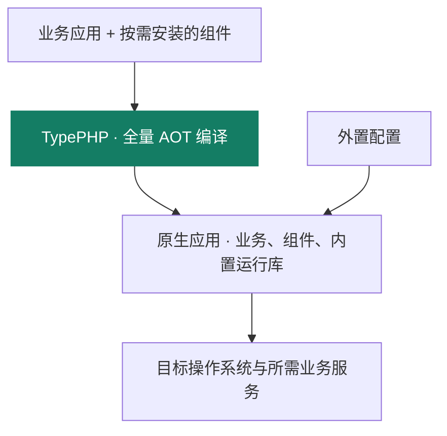

# TypeApp

TypeApp 是面向原生交付的 PHP 应用框架。用 PHP 编写业务，按需组合组件，通过 **TypePHP 全量 AOT 编译**生成原生应用。

框架提供通信、数据、任务与资源管理能力。Swoole 作为内置原生运行库提供网络与并发支持，由构建流程管理并随应用交付，无需在部署端单独安装。TypePHP 和 Composer 用于构建，业务请求不依赖它们。

**交付约定是一个主程序文件 + 外置配置文件，启动不释放运行库。当前仍生成携带原生依赖的目录包，完整静态单程序尚未完成。** 实际可用命令与验收差距见[构建与部署](docs/guide/deployment.md)；开发、构建和部署各需准备什么，见[环境与依赖](docs/guide/environment.md)。

文档站：[iots.top](https://iots.top)。新业务从 `type-project` 创建；主仓附带的物联中心展示框架如何组成业务产品。

## 从开发到运行



| 环节 | TypeApp 提供的能力 |
| --- | --- |
| 开发应用 | 显式装配、路由与中间件、三库 ORM、通信与后台任务 |
| 构建产物 | 提前生成路由、配置和模型；TypePHP 编译全部生产 PHP 输入，校验实际原生依赖 |
| 运行服务 | 复用内置运行库的网络与协程能力，以作用域、截止和预算控制资源 |
| 发布维护 | 记录产物身份和摘要，分开管理程序、配置与持久数据 |

TypePHP 的编译流程和输入边界见[TypePHP 全量编译](docs/guide/typephp.md)。生产代码的全量编译门槛不等于全部平台和协议已验收。当前锁定 PHP 8.5.10 ZTS、TypePHP 0.9.3、PHPX 2.9.2；工具链与生产依赖分别由 `toolchain.lock.json` 和 `composer.lock` 记录。

构建组件包含 Linux x64 / ARM64、macOS ARM64、Windows x64 的 Swoole 6.2.1 模块。匹配构建可直接复用；模块格式与 ABI、平台实测范围是不同的检查，见[平台与验收](docs/guide/platforms.md)。基础需求和已有入口见[基础能力](docs/guide/capabilities.md)，未完成项见[实现规划](docs/guide/roadmap.md)。

已验收源码 `bf28c8b` 的四平台默认原生 CI、15 组件批次与应用模板分发均已通过，16 个 Packagist `dev-main` 引用与 GitHub 一致。当前可使用开发版本和经验证的目录包；具体场景、隔离强度与未完成目标见[验收记录](docs/evidence/native-release-20260925.md)。

## 快速开始

以下命令用于跟进模板和组件子仓 `main` 的源码开发：准备 PHP `>=8.4 <8.6`、Composer、匹配的 Swoole 和所选 PDO 扩展。需要复现已发布批次时，使用[Composer 按版本安装](docs/guide/releases.md#composer-按版本安装)。完整环境分工见[环境与依赖](docs/guide/environment.md)，平台执行方式与验收范围见[平台与验收](docs/guide/platforms.md)。从 Packagist 创建独立应用，先选择数据库再安装依赖：

```bash
composer create-project --no-install --no-plugins --no-scripts zoujingli/type-project my-app dev-main
cd my-app
php configure.php sqlite
composer install --no-plugins --no-scripts
php dev.php help
php dev.php check
```

`dev-main` 是开发分支，不代表稳定版本；安装后提交应用的 `composer.lock`，固定实际依赖版本。`--no-install` 保留驱动选择窗口，`configure.php` 必须在首次安装前运行。接着按[第一个应用教程](docs/guide/tutorial.md)完成迁移、令牌配置和真实 HTTP 操作，再按需安装[框架组件](docs/guide/components.md)。生产构建在应用根执行 `composer build`。

也可先 `git clone https://github.com/zoujingli/type-project.git my-app`，再从上面的 `cd my-app` 继续。已有本地模板与 `type-build` 时，可用 `php /构建工具项目/vendor/bin/type create /本地模板目录 /新项目目录 sqlite` 创建应用；该入口已经选择驱动，无需再运行 `configure.php`。详细用法见[快速开始](docs/guide/quickstart.md)。

运行本仓库附带的成品案例物联中心，见[物联网中心](docs/guide/iot-center.md)。

物联中心前端随 TypePHP 构建编入主程序，首次 `app:install` 安装到 `public/`，升级可用 `web:install --dry-run --force` 预览后再执行 `web:install --force`。普通启动不释放资源，运行端无需 Node.js 或前端开发服务器。推送版本 tag 的四平台构建、同版本组件分发、Packagist 核验与 Release 顺序见[版本发布与安装](docs/guide/releases.md)。

## 仓库结构

```text
plugin/type-*/       Plugins，可独立组合的 Composer 包
templates/type-project/  独立业务应用起点
app/                 成品案例物联中心（common / admin / broker / iot）
web/                 物联中心 Vben Admin Pro 管理端
config/              成品案例的应用、数据库配置与路由声明
docs/guide/          公开使用指南（发布到 iots.top）
docs/development/    实现规范与验收方法，不进入公开站点
docs/evidence/       按原产物身份保留的历史验收记录
tests/               契约、真实依赖与原生验收
```

HTTP 路由来自控制器 `#[Route]` 或 `config/route.php`；`#[Transactional]`、`#[Cacheable]` 等声明同样在构建期生成显式代码。运行时不扫描未知目录，也不做 AOP 拦截。

## 文档

| 读者 | 入口 |
| --- | --- |
| 开始使用 | [公开指南](https://iots.top) · [环境与依赖](docs/guide/environment.md) · [快速开始](docs/guide/quickstart.md) · [第一个应用](docs/guide/tutorial.md) |
| 运行与交付 | [系统架构](docs/guide/architecture.md) · [性能与调优](docs/guide/performance.md) · [构建与部署](docs/guide/deployment.md) |
| 成品案例 | [物联网中心](docs/guide/iot-center.md) |
| 许可证 | [LICENSE](LICENSE) · [NOTICE](NOTICE) · [许可证说明](docs/guide/licensing.md) |
| 协作约定 | [CONTRIBUTING.md](CONTRIBUTING.md) · [AGENTS.md](AGENTS.md) |
| 术语与决策 | [CONTEXT.md](CONTEXT.md) · [架构决策](docs/adr/README.md) |

内部实现说明在 `docs/development/`；待完成能力与验收条件见[实现规划](docs/guide/roadmap.md)。

## 许可证

第一方源码、文档、示例、测试、配置、模板与 Web 应用按 [Apache License 2.0](LICENSE) 发布，版权主体为 Anyon。

`swoole/typephp` 为 GPL-3.0-only 的独立构建工具，不改变 TypeApp 第一方代码的许可证。Swoole、Vben Admin、Docsify 及其他依赖保留各自许可证，见 [NOTICE](NOTICE)。

## 贡献

需求与讨论在本仓库进行。提交须包含与作者身份一致的 `Signed-off-by`，验证步骤见 [CONTRIBUTING.md](CONTRIBUTING.md)。文档、注释与提交说明使用简体中文。
