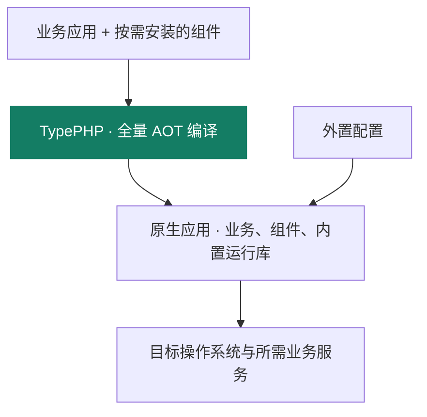

# TypeApp

TypeApp 是面向原生交付的 PHP 应用框架。用 PHP 编写业务，按需组合组件，通过 **TypePHP 全量 AOT 编译**生成原生应用。

框架提供通信、数据、任务与资源管理能力。Swoole 作为内置原生运行库提供网络与并发支持，由构建流程管理并随应用交付，无需在部署端单独安装。TypePHP 和 Composer 用于构建，业务请求不依赖它们。

**交付一个主程序文件，配置使用环境变量或外置文件，启动不释放运行库。** 已公开的 [RC14](https://github.com/zoujingli/typeapp/releases/tag/v1.0.0-rc.14) 按 Linux x64 / ARM64、macOS ARM64、Windows x64 × `sqlite`、`mysql`、`pgsql` 提供 12 个静态单程序；每个程序只包含对应 profile 的数据库驱动和已启用能力。按平台与数据库选择一个下载项；安装方法见[版本安装](docs/guide/releases.md)，系统基线与业务服务要求见[环境与依赖](docs/guide/environment.md)。

文档站：[iots.top](https://iots.top)。新业务从 `type-project` 创建；主仓附带的物联中心展示框架如何组成业务产品。

## 从开发到运行


```mermaid
flowchart TB
  Source["业务应用 + 按需安装的组件"] --> Build["TypePHP · 全量 AOT 编译"]
  Build --> App["原生应用 · 业务、组件、内置运行库"]
  Config["外置配置"] --> App
  style Build fill:#147d64,color:#ffffff,stroke:#147d64,stroke-width:2px
  App --> Env["目标操作系统与所需业务服务"]
```

| 环节 | TypeApp 提供的能力 |
| --- | --- |
| 开发应用 | 显式装配、路由与中间件、三库 ORM、通信与后台任务 |
| 构建产物 | 提前生成路由、配置和模型；TypePHP 编译全部生产 PHP 输入，校验实际原生依赖 |
| 运行服务 | 复用内置运行库的网络与协程能力，以作用域、截止和预算控制资源 |
| 发布维护 | 记录产物身份和摘要，分开管理程序、配置与持久数据 |

TypePHP 的编译流程和输入边界见[TypePHP 全量编译](docs/guide/typephp.md)。生产代码的全量编译门槛不等于全部平台和协议已验收。当前源码锁定 PHP 8.5.10 ZTS、TypePHP 0.9.4、PHPX 2.9.3；工具链与生产依赖分别由 `toolchain.lock.json` 和 `composer.lock` 记录。新版的实际验收结果见[升级记录](docs/evidence/typephp-upgrade-0.9.4.md)，RC13 仅作为历史对照保留。

构建组件另附 Linux x64 / ARM64、macOS ARM64、Windows x64 的 Swoole 共享模块，用于开发及共享库回归；生产单程序使用静态 SDK。当前固定 6.3 开发快照 `4aff74a`，运行时版本字符串为 `6.3.0RC1`，不是正式 6.3.0。模块 ABI 与平台实测范围分别核对，见[平台与验收](docs/guide/platforms.md)。基础需求和已有入口见[基础能力](docs/guide/capabilities.md)，未完成项见[实现规划](docs/guide/roadmap.md)。

`v1.0.0-rc.14` 已通过新版工具链的四平台完整回归、十二个单程序验收及公开消费，并完成主仓、15 个组件和应用模板的 Release。16 个 Packagist 版本及公开下载摘要已回读核对。准确源码、运行 ID 与未测范围见[升级验收记录](docs/evidence/typephp-upgrade-0.9.4.md)。RC 仍是预发布版本；RC13 的标签与原始证据保留作为历史对照。

## 快速开始

开发机准备 PHP `>=8.4 <8.6`、Composer、匹配的 Swoole 和所选 PDO 扩展，具体分工见[环境与依赖](docs/guide/environment.md)。按[版本安装示例](docs/guide/releases.md#composer-按版本安装)创建 `my-app`，选择数据库，将模板与组件固定到 `1.0.0-rc.14`，然后在应用根目录执行：

```bash
php dev.php help
php dev.php check
```

安装后提交应用的 `composer.lock`，固定实际依赖版本。接着按[第一个应用教程](docs/guide/tutorial.md)完成迁移、令牌配置和真实 HTTP 操作，再按需安装[框架组件](docs/guide/components.md)。生产构建还须准备目标平台的静态 SDK，按[构建与部署](docs/guide/deployment.md)执行 `composer build`。

本地模板与 Git tag 创建方式见[快速开始](docs/guide/quickstart.md)。`dev-main` 跟进子仓开发分支，不一定与当前 RC 相同；按版本安装才能复现本批次。

运行本仓库附带的成品案例物联中心，见[物联网中心](docs/guide/iot-center.md)。

当前 `main` 补齐了配置与角色预检、生产错误关联、业务就绪探针、维护调度停止及 `app:upgrade` 升级入口；这些修改未包含在已发布的 RC14 中。使用新入口须从对应源码构建；操作顺序与实际平台验收范围见[构建与部署](docs/guide/deployment.md)和[实现规划](docs/guide/roadmap.md#启动与运行收口)。

物联中心前端随 TypePHP 构建编入主程序，首次 `app:install` 安装到 `public/`，升级可用 `web:install --dry-run --force` 预览后再执行 `web:install --force`。普通启动不释放资源，运行端无需 Node.js 或前端开发服务器。推送版本 tag 的四平台构建、同版本组件分发、Packagist 核验与 Release 顺序见[版本发布与安装](docs/guide/releases.md)。

## 仓库结构

```text
plugin/type-*/       Plugins，可独立组合的 Composer 包
templates/type-project/  独立业务应用起点
app/                 成品案例物联中心（common / admin / broker / iot）
web/                 物联中心 Vben Admin Pro 管理端
config/              成品案例的应用、数据库配置与路由声明
docs/guide/          公开使用指南（发布到 iots.top）
docs/development/    实现规范与验收方法，不进入公开站点
docs/evidence/       按原产物身份保留的历史验收记录
tests/               契约、真实依赖与原生验收
```

HTTP 路由来自控制器 `#[Route]` 或 `config/route.php`；`#[Transactional]`、`#[Cacheable]` 等声明同样在构建期生成显式代码。运行时不扫描未知目录，也不做 AOP 拦截。

## 文档

| 读者 | 入口 |
| --- | --- |
| 开始使用 | [公开指南](https://iots.top) · [环境与依赖](docs/guide/environment.md) · [快速开始](docs/guide/quickstart.md) · [第一个应用](docs/guide/tutorial.md) |
| 运行与交付 | [系统架构](docs/guide/architecture.md) · [性能与调优](docs/guide/performance.md) · [构建与部署](docs/guide/deployment.md) |
| 成品案例 | [物联网中心](docs/guide/iot-center.md) |
| 许可证 | [LICENSE](LICENSE) · [NOTICE](NOTICE) · [许可证说明](docs/guide/licensing.md) |
| 协作约定 | [CONTRIBUTING.md](CONTRIBUTING.md) · [AGENTS.md](AGENTS.md) |
| 术语与决策 | [CONTEXT.md](CONTEXT.md) · [架构决策](docs/adr/README.md) |

内部实现说明在 `docs/development/`；待完成能力与验收条件见[实现规划](docs/guide/roadmap.md)。

## 许可证

第一方源码、文档、示例、测试、配置、模板与 Web 应用按 [Apache License 2.0](LICENSE) 发布，版权主体为 Anyon。

`swoole/typephp` 为 GPL-3.0-only 的独立构建工具，不改变 TypeApp 第一方代码的许可证。Swoole、Vben Admin、Docsify 及其他依赖保留各自许可证，见 [NOTICE](NOTICE)。

## 贡献

需求与讨论在本仓库进行。提交须包含与作者身份一致的 `Signed-off-by`，验证步骤见 [CONTRIBUTING.md](CONTRIBUTING.md)。文档、注释与提交说明使用简体中文。
