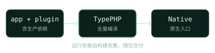
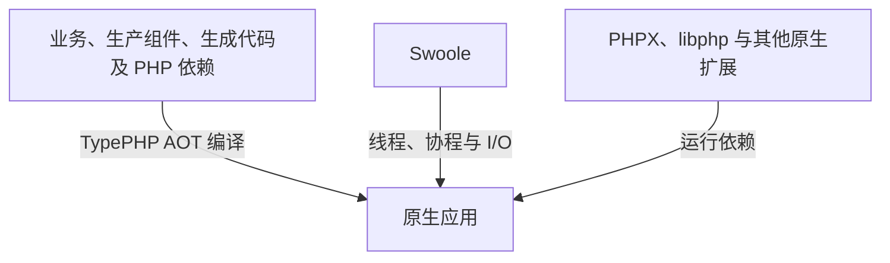

<section class="hero" aria-labelledby="hero-title">
  

    
 标准极简框架 · 开发文档

    <h1 id="hero-title" tabindex="-1">TypeApp极简构建， 原生运行。</h1>
    
以 TypePHP 全量编译、Swoole 驱动运行、 Plugins 组合能力的 PHP 应用框架。

    

      <a class="primary" href="#/guide/quickstart">开始使用 ↗</a>
      <a class="secondary" href="#/guide/components">Plugins →</a>
    

    
TypePHP 编译 · Swoole 运行 · Plugins 扩展

  

  

    <figure class="code-preview" aria-labelledby="preview-caption">
      <figcaption id="preview-caption">Route.php <small>· HTTP 路由声明</small><button class="preview-toggle" type="button" hidden>暂停动效</button></figcaption>
      

        
01 02 03 04 05

        <code class="preview-code">#[Route(
    path: '/status',
    methods: ['GET'],
    name: 'status'
)]</code>
      

      
$<code class="preview-command">php vendor/bin/type build</code>

      

      
TypePHP 全量编译<a href="#/guide/architecture">查看系统架构 ↗</a>

    </figure>
  

</section>

> **已验证平台：Linux x64 / ARM64、macOS ARM64、Windows x64。** 各平台已完成的原生编译与运行场景见[平台支持表](guide/platforms.md#当前平台状态)。完整应用、全部协议及单程序交付仍有待验收项。

  
01 / TYPEPHP<h2>全量编译</h2>
生产 PHP 实现与生成代码， 在构建期编译为原生代码。

  
02 / SWOOLE<h2>通信与并发底层</h2>
统一使用官方通信与并发能力， 减少开发和平台适配成本。

  
03 / PLUGINS<h2>Plugins</h2>
框架组件由 Composer 管理， 按需安装 <code>type-xxxx</code>。

## 从这里开始

TypeApp 是标准极简框架。先创建自己的应用并组合 Plugins；通信与基础并发必须使用 Swoole。生产交付约定为一个程序文件加外置配置，当前打包进度见[构建与部署](guide/deployment.md)。物联中心是基于框架构建的成品案例。

  <a class="start-guide" href="#/guide/quickstart">
    &gt;_
    FRAMEWORK / 框架<strong>开发 TypeApp 应用</strong>用 type-project 创建项目，Composer 安装组件，经 TypePHP 编译运行。
    ↗
  </a>
  <a class="case-guide" href="#/guide/iot-center">
    CASE / 案例<strong>物联中心</strong>平台管理端与租户 SaaS：设备、物模型、遥测与 MQTT。不是框架本身。
    ↗
  </a>

  <a class="guide-card" href="#/guide/architecture">00 ↗<strong>系统架构</strong>理解 TypeApp、TypePHP、Swoole 与 Plugins 的职责及关系。ARCHITECTURE</a>
  <a class="guide-card" href="#/guide/runtime">01 ↗<strong>进程、线程与协程</strong>掌握执行层次、协程上下文、资源所有权与停止控制。RUNTIME</a>
  <a class="guide-card" href="#/guide/structure">02 ↗<strong>应用结构</strong>组织控制器、服务与模型，让业务拥有清晰的边界。APPLICATION</a>
  <a class="guide-card" href="#/guide/configuration">03 ↗<strong>配置与环境</strong>管理环境变量与启动配置，区分构建声明和运行数据。CONFIGURATION</a>
  <a class="guide-card" href="#/guide/routing">04 ↗<strong>路由与中间件</strong>声明路由、接收请求，将业务逻辑连接到 HTTP 服务。HTTP & ROUTING</a>
  <a class="guide-card" href="#/guide/database">05 ↗<strong>数据库与模型</strong>使用 MySQL、PostgreSQL 或 SQLite，处理查询与事务。DATABASE</a>
  <a class="guide-card" href="#/guide/components">06 ↗<strong>组件参考</strong>了解各 Plugins 的职责与接口，按应用需要组合。PLUGINS</a>
  <a class="guide-card" href="#/guide/communications">07 ↗<strong>基础通信</strong>HTTP、TCP、UDP、MQTT、WebSocket 独立教程：配置、实例与应用。COMMUNICATIONS</a>
  <a class="guide-card" href="#/guide/deployment">08 ↗<strong>构建与部署</strong>从声明生成到全量编译，封装并运行原生应用。BUILD & DEPLOY</a>
  <a class="guide-card" href="#/guide/documentation">09 ↗<strong>文档站发布</strong>导出 Docsify 静态站点并发布到 iots.top，保持公开内容可追溯。DOCUMENTATION</a>
  <a class="guide-card" href="#/guide/licensing">10 ↗<strong>许可证与归属</strong>查看 Apache-2.0 授权、作者与第三方依赖的原始许可证。LICENSING</a>
  <a class="guide-card" href="#/guide/platforms">11 ↗<strong>平台与验收</strong>查看各平台已通过的场景、SDK 前提和完整交付条件。PLATFORMS</a>

## 理解 TypeApp

TypeApp 统一应用开发、组件组合、构建与运行约定。TypePHP 是构建期的编译器；Swoole 是提供进程、线程、协程、网络与 I/O 的原生扩展；Plugins 是 Composer 管理的 `type-xxxx` 框架组件。新的独立业务从 `type-project` 起步，按需安装组件。进程、线程、协程的执行边界和协程上下文见[运行时指南](guide/runtime.md)。

业务、生产组件、生成代码与其他生产 PHP 依赖进入同一次 AOT 构建。Swoole 原生扩展作为运行依赖提供能力，不是交给 TypePHP 编译的 PHP 组件。完整职责、运行依赖及编译边界见[系统架构](guide/architecture.md)。

## 使用前了解

本站主体是 TypeApp 标准极简框架的开发文档。物联中心是成品案例，文档在独立分组；部署后的 API、管理端和设备接入地址由你自己的环境决定。

源码入口：[TypeApp 主仓](https://github.com/zoujingli/typeapp)、[15 个 Plugins](guide/components.md#组件一览)与 [type-project 应用模板](https://github.com/zoujingli/type-project)。第一方内容统一采用 Apache-2.0，独立仓库附 LICENSE 与 NOTICE。

安装文档使用公开仓库的 HTTPS 地址，无需 SSH 密钥即可获取源码。组件尚未发布稳定版本，开发分支不代表稳定交付；安装后请提交应用的 `composer.lock`。

全量编译指生产实现进入 TypePHP 的覆盖门槛，不是测试覆盖率，也不是全部 PHP 包或全部平台已经验收。平台支持按所列架构与实际场景成立，环境前提、证据身份与完整交付条件见[平台与验收](guide/platforms.md)。
