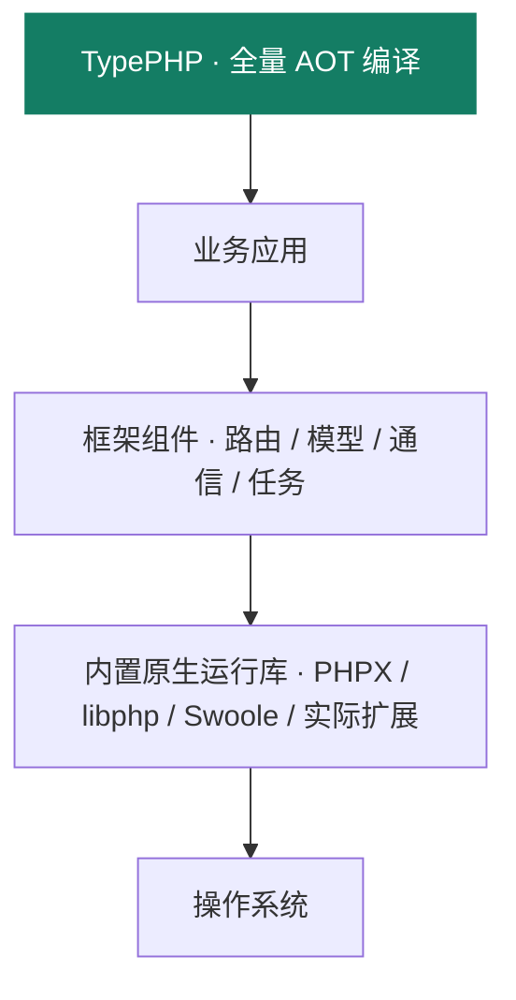

<section class="hero" aria-labelledby="hero-title">
  <div class="hero-copy">
    <p class="eyebrow"><span></span> PHP 应用框架 · 开发文档</p>
    <h1 id="hero-title" tabindex="-1">TypeApp<span>极简构建，<br>原生运行。</span></h1>
    <p class="intro">用 PHP 编写业务，以 TypePHP 全量编译。<br>构建原生应用，让部署回归程序与配置。</p>
    <div class="hero-actions">
      <a class="primary" href="#/guide/quickstart">开始使用 <span aria-hidden="true">↗</span></a>
      <a class="secondary" href="#/guide/environment">环境与依赖 <span aria-hidden="true">→</span></a>
    </div>
    <p class="hero-caption">PHP 开发 · TypePHP 编译 · 原生交付</p>
  </div>
  <div class="hero-visual">
    <figure class="code-preview" aria-labelledby="preview-caption">
      <figcaption id="preview-caption"><span class="preview-led" aria-hidden="true"></span><span>Route.php <small>· HTTP 路由声明</small></span><button class="preview-toggle" type="button" hidden>暂停动效</button></figcaption>
      <div class="preview-editor" aria-hidden="true">
        <div class="preview-gutter">01<br>02<br>03<br>04<br>05</div>
        <code class="preview-code">#[Route(
    path: '/status',
    methods: ['GET'],
    name: 'status'
)]</code>
      </div>
      <div class="preview-terminal" aria-hidden="true"><span class="preview-prompt">$</span><code class="preview-command">php vendor/bin/type build</code></div>
      <div class="preview-flow"><span class="preview-signal" aria-hidden="true"></span></div>
      <div class="preview-footer"><span class="preview-status">TypePHP 全量编译</span><a href="#/guide/architecture">查看系统架构 <span aria-hidden="true">↗</span></a></div>
    </figure>
  </div>
</section>

> **交付目标：一个主程序文件 + 外置配置文件，启动不释放运行库。** 当前提供携带原生依赖的目录包，完整静态单程序仍待完成；现阶段按[构建与部署](guide/deployment.md)整体交付运行包。

<div class="feature-grid">
  <div><span class="feature-number">01 / DEVELOP</span><h2>按业务组合</h2><p>路由、模型、通信与任务，<br>通过组件形成应用。</p></div>
  <div><span class="feature-number">02 / TYPEPHP</span><h2>全量原生编译</h2><p>TypePHP 编译生产实现，<br>装配与依赖校验提前完成。</p></div>
  <div><span class="feature-number">03 / DEPLOY</span><h2>专注应用运行</h2><p>运行库随应用交付，<br>维护配置与业务数据。</p></div>
</div>

## 从这里开始

从 `type-project` 创建应用，用 Composer 安装所需的框架组件，再编译和验证自己的业务。先阅读[环境与依赖](guide/environment.md)区分开发机、构建机与部署机；[基础能力](guide/capabilities.md)帮助确定应用需要哪些组件。物联中心展示设备接入与多租户业务的组合方式。

<div class="doc-paths">
  <a class="start-guide" href="#/guide/quickstart">
    <span class="start-symbol" aria-hidden="true">&gt;_</span>
    <span class="start-copy"><span class="guide-kicker">FRAMEWORK / 框架</span><strong>开发 TypeApp 应用</strong><span>用 type-project 创建项目，Composer 安装组件，经 TypePHP 编译运行。</span></span>
    <span class="guide-arrow" aria-hidden="true">↗</span>
  </a>
  <a class="case-guide" href="#/guide/iot-center">
    <span class="start-copy"><span class="guide-kicker">CASE / 案例</span><strong>物联中心</strong><span>平台管理端与租户 SaaS：设备、物模型、遥测与 MQTT。不是框架本身。</span></span>
    <span class="guide-arrow" aria-hidden="true">↗</span>
  </a>
</div>

## 创建第一个应用

```bash
composer create-project --no-install --no-plugins --no-scripts zoujingli/type-project my-app dev-main
cd my-app
php configure.php sqlite
composer install --no-plugins --no-scripts
php dev.php help
php dev.php check
```

先选择数据库，再安装依赖；`dev-main` 是开发分支，不代表稳定版本。提交应用的 `composer.lock`，固定实际安装版本。[第一个应用教程](guide/tutorial.md)带你完成迁移、HTTP 增删改查和原生构建；已有本地模板或需要 Git 检出的用户，可使用[快速开始](guide/quickstart.md)中的 `type create` 或 clone 入口。

<div class="guide-grid">
  <a class="guide-card" href="#/guide/typephp"><span class="guide-index">AOT <span aria-hidden="true">↗</span></span><strong>TypePHP 全量编译</strong><span>从 PHP 生产实现到原生程序，理解编译流程、覆盖范围与验证边界。</span><span class="guide-meta">TYPEPHP</span></a>
  <a class="guide-card" href="#/guide/capabilities"><span class="guide-index">MAP <span aria-hidden="true">↗</span></span><strong>基础能力与验收</strong><span>按应用需要选择组件，明确现有入口、行为要求与交付缺口。</span><span class="guide-meta">CAPABILITIES</span></a>
  <a class="guide-card" href="#/guide/architecture"><span class="guide-index">00 <span aria-hidden="true">↗</span></span><strong>系统架构</strong><span>了解业务、框架组件与内置运行库的分层，以及构建和运行边界。</span><span class="guide-meta">ARCHITECTURE</span></a>
  <a class="guide-card" href="#/guide/runtime"><span class="guide-index">01 <span aria-hidden="true">↗</span></span><strong>进程、线程与协程</strong><span>掌握执行层次、协程上下文、资源所有权与停止控制。</span><span class="guide-meta">RUNTIME</span></a>
  <a class="guide-card" href="#/guide/structure"><span class="guide-index">02 <span aria-hidden="true">↗</span></span><strong>应用结构</strong><span>组织控制器、服务与模型，让业务拥有清晰的边界。</span><span class="guide-meta">APPLICATION</span></a>
  <a class="guide-card" href="#/guide/configuration"><span class="guide-index">03 <span aria-hidden="true">↗</span></span><strong>配置与环境</strong><span>管理环境变量与启动配置，区分构建声明和运行数据。</span><span class="guide-meta">CONFIGURATION</span></a>
  <a class="guide-card" href="#/guide/routing"><span class="guide-index">04 <span aria-hidden="true">↗</span></span><strong>路由与中间件</strong><span>声明路由、接收请求，将业务逻辑连接到 HTTP 服务。</span><span class="guide-meta">HTTP & ROUTING</span></a>
  <a class="guide-card" href="#/guide/database"><span class="guide-index">05 <span aria-hidden="true">↗</span></span><strong>数据库与模型</strong><span>使用 MySQL、PostgreSQL 或 SQLite，处理查询与事务。</span><span class="guide-meta">DATABASE</span></a>
  <a class="guide-card" href="#/guide/components"><span class="guide-index">06 <span aria-hidden="true">↗</span></span><strong>组件参考</strong><span>了解各 Plugins 的职责与接口，按应用需要组合。</span><span class="guide-meta">PLUGINS</span></a>
  <a class="guide-card" href="#/guide/communications"><span class="guide-index">07 <span aria-hidden="true">↗</span></span><strong>基础通信</strong><span>HTTP、TCP、UDP、MQTT、WebSocket 独立教程：配置、实例与应用。</span><span class="guide-meta">COMMUNICATIONS</span></a>
  <a class="guide-card" href="#/guide/deployment"><span class="guide-index">08 <span aria-hidden="true">↗</span></span><strong>构建与部署</strong><span>从源码构建到运行交付，明确程序、配置与持久数据的责任。</span><span class="guide-meta">BUILD & DEPLOY</span></a>
  <a class="guide-card" href="#/guide/documentation"><span class="guide-index">09 <span aria-hidden="true">↗</span></span><strong>文档站发布</strong><span>导出 Docsify 静态站点并发布到 iots.top，保持公开内容可追溯。</span><span class="guide-meta">DOCUMENTATION</span></a>
  <a class="guide-card" href="#/guide/licensing"><span class="guide-index">10 <span aria-hidden="true">↗</span></span><strong>许可证与归属</strong><span>查看 Apache-2.0 授权、作者与第三方依赖的原始许可证。</span><span class="guide-meta">LICENSING</span></a>
  <a class="guide-card" href="#/guide/platforms"><span class="guide-index">11 <span aria-hidden="true">↗</span></span><strong>平台与验收</strong><span>查看各平台已通过的场景、SDK 前提和完整交付条件。</span><span class="guide-meta">PLATFORMS</span></a>
  <a class="guide-card" href="#/guide/environment"><span class="guide-index">12 <span aria-hidden="true">↗</span></span><strong>环境与依赖</strong><span>分别准备开发、构建与部署环境，确认应用所需的业务服务。</span><span class="guide-meta">ENVIRONMENT</span></a>
  <a class="guide-card" href="#/guide/performance"><span class="guide-index">13 <span aria-hidden="true">↗</span></span><strong>性能与调优</strong><span>理解低开销与高并发机制，按真实负载调优并验证容量。</span><span class="guide-meta">PERFORMANCE</span></a>
</div>

## 理解 TypeApp

应用通过框架组件使用通信、数据和后台任务。内置原生运行库负责执行支持与 I/O，Swoole 是其中提供网络和并发能力的库，由框架接入并随应用交付；部署无需单独安装 Swoole 或另起一个 Swoole 服务。选择它的原因与责任边界见[系统架构](guide/architecture.md#为什么内置-swoole)。



TypePHP 和 Composer 位于构建侧；生产运行执行已编译的业务与组件。运行效率来自构建期准备、可让出的 I/O 与有界资源管理，实际容量由负载测量决定，见[性能与调优](guide/performance.md)。

## 使用前了解

本站主体是 TypeApp 应用框架的开发文档。物联中心是成品案例，文档在独立分组；部署后的 API、管理端和设备接入地址由你自己的环境决定。

源码入口：[TypeApp 主仓](https://github.com/zoujingli/typeapp)、[15 个 Plugins](guide/components.md#组件一览)与 [type-project 应用模板](https://github.com/zoujingli/type-project)。第一方内容统一采用 Apache-2.0，独立仓库附 LICENSE 与 NOTICE。

应用模板和框架组件通过 Packagist 分发，Composer 自动解析传递依赖，无需逐一配置 Git 仓库。公开分发子仓保留源码、许可证与变更记录；当前使用开发版本，稳定交付范围以各平台实际验收为准。

Linux x64 / ARM64、macOS ARM64、Windows x64 均有原生验证记录，各自通过的场景不同；环境前提与证据身份见[平台与验收](guide/platforms.md)。全量编译指生产实现进入 TypePHP 的覆盖门槛，不等于测试覆盖率或所有 PHP 包兼容。
