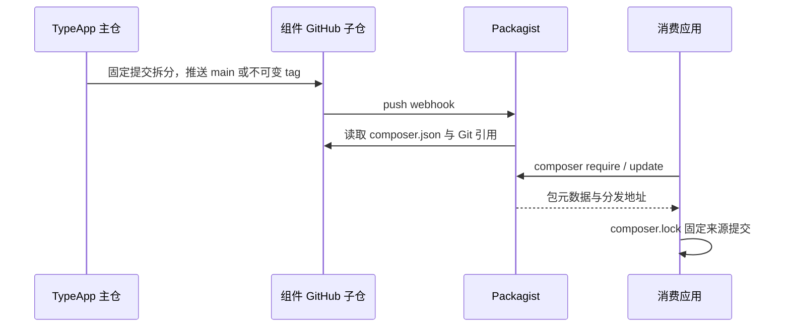

# 组件组织、安装与实施标准

开发主仓同时承载 TypeApp 的 `plugin/` 独立组件，以及 `app/` 中的成品案例物联中心。TypePHP 负责编译，Swoole 提供原生运行能力，Plugins 由 Composer 管理；职责关系见[系统架构](../guide/architecture.md)。物联中心不是框架本身；其他业务用 `type-project` 创建独立应用。两者通过根 Composer 组合，但应用目录不是组件源码目录，组件分发也不复制整个应用。职责清晰和稳定的调用入口比机械增加目录层数更重要。

## 应用与组件的布局

| 位置 | 职责与约束 |
| --- | --- |
| `app/` | 成品案例物联中心的业务源码，使用 `app\` PSR-4 与小写职责目录；可同时有一级和任意多级模块 |
| `app/iot/`、`web/` | 物联网业务及Vben管理端；身份、设备、接收、控制、转移和恢复由业务所有者维护，不进入组件分发 |
| `config/*.php`（不含 `route.php`） | 显式选择的受限配置声明，构建时解析为可编译类；不执行任意配置代码 |
| `app/*`、`config/route.php` | 物联中心业务源码与路由构建声明，不保存运行秘密 |
| `.env` | 应用根下的外部运行数据，进程环境优先；不提交、不编译、不自动复制进镜像 |
| `docs/build-config/` | 开发主仓专项构建 JSON；用 `project-root` 明确应用根，不改变独立消费者自己的根配置 |
| `plugin/<组件>/` | 可独立分发的 Composer 包根，包含本包 `composer.json`、README 与 `src/` |
| `templates/type-project/` | 独立应用模板，与主仓示例分别验证并通过专门工作流分发 |
| `build/` | 生成代码、ELF、身份报告和受控验收输出，不手工维护生成业务实现 |

`app/admin`、`app/iot` 与 `app/broker` 通过同一 Composer 映射加载。路由来自生产源码上的 `#[Route]`/`#[Group]`/`#[Resource]`，或 `config/route.php` 中的显式 `routes` 表。新增目录不会自动成为公开路由，也没有要求所有模块必须固定两层；参见[成品案例物联中心](typeapp.md)。

组件保留现有 `Type\...` FQCN 与 `src/` 大小写，因为命名空间、Composer 映射、构建符号、生成引用及下游业务已经共同依赖这些入口。应用采用小写目录不意味着应把 `Type\Orm\Connection` 改成新的路径或类名。真正需要迁移公开接口时，要单独评估兼容、调用者和发布版本，不能以“统一目录”为由直接破坏消费者。

## 组件内部职责

| 组件 | 稳定入口与实际职责分组 |
| --- | --- |
| `type-runtime` | 根入口承载参数、执行作用域、资源池/租约、截止/取消与部署预算；同一执行资源语境，不为单类建目录 |
| `type-core` | 根为命令、事件、旧配置；`Config/` 为嵌套配置与环境；`Http/` 为路由和接入，`Http/Message/` 为 PSR 消息，`Http/Attribute/` 为构建声明 |
| `type-orm` | 根为驱动、连接、查询、模型、关系与流；`Migration/` 为版本化迁移，`Outbox/` 为事务意图/转发，`Attribute/` 为显式事务声明 |
| `type-orm-mysql` | 一个真实 MySQL Driver，复用 ORM 查询、事务和模型实现 |
| `type-orm-pgsql` | 一个真实 PostgreSQL Driver，保留 schema、角色、RETURNING 与 TLS 语义 |
| `type-orm-sqlite` | 一个真实 SQLite Driver，负责文件/内存、WAL、外键与 busy 基线 |
| `type-validate` | `Schema/Field` 声明、`Input` 分源解析、`Data` 结果与 `ValidationException` |
| `type-log` | 管理器/Logger/上下文、通道/级别、格式化与有界输出 |
| `type-redis` | 配置/命名管理器、用途连接/会话、结果/异常、受管脚本与存储预检 |
| `type-cache` | 类型化缓存/codec、命名空间代次、PSR-16/可信序列化；`Attribute/` 为构建声明 |
| `type-queue` | 消息/任务协议、注册、Queue/Reservation、Worker/RetryPolicy 与失败码 |
| `type-scheduler` | 时间计划、执行入口、持久状态与多实例租约；文件与 Redis 适配同一状态接口 |
| `type-mqtt` | 独立Broker、协议编解码、客户端、认证授权契约与PostgreSQL持久会话/交付；不依赖`app/iot` |
| `type-build` | 输入审计、按职责划分的生成器、构建环境/锁、身份/缓存/资源清单；仅开发期使用 |
| `type-testing` | 严格断言与 Suite、有界进程、真实 HTTP；通常仅开发期使用 |

保留根公共入口不等于缺乏分层：一个小而完整的 Driver 不需要拆成多个转发类。`Http/Message`、`Migration`、`Outbox`、`Config` 等目录承载已经存在的独立职责，而不是为了目录数量新增抽象。新增类先寻找已有所有者，只有实际责任或变化点出现时才建立新的分组。

## 公开 Composer 安装

组件按 .github/distribution.json 从主仓拆分到公开 Git 子仓，包含 type-mqtt；15 个组件及 type-project 模板在 Packagist 登记。消费应用通过默认公共索引安装，Composer 自动解析传递依赖，无需额外 repositories。主仓改动需要先分发到子仓，随后 GitHub push webhook 才触发 Packagist 索引更新。

| 所选组件 | 自动解析的传递依赖 |
| --- | --- |
| `type-runtime` | 无其他第一方包 |
| `type-build`、`type-core`、`type-testing`、`type-validate`、`type-log`、`type-orm`、`type-redis` | `type-runtime`；build 另有公开编译工具依赖 |
| 三种 `type-orm-*` 驱动 | `type-orm`、`type-runtime` |
| `type-cache`、`type-queue`、`type-scheduler` | `type-redis`、`type-runtime` |
| `type-mqtt` | `type-orm`、`type-runtime`；使用PostgreSQL持久适配时由应用显式安装`type-orm-pgsql`及其真实驱动 |

例如在已有应用根安装独立 SQLite ORM：

```sh
composer config minimum-stability dev
composer config prefer-stable true
composer require zoujingli/type-orm-sqlite:dev-main
```

公开安装不需要项目分发凭据；不得把令牌、SSH 私钥或 `auth.json` 内容写入文档和 Git。应用可以进一步收紧允许的开发依赖策略，以上命令与当前组件开发版本一致。

每包将 `dev-main` 别名映射到 `1.0.x-dev`，组件间使用 `~1.0.0@dev` 约束；这不是稳定 `1.0.0` 标签。消费应用提交 `composer.lock`，使部署锁定真实分发提交，不在构建时任意更新依赖。根锁文件里选择的包来源决定当前消费的版本，新主仓修改只有完成对应分发才会出现在子仓；GitHub 目录中的新 README 不证明它已经发布。

上面的入口用于跟进开发分支。按已发布版本创建应用时，使用[版本安装示例](../guide/releases.md#composer-按版本安装)，同时固定模板和需要的第一方组件；RC 需要在消费应用允许相应依赖稳定性。主仓版本 tag 的四平台验收、同版本拆分和 17 个 Release 由统一[发布工作流](distribution-batches.md#版本-tag-自动发布)衔接，不能用单个组件的 `dev-main` 更新冒充整个版本批次。

应用的 `require` 仅包含实际生产组件，`type-build` 与 `type-testing` 通常放 `require-dev`。主仓则用 `repositories.type=path` 加载 `plugin/*`，方便跨组件同步开发；这不要求独立应用再复制或挂载主仓插件目录。

## 生产源码与生成结果

生产文件使用 UTF-8、`declare(strict_types=1)`、明确的参数与返回类型。全局只放声明；一个二进制只有一个 `main(): void` 或 `main(int $argc, array $argv): void`。注释应说明职责、数组形状、回调、异常、资源和副作用约束，不重复方法签名已经表达的标量类型。

公开回调必须完整声明实际形参：事务体接收 `Connection`，任务接收自己的上下文，规则接收字段值、分源输入和场景。不要添加反射裁参来模仿 PHP 宽松实参；不同用途的局部变量不复用为不兼容类型。新源码保持 PSR-12 风格；实际格式工具及范围以根 Composer 和格式配置为准，不能用格式整理改变公开语义。

`ModelCompiler`、`RouteCompiler`、`JobCompiler`、`ConfigCompiler`、`OperationCompiler` 各自管理一种生成责任，调用方显式提供生产源码与声明。手写业务类与生成类分开：生成模型可以作为稳定字段基类，但业务子类须显式实现符合业务类型的水合，不能靠空继承假装已扩展查询。事务/缓存 Attribute 生成普通组合对象，调用者必须使用该对象；直接调用原服务不被运行时 AOP 拦截。详见[配置](configuration.md)与[操作生成](operations.md)。

## AOT、运行库与验证

Composer 负责安装与组合源码，TypePHP 负责把框架、业务、生产依赖和生成结果整体编译。生产不依赖 PHP CLI 进程、Composer 自动加载或 `require` 业务源码回退；仍需要匹配的 PHPX、libphp 和实际所选原生扩展及其传递库。原生依赖清单必须来自实际构建/运行身份，不能把“移除 PHP 源码”误写成“不需要 PHP 运行时”。

各组件 README 的 `composer test:*` 指向开发主仓根脚本，而非分发子仓自带命令。原生测试先构建对应产物，独立消费者测试负责验证只装所选依赖；三库与外部进程场景使用专属真实环境，不能以 SQLite 或内部 mock 代替另一数据库协议。

`composer test:component-docs -- type-runtime --native` 提取指定组件 README 中的首个完整 PHP 示例，从 Composer 清单递归计算第一方依赖闭包，再在新消费者中独立安装、运行及全量编译。默认使用本地 path 副本；增加 `--packagist` 后不写任何 repositories，实际从公共索引安装，并记录各组件的源码引用。两种来源的结果分别记录。

构建组件和测试组件放在开发依赖；`type-testing` 示例通过 `TYPE_DOCUMENTED_TEST_BINARY` 指向受控真实程序。原生模式需要 `PHP_HOME`、`PHPX_HOME` 和 `TYPE_COMPOSER_PHAR`；三库示例另提供 `TYPE_MYSQL_TOOLS`、`TYPE_PGSQL_TOOLS`，Redis 示例提供 `TYPE_REDIS_SERVER`。测试装置持有专属数据库和 Redis，结束后关闭。ORM 示例同时提取业务模型声明，由 DevelopmentBuilder 生成实际模型，在 Db 与协程执行作用域中调用无连接的业务接口；测试应用显式安装 SQLite 驱动，不增加 ORM 包的隐式驱动依赖。MQTT 的 README 示例验证离线公共协议契约，不代替网络或持久交付验收。

## Packagist 自动同步



维护者在每个 Packagist 包页检查自动更新状态，并核对 GitHub webhook 的最近投递结果；不把 webhook URL、认证参数或令牌写入公开报告。索引延迟时比较子仓 HEAD 与 Packagist `dev-main` 的 `source.reference`，一致后再运行不含 VCS 配置的独立安装验证。Webhook 只负责索引已发布的子仓，不会替主仓执行源码分发。

版本发布则核对本批次 tag 的 `source.reference` 与拆分 SHA，并安装该准确版本。组件及模板的独立消费都从默认 Packagist 获取，不配置本地 path/VCS 来源；通过索引检查之后仍须完成实际安装和三库原生消费。

源码基线按明确授权发布到开发分支，完整原生验收与稳定版本门槛仍独立执行；不为获得 Composer 可安装状态创建未经验证的稳定标签。

可对已验证消费者执行`php tests/documented-components.php --failures build/消费者目录`，从相同PHP/原生入口核对文档声明的非法参数和配置拒绝，保存新的报告而不改写原始正向记录。每个完整示例的摘要、安装锁、生产包及实际执行结果分别记录；仓库/注释核对不能代替这些真实调用，独立本地副本也不代表远端分发已经完成。

## 分发后可用的文档链接

组件 README 的同包源码链接可以使用 `src/...`。开发主仓的说明则使用完整 `https://github.com/zoujingli/typeapp/blob/main/...`，避免组件拆分后 `../../docs/...` 指向不存在的位置。固定发布的审计证据应记录准确提交或 Actions run；指向 `main` 的使用指南用于导航，不能代替不可变制品身份。

GitHub Actions 只从映射的 `plugin/<组件>` 目录生成组件子仓；`app/`、根 `config/`、`.env`、业务启动器与主仓构建配置不随组件分发。组件包独立安装、完整应用 AOT、无源码运行与实际分发消费是不同验收接口，任何一个通过都不能代替其余步骤。
