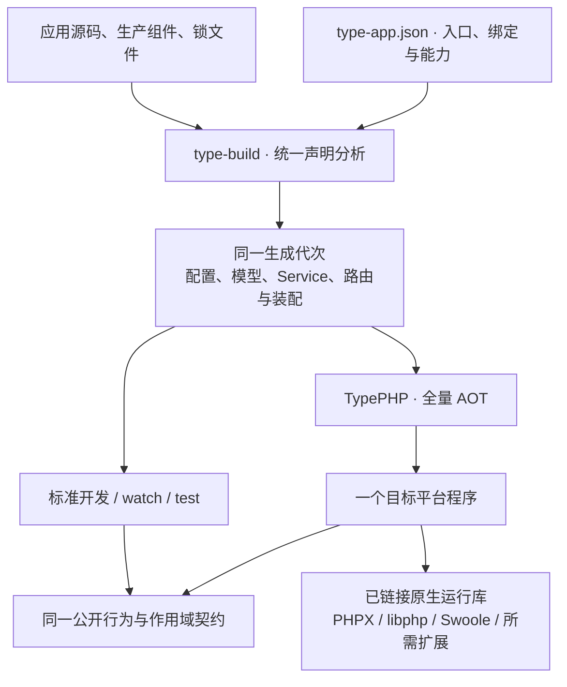
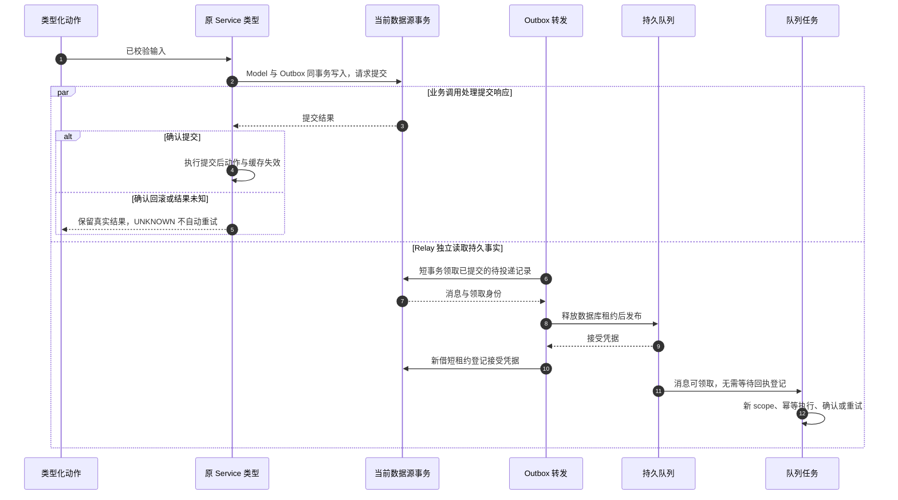

# 框架开发闭环设计

本设计收敛现有 15 个组件的日常开发体验：从独立应用创建开始，完成输入校验、Model、迁移、事务、缓存、任务、诊断和原生交付。目标是让开发者主要编写 Controller、Service、Model 与配置，由构建工具处理可确定的重复接线，并保留可检查的生命周期与失败语义。

**状态：开发分支已实现主要接口，正在完成原生与发布验收。** 当前发布版为 RC14。开发源码包含共享生成、构造器装配、执行服务隔离、类型化动作与输入、原 Service 声明转换、Model 时间与关系写入、唯一冲突处理、Schema、任务装配、脚手架和连续教程。PHP、全量 AOT、静态单程序及公开消费分别验收；这些变更不属于 RC14。实施进度维护在[实现规划](../guide/roadmap.md)，本文保留完整设计，不替代有效 API 手册。

## 目标与范围

已确定的八项选择如下：

1. 先成熟现有 15 个组件，不新增 RPC、服务发现、配置中心等能力类别。
2. 构建期自动装配成为默认；具体类依赖可推导，显式绑定保留覆盖权。
3. RC 阶段允许集中收敛公开接口，应用、模板、示例、生成器和文档一起迁移，并提供升级说明。
4. 控制器默认接收明确的路由参数与已校验输入，返回业务数据；由生成代码完成 PSR 适配。
5. 以独立应用、Model、缓存、任务、诊断和四平台交付的常用闭环作为本轮成熟验收范围。
6. 事务与缓存声明在构建期转换原 Service，保留原类型、`final` 和公开签名；标准开发入口与 AOT 执行相同转换结果。
7. Docsify 默认展示已验收发布版，另有开发版入口；每套教程对应准确的组件批次。
8. 在 `type-orm` 补常用表结构声明，保留显式 SQL；已执行迁移及摘要不可改写。

完整 MQTT 规范、HA 故障域、MySQL/SQLite 尚未安全实现的物理连接复用继续保留专项；本轮不得破坏已有能力，也不以完成常用开发闭环宣称这些专项已完成。物联中心负责验证真实业务接入，其全部页面、设备规模和业务故障场景仍按应用验收。

TypePHP 继续编译全部生产源码、依赖和生成代码；Swoole 是内置原生运行库，负责官方通信与并发。部署交付仍是匹配平台和数据库 profile 的一个主程序加外置配置，非系统运行库静态链接，启动不释放运行库。数据库、Redis 与其他外部业务服务按所用功能准备。

## 用户故事与完成标志

1. 作为应用开发者，我希望从公开模板选择数据库、安装组件并启动首个接口，以便不借用主仓也能开始开发。
2. 作为业务开发者，我希望新增模块时主要填写输入、服务和模型，以便减少手工工厂、连接传递与响应包装。
3. 作为服务开发者，我希望普通调用、手动构造后的调用与类内互调具有相同声明语义，以便不会因入口不同遗漏事务或缓存规则。
4. 作为数据开发者，我希望迁移、关系及并发创建保留数据库真实约束，以便简化代码时仍保证租户、版本和数据一致性。
5. 作为任务开发者，我希望提交业务数据后可靠安排后台工作，以便崩溃、重复投递和重试都有明确结果。
6. 作为维护者，我希望离线检查路由、依赖和运行能力，以便无需连接生产服务即可定位配置与装配问题。
7. 作为学习者，我希望照着对应版本的教程新增一个真实业务模块，以便代码能原样运行而不是只展示概念。
8. 作为部署者，我希望同一最终程序在无源码、PHP、Composer 和 Node 的环境完成初始化、运行与正常停止，以便部署只管理程序、配置及业务数据。

完成标志是一份从新目录开始的独立应用：新增第二业务模块，经过真实三库验证，并使用同一套生成规则完成 PHP 开发与原生运行。接口存在、示例编译或文档渲染均不能单独代表完成。

## 架构与接口契约

### 同源生成与自动装配



复用 `CommandAssembly` 的源码符号、依赖图和直接工厂，提取可供 HTTP、命令、Job、调度任务与监听器共用的声明分析。`DevelopmentBuilder` 和 `NativeBuilder` 消费同一分析结果；配置、Model、Service、路由、队列与应用入口组成完整生成代次，不能在开发路径遗漏命令或队列装配。

- `type-app.json.application` 是应用装配入口；路由、命令、任务等明确声明构成依赖根。生产包提供默认声明，应用可显式覆盖；同一层重复声明、未解决的接口绑定或依赖环在构建期失败，不能用加载顺序决定赢家。
- 可实例化的具名具体类按构造器参数推导。接口、抽象类、标量配置及复杂工厂显式绑定；工厂是具名且返回类型确定的方法，构建时不执行。扫描到类不等于公开路由、启动角色或连接外部服务。
- 默认 `execution` 实例归当前 `ExecutionScope` 所有，在同一范围复用，在并发请求、任务与子作用域之间隔离，关闭后清除。不能复用当前命令生成器的应用级 execution 数组来承载 HTTP。
- `singleton` 仅在所属 worker 或业务线程的装配实例内共享，不能捕获 execution 服务、请求、身份、租户、物理连接、事务或活动 Model。工厂的服务依赖须完整声明为类型化参数，不通过服务定位器、全局变量或闭包捕获取得作用域对象；构建期拒绝覆盖完整声明依赖图，工厂内部资源仍受运行时所有权检查。
- 复用 `ManagedResource` 的启动、失败回收和逆序停止。构造与检查不打开外部资源；`help`、`check` 和装配检查无需数据库或网络。
- 生成代码直接调用已知类型，业务不使用全局 `get(string)` 服务定位器；不增加通用运行时容器或第二套连接池。

### 原 Service 的事务与缓存声明

复用 Model 的同名源码替换机制，按完整文件统一转换：保留所有声明，把受声明方法的实现放入唯一私有方法，公开方法承担已有事务/缓存调用。原类名、`final`、构造器和公开方法签名不变，业务直接依赖原 Service，不再依赖 `UserOperations` 一类生成类型，也不再要求 `operations.classes` 的类型映射。

标准 `prepare`、`dev`、`watch`、`test` 入口在任何原应用类被 Composer 加载前装入准确的生成 classmap。手动 `new` 和类内调用的保证以进入这条标准管线为前提；原类已加载、生成代次过期、漏转或重复转换都明确失败。直接运行未准备的源文件不属于声明运行入口。

首轮沿用可静态证明的普通公开实例方法边界；继承、Trait、引用参数/返回、可变参数、魔术方法与生成器等未支持组合明确拒绝。转换不能悄然改变 `__METHOD__`、`__FUNCTION__`、文件位置或诊断映射；无法保持语义的结构在生成阶段指出原因。

嵌套事务沿用保存点和提交后动作合并；UNKNOWN 不自动重试。缓存保留 null 命中和异常不写入；在活动事务内，CacheEvict 绑定该逻辑数据源最外层事务的确认提交，回滚丢弃，Cacheable 绕过共享缓存执行业务且不填充，防止读到与事务不一致的缓存或公开未提交数据。无活动事务时沿用普通缓存行为；缓存参数仍显式传递，不增加隐式全局缓存，也不为判定事务另借默认数据源连接。模型转换和 Service 转换必须共享文件替换表，原文件与转换文件都参与完整编译审计及缓存身份。

事务与缓存的组合由生成代码根据应用实际依赖连接；只安装缓存组件的应用不因此强制依赖 ORM，声明事务却未安装 ORM 时在构建期失败。

### 类型化 HTTP 动作

以下签名已进入开发源码，仍需完成同一候选的原生验收，不应复制到 RC14 使用：

```php
public function update(int $id, UpdateUserInput $input): array
```

1. 保留 `action(ServerRequestInterface): ResponseInterface`。类型化动作参数接受对应路径占位符的 `int/string`、至多一个输入类和可选 PSR 请求；Service 依赖使用构造器。无法确定的联合类型、未知参数、引用和可变参数在构建期拒绝。
2. 新增一个输入契约 `Type\Validate\ValidatedInput`，包含静态 `schema(): Schema` 和 `fromData(Data): ValidatedInput`；具体工厂返回类型须收窄为自身类型。规则沿用现有 `Schema/Field`，生成器只验证签名并生成直接调用，不执行业务规则、不增加另一套校验 DSL。
3. body 默认是 JSON 对象；query、route、header 各自独立。仅 Router 提供路由参数；header 名称不区分大小写，标量字段的多值头明确拒绝。复用 `Input` 的有界解析、重复键检查及大整数语义，以及 `RequestBody` 的有界读取。流和上传使用显式 PSR 动作。
4. `Route` 与配置式路由使用同义的 `input` 选项表达解析预算、校验场景和部分更新策略；预算不超过接入层上限，模板既有 16 KiB、8 层限制保留。PATCH 默认按部分更新校验，不给缺失字段补默认值；DTO 保留字段存在性，显式 null 仍需声明允许。
5. 路径 `int` 复用严格校验转换并拒绝溢出，不做截断强转；未匹配路径约束为 404，匹配后的类型/范围错误为 422。同名 query/body 不能覆盖路径值；输入不能自动建立身份或租户上下文。
6. `array` 仅包含 JSON 数据值，由生成适配输出 UTF-8 JSON，默认 200；现有路由声明增加固定成功 `status`，支持创建返回 201。`void` 对应 204，显式 `ResponseInterface` 原样返回。活动 Model、未声明关系或任意对象不自动序列化，业务显式选择对外字段。
7. 非法 JSON/query、超预算、媒体类型和字段错误分别保持 400、413、415、422，并沿用稳定 `error/fields`；业务错误交给应用统一中间件，不把所有异常变成校验失败。继续经过 Host、路径、身份、权限和路由中间件，日志不记录秘密输入值。
8. 生成适配按需组合 `type-core` 与 `type-validate`；两包不为此增加循环依赖，`type-core` 不依赖 ORM 或构建工具。输入、控制器和请求对象均归当前作用域。

运行时先取得输入类的 Schema，通过其只读字段元数据确定所用来源，仅声明 body 字段时启用 JSON 正文适配。未提供正文按空 body 来源交给必填校验；存在正文时检查媒体类型并有界解析，空 JSON 文本不视为合法对象。仅使用 query/route/header 的输入类不要求 JSON 正文或 Content-Type。

固定成功状态与返回类型须在构建期相容：array 只接受允许正文的 2xx；void 只允许省略状态或显式 204；ResponseInterface 动作不得同时声明固定成功状态。HEAD 复用 GET 动作语义，由响应层移除正文；状态冲突不能留到运行时猜测。

### Model 与迁移

已经具备的无连接 CRUD、聚合、分页、批量读取、预加载、租户隔离和 `Db` 同库事务继续作为基础，业务不退回传递 `Connection`。本轮补齐以下入口：

| 能力 | 本轮接口契约 | 一致性边界 |
| --- | --- | --- |
| 自动时间字段 | Model 显式声明创建/更新时间，支持 Unix 秒与 UTC 微秒时间；同次写入或批次使用同一时刻 | 禁止与主键、租户、版本、软删除字段重叠及由批量赋值覆盖；无变化的 save 不更新时间/版本；业务采样与发生时间仍手工管理 |
| 关系写入入口 | 父 Model 提供关系句柄，复用既有 attach/detach/sync | 保留主库、锁、事务、租户和 scope 校验；写后清除本实例的对应已加载关系；related 仍只读已加载结果 |
| 模型冲突写入 | PostgreSQL/SQLite 提供 upsert(rows, uniqueBy, updateFields)，MySQL 提供 upsertAnyUnique(rows, updateFields) | 先核验真实唯一索引；整批单 SQL，无逐实例钩子、不猜主键、不覆盖创建时间、不重置版本、不修改默认范围不可见的软删除记录；不能原子维持租户、时间、版本及可见性的组合明确拒绝 |
| 并发获取或创建 | firstOrCreate(identity, values) 使用主库与真实非空唯一身份 | 已确认的目标唯一冲突才可处理；保存点回滚后再读取；不吞其他约束或 UNKNOWN，不自动重跑外层事务 |
| 表结构声明 | 在 type-orm 声明表、字段、主键、索引和常用变更，生成三驱动 SQL | SQL 快照冻结并入仓，普通构建只核对；既有迁移的版本、描述、顺序、事务标志及摘要算法不变 |

唯一索引元数据与结构化约束错误是模型冲突写入的前置能力。部分/表达式索引、可空身份和无法证明安全的跨租户冲突目标明确拒绝。MySQL 的任意唯一键冲突不能伪装成指定冲突目标；在隔离级别导致获胜记录仍不可见时返回明确可重试冲突，不把“先查后写”当作原子操作。暂不加入覆盖语义含糊的 `updateOrCreate()`。

Schema 是迁移声明入口，不自动同步在线数据库。首轮提供字符串、文本、整数、布尔、精确数值、UTC 时间和二进制，明确各驱动的类型、默认值及存储语义；不把 SQLite 亲和性宣称为其他数据库的精度约束。

新迁移显式准备各驱动的 SQL 快照及生成器协议，再纳入源码审查。已发布模板、应用和 Broker 的历史 SQL 不改写成新声明；变化只增加迁移版本。复用 `Migrator` 的同连接锁、状态、摘要和恢复入口，MySQL DDL 保持非事务语义，不能宣称三库迁移都原子回滚。

SQLite 首轮只提供实际版本支持的建表、加列、表/列改名、建删索引及无依赖删列。需要表重建的类型、null、默认值、主外键变化明确拒绝；有依赖的删列由数据库检查拒绝并回滚，不自动拆除依赖或关闭外键。显式 SQL 也须遵守现有迁移执行边界，不以放宽 PRAGMA/事务控制白名单模拟安全重建。

PostgreSQL 完整重置后复用继续保留，MySQL/SQLite 维持安全关闭；本轮不通过开启 persistent 或删除回收逻辑来宣称物理连接复用完成。

### 通信、事件、缓存与任务组合

在 `type-core` 补一个受管 HTTP 客户端，统一当前 CRL HTTPS 与 MQTT 外部请求中重复的 TLS、超时、正文预算和关闭规则；基于 Swoole 官方客户端与 `ExecutionScope`，默认验证证书与主机名，不自动重试有副作用的请求。CRL 内容验证、目标白名单、授权与业务错误仍由调用者负责，避免迁移时削弱业务约束。

业务事件采用明确的类型和生成监听表，与现有命令生命周期事件区分。同步事件在当前 scope 按声明顺序执行，异常向调用者传播；提交后动作使用 `Db::afterCommit()`，它不是持久投递保证。需要跨崩溃保证的工作通过现有 Outbox 与 Queue，不序列化连接、活动 Model 或 Service。

生成器组合既有 Job、消息注册、Publisher、Relay、Worker 与 Scheduler，业务入口减少显式连接和重复接线。Outbox 使用当前事务的逻辑数据源，Relay 显式携带同一命名数据源；外部投递期间不持有数据库事务，重复投递仍需要消息身份和业务幂等处理。调度保留时区、持久游标、错过策略及有界停止。



UNKNOWN 不等于未提交。Relay 依据数据库中的持久事实独立推进，业务调用者仍须核对结果；提交后回调失败不会阻止已提交 Outbox 被转发，也不能把已提交业务报告成已回滚。队列已接受而 Outbox 凭据登记失败时允许后续重复投递，消息身份和业务幂等负责收敛重复效果；接受凭据不等于任务已处理完成。

### 开发工具与模板版本

- 在 `type-build` 的现有 `type` 命令中增加 `make` 命令族，生成 Model、Controller、输入类、Service、迁移、命令、Job 和调度任务。按需生成真实源码和 PHPDoc，合法名称与路径受检，默认拒绝覆盖；关联文件先校验再落盘，失败不留下半个模块。
- 装配检查输出路由、服务图与生命周期、模型、命令/任务和能力信息，支持人读与 JSON；消费统一声明分析，不启动角色、不连接外部服务、不输出秘密。命令语义与现有 `--inspect <artifact>` 的产物检查明确区分。
- 新模板启动前明确设置令牌和数据库，运行迁移，再启动服务；测试新增第二业务模块，不能只反复请求模板自带 User 接口。
- 版本准备在打 tag 前形成正常源码提交，固定模板第一方依赖闭包与 RC 稳定性策略。`configure.php` 和 ProjectCreator 只切换驱动，不把批次约束重置为开发版。
- 分发保持模板 subtree 字节一致，发布消费验证实际安装版本和来源提交，禁止测试替消费者修补依赖。开发分支/path 消费有明确模式，不冒充公开批次安装。

目标创建顺序是公开模板创建（不自动安装）→ 选择驱动 → Composer 安装 → 配置与迁移 → 开发。原生交付继续使用已有构建、SDK、profile 与发布门禁，本轮设计不指定新 RC 号或自动发版时间。

## 组件分工与实施顺序

组件数量维持 15 个，优先扩展现有职责，不为功能名称增加新包。

| 组件 | 本轮交付责任 |
| --- | --- |
| type-build | 同源分析/生成、源码替换身份、自动装配、类型化路由适配、make 与离线检查 |
| type-core | HTTP 适配与受管客户端、业务事件、统一错误边界和应用启动组合 |
| type-runtime | execution 服务所有权、子作用域隔离、预算与真实收尾；复用现有资源机制 |
| type-validate | 已校验输入契约，复用 Field/Schema/Input/Data，保持来源和 PATCH 语义 |
| type-orm | Model 便捷入口、结构声明、冻结迁移、事务与命名数据源 Outbox |
| type-orm-mysql | 唯一约束分类、真实冲突语义、非事务 DDL 与三库契约中的 MySQL 行为 |
| type-orm-pgsql | 唯一索引、冲突目标、事务与 DDL，保持现有完整重置复用 |
| type-orm-sqlite | 唯一索引、原生 ALTER 能力及拒绝边界，保持安全关闭 |
| type-redis | 服务装配、连接预算和任务/缓存所需真实资源行为 |
| type-cache | 原 Service 声明集成、null/异常/提交后失效及独立消费 |
| type-queue | Job 注册、可靠投递与失败诊断，保持每任务 scope、租约和重试 |
| type-scheduler | 显式任务装配、时区与游标、错过策略和正常停止 |
| type-log | 请求/任务关联、稳定错误和秘密脱敏，文档与真实字段一致 |
| type-testing | 通过公开入口复用开发/原生断言，支持教程与独立消费者 |
| type-mqtt | 接入统一装配及作用域，迁移重复 HTTP 请求；既有协议范围做回归，完整规范继续专项 |

| 阶段 | 可观察的交付 | 真实前置 |
| --- | --- | --- |
| 一、统一生成与 Service | 独立应用的命令与 HTTP 使用同一原 Service，类内互调声明生效，并发请求互不串状态 | 已确认的类型、装配和转换契约 |
| 二、类型化 HTTP 与 Model | 第二业务模块完成输入、错误、CRUD、关系、事务与新迁移，业务不传连接 | 统一生成；Model 数据能力可独立并行实现 |
| 三、可靠任务与通用服务 | 模块提交后产生可恢复任务，缓存正确失效，HTTP 外部请求和后台角色可诊断、可停止 | 统一 scope 和声明；Outbox 命名源与注册生成 |
| 四、模板、工具与教程 | 新目录按公开教程创建、生成、测试、构建；公开模板原样安装准确批次 | 对应公开接口稳定；文档内容与接口同步推进 |
| 五、应用接入与候选验收 | 案例接入收敛接口，四平台及三个数据库 profile 的最终程序验证通过 | 以上行为、模板、独立组件消费与质量检查 |

这些阶段是一轮完整交付的实施顺序，不以某个局部阶段通过替代整体目标。公共接口变动时同步迁移本仓调用者与升级说明，不长期保留两套含义不同的业务入口。

## 文档与示例交付

继续使用 Docsify 与现有本地 Mermaid 资源。默认根路径为已验收发布文档，`/next/` 为开发文档，页头显示产品版本与通道；发布文档固定产品 tag、文档提交和组件批次，允许针对旧产品提交纠正文档，但不得混入新接口。维护当前源码和一个准确的发布快照来源，不复制全部历史版本站点。

导出与部署白名单同时支持两通道；导航、相对链接、搜索命名空间与快照身份一起验证。切换通道尽量保留章节，缺少对应章节时明确回到该通道首页。现有搜索已包含路径隔离，新增快照身份用于索引失效；站点标题继续包含“物联开源分享”。上线仍经过既有部署验证，设计落档不等于站点已切换。

教程按一条连续业务组织：


每节提供完整前置、对应文件、可运行代码、命令、预期结果、失败排查及清理步骤。通用教程使用独立应用；物联中心的 profile、双端身份、安装和设备业务维持案例分组。迁移既有 Operations 用法和手工接线示例时，同步 README、组件 README、模板 README、Docsify 与代码 PHPDoc。

架构图说明编译与运行职责，时序图说明请求、事务、Outbox 与资源收尾，流程图说明从开发到交付的步骤；不以装饰图或重复口号替代解释。性能结论需要同条件测量。当前文档只描述本框架的设计、行为与限制；第三方许可和法定归属继续保留。

## 验收与清理

扩展现有入口，不新增平行的矩阵脚本；新增断言必须能通过公开行为发现错误。

| 范围 | 复用入口 | 必须增加或核对的行为 |
| --- | --- | --- |
| 声明与装配 | tests/development-generation.php、tests/assembly.php、tests/assembly-consumer.php | 同源生成、确定性、缺绑定/依赖环/生命周期拒绝、并发 scope 与子 scope 隔离、失败保留旧代次 |
| Service 转换 | tests/operations.php、现有操作声明构建场景 | final、普通调用/手动 new/类内互调、嵌套事务及回滚、事务内缓存绕过与外层提交后失效、null/异常缓存、加载顺序、双重转换和陈旧输入拒绝 |
| 类型化动作 | tests/routing-build.php、tests/routing-http.php、tests/validation.php | 两种声明一致、路径不可覆盖、PATCH 存在性、400/413/415/422、201/204/HEAD、PSR 响应、安全中间件 |
| Model 与 Schema | tests/models.php、tests/app-models.php、tests/migrations-consumer.php、tests/migrations-native.php、现有三库 ORM suite | 历史摘要不变、SQLite ALTER 接受/拒绝、唯一竞争、隔离级别、租户/软删除/版本、UNKNOWN、无变化 save、关系结果失效 |
| 缓存与任务 | 既有缓存、Outbox、Queue、Scheduler 的 PHP/原生入口 | 真实 Redis、回滚不投递、UNKNOWN 保留、重复消费、命名源、取消/失败/停止、资源归还 |
| 模板与脚手架 | tests/project-create.php、tests/application-template.php、模板 smoke | 全新目录、空格路径、不同 cwd、名称与覆盖拒绝、部分写失败、教程新增模块、公开消费不修补依赖 |
| 版本与文档 | tests/Unit/TemplateDistributionTest.php、ReleaseTest.php、tests/docs-consistency.php、tests/docs-deployment.php | 发布版本闭包、模板原字节、两通道真实导出/导航/锚点/搜索/备案标题；按应用上下文检查命令 |
| 原生交付 | tests/template-deployment.php、既有四平台构建与发布工作流 | 完整生产清单、同一最终程序、所选数据库迁移与 CRUD、HTTP/MQTT/前端/任务、无源码及开发工具、正常停止 |

文档测试不能只抽取第一个代码块或用全仓字符串证明某应用命令存在。独立模板消费应原样执行对应通道教程，记录产品/组件/文档身份；装配拒绝测试不得以超时当作成功。

四平台为 Linux x64、Linux ARM64、macOS ARM64、Windows x64，各自验证 sqlite/mysql/pgsql；每个程序只承担所选数据库 profile，不能让单个程序伪装成可切换三库。复用现有单文件、静态依赖、无源码和发布回读门禁。协议平台本身尚不支持的组合保持明确拒绝与专项状态，不静默跳过新增能力的必需验收。

验收分别记录 PHP 行为、全量 AOT、同一最终程序和独立分发消费。历史 RC14 和已有 CI 只证明原身份；新功能未通过所需矩阵前不公开新的产品候选，也不把开发文档升级为发布文档。统一生成与运行性能使用固定负载对照，沿用体积增长超过 5% 的说明门禁，不预先承诺吞吐或体积收益。

实施在当前 `main`，保留已有修改，按功能形成带中文描述的签署提交。资源检查、证据保全及精确清理遵守项目约定；仅删除已被有效断言替代的冗余测试，不删除三库、并发、失败和原生边界的证据。历史迁移、许可证及原产物身份保留。新 RC 版本与公开发布时间另行确定，不替换本机业务站点。
