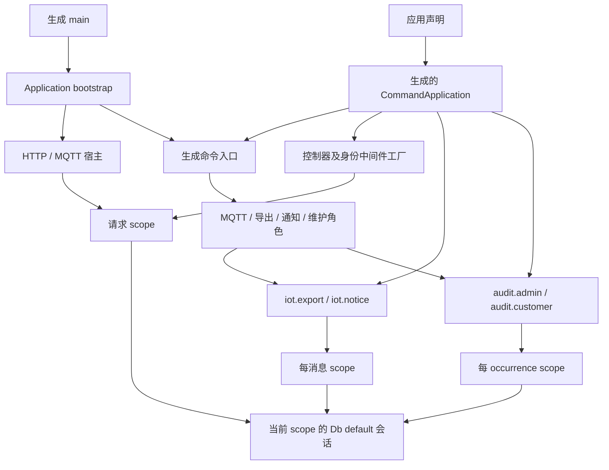
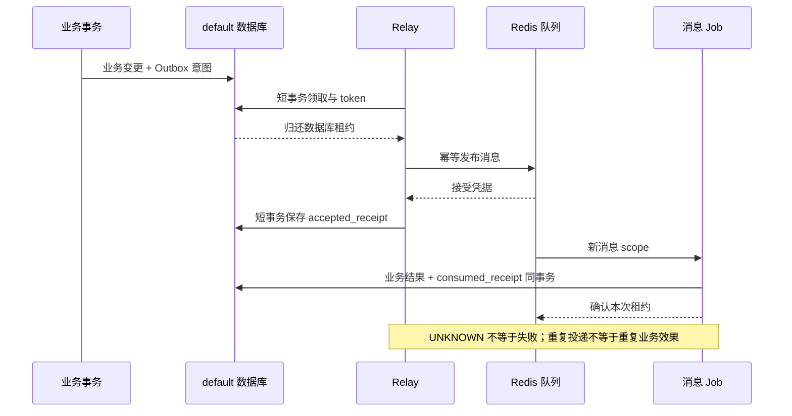

# 物联中心统一装配

物联中心的应用声明位于 `docs/build-config/type-app.json`。它登记命令、控制器依赖、固定身份域的中间件、队列协议和维护计划。开发准备与完整 AOT 消费同一声明；生成入口替代原 `app/main.php`，生产端不读取 PHP 注册文件或扫描类。

## 启动及资源归属

`ApplicationContext` 只保存启动路径、开发模式及配置快照，按需读取同一个 `Repository`，不持有连接、Model 或当前身份。控制器通过构造参数取得服务和固定配置；原来未使用的 `DatabaseManager` 参数与手写控制器工厂已删除。数据库管理器由角色创建并 `Db::configure()`，业务连接归当前执行作用域，角色退出再关闭管理器。

`serve`、`broker:serve`、`iot:mqtt`、`broker:run` 属于 bootstrap 宿主分派，继续列在应用 `help` 中。它们需要拥有 Swoole Server 的外层事件循环，不能注册成会自动进入命令协程的普通命令。`inspect` 的 commands 清单因此只表示生成命令图；HTTP 列表表示同一宿主登记的路由。此边界与应用模板一致。HTTP 业务工厂仍来自生成图，在实际 worker 的请求 scope 中解析，不把主线程活动对象传给线程。

其他现有管理及后台命令通过生成的命令服务执行。`check` 的内部登记名是 `app:check`，避免与框架离线检查保留名冲突；用户入口仍为 `check`。离线 `help` 不加载 Composer、运行配置或数据库，`check` 只核对配置而不建立外部连接。

开发命令由 `bin/typeapp` 调用构建器的 `loadConfiguration()`，它负责一次完整准备与加载；`bin/typeapp-prepare` 仍提供独立的准备入口。启动子进程不再先准备、再在加载时重复准备。代次仍核对完整源码、依赖、生成器和冻结快照摘要；Schema 候选文件只有同时包含属性起始与相关名称时才进入语法树解析，普通引用不会反复触发声明扫描。

## HTTP 输入与原有权限

双端登录使用 `LoginInput`；公开站点信息使用零参数动作；站点更新使用 `SiteUpdateInput`；产品的查询、创建、修改和删除使用路径参数及产品 DTO。其他上传、流和既有 PSR 动作继续使用原接口。

生成动作负责有界读取、分源解析和 Schema 校验。`JsonBody` 仅保留业务已有的 JSON 媒体类型与空正文错误，不再次消费正文。额外字段明确拒绝；PATCH 的 `Data::has()` 保留“未提供”，显式 null 依照字段规则拒绝。产品的版本不能省略，省略名称或描述不清空原值。

身份域仍由固定路由确定；客户路径租户必须匹配 `X-Tenant-Id`，当前权限、成员有效性、乐观版本和审计事务仍由原服务检查。输入 DTO 不承载可信身份，不允许覆盖数据源、配置或角色。站点公开投影与 `no-store` 响应保持原行为。

## 后台声明与恢复

| 角色 | 声明/运行入口 | 资源及业务事实 |
| --- | --- | --- |
| MQTT | `iot:mqtt`、`broker:run` 宿主及生成的存储/接收命令 | 原 Broker、认证、TLS/CRL、白名单与同步存储入口；每条业务处理保留原 scope |
| 导出 | `iot:exports` / `iot:exports-work`；`iot.export` v1 | `ExportJob` 在消息 scope 构造；`ExportService` 从应用根取得私有目录 |
| 通知 | `iot:notices`；`iot.notice` v1 | `NoticeJob` 只消费持久消息，队列 Publisher 由通知角色持有 |
| 审计维护 | `app:schedule`；`audit.admin` / `audit.customer` | 每 60 秒的原计划、skip 错过策略、Redis 游标及独立 occurrence scope |
| 告警、聚合和清理 | 原同名有界命令 | 原批次、事务、历史保留期与故障恢复入口 |

队列注册改用 `CommandApplication::jobs()`，调度定义改用 `schedules()`，不再维护并行手写注册。Job 的活动连接不保存在应用单例；通知队列的发布对象与 Job 分开，消息工厂无须捕获长期队列连接。声明存在不意味着所有 profile 均开放该业务，原 `RuntimeCapabilities` 功能检查仍在角色入口执行。

导出的 Outbox 写入和消费凭据使用 `Store::enqueue()`、`consumed()`，只允许当前 `default` 活动事务。告警通知的底层服务仍接收显式事务连接，使用 `enqueueUsing()` 保持与告警事实同一租约；通知 Job 则使用当前命名事务的 `consumed()`。两类 Relay 明确选择 `default`，领取、登记接受凭据分别使用短 scope，外部发送期间释放数据库租约。

停止通知同时停止 Worker 和 Relay 接收新工作；正常与异常退出都执行有限排空，再由外层关闭 scope、数据库与 Redis。导出和通知命令返回 worker/relay 统计，接受凭据与业务完成凭据分开保留。部署监督器仍分别管理角色，统一应用入口不会自动启动全部角色。

## 验证入口与限制

复用 `tests/iot-identity.php` 及 `tests/iot-identity-databases.php` 的双端、产品、设备、告警通知、导出、运维及调度场景；`--scheduler` 可随三库入口一起执行。告警和导出使用各自既有独立业务夹具，不合并互斥场景。Redis 测试要求 `TYPE_REDIS_SERVER` 指向同平台原生可执行文件。

HTTP 回归覆盖非法来源、类型与白名单、PATCH 缺失/null、跨租户、过时版本、审计故障回滚、重启与排空。后台沿用真实数据库、Redis、重试、重复投递、租约与停止测试。PHP 行为结果与最终同一程序的完整 AOT 结果分别记录；源码通过不代替完整 MQTT 规范、HA 专项或未实机运行的平台证明。

当前 PHP 验收已完成 MySQL/PostgreSQL/SQLite 双端、产品、设备、告警通知、运维及调度，另以独立三库装置完成导出；调度长间隔停止均正常退出。独立 Broker 证书/CRL 与主仓候选入口也已通过。原始报告摘要及已关闭数据库/角色身份保存在本轮本地 `.cache/t27-t28-php-evidence/index.json`，临时数据库、证书及配置已回收；这些 PHP 记录与下述原生验收分别保留，不能互相替代。

`tests/iot-device-mqtt.php --php --ingestion` 已在固定开发代次通过完整 MQTT.js 接收、重复与永久拒绝、设备 CLI 缓存和真实业务回执、指令撤权与丢回执对账、模型拒绝/确认/重启，以及 PostgreSQL 同步提交结果未知后的恢复。客户端、接收角色与 HTTP 正常退出，数据库装置已回收。开发入口优化没有放宽网络等待预算；这项记录是 PHP 行为验收，不代表吞吐容量或最终原生 MQTT 验收。

2026-10-06，本轮完整应用 AOT 程序已通过 **Darwin arm64 shared embed** 本机行为验收。七个阶段为生产诊断、开发模式边界、应用三库、独立导出三库、主仓候选入口、Broker 证书/CRL 和设备 MQTT；均正常退出，未超时。业务子报告记录了无源码沙箱运行，应用、导出与 MQTT 使用同一程序摘要，候选入口同时验证该程序用于主仓双端安装及 Broker 安装登录。

| 原生业务范围 | MySQL HTTP 检查 | PostgreSQL HTTP 检查 | SQLite HTTP 检查 |
| --- | --- | --- | --- |
| 双端、产品、设备、告警通知、运维及调度 | 948 | 951 | 948 |
| 独立导出与恢复 | 767 | 766 | 765 |
| 设备 MQTT、同步接收及指令恢复 | — | 652 | — |
| Broker 证书/CRL | — | — | 202 |

三库调度均验证重启后游标保留、occurrence 唯一及正常停止。导出覆盖幂等、持久租户、摘要损坏拒绝、权限撤销、取消/恢复、配额、十万行边界及有界清理；数据库锁竞争按 MySQL/PostgreSQL 的实际能力执行。设备场景使用 MQTT.js 和真实 TLS，覆盖业务回执、重复/冲突/乱序、设备离线缓存、撤权指令、丢回执后重启对账、模型拒绝/确认，以及 PostgreSQL 同步提交结果未知后的恢复。原生设备模拟器不等于真实硬件验收。

原始总报告为 `build/framework-acceptance-bg8i88xd/app-behavior-a47dea9b983d/verification.json`，程序 SHA256 为 `453aaf1bd38e860af644c0fac34c39fe8e5d694ca4ec73308b1425a667ebd836`，build-id 为 `2725ddc0904bf8c7354c4189675f4efddb5eeb06209f8939793b4b8caa916392`。独立索引 `build/framework-acceptance-bg8i88xd/app-native-final-evidence.json` 关联本次成功、此前开发模式断言失败、PostgreSQL 线程 hook 启动失败和各自原始产物；失败报告不改写为成功。

这项结果未验证静态交付，不代表四平台共 12 个数据库 profile 的静态单程序，也不代表新版本公开消费。固定最终提交的发布矩阵、教程独立应用对应的最终原生结果、MQTT 完整规范、HA、性能/容量及真实设备仍按各自范围验收。
