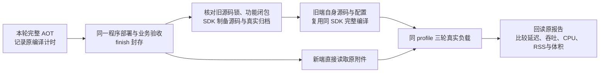

# 平台性能验证

性能比较使用明确指定的两个源码状态，在相同平台、SDK、数据库、负载和采样方法下运行；每个状态使用自身锁文件安装与全量编译。没有可比基准时报告未验证，不宣称性能改善。

## 准备与运行

准备可信 Composer、匹配的 PHP ZTS/embed SDK、原生数据库工具和 Swoole。源码参数必须是本地仓库可读取的完整 Git 提交；输出目录为本次独立创建的工作目录。

```sh
php tests/prepare-platform-benchmarks.php "$TYPE_BASE_SOURCE" "$TYPE_NEW_SOURCE" "$TYPE_COMPOSER_PHAR"
php tests/benchmark-pairs.php "$TYPE_PAIR_ROOT/old" "$TYPE_PAIR_ROOT/new" "$TYPE_MYSQL_TOOLS" "$TYPE_PGSQL_TOOLS"
php tests/benchmark-compare.php "$TYPE_MEASUREMENT/verification.json"
```

准备器从每个输入状态导出源码和锁文件，独立构建 PHPX、核对受控 CMake 适配与产物摘要。生成和 AOT 外层控制器显式采用锁定 SDK 的 2G PHP 内存预算；TypePHP 子进程沿用构建器配置，被测程序使用自身运行 INI。每个版本先通过自身的 `type prepare` 入口执行三轮冷生成与代次复用；每轮复用先预热一次，保存原始耗时、生成清单、生成字节数及声明身份。冷生成指删除本轮专用生成目录，不表示操作系统文件缓存已清空；计时包含 CLI 启动、输入审计及生成或完整性核验。新版开发生成与随后全量 AOT 必须对应同一声明身份；历史生成器没有该字段时明确保留 `null`，不补造共享生成证据。

全量 AOT 的编译耗时、程序字节数与原始构建报告摘要继续保存在准备报告。运行时使用对应产物构建报告中的 INI 和模块，不能继承另一版本的控制器配置；测量报告记录运行 INI 的摘要。新的成对入口只接受同一准备轮次的 `old`、`new`，绑定准备报告摘要、两个完整源码 SHA、构建身份与原程序摘要；比较器回读准备报告及六份原始测量报告，拒绝跨轮或跨源码混用。历史测量报告仍可按原协议比较，但没有新增的生成与来源证据，不能替本轮验收背书。CI 的性能入口要求显式提供 `TYPE_BASE_SOURCE`；基准提交不内置在脚本中。

首次按默认旧版在先的顺序测量。Linux 与 macOS 的 CI 入口收到比较器退出码 `2` 时，在同一运行器上复用同一准备目录和两个原程序，交换顺序复测一次；比较、测量或日志保存的其他错误立即失败，第二轮仍有回退信号也失败。两个顺序的原始报告均须保留，不能只保留较好的一轮。手动调用成对测量命令时，可在四个目录参数后追加 `new-first`。

Linux ARM64 的 Actions 手动入口使用 `suite=benchmark`、`base_source` 和 `new_source` 固定同一对完整提交，`benchmark_order=new-first` 执行逆序复验。`new_source` 留空时使用本次工作流源码。独立运行会重新构建并记录新的程序摘要；不同运行器或不同原生字节的结果不能伪称为同一程序复测，仍须核对平台、依赖、功能和负载是否可比。

## 方法与边界

比较器核对报告完整性、内容摘要、平台、预热次数、样本和并发。测量记录吞吐、p50/p95/p99、CPU/RSS，CRUD 按逻辑操作计数，RSS 为受测进程及后代的采样总和。区间重叠不能证明性能等价，持续退化信号需要独立复验和定位。

成对比较工具固定使用 Swoole 通信，按 SQLite、MySQL、PostgreSQL 三种真实数据库分别比较两个源码状态；测量结果只说明同一平台和负载下的相对变化，不扩展为其他平台或数据库的性能结论。当前完整验收要求见[实现规划](../guide/roadmap.md)。

被测源码是各自提交的完整物联中心，初始化通过 `app:install`，HTTP 通过 `serve`、管理身份与人员 CRUD 入口。统一装配版本会实际执行其生成的命令与 HTTP 装配，不沿用旧版本的入口实现。固定负载覆盖短 JSON、CRUD 与真实数据库锁等待；缓存关闭、请求并发为一。Job、调度、缓存、文件流和并发容量的性能不在这组测量中，功能回归成功也不能补作其性能结果。

上面的三库共享运行库入口继续用于 Linux 与 macOS 的独立开发基准。同一程序依次测量三库；它的编译耗时和字节数不能代表十二个最终静态程序。

## 原静态候选与同 profile 对照

Linux 静态入口、macOS 的 `scope=single-program` 和 Windows 静态候选入口接收可选 `base_source` 完整提交。提供它时，在原有平台 × profile 作业内补做比较；教程和原程序诊断入口不运行这组测量。当前手动验收使用 `522db8762655a4c1fe14f1f6f47e6cbe17fed094` 作为框架改造前基准。该输入不自动改变正式发布的基线，也不把 `v0.0.0` 验收记录改称某个 RC。



原候选构建前由工作流设置 `TYPE_BENCHMARK_BUILD_TIMING=1`，构建工具记录这次 `vendor/bin/type` 子进程的真实耗时、宿主 PHP 内存配置、原构建报告与程序摘要；前端和 SDK 制备不计入编译时间。缓存命中会拒绝，缺失计时不能事后重编译另一个新端程序补证据。新端经 `release-candidate finish` 后保持原字节；准备器只为新源码快照补测开发生成，不重建新端主程序。

完成原候选封存后，底层入口为：

```sh
php tests/prepare-platform-benchmarks.php "$TYPE_BASE_SOURCE" "$TYPE_NEW_SOURCE" "$TYPE_COMPOSER_PHAR" --static-profile "$TYPEAPP_BUILD_PROFILE"
php tests/benchmark-pairs.php "$TYPE_PAIR_ROOT/old" "$TYPE_PAIR_ROOT/new" --static-profile "$TYPEAPP_BUILD_PROFILE"
php tests/benchmark-compare.php "$TYPE_MEASUREMENT/verification.json"
```

`TYPE_PAIR_ROOT` 取准备器输出的 `build/pb-<本轮编号>`。协议 3 的短目录供 Windows 编译器使用；编译前按锁定 TypePHP 的声明头规则核对生产源码及生成源码路径上界，不能为避免路径超长删除源码。静态配对只产生当前数据库的 old/new 两份测量，三个数据库在三个既有 profile 作业内各自完成。首次比较返回回退信号时，工作流在同一运行器上复用同一准备目录和原程序，自动追加 `--order new-first` 交换顺序复测；Windows 的外部数据库装置使用 `-BenchmarkOrder new-first`。输入或执行错误立即失败，逆序仍有回退信号也失败。逆序未复现时，保留首次信号、两轮测量和比较日志，不据此宣称性能改善；手动复验沿用相同参数。

旧端安装自身 Composer 锁，并使用自己的 `StaticRuntimeSdk` 验证 ABI、源码补丁、归档和头文件。还要核对新旧工具链锁、SDK 制备脚本及 profile 的真实功能闭包相同，才能复用本轮 SDK。两个版本的 `web/` 内嵌前端清单必须逐项一致，各自的依赖许可材料按本版本生成；完整内嵌资源仍由各自原程序、构建清单和摘要核验。两端编译各自完整业务与框架源码，分别测量冷生成和代次复用，并核对新端的声明身份与已封存 AOT 报告相同；改变输出目录不能改变声明语义。

被测静态程序使用独立数据目录和只含系统路径、测试配置的环境，不加载控制端 PHP INI。数据库锁持有者是单独的控制端 PHP，保留其 PDO 与 INI。Windows 的 SQLite 每轮创建独立文件，MySQL/PostgreSQL 由现有 Windows 数据库装置创建专用实例，再为每个版本的每轮测量建立并回收独立库。

Windows 使用每轮一个 PowerShell 采样控制器，以 CIM 确认进程树、`System.Diagnostics` 读取实际 CPU 和工作集；与 Unix 一样每十个业务操作采样，记录采样开销并有界退出。延迟只包含请求，吞吐仍包含观察开销；协议 3 的 Windows 采样和协议 2 的 Unix 采样不能跨平台混比。性能程序在干净环境中运行，关联同一 SHA 已完成的无源码部署回执；不宣称性能采样也在部署隔离沙箱内。

准备、测量、比较、控制器日志、原候选回执和旧端程序随本轮 Actions 证据保留。比较器拒绝跨 profile、跨 SDK、替换程序、缺失原候选或改写编译计时；同 profile 字节增长超过 5% 时标记需要解释，正式版本仍须通过既有 `SizeGate`。这些接线与契约检查不等于四平台 × 三 profile 已实测完成，完整结果以同一源码与十二个原程序的实际回执为准。Job、调度、文件流和并发容量仍不属于这三种负载的性能结论。
