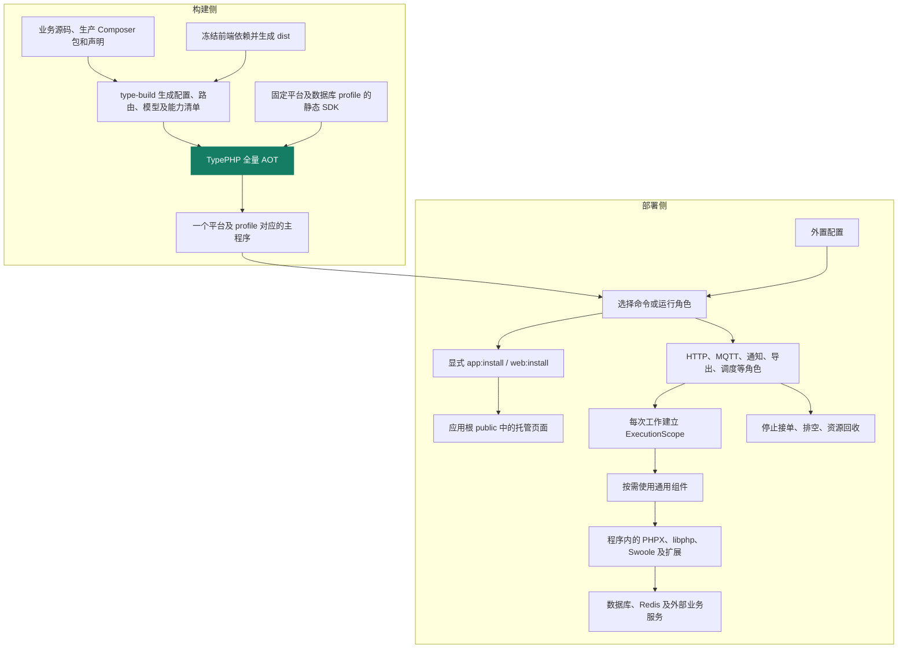
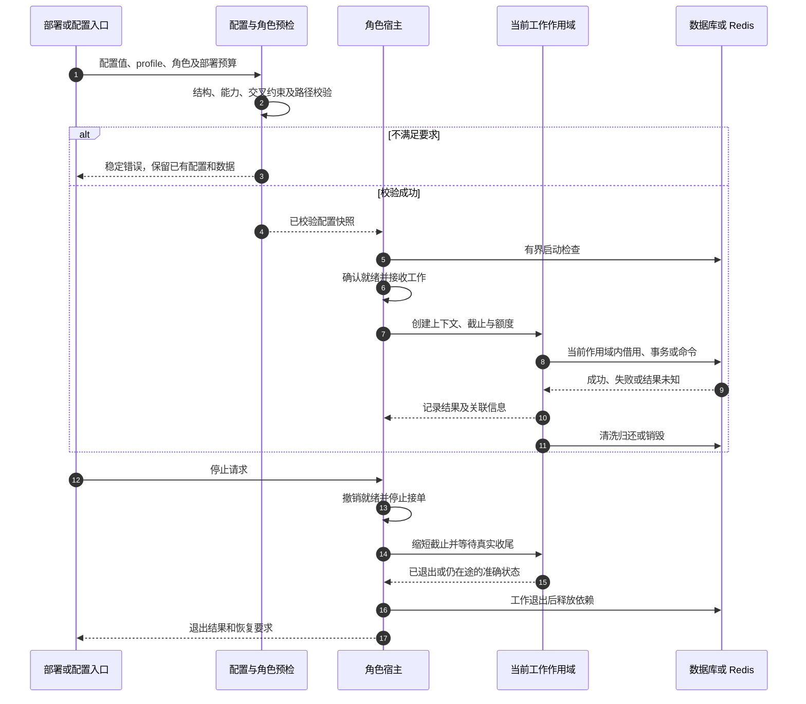

# 系统架构、配置与运行过程审查

核查日期：2026-10-04。源码基线：`7999657396acdff27e54e181de2e1ebdb247d1ea`，分支 `main`。本次沿配置、构建、启动、请求、后台任务、停止及升级过程检查 15 个组件和物联中心的实际调用者，不以组件存在或历史测试通过代替业务接入。

后续实现与新产物验收单独记录在[运行修复证据](system-architecture-fixes-20261004.md)。本文保留上述审查基线的发现及原始身份，不将后续结果改写成当时已通过。

## 结论

主架构可以继续使用：TypePHP 全量 AOT、编译期声明生成、应用显式装配、Swoole 内置原生运行库，以及按执行作用域管理资源，职责是相容的。当前最需要改进的是应用入口对已有能力的统一接入：配置检查与启动不一致、生产内部异常缺少原因日志、维护调度未接停止信号，随后是部署预算、业务就绪和数据升级流程。

这些问题不需要引入新的通用容器、AOP 或统一网络引擎。应复用现有配置、作用域、池、生命周期及迁移组件，补齐各角色的调用和验收。当前不能宣称“所有角色已经满足完整生产运行标准”，也没有证据证明需要推翻现有分层。

内部对照采用固定 Hyperf v3.2.4 源码、PHP-FIG PSR-15、官方探针语义、Redis 锁与 W3C 关联头说明，来源及适用边界见[官方研究基线](system-architecture-hyperf-baseline.md)。Hyperf 是实现对照，不是 TypeApp 的运行依赖；其运行时 DI、代理或平台说明不直接成为本项目的要求。

## 身份与证据边界

| 项目 | 本次实际范围 |
| --- | --- |
| 源码 | 上述固定提交；产品修正仅涉及文档，未修改生产实现 |
| PHP 探针 | macOS ARM64，PHP 8.5.10 ZTS，Swoole 运行字符串 `6.3.0RC1`；沿用当前已锁定工具链 |
| 主动复现 | 临时配置工厂与哨兵 `.env`；通过公开配置、HTTP 策略、日志接口触发错误；不连接外部数据库或 Redis |
| 本轮既有测试 | PHP 契约套件、配置、部署预算、调度和输入校验；详细结果见后文 |
| 历史原生结果 | [RC14 升级记录](typephp-upgrade-0.9.4.md)；标签源码为 `683f6d4d30e1e99b6a93f6a6fb45625fbd87138a`，与本次审查基线分别记录 |
| 未重新执行 | 十二组合 AOT、三库业务及断连、Redis 故障、真实设备容量、浏览器完整交互、Windows 信号与文件系统验收 |

“复现”表示本轮实际调用得到结果；“源码确认”表示能追踪到确定的调用或缺失接线；“待验证”表示尚无对应真实运行结果。源码检查覆盖组件主要公共入口和失败路径，不是每行代码的形式化验证或安全认证。

## 系统职责和过程

这是职责图，不表示每个角色的所有接线都已完成。一个主程序可以启动多个角色实例；“一个文件”不等于一个运行进程，也不消除外部数据库、Redis、证书及持久目录。前端只由显式安装命令写入 `public`，普通启动不释放原生运行库。完整 MQTT 持久部署还受 PostgreSQL 同步存储约束，不能从三个数据库 profile 推导出相同的持久 MQTT 保证。

| 已有机制 | 判断与保留理由 |
| --- | --- |
| 配置声明与启动快照 | `ConfigCompiler` 不执行任意配置 PHP；`Environment` 明确进程环境优先，`Repository` 隔离引用并约束类型。应补消费者校验，不另建动态配置体系 |
| 显式装配与边界接口 | 应用拥有业务装配，组件不反向依赖物联中心；PSR 接口用于 HTTP、日志、缓存和时钟等实际边界。无需为复用引入通用运行时容器 |
| 作用域和所有权 | `ExecutionScope`、`ExecutionOwner`、`ResourcePool` 对协程、线程、取消和真实收尾有明确约束；等待超时不会直接释放仍在使用的资源额度 |
| 数据库与 Redis 借用 | 连接跟随执行作用域，事务和有状态 Redis 操作保持所有权；提交未知、会话污染与普通业务异常分别处理 |
| 队列和调度 | 已有租约、恢复、幂等、状态记录及停止机制；任务超时不宣称未执行，锁也不宣称绝对只执行一次 |
| 前端安装和 HTTP | 有安装锁、暂存、摘要复核及恢复记录；页面仅从受管清单读取，支持 GET/HEAD，不用页面回退吞掉 API |
| 构建与发布 | profile、SDK、源码适配、内嵌资源和最终字节参与身份；发布核对固定源码、运行轮次、拆分提交及消费回执，重试保留候选产物身份 |

## 需要整改的发现

P1 表示应优先修正的运行可靠性问题，P2 表示需按部署、功能或平台边界收口的问题；这不是漏洞严重性评级。以下为审查发现，未因更新本文而修复生产代码。

### A1 · P1 · 配置预检和保存未覆盖实际启动约束

**本轮已复现。** [Settings::configurationCommand()][S-settings-check] 和管理端使用的 `validateRuntimeConfiguration()` 分别维护一份字段范围校验，没有复用实际启动中的 `DeploymentBudget`、`RequestPolicy` 及上传目录约束。有效默认配置通过；以下配置同样被 `config:check` 判为 `valid`，对应公开消费者却拒绝：

| 隔离输入 | `config:check` | 实际消费者结果 |
| --- | --- | --- |
| `DB_SERVER_BUDGET=2`、`DB_ADMIN_RESERVE=10` | 退出 0 | 管理预留超过可用容量，`InvalidArgumentException` |
| `DB_SERVER_BUDGET=12`、reserve 为 10，其余为默认部署和线程配置 | 退出 0 | 无每线程可用份额，`CapacityException` |
| `APP_ALLOWED_HOSTS=https://invalid.example/path` | 退出 0 | `RequestPolicy` 拒绝 `invalid_host` |
| `APP_TRUSTED_PROXIES=not-a-cidr` | 退出 0 | 非法代理 IP/CIDR |
| `APP_UPLOAD_TEMP` 指向本轮未创建的目录 | 退出 0 | 不满足 multipart 专用临时文件系统约束 |

因此检查成功不等于 HTTP 能启动；管理端同样可能保存重启后才失败的组合。复现直接调用启动所用的公开消费者，没有停止或重启业务站点，也没有把它描述成一次完整原生启动测试。

**最小方向：**在应用配置装配处提供按角色选择的无副作用预检，供检查、保存和启动共用。类型、字段关联、profile 能力、文件条件与显式连接检查分别报告；不要为了校验而创建 SQLite 文件、执行迁移或启动后台任务。

**验收：**上述输入在检查和保存阶段一致拒绝，保存失败保留原文件；有效配置在相同环境与 profile 下可进入对应角色启动。覆盖进程覆盖、文件内被覆盖的错误值、不同工作目录和未选角色，避免让未启用功能的依赖阻断无关命令。

### A2 · P1 · 生产内部 500 缺少可定位原因的记录

**本轮已复现。** [ApiErrors::failure()][S-api-errors] 仅在开发调试权限为真时记录异常类型和代码位置。使用真实 `LogManager` 调用同一个异常处理入口：生产模式返回 500、错误记录为 0；开发模式返回 500、错误记录为 1。测试哨兵异常消息不进入日志，脱敏边界本身应保留。

[RequestLog][S-request-log] 位于外层，内部异常已经转为响应后，它只写 INFO 级完成记录与状态码，无法在 catch 中取得原异常。生产虽然能知道“发生了 500”，却缺少定位是哪处代码失败的受控信息。另外，当前请求 ID 只放在请求属性和日志上下文，日志构建标识使用应用名，跨后台任务关联与真实 build ID 尚未统一。

**最小方向：**生产始终记录受控错误码、异常类型、应用相对位置、请求/工作 ID 和真实构建身份；开发权限只决定是否追加有限帧。保留秘密脱敏和有界输出，不以启用 `APP_DEBUG` 或写完整异常、SQL、请求体解决生产诊断。路由模板、耗时和结果统计使用有界字段，不以设备 ID 或原始 URL 作指标标签。

**验收：**生产真实 HTTP 500 可用响应 request ID 找到错误原因；正常请求、业务拒绝、资源耗尽和内部错误分别统计，重复记录受控；令牌、密码、SQL 参数和原始异常消息不泄漏，日志失败不能导致无界阻塞。

### A3 · P1 · 维护调度入口没有接入停止通知

**源码确认。** [ApplicationScheduler::run()][S-app-scheduler] 直接调用 `SchedulerConsole::run()`，只在调用退出后的 finally 中执行 `Scheduler::stop()`。组件已有 `WorkLifecycle` 和排空机制，但该应用入口没有像通知、导出等角色一样注册 `ProcessSignals`，不能把外部停止请求转换为停止调度。

`app:schedule work` 虽然是有限轮询，最大次数和间隔仍允许长时间运行；“有限循环”和 finally 都不能代替停机接线。本轮未向实际服务发送信号，不宣称已完成 Windows CTRL_BREAK 或 Unix SIGTERM 复验。

**最小方向：**复用已有信号和角色停止接口，停止取新任务，使轮询等待可被停止状态结束，等待当前任务按期限收尾，再关闭 Redis、数据库及信号资源。不要新增另一套调度器。

**验收：**空闲、执行中、失锁和依赖失败时分别停止；限定时间内退出且不再触发新任务，当前工作保留成功、失败或可恢复的准确状态。Unix 与 Windows 按各自官方能力验证。

### A4 · P2 · 容量配置没有形成覆盖全部角色的部署预算

**源码确认。** [Settings::database()][S-settings-db] 为 HTTP 构造 `DeploymentBudget`；通知、导出、恢复、调度等多处直接构造 `DatabaseManager`，没有接入相同的部署预算计算。`RedisManager` 各用途另有池容量，部署总额尚未形成统一视图。组件的预算测试通过，不能证明应用每个角色已纳入预算。

应用还在 [Application::serve()][S-app-serve] 中用 `database.budget.threads` 决定 Unix 原生 HTTP 线程数，Windows 固定一个线程；执行容量和数据库预算职责混在同一配置键。HTTP 使用默认 `HttpControl`：每宿主 64 个请求、256 个连接、30 秒请求和 5 秒排空；数据库池上限为 4、空闲保留为 0，未提供对应应用容量配置入口。

空闲保留为 0 意味着当前 HTTP 装配不会保留跨请求空闲 PDO；即使 PostgreSQL 驱动支持安全重置，也不能据此宣传物联中心已启用物理连接复用。MySQL/SQLite 当前无法保证完整清洗时关闭连接属于合理的隔离策略。

**最小方向：**分离 HTTP 执行容量、每用途池容量和全部署连接预算，显式纳入各角色、副本、滚动增量和管理预留；启动预检输出不含秘密的预算摘要。公式可以共用，运行中的租约和池不能跨线程共享。先证明清洗正确，再决定空闲复用策略。

**验收：**以实际部署角色组合计算数据库和 Redis 总额，峰值不超额；角色停止、凭据轮换、旧代在途工作和池等待均在预算内。当前没有测得默认部署已经超额，本项是约束与可运维性缺口。

### A5 · P2 · HTTP 就绪仅表示宿主还有请求额度

**源码确认；依赖故障后的真实流量行为待验证。** [HttpControl::probe()][S-http-control] 的 `/readyz` 只使用接单状态及请求额度；`/livez` 表示当前入口仍响应。应用在启动时校验数据库兼容性和恢复门，但没有把其持续状态接到 HTTP 就绪。数据库后来失联时，该公式仍可能返回就绪，不能把它作为完整业务健康结论。

[SwooleServer::handleNative()][S-http-entry] 在普通 Host/代理策略前响应 GET 探针。这是一个需要明确的入口策略，目前返回的是有限布尔信息；本次没有据此认定敏感信息泄漏。

**最小方向：**保留廉价存活检查，就绪按角色聚合初始化代次、排空状态及必需依赖的有界、带时效状态。依赖故障不直接等同进程死亡，也不让每次探针串行连接全部后端。明确专用探针入口或 Host/网络访问边界。

**验收：**初始化中、正常、数据库失联、恢复、预算耗尽、排空各有准确状态；可选服务故障不错误阻断无关角色。验证探针超时、暴露范围及高频访问不会放大后端故障。

### A6 · P2 · 应用数据升级需要独立闭环，现有初始化提示错误

**源码确认。** 通用迁移组件有执行能力，物联中心的 [Application::migrate()][S-app-migrate] 却明确拒绝 `migrate run`，只允许查询与恢复核对。`app:install` 面向空库，不是已有业务数据的增量升级入口。与此同时，[DatabaseFactory::requireExisting()][S-db-existing] 在 SQLite 文件不存在时提示先执行 `migrate run`，与实际应用命令相矛盾。

**最小方向：**先纠正初始化提示，再定义应用受控升级入口：旧/新 schema 兼容检查、迁移锁、备份与恢复前提、数据迁移、验证及切换。复用现有 `Migrator` 和恢复门，不能简单删除对 `migrate run` 的拒绝，也不能通过重新安装覆盖已有数据。

**验收：**从一个真实旧版本的三库数据升级，保留账号、租户、设备、审计和未完成任务；中断后可核对恢复，重复执行不重复副作用。仅替换程序、更新页面或发布 Release 均不能替代该验收。

### A7 · P2 · Windows 本地文件入口的路径能力不一致

**日志路径本轮已复现，调度路径由源码确认。** [Output::file()][S-log-file] 只接受 `/` 开头，`C:/typeapp/logs/app.log` 会立即被拒绝；本轮在 macOS 验证这一无条件分支，未在 Windows 运行文件写入。[FileStateStore][S-file-state] 同样声明 POSIX 风格绝对路径。其他配置与 SQLite 入口已经支持 Windows 盘符，组件组合仍存在差异。

物联中心目前使用 stdout 日志与 Redis 调度状态，不能将本项写成所有 Windows 应用启动失败。WebSocket 是另一项已明确拒绝的能力：当前 `WebSocket\Server::start()` 在 Windows 返回 `websocket_unsupported_platform`，协程 HTTP 不自动补上升级后的会话管理。

**最小方向：**统一本地绝对路径策略，保留 URL、空字节、越界和符号链接拒绝；显式决定盘符和 UNC 的支持范围。修正平台说明，协议扩展另行验收。

**验收：**Windows 盘符、空格、不同 cwd、只读目录、锁冲突及原子替换均有真实结果；不以在 Unix 上接受某种字符串证明 Windows 文件语义。

### A8 · P2 · 通用缓存配置与实际业务接入没有对应起来

**源码确认。** `APP_CACHE_ENABLED` 在配置声明、管理表单、能力与依赖检查中出现；本轮未在应用生产调用者找到据此装配 `TypedCache`、`SimpleCache` 或缓存操作声明的路径。组件具备缓存能力，不代表打开开关就会缓存物联中心的业务查询。

默认发布 profile 也未声明通用 `cache` 功能，原生产物启用该功能会被能力检查拒绝；通知、导出、调度所用 Redis 是另外的用途。原说明把开关和实际缓存读取连起来，容易让部署者误判效果。

**最小方向：**先在文档和配置界面说明实际用途；只有明确选定可缓存数据、租户/授权键、TTL、事务后失效和故障策略后，才接入该业务缓存。没有调用者的配置不应宣传为可用加速能力。

**验收：**开启配置后有可观察的正确命中/回源和失效行为，授权与租户互不污染；未启用的 profile 明确拒绝，不影响其他 Redis 用途。

## 正常运行契约如何落到调用者

下面是建议统一的调用顺序；A1、A3、A4、A5 所列缺口仍需实现，不能将图作为当前全部角色已通过的证据。

异常处理的责任同样要封闭：协议边界产生稳定响应，业务保持事务与未知结果语义，资源所有者负责实际收尾，日志保留可关联的原因。共享对象只持有不可变配置或受控资源管理器；请求用户、租户、事务与连接不能放入跨请求可变属性。

## 全系统覆盖与剩余边界

以下是本轮代码阅读范围，不把每一行都标为动态验收通过。

| 组件 | 检查重点 | 当前判断或后续边界 |
| --- | --- | --- |
| `type-runtime` | `ExecutionScope`、资源池、部署预算、WorkLifecycle、协程与线程监督、停止信号 | 所有权、期限和真实收尾设计合理；应用角色接入见 A3/A4 |
| `type-core` | 配置、应用资源顺序、HTTP 策略/限额/探针、WebSocket、通信入口 | 公共边界明确；A1/A5 和平台升级能力需收口 |
| `type-log` | 输出边界、LogManager、应用 RequestLog/ApiErrors | 有界、脱敏机制可复用；生产诊断与 Windows 文件见 A2/A7 |
| `type-orm` | Db、DatabaseManager、Database、事务及 PDO 会话 | 作用域、事务和未知提交不能削弱；模型聚合、批量写入等沿既有规划补齐 |
| `type-orm-mysql` | 驱动连接、重置与退役 | 当前 reset 不承诺完整清洗，安全关闭；不能仅删除关闭逻辑以宣称复用 |
| `type-orm-pgsql` | DISCARD ALL 与会话重新初始化 | 组件支持安全复用；应用 HTTP idleLimit 为 0，实际接入见 A4 |
| `type-orm-sqlite` | 文件配置、连接与重置 | 数据库语义单独验证；无完整重置保证时退役；应用初始化提示见 A6 |
| `type-redis` | RedisManager、用途分池、有状态会话和收尾 | 连接所有权明确；全角色部署容量需纳入 A4 |
| `type-cache` | TypedCache、CacheReader、命名空间及序列化入口 | 区分 null/未命中、有限 TTL、强一致回源与失败策略；业务接入见 A8；不承诺并发回源互斥 |
| `type-queue` | Worker、租约、确认、重试及停止 | 已有完整机制，继续保持幂等与未知结果；本轮未重跑真实 Redis 故障 |
| `type-scheduler` | Scheduler、Console、File/Redis 状态和应用装配 | 组件停止与任务隔离存在；应用信号及路径见 A3/A7 |
| `type-mqtt` | Broker 事件作用域、容量、停止和应用持久角色 | 复用 Swoole 的方向正确；全协议义务、HA 故障域和目标设备规模仍需专门验收 |
| `type-validate` | 有界 JSON、重复键、分源输入、嵌套与 PATCH | 本轮 18 个应用入口用例通过；解析能力不替代业务授权 |
| `type-build` | 全量生产依赖收集、profile/SDK 拒绝、生成、strip 与身份封存 | 现有能力可继续复用；本轮契约验证不替代重编十二个程序 |
| `type-testing` | 进程装置、隔离目录、契约及原生证据的分层入口 | 测试控制端的 stream 通信不属于生产回退；不能机械删除，旧业务组合装置按规划更新 |

| 系统外围 | 本轮检查 | 仍需保持独立验收的事项 |
| --- | --- | --- |
| 应用入口及配置管理 | 命令分派、HTTP/后台角色装配、配置更新/恢复及数据库初始化 | A1—A6；按角色给出实际依赖、就绪和停止结果 |
| 身份与业务 | 双端认证中间件、IdentityService 关键授权、恢复门及业务调用结构 | 其余领域 Model 接入、完整 CRUD、真实设备、审计及任务组合仍按业务逐项验证 |
| 前端 | Hash 路由、分域用户守卫、API 请求、FrontendPages 和安装恢复 | 本轮没有做完整浏览器视觉审查；Vben 分组与嵌套路由、窄屏体验、站点时区/说明消费仍保留规划 |
| 发布与组件消费 | release.yml 的依赖链、Plan/Evidence、候选身份、Packagist 与子仓约束 | 沿用 RC14 历史结果；本轮未推标签、重发版本或重新核验公开下载 |
| 平台与运维 | profile、系统库边界、静态链接、角色停止及文件路径 | 不能从程序可启动推断所有协议、后台角色或 Windows 文件入口均已完成 |

组件未依赖 `app` 业务包；默认程序完整编译所选生产源码。当前 `enableIo()` 对不存在的 PDO hook 会跳过，独立消费者仍需补齐“所选驱动的协程前置能力校验”。这与 AOT 成功、扩展已加载、数据库能连接是不同的检查，沿[ORM 补齐顺序](../guide/roadmap.md#orm-补齐顺序)处理。

## 建议实施顺序与验收门

| 顺序 | 最小完整交付 | 复用点 | 完成判断 |
| --- | --- | --- | --- |
| 1 | 配置检查、管理保存、角色启动共用校验 | Settings、Repository、RequestPolicy、RequestLimits、DeploymentBudget | A1 复现全部在改动前失败、修复后一致拒绝；配置未被错误覆盖；对应原生入口通过 |
| 2 | 生产诊断与维护调度停止 | ApiErrors/RequestLog、ProcessSignals、WorkLifecycle | 真实 HTTP 可定位且不泄密；真实后台任务停止并留下准确状态，不能只测组件方法 |
| 3 | 所有角色的预算和业务就绪 | 现有池、DeploymentBudget、HttpControl、恢复门 | 多角色/滚动更新峰值、依赖故障、排空和恢复分别有证据 |
| 4 | 数据升级和平台文件闭环 | Migrator、安装恢复、现有路径与文件安全校验 | 旧版本三库数据升级、中断恢复、Windows 实际读写和停止通过 |
| 5 | ORM、业务缓存及成品体验 | 已有模型、缓存、Vben 与业务服务 | 按现有规划逐领域验证，不用组件结果代替应用；性能优化有同条件测量 |

第一批应优先形成一个可观察的完整运行行为，不把 1,500 多行的应用装配类简单拆成更多文件就算完成。只有职责独立且被多个角色使用时才提取应用装配助手；业务服务和组件接口保持稳定。

## 本轮验证和资源处理

| 检查 | 结果 |
| --- | --- |
| 隔离架构探针 | 1 个有效配置通过，5 类预检漏项复现；生产/开发错误日志差异复现；Windows 风格日志路径拒绝复现 |
| PHPUnit 契约套件 | 187 项、15,355 个断言通过，退出 0；定向诊断确认 1 条弃用提示来自本轮使用的 `--do-not-cache-result` 参数，后续应使用 `--do-not-record-test-run-history`，不是产品运行错误 |
| `test:configuration` | 通过：环境优先级、类型、不可变快照、受限生成及秘密脱敏 |
| `test:deployment-budget` | 通过：组件预算、轮换在途额度、归还及进程隔离；不代表应用所有角色已接线 |
| `test:scheduler` | 通过：UTC/时区/DST、重启/回拨、有限补跑、作用域及失败状态；不代表应用信号已接线 |
| `test:validate` | 通过：18 个应用入口用例，含分源、嵌套与 PATCH |
| `cs-check` | 通过，未改写源码格式 |
| `check` | 829 个 PHP 文件语法/基础检查、3 个分发拒绝用例、文档一致性及文档站发布边界通过 |

Docsify 实际导出包含 66 个公开文件，核对更新后的使用指南与备案标题“物联开源分享”，内部审查及研究材料不进入站点导出。只验证静态文件生成，没有部署或替换站点。

原始探针脚本、生成配置、哨兵环境、结果及检查日志保全在 `.cache/retained-evidence/system-architecture-20261004-mli3uzld/`。其中 `manifest.json` 记录原相对路径、逐文件摘要、归档摘要及恢复方式；重新使用探针时应在所记录源码上恢复到原 `build/` 位置，并使用匹配的测试工具链。归档不是部署依赖，也不是新 AOT 产物。

本轮独立配置测试、探针与站点导出目录在逐文件回读归档后回收，研究临时目录另由研究任务回收。未修改本机业务站点或停止用户开发服务；既有 SDK 和其他任务的历史证据继续保留。

[S-settings-check]: https://github.com/zoujingli/typeapp/blob/7999657396acdff27e54e181de2e1ebdb247d1ea/app/common/bootstrap/Settings.php#L327
[S-settings-db]: https://github.com/zoujingli/typeapp/blob/7999657396acdff27e54e181de2e1ebdb247d1ea/app/common/bootstrap/Settings.php#L77
[S-api-errors]: https://github.com/zoujingli/typeapp/blob/7999657396acdff27e54e181de2e1ebdb247d1ea/app/common/middleware/ApiErrors.php#L85
[S-request-log]: https://github.com/zoujingli/typeapp/blob/7999657396acdff27e54e181de2e1ebdb247d1ea/app/common/middleware/RequestLog.php#L33
[S-app-scheduler]: https://github.com/zoujingli/typeapp/blob/7999657396acdff27e54e181de2e1ebdb247d1ea/app/common/bootstrap/ApplicationScheduler.php#L32
[S-app-serve]: https://github.com/zoujingli/typeapp/blob/7999657396acdff27e54e181de2e1ebdb247d1ea/app/common/bootstrap/Application.php#L1477
[S-http-control]: https://github.com/zoujingli/typeapp/blob/7999657396acdff27e54e181de2e1ebdb247d1ea/plugin/type-core/src/Http/HttpControl.php#L79
[S-http-entry]: https://github.com/zoujingli/typeapp/blob/7999657396acdff27e54e181de2e1ebdb247d1ea/plugin/type-core/src/Http/SwooleServer.php#L405
[S-app-migrate]: https://github.com/zoujingli/typeapp/blob/7999657396acdff27e54e181de2e1ebdb247d1ea/app/common/bootstrap/Application.php#L994
[S-db-existing]: https://github.com/zoujingli/typeapp/blob/7999657396acdff27e54e181de2e1ebdb247d1ea/app/common/database/DatabaseFactory.php#L115
[S-log-file]: https://github.com/zoujingli/typeapp/blob/7999657396acdff27e54e181de2e1ebdb247d1ea/plugin/type-log/src/Output.php#L61
[S-file-state]: https://github.com/zoujingli/typeapp/blob/7999657396acdff27e54e181de2e1ebdb247d1ea/plugin/type-scheduler/src/FileStateStore.php#L17
