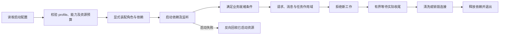

# 系统架构审查：Hyperf 与通用运行契约基线

核查日期：2026-10-04。本文是本次系统审查的一手资料研究记录，不是 TypeApp 功能验收，也不是向应用引入 Hyperf 的实施计划。TypeApp 的源码审查基线为 `7999657396acdff27e54e181de2e1ebdb247d1ea`；项目职责仍以[显式装配决策](../adr/0022-explicit-assembly-and-boundary-contracts.md)和[业务线程与协程作用域](../adr/0013-business-threads-and-coroutine-scopes.md)为准。

## 来源身份与适用范围

- Hyperf：查询时最新正式版为 [v3.2.4][H-release]，2026-08-10 发布；标签对象为 `111efff0e97ebef91e09f598b9b4533ed803bffa`，解引用源码提交为 `58d9f50ff6f51d4ca828c49e131889a419ea66ce`。下文 Hyperf 文档和源码均固定到这个提交，不引用浮动主线作为实现证据。
- 下载核查的官方源码归档 SHA-256：`e93e5e384b2bd11d6b452998a1c458f8e1ffa926ab8fc98d62ced246ac8aa0e4`。只读检查配置、容器、协程、HTTP、连接池、事务、Redis、队列、调度、信号及观测实现；没有运行 Hyperf 服务或性能测试。
- PSR-15：采用 PHP-FIG 已接受规范；所读文件最后修改提交为 `339922b6b83ec88ba90bda14a5e3e40c1dd6986e`。[规范原文][S-psr15]
- 健康探针：采用 Kubernetes 官方探针语义，所读文件最后修改提交为 `6a20979cf474462be672e7387c37dfb0f5f285a4`。引用其区分启动、存活、就绪的契约，不要求 TypeApp 必须部署 Kubernetes。[探针文档][S-probes]
- 分布式锁与跨服务关联：读取 Redis 官方分布式锁说明、W3C Trace Context，访问日期均为 2026-10-04。[锁的有效期与所有权][S-locks]、[关联头协议][S-trace]

Hyperf 是成熟实现的对照来源，PSR-15 是声明采用该接口后的公共协议，健康检查与锁的说明是运维及分布式系统约束；三者不能混称为“必须照搬 Hyperf 才符合标准”。以下“审查要求”是结合 TypeApp 已有架构提出的检查条件，是否满足必须由本仓实现和实际验收分别证明。

## 可以直接用于审查的对照

| 范围 | 已核实的上游事实 | TypeApp 应检查的行为 |
| --- | --- | --- |
| 配置 | 官方建议业务只读取配置对象；外部环境变量可覆盖 `.env`；`.env` 不应入仓。[H-config]、[H-env] | 构建声明与启动数据分离；优先级、类型、范围、路径基准可解释；秘密不写入程序或诊断输出；配置变更何时生效明确 |
| 对象生命周期 | `Container::get()` 缓存解析结果，官方要求此类长寿命对象不携带随请求变化的状态。[H-di]、[H-container] | 显式装配的共享服务也须遵守同样约束；用户、租户、请求、事务不能存入共享可变属性 |
| 协程上下文 | `Context` 按协程存取；`Coroutine::create()` 不复制上下文，`fork()` 显式复制；非协程上下文另有静态存储。[H-context]、[H-coroutine] | 子任务仅继承允许的关联信息；连接与事务不复制；命令退出清理非协程状态；取消、等待与实际收尾分别记录 |
| 启动顺序 | `StartServer` 校验环境并配置 Server；Worker 启动回调在启动事件完成后释放协调信号；HTTP 处理等待该信号。[H-start]、[H-worker]、[H-http] | 能力与配置校验先于接流；依赖启动失败反向回收；“端口已监听”不能替代“业务已就绪” |
| 请求与异常 | HTTP 入口构建 PSR 请求/响应，组合全局和路由中间件，统一捕获异常；HEAD 响应不发送正文。[H-http] PSR-15 建议最外层异常处理覆盖后续管线。[S-psr15] | 入站校验、关联信息、授权、业务和响应边界顺序确定；所有失败可转换为稳定响应，流式响应提交后的错误另行处理 |
| 池容量 | Pool 配置连接上限、借用等待超时及空闲时间；达到上限后有界等待，超时失败。[H-pool] | 每进程/线程池总量可计算；池耗尽及时返回；借用、使用、清洗、销毁有同一所有者，不能无限排队 |
| 数据库 | 同一协程按连接名复用借用，协程结束归还；归还时回滚遗留事务，回滚异常使下次借用重置连接。[H-db-resolver]、[H-db-release] | 事务绑定实际连接与作用域；成功、异常、超时、取消都归还或销毁；三库分别验证会话恢复，不用“有池”替代证明 |
| Redis | 普通命令结束归还；`multi`、`pipeline`、`select` 保持同协程连接；回调式事务/管线可以在结束时提前归还。[H-redis]、[H-redis-multi] | 有状态操作使用专属借用；失败不能污染下个调用；阻塞消费连接与普通业务连接的容量互不挤占 |
| 异步队列 | 具有 waiting、reserved、delayed、failed、timeout 状态；可设置消费并发；官方明确超时任务仍可能已执行成功。[H-queue]、[H-queue-driver] | 确认、租约、重试、死信、幂等与恢复闭环；业务提交成功但确认丢失不能重复产生副作用 |
| 调度 | `singleton` 与 `onOneServer` 分别描述并发互斥和多实例触发；互斥依赖锁有效期。[H-crontab] | 单实例防重叠、多实例抢占、失锁后停止和业务幂等分别验证；不能宣传绝对只执行一次 |
| 停止 | 队列停止处理器将运行标志置为 false，消费者按此标志结束循环；协程 Server 有独立停止协调入口。[H-process-stop]、[H-queue-driver]、[H-co-stop] | 先拒绝新工作，再排空、处理超时、释放依赖；进程/线程/协程分别验证，信号接收不等于业务已退出 |
| 观测 | 提供 Counter、Gauge、Histogram；官方明确过多请求路径标签会造成高基数和内存风险。[H-metric] | 请求、连接池、队列、调度、MQTT 的成功/失败/延迟/积压可观测；标签有界，诊断保留关联 ID 并脱敏 |
| 平台 | 固定版本安装页描述 Swoole 引擎的 Linux/macOS 路径及 Swow 的 Windows 路径，所列最低 Swoole 版本为 5.0。[H-install] | 这不是对本项目 Swoole 6.3 固定快照的兼容性结论；Windows 进程、线程、服务端及关闭能力必须用 TypeApp 实际产物验收 |

## 配置应形成一次可解释的启动快照

Hyperf 的 `DotenvManager` 通过 immutable 仓库加载环境数据，配置工厂随后读取组件提供者、`config/config.php` 和 `config/autoload`。配置声明可以从这一集中装配入口取得环境值；并不意味着所有配置具有统一的“后者覆盖前者”语义：固定源码的 `ConfigFactory` 使用 `array_merge_recursive`，提供者对依赖映射另有特殊处理。[H-env]、[H-config-factory]、[H-provider]

对 TypeApp 的建议是保持现有编译期配置工厂，启动时解析环境与外置配置，形成已校验的快照。应逐项检查：缺失值与空字符串是否可区分；布尔、枚举、端口、超时和容量是否严格解析；来源优先级是否一致；相对路径是否始终依据应用根或配置文件；profile 不匹配是否在打开外部资源前拒绝。共享配置对象不应被请求临时改写。是否支持热更新是单独能力，不能由“每次读取 env”隐式实现。

上面是项目审查建议，并非要求复制 Hyperf 的 PHP 配置扫描、通用 DI 或运行时代理。TypeApp 的[编译声明与启动配置决策](../adr/0003-static-declarations-and-runtime-config.md)可以通过构建期生成达成同样的配置边界。

## 长驻进程的核心是所有权和真实收尾

Hyperf 容器缓存对象与协程上下文共同说明：是否使用 DI 不是隔离的关键，关键是哪些状态被共享、哪些状态只属于当前工作。`Context::copy()` 复制数组内容，不会将其中的对象自动变成新的连接或事务。`Coroutine::create()` 返回协程标识，也没有为调用者建立自动取消、等待和资源回收的完整任务树。[H-container]、[H-context]、[H-coroutine]

因此 TypeApp 的 `ExecutionScope` 应继续承担它自己的责任：按进程、线程和协程确认资源所有者；子任务继承有界的标识及只能缩短的预算；父作用域停止时禁止新任务；超时只表达取消意图，底层 I/O 或任务尚未结束时不能释放仍在使用的连接和并发额度。这是项目已有作用域契约的核查条件，不以 Hyperf 的辅助函数替换。

以下是建议用于核对本仓的运行顺序，不表示 Hyperf 已为每个组件自动实现这些步骤：

## 数据访问不能只审“有没有连接池”

Hyperf 的数据库归还逻辑清理写入标志，并对未完成事务执行回滚；回滚失败会标记下次重置。它不是任意 SQL 会话状态均可复用的证明。事务、会话变量、临时表、锁、游标及数据库特有状态是否恢复，需要由具体驱动契约决定；无法证明干净时关闭连接属于正确的保守策略，不应为宣称复用而放宽隔离。[H-db-release]

事务助手对异常进行回滚，使用受限尝试次数处理识别出的死锁，嵌套事务按数据库语法能力使用保存点。[H-transactions] 对 TypeApp 的检查应至少区分：业务异常、死锁、连接丢失、提交结果未知、回滚失败。自动重试必须证明该操作可以安全重放；HTTP 外呼、MQTT 下发和 Redis 投递不会因为放在数据库事务回调中自动变成数据库事务的一部分。

Redis 的借用粒度与数据库并不相同。普通无状态命令可以尽早归还，管线、事务和选库操作则需要保持同一连接。固定版本的 `RedisConnection::release()` 会尝试恢复所选数据库，但这也不等于任意用户变更的连接状态均已复原。[H-redis]、[H-redis-multi]、[H-redis-release]

## 任务闭环与停机要分别说明保证

| 行为 | 可接受的契约 | 容易误写的承诺 |
| --- | --- | --- |
| 任务执行超时 | 记录结果未知或待核对；恢复依赖幂等键、业务状态和确认记录 | “超时说明没有执行” |
| 数据提交后队列确认丢失 | 允许再次投递，但相同业务键不重复产生副作用 | “队列只投递一次，所以业务不会重复” |
| 调度租约到期 | 旧执行者停止或被业务存储拒绝；解锁校验所有权；必要时采用 fencing token | “只要有锁就不会并发执行” |
| 收到停止信号 | 停止接收新工作，等待存量任务到期限；未完成者保留可恢复状态 | “设置停止标志后资源可立即释放” |

队列超时的事实依据是 Hyperf 官方任务流转说明。[H-queue] 调度建议同时依据 Redis 官方说明：锁只在有效期及其时钟假设内提供互斥；释放和续期须匹配所有权，长任务需要考虑 fencing token。不能把 Hyperf 某个锁实现的所有细节当作分布式正确性的标准答案。[S-locks]

Hyperf 文档区分经典 Server 与协程 Server 的停止处理器，固定源码也提供独立的协程退出协调。因此 TypeApp 在 Windows 使用线程或协程时，应验证同样的停机结果，而不是模拟并不存在的进程信号。[H-signal]、[H-process-stop]、[H-co-stop]

## HTTP、健康与可观测性

PSR-15 约定请求处理器和中间件返回 PSR 响应，允许中间件提前返回，建议由最外层组件捕获异常。[S-psr15] Hyperf 在 HTTP 适配入口外层捕获 `Throwable`，进入异常处理链，最后发出响应，并对 HEAD 禁止正文。[H-http] 对 TypeApp 应检查配置错误、路由缺失、鉴权失败、业务异常、响应编码失败以及连接已经关闭时的结果；“PSR 接口签名兼容”不能替代这些行为验收。

健康探针应明确区分启动、存活与就绪。Kubernetes 官方说明把 liveness 用于判断是否需要重启，把 readiness 用于是否接收流量；启动探针可避免初始化尚未结束时被误杀。后端依赖故障通常需要按角色影响就绪状态，不应直接把所有实例判为需要重启，否则会放大故障。[S-probes] 不必强制提供三个独立 URL，但每个已有健康入口必须说明自己检查什么、什么情况下返回失败、是否有超时及是否会产生副作用。

指标应覆盖总量、失败、延迟和容量，路径标签使用路由模板或有限分类，不能直接塞入设备 ID、用户 ID 或完整 URL。[H-metric] 日志和追踪可使用 W3C `traceparent`/`tracestate` 在调用边界传递关联，需检查格式并避免写入个人或秘密信息。[S-trace] Hyperf 本次核查的 tracer 文档仍以 OpenTracing、Zipkin/Jaeger 为主要接入方式；这不是要求 TypeApp 新增运行时 AOP 或照搬其追踪依赖的理由。[H-tracer]

## 审查结论如何判定

本次系统审查可按下面条件给每个实际入口记录“已实现且有证据”“实现存在但缺少验证”“明确缺陷”“刻意未支持”，不能仅按组件文件存在与否打勾：

1. 配置从声明到启动对象有唯一可追踪路径，非法组合在打开资源前失败。
2. 启动失败和正常停止覆盖所有角色，禁止只验证 HTTP 主入口。
3. 请求、命令、定时任务、队列、MQTT 和受管子任务都能追踪当前作用域，且不存在跨工作复用可变业务状态。
4. 所有连接、缓冲、等待、重试与并发都有预算；多进程或多线程下的总额可以计算。
5. 数据库与 Redis 归还覆盖成功和异常，三库事务语义分别验证；未知提交结果没有被伪装成可安全重试。
6. 队列和调度有重试及恢复路径，租约失效、重复投递、停机中断不会绕过业务幂等或确认边界。
7. 健康状态能够表达初始化、依赖失败与排空；指标及日志能定位失败，标签和秘密输出受控。
8. 对平台能力、数据库 profile、AOT 和单程序交付的结论来自 TypeApp 同一最终产物，不由 Hyperf 的平台说明或功能清单代替。

本研究没有检查 TypeApp 上述入口的完整实现，没有执行其原生或三库回归，也没有形成性能优劣结论；这些结果应由主审查记录关联实际代码与验收证据。

[H-release]: https://github.com/hyperf/hyperf/releases/tag/v3.2.4
[H-config]: https://github.com/hyperf/hyperf/blob/58d9f50ff6f51d4ca828c49e131889a419ea66ce/docs/zh-cn/config.md
[H-env]: https://github.com/hyperf/hyperf/blob/58d9f50ff6f51d4ca828c49e131889a419ea66ce/src/support/src/DotenvManager.php
[H-config-factory]: https://github.com/hyperf/hyperf/blob/58d9f50ff6f51d4ca828c49e131889a419ea66ce/src/config/src/ConfigFactory.php
[H-provider]: https://github.com/hyperf/hyperf/blob/58d9f50ff6f51d4ca828c49e131889a419ea66ce/src/config/src/ProviderConfig.php
[H-di]: https://github.com/hyperf/hyperf/blob/58d9f50ff6f51d4ca828c49e131889a419ea66ce/docs/zh-cn/di.md
[H-container]: https://github.com/hyperf/hyperf/blob/58d9f50ff6f51d4ca828c49e131889a419ea66ce/src/di/src/Container.php
[H-context]: https://github.com/hyperf/hyperf/blob/58d9f50ff6f51d4ca828c49e131889a419ea66ce/src/context/src/Context.php
[H-coroutine]: https://github.com/hyperf/hyperf/blob/58d9f50ff6f51d4ca828c49e131889a419ea66ce/src/coroutine/src/Coroutine.php
[H-start]: https://github.com/hyperf/hyperf/blob/58d9f50ff6f51d4ca828c49e131889a419ea66ce/src/server/src/Command/StartServer.php
[H-worker]: https://github.com/hyperf/hyperf/blob/58d9f50ff6f51d4ca828c49e131889a419ea66ce/src/framework/src/Bootstrap/WorkerStartCallback.php
[H-http]: https://github.com/hyperf/hyperf/blob/58d9f50ff6f51d4ca828c49e131889a419ea66ce/src/http-server/src/Server.php
[H-pool]: https://github.com/hyperf/hyperf/blob/58d9f50ff6f51d4ca828c49e131889a419ea66ce/src/pool/src/Pool.php
[H-db-resolver]: https://github.com/hyperf/hyperf/blob/58d9f50ff6f51d4ca828c49e131889a419ea66ce/src/db-connection/src/ConnectionResolver.php
[H-db-release]: https://github.com/hyperf/hyperf/blob/58d9f50ff6f51d4ca828c49e131889a419ea66ce/src/db-connection/src/Connection.php
[H-transactions]: https://github.com/hyperf/hyperf/blob/58d9f50ff6f51d4ca828c49e131889a419ea66ce/src/database/src/Concerns/ManagesTransactions.php
[H-redis]: https://github.com/hyperf/hyperf/blob/58d9f50ff6f51d4ca828c49e131889a419ea66ce/src/redis/src/Redis.php
[H-redis-multi]: https://github.com/hyperf/hyperf/blob/58d9f50ff6f51d4ca828c49e131889a419ea66ce/src/redis/src/Traits/MultiExec.php
[H-redis-release]: https://github.com/hyperf/hyperf/blob/58d9f50ff6f51d4ca828c49e131889a419ea66ce/src/redis/src/RedisConnection.php
[H-queue]: https://github.com/hyperf/hyperf/blob/58d9f50ff6f51d4ca828c49e131889a419ea66ce/docs/zh-cn/async-queue.md
[H-queue-driver]: https://github.com/hyperf/hyperf/blob/58d9f50ff6f51d4ca828c49e131889a419ea66ce/src/async-queue/src/Driver/Driver.php
[H-crontab]: https://github.com/hyperf/hyperf/blob/58d9f50ff6f51d4ca828c49e131889a419ea66ce/docs/zh-cn/crontab.md
[H-process-stop]: https://github.com/hyperf/hyperf/blob/58d9f50ff6f51d4ca828c49e131889a419ea66ce/src/process/src/Handler/ProcessStopHandler.php
[H-co-stop]: https://github.com/hyperf/hyperf/blob/58d9f50ff6f51d4ca828c49e131889a419ea66ce/src/signal/src/Handler/CoroutineServerStopHandler.php
[H-signal]: https://github.com/hyperf/hyperf/blob/58d9f50ff6f51d4ca828c49e131889a419ea66ce/docs/zh-cn/signal.md
[H-metric]: https://github.com/hyperf/hyperf/blob/58d9f50ff6f51d4ca828c49e131889a419ea66ce/docs/zh-cn/metric.md
[H-tracer]: https://github.com/hyperf/hyperf/blob/58d9f50ff6f51d4ca828c49e131889a419ea66ce/docs/zh-cn/tracer.md
[H-install]: https://github.com/hyperf/hyperf/blob/58d9f50ff6f51d4ca828c49e131889a419ea66ce/docs/zh-cn/quick-start/install.md
[S-psr15]: https://github.com/php-fig/fig-standards/blob/339922b6b83ec88ba90bda14a5e3e40c1dd6986e/accepted/PSR-15-request-handlers.md
[S-probes]: https://github.com/kubernetes/website/blob/6a20979cf474462be672e7387c37dfb0f5f285a4/content/en/docs/concepts/workloads/pods/probes.md
[S-locks]: https://redis.io/docs/latest/develop/clients/patterns/distributed-locks/
[S-trace]: https://www.w3.org/TR/trace-context/
