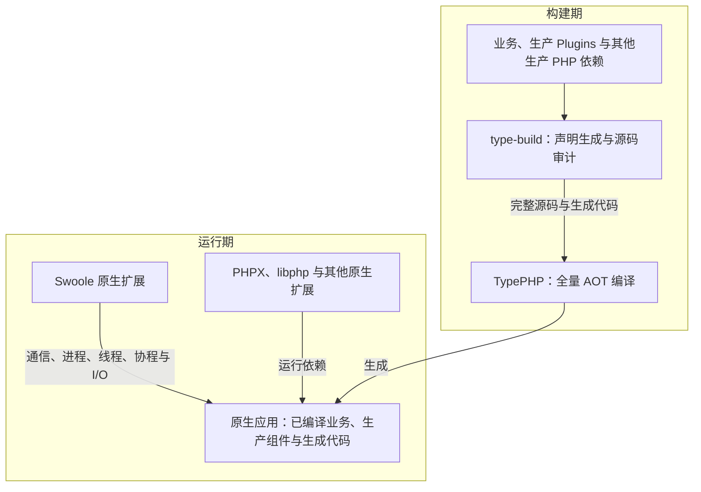
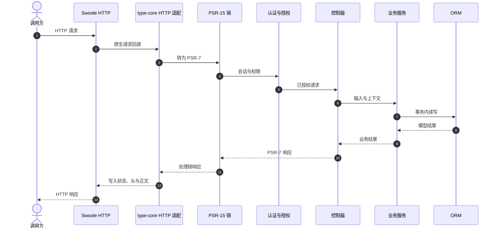

# 系统架构

TypeApp 是以 TypePHP 全量编译、Swoole 驱动运行、Plugins 组合能力的 PHP 应用框架。已集成的 Swoole 能力统一承担网络与并发；构建期完成静态装配，运行期专注业务执行，部署使用携带实际原生依赖的产物。

**TypePHP 编译 · Swoole 运行 · Plugins 扩展。** 业务应用用 `type-project` 创建，再按需安装组件。物联中心是基于框架构建的成品案例，见[物联网中心](iot-center.md)。

## 四者的关系

| 名称 | 职责 | 与其他部分的关系 |
| --- | --- | --- |
| TypeApp | 应用框架，统一组件组合、声明装配、构建与运行约定 | 采用 TypePHP 和 Swoole，通过 Plugins 提供可复用能力 |
| TypePHP | 构建期的 PHP AOT 编译器 | 将生产 PHP 实现转换为 C++，再经原生工具链生成应用产物 |
| Swoole | 运行期的必需原生扩展 | 为已编译应用提供通信、进程、线程、协程与 I/O；可用能力由目标平台及构建选项决定 |
| Plugins | 由 Composer 管理的 `type-xxxx` 框架组件 | 生产组件与业务一起编译；`type-build`、`type-testing` 等开发工具只在对应开发阶段使用 |

Plugins 是这些框架组件的统称。组件按 Composer 包选择和锁定，不是 TypePHP 编译器插件、Composer 安装器插件或运行时热插拔二进制模块。新增生产组件后需要重新构建应用。

TypeApp 的职责是把这些能力组织成可开发、可编译、可部署的应用。TypePHP 负责编译 PHP 调用代码，Swoole 负责执行其原生能力；构建过程与运行时关系分别描述。

应用开发者选择组件和业务入口，构建维护者准备一次匹配的工具链并产出运行包，部署者维护配置、数据与外部服务。各阶段要求见[环境与依赖](environment.md)，运行效率与调优见[性能与调优](performance.md)。

## 精简装配与标准共用

TypeApp 优先复用 PSR、Swoole 以及现有 `ExecutionScope`、`ManagedResource` 和配置约定。应用入口显式构造需要的组件，组件只在通信、存储、日志、队列等真实替换边界使用接口；不增加通用运行时容器、未知源码扫描、AOP 代理或万能基础类。应用按声明顺序启动资源、按逆序停止资源，启动失败回收已启动部分，停止先拒绝新工作再在有界期限内排空。

HTTP、WebSocket、TCP、UDP、MQTT 保留各自协议入口和失败语义，只共用生命周期、资源预算、统计和关闭约定。HTTP 与 WebSocket 共用端口时由同一个 Swoole Server 持有监听，不引入额外的统一 Transport 或 Server 管理器。

## 构建期与运行期

Composer 负责包的安装、依赖解析与版本锁定；`type-build` 收集完整生产源码并生成路由、配置、模型等显式代码，再调用 TypePHP。Swoole 原生扩展本身不作为 PHP 组件交给 TypePHP 编译，PHPX、libphp 与实际使用的扩展仍属于运行依赖。生产请求直接执行已编译入口，不在请求链中调用编译器或通过 Composer 加载业务源码。

`type-build` 的 `resources/swoole/` 随构建组件提供四平台预编译模块、清单和许可材料。构建按组件安装位置选择匹配的模块并校验身份，应用产物只收集所选模块及实际依赖；无需将整目录声明为应用资源。它解决 Swoole 构建输入的复用，当前仍采用共享扩展，选择顺序及 ABI 边界见[内置 Swoole](plugins/type-build.md#内置-swoole-与运行依赖)。

全量 AOT 覆盖框架、业务、生成代码与实际安装的生产 PHP 依赖；仅作开发用途的构建和测试工具不因此进入应用产物。当前约定允许固定 Swoole 扩展的官方内置 PHP 库按官方机制加载，并把其版本、摘要和构建开关纳入产物身份；该库仍是 PHP 实现，这个例外不适用于业务、Plugins 或其他第三方 PHP 源码。

## 原生能力与框架职责

Swoole 统一承担调度、通信和 I/O，直接沿用官方 API、配置、事件循环与协议处理。Plugins 在其上处理编译入口衔接、执行作用域、资源预算、数据库和业务协议；`type-runtime` 管理资源所有权，`type-core` 提供 HTTP、WebSocket、TCP、UDP 四项基础通信，`type-mqtt` 提供 MQTT 协议及会话语义。业务应用通过这些组件实现自己的授权和业务规则。

[HTTP](communications/http.md) 请求与响应、[TCP](communications/tcp.md) 字节流、[UDP](communications/udp.md) 数据报、[MQTT](communications/mqtt.md) 发布订阅和 [WebSocket](communications/websocket.md) 双向消息是平级的应用通信能力，分别有独立教程、协议入口与资源约定。菜单平级不改变协议分层关系。HTTP 接入 PSR 与路由，WebSocket 消息和 TCP/UDP 数据通过各自回调或收发接口处理。HTTP 与 WebSocket 可由同一个 `WebSocket\Server` 实例共用监听地址、端口与生命周期：普通请求交给 `onRequest()`，升级后的消息交给 `onMessage()`；HTTPS 与 WSS 同样可共用 TLS 监听。装配方式与运行边界见[HTTP 与 WebSocket 共用服务](communications/websocket.md#http-与-websocket-共用服务)。

框架不另设可切换的通信底层，不自行维护网络轮询、协议帧或线程调度引擎。迁移须连同旧驱动、配置、调用者及使用说明一起清理。必要的 AOT 入口和生命周期衔接只补官方接口与编译产物之间的实际缺口，并在官方能力足以覆盖时撤除。

## 运行方式与平台

Windows、Linux、macOS 都采用 Swoole 官方能力。执行方式根据目标构建实际可用的能力和角色需要选择；进程不可用时直接使用线程/协程，不要求每个服务先启动进程。

| 运行条件 | 使用方式 |
| --- | --- |
| 角色需要进程且原生进程能力可用 | 使用 Swoole Process 或适用的 Server worker 模型 |
| 进程不可用，线程能力可用 | 使用 Swoole Thread 承载角色，在线程内运行协程；线程构建需要 PHP ZTS |
| 线程不可用或角色无需独立线程 | 在当前执行单元内运行 Swoole 协程，复用官方网络与等待机制 |

经典 Server 不可用时，HTTP 与 WebSocket 使用官方协程 HTTP Server、升级及帧能力，TCP 与 UDP 使用协程 Socket；共用 HTTP/WS 服务和端口的能力不依赖进程模型。进程、线程、协程的隔离程度和停止方式不同，选择执行方式时保留明确的状态归属、资源额度和退出责任。

“最新 Swoole”指跟进官方能力，并在每次构建中锁定具体版本或源码提交、构建开关及摘要。官方 Windows 原生支持已经存在；其经典 Server/Process 与协程/线程的能力范围不同，稳定发行与主线新增能力也需分别核对，见[官方 Windows 支持矩阵](https://github.com/swoole/swoole-src/blob/8340c534526d26bf1efa20c11e1e6ed0a78eb524/docs/windows-native-support.md)。

以上是统一架构约束。当前生产通信入口统一使用 Swoole，角色根据构建能力选择进程、线程或协程；完整应用 AOT、单程序交付和各平台组合验收仍以对应产物证据为准。各平台已通过场景与 SDK 限制统一见[平台与验收](platforms.md)，协议入口见[基础通信](communications.md)。

## 进程、线程与协程的执行边界

三种执行层次各自承担不同责任：进程提供故障、信号和地址空间边界；线程提供独立 PHP/ZTS 运行时和并行执行单元；协程在同一进程或线程内交错处理可让出的 I/O。进程不可用时可以接入官方线程或协程，但降级后必须重新核对状态隔离、硬停止、连接归属和资源总额。完整知识、示例与控制规则见[进程、线程与协程](runtime.md)。

需要业务资源的 HTTP 请求、WebSocket 消息、TCP/UDP 收发、MQTT 业务操作、命令和后台任务都从根 `ExecutionScope` 开始；协议会话本身仍由对应的 Swoole Server 或 Socket 所有。作用域携带有界业务上下文、单调截止时间、取消信号和任务树预算；受管子协程取得新的执行者和资源边界，复制上下文快照，共享只能缩短的截止与取消，连接、事务和可变对象必须在子作用域重新借用。资源所有权由进程、原生线程、请求代次、Swoole 协程和 Fiber 身份共同校验，不能用进程全局变量承载当前请求。

停止遵循“撤销就绪 → 取消新工作 → 等待真实收尾 → 逆序释放资源”的顺序。协程取消是合作式意图，`await` 超时不等于底层操作已经退出；作用域在仍有后代或原生 I/O 时保持 `closing` 并继续占用预算。只有线程/进程监督能够确认角色退出或完成隔离，不能把强制终止解释成外部事务已经回滚。

## HTTP 请求示例

下面以一次 HTTP 请求说明应用与组件的分工；WebSocket 按消息处理，TCP 与 UDP 按各自的数据语义处理，其生命周期见[基础通信](communications.md#共用的资源与运行约定)。

通信适配器只负责协议、连接和资源生命周期；控制器负责输入与响应，服务负责业务状态和事务，组件负责通用能力。配置与路由在构建期生成；生产应用不读取业务 PHP 源码或 Composer 自动加载。完整通信边界见[基础通信](communications.md)，编译和运行包见[构建与部署](deployment.md)。

## 源码职责

| 目录 | 当前责任 | 关键入口 |
| --- | --- | --- |
| `plugin/type-core` | 配置、命令、事件及 HTTP、WebSocket、TCP、UDP 基础通信 | `Http\SwooleServer`、`WebSocket\Server/Client`、`TcpSocket`、`UdpSocket` |
| `plugin/type-runtime` | 执行作用域、资源池与租约、截止和取消 | `ExecutionScope`、`ResourcePool` |
| `plugin/type-orm` | 连接、查询、模型、事务与迁移 | `Connection`、`Model` |
| `plugin/type-mqtt` | MQTT 连接、协议状态和 Topic 路由；持久交付需 PostgreSQL 同步存储 | `Broker`、`Client` |
| `plugin/type-build` | 声明生成、源码审计、AOT 与运行包 | `type` 命令 |
| `templates/type-project` | 独立业务应用起点，按需安装 Plugins | `type create`、`type-app.json` |

生产源码中带 `#[Route]`、`#[Group]` 或 `#[Resource]` 的控制器，以及 `config/route.php` 里显式列出的 `routes`，会进入构建期生成结果。只把 PHP 文件放进 `app/`、没有路由注解也没有写入声明表，不会成为公开入口。新增控制器后仍须更新 PHPDoc、业务指南和真实路由回归。

## 运行与发布边界

开发时可以通过 PHP 开发入口加载 Composer 和 PHP 源码，便于快速反馈；生产必须执行 TypePHP 全量编译。交付目标是**一个程序文件加外置配置**：PHPX、libphp、Swoole 及其他非系统原生库在构建期静态链接，启动不释放运行库；允许依赖目标操作系统自带库。运行时按需创建数据与日志，用户无需分别安装 PHP、Swoole 或编译工具链。`.env` 是启动数据，不能进入源码清单、构建身份或公开文档站。

一个程序文件可包含多个角色入口，不等于所有角色只能运行在一个进程或线程。不同平台分别构建对应程序；当前 `type package` 仍生成目录包，完整静态单程序尚未完成。现阶段运行库随完整包交付，部署者无需安装 Composer、TypePHP 或编译 SDK；数据库、Redis、证书和持久数据按业务需要管理，见[构建与部署](deployment.md)。

项目源码按 Apache-2.0 提供，Swoole、TypePHP、Vben Admin Pro、Docsify、PrismJS 和数据库/系统库保留各自许可证。许可证边界见[许可证与归属](licensing.md)，站点根目录同时提供 <a href="LICENSE">LICENSE</a> 和 <a href="NOTICE">NOTICE</a>。

[快速开始](quickstart.md) · [配置与环境](configuration.md) · [组件参考](components.md)
