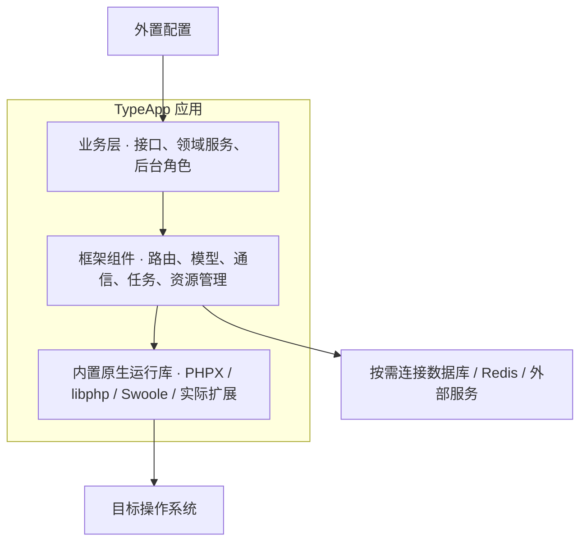
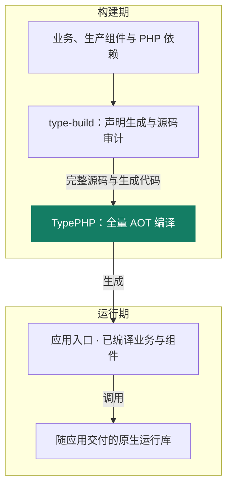
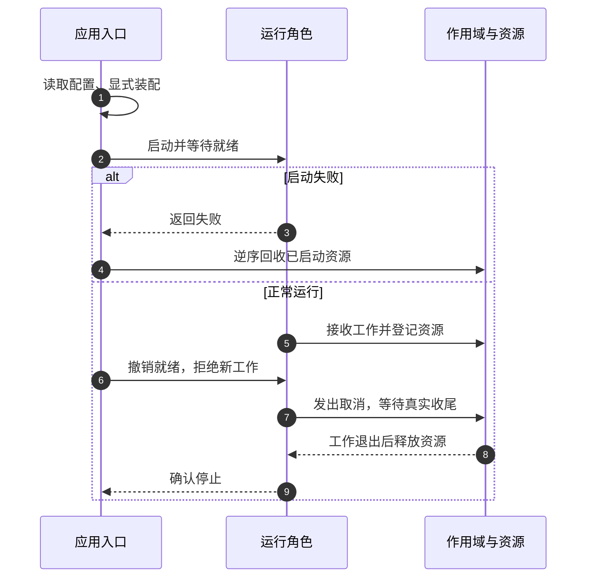
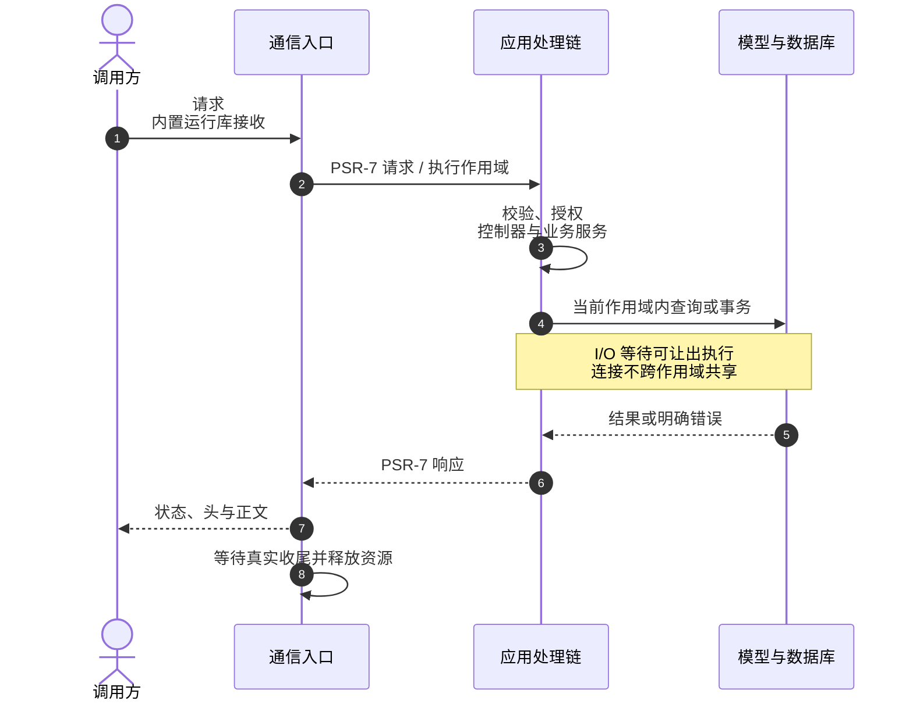

# 系统架构

TypeApp 是面向原生交付的 PHP 应用框架。开发者组合组件实现业务，构建工具提前完成声明生成与依赖装配，由 TypePHP 全量编译生产实现，部署端运行已构建的应用。

## 应用分层

业务应用拥有自己的入口、数据和规则。TypeApp 通过 Plugins 提供通用能力，底层原生运行库随应用交付，由构建统一管理版本与依赖。

这张图描述职责归属。最终文件形态是一个主程序加外置配置；当前仍采用目录包，具体差距集中在[构建与部署](deployment.md#当前构建状态)。

| 层次 | 负责什么 | 由谁维护 |
| --- | --- | --- |
| 业务应用 | 授权、业务规则、数据归属和角色装配 | 应用开发者；通用项目从 `type-project` 起步 |
| 框架组件 | 通信入口、模型、任务、配置与有界资源生命周期 | TypeApp；Plugins 是 Composer 管理的 `type-xxxx` 包 |
| 内置原生运行库 | PHP 原生执行支持、网络、并发、数据库客户端等 | 构建流程选择和校验，随应用交付 |
| 外部环境 | 操作系统、业务服务、证书、持久目录 | 部署者按应用需要准备 |

组件在构建时选择并锁定，新增生产组件需要重新编译。`type-build`、`type-testing` 等开发工具只在对应阶段使用。物联中心是应用实例，其业务不进入通用组件，见[物联网中心](iot-center.md)。

## 精简装配与标准共用

TypeApp 优先复用 PSR、Swoole 以及现有 `ExecutionScope`、`ManagedResource` 和配置约定。应用入口显式构造需要的组件，组件只在通信、存储、日志、队列等真实替换边界使用接口；不增加通用运行时容器、未知源码扫描、AOP 代理或万能基础类。应用按声明顺序启动资源、按逆序停止资源，启动失败回收已启动部分，停止先拒绝新工作再在有界期限内排空。

HTTP、WebSocket、TCP、UDP、MQTT 保留各自协议入口和失败语义，只共用生命周期、资源预算、统计和关闭约定。HTTP 与 WebSocket 共用端口时由同一个 Swoole Server 持有监听，不引入额外的统一 Transport 或 Server 管理器。

## 构建期与运行期

TypePHP 是核心编译技术，承担从 PHP 到 C++ 再到原生程序的编译路径，详见[TypePHP 全量编译](typephp.md)。Composer 负责包的安装、依赖解析与版本锁定；`type-build` 收集完整生产源码并生成路由、配置、模型等显式代码，再调用 TypePHP。Swoole 原生扩展本身不作为 PHP 组件交给 TypePHP 编译，PHPX、libphp 与实际使用的扩展仍属于运行依赖。生产请求直接执行已编译入口，不在请求链中调用编译器或通过 Composer 加载业务源码。

物联中心的前端在构建侧冻结依赖并生成 `dist`，由 `type-build` 转为 C++ 常量随程序链接；安装命令按资源清单写入应用根 `public/`，运行时通过既有 HTTP 入口提供页面与 API。页面文件、外置配置和持久数据有各自生命周期，普通启动不解包资源；这项前端内嵌能力不改变原生库仍随目录包交付的现状。

构建组件提供匹配平台的预编译 Swoole 模块、清单和许可材料，默认按自身安装位置选择并校验。应用只收集选中的模块与实际依赖；ABI、覆盖与失败处理见[type-build](plugins/type-build.md#内置-swoole-与运行依赖)。

全量 AOT 覆盖框架、业务、生成代码与实际安装的生产 PHP 依赖；仅作开发用途的构建和测试工具不因此进入应用产物。当前约定允许固定 Swoole 扩展的官方内置 PHP 库按官方机制加载，并把其版本、摘要和构建开关纳入产物身份；该库仍是 PHP 实现，这个例外不适用于业务、Plugins 或其他第三方 PHP 源码。

## 为什么内置 Swoole

HTTP 请求、长连接、设备消息和后台任务都需要处理网络等待与并发执行。Swoole 提供官方网络服务、Socket、协程调度及线程/进程能力：可让出的 I/O 等待期间，执行单元可以处理其他工作；需要并行或隔离的角色再按平台能力选择线程或进程。

将这些能力集成进框架，可以共用成熟的通信机制，减少重复维护事件循环、网络轮询和平台适配。业务代码通过组件使用它们；部署者无需另起一个 Swoole 服务，也无需手工安装或配置 Swoole 扩展。开发机与构建机仍有各自的准备要求，见[环境与依赖](environment.md)。

Swoole 是必需的内部运行库，但不会代替业务授权、资源预算或事务语义，也不意味着所有工作会自动并行。吞吐与延迟取决于业务、数据库和资源配置，测量方法见[性能与调优](performance.md)。

### 原生能力与框架职责

Swoole 统一承担调度、通信和 I/O，直接沿用官方 API、配置、事件循环与协议处理。Plugins 在其上处理编译入口衔接、执行作用域、资源预算、数据库和业务协议；`type-runtime` 管理资源所有权，`type-core` 提供 HTTP、WebSocket、TCP、UDP 四项基础通信，`type-mqtt` 提供 MQTT 协议及会话语义。业务应用通过这些组件实现自己的授权和业务规则。

[HTTP](communications/http.md) 请求与响应、[TCP](communications/tcp.md) 字节流、[UDP](communications/udp.md) 数据报、[MQTT](communications/mqtt.md) 发布订阅和 [WebSocket](communications/websocket.md) 双向消息是平级的应用通信能力，分别有独立教程、协议入口与资源约定。菜单平级不改变协议分层关系。HTTP 接入 PSR 与路由，WebSocket 消息和 TCP/UDP 数据通过各自回调或收发接口处理。HTTP 与 WebSocket 可由同一个 `WebSocket\Server` 实例共用监听地址、端口与生命周期：普通请求交给 `onRequest()`，升级后的消息交给 `onMessage()`；HTTPS 与 WSS 同样可共用 TLS 监听。装配方式与运行边界见[HTTP 与 WebSocket 共用服务](communications/websocket.md#http-与-websocket-共用服务)。

框架不另设可切换的通信底层，不自行维护网络轮询、协议帧或线程调度引擎。迁移须连同旧驱动、配置、调用者及使用说明一起清理。必要的 AOT 入口和生命周期衔接只补官方接口与编译产物之间的实际缺口，并在官方能力足以覆盖时撤除。

## 运行方式与平台

Windows、Linux、macOS 都采用 Swoole 官方能力。执行方式根据目标构建实际可用的能力和角色需要选择；进程不可用时直接使用线程/协程，不要求每个服务先启动进程。

| 运行条件 | 使用方式 |
| --- | --- |
| 角色需要进程且原生进程能力可用 | 使用 Swoole Process 或适用的 Server worker 模型 |
| 进程不可用，线程能力可用 | 使用 Swoole Thread 承载角色，在线程内运行协程；线程构建需要 PHP ZTS |
| 线程不可用或角色无需独立线程 | 在当前执行单元内运行 Swoole 协程，复用官方网络与等待机制 |

经典 Server 不可用时，HTTP 与 WebSocket 使用官方协程 HTTP Server、升级及帧能力，TCP 与 UDP 使用协程 Socket；共用 HTTP/WS 服务和端口的能力不依赖进程模型。进程、线程、协程的隔离程度和停止方式不同，选择执行方式时保留明确的状态归属、资源额度和退出责任。

“最新 Swoole”指跟进官方能力，并在每次构建中锁定具体版本或源码提交、构建开关及摘要。官方 Windows 原生支持已经存在；其经典 Server/Process 与协程/线程的能力范围不同，稳定发行与主线新增能力也需分别核对，见[官方 Windows 支持矩阵](https://github.com/swoole/swoole-src/blob/8340c534526d26bf1efa20c11e1e6ed0a78eb524/docs/windows-native-support.md)。

以上是统一架构约束。当前生产通信入口统一使用 Swoole，角色根据构建能力选择进程、线程或协程；完整应用 AOT、单程序交付和各平台组合验收仍以对应产物证据为准。各平台已通过场景与 SDK 限制统一见[平台与验收](platforms.md)，协议入口见[基础通信](communications.md)。

## 进程、线程与协程的执行边界

三种执行层次各自承担不同责任：进程提供故障、信号和地址空间边界；线程提供独立 PHP/ZTS 运行时和并行执行单元；协程在同一进程或线程内交错处理可让出的 I/O。进程不可用时可以接入官方线程或协程，但降级后必须重新核对状态隔离、硬停止、连接归属和资源总额。完整知识、示例与控制规则见[进程、线程与协程](runtime.md)。

需要业务资源的 HTTP 请求、WebSocket 消息、TCP/UDP 收发、MQTT 业务操作、命令和后台任务都从根 `ExecutionScope` 开始；协议会话本身仍由对应的 Swoole Server 或 Socket 所有。作用域携带有界业务上下文、单调截止时间、取消信号和任务树预算；受管子协程取得新的执行者和资源边界，复制上下文快照，共享只能缩短的截止与取消，连接、事务和可变对象必须在子作用域重新借用。资源所有权由进程、原生线程、请求代次、Swoole 协程和 Fiber 身份共同校验，不能用进程全局变量承载当前请求。

停止遵循“撤销就绪 → 取消新工作 → 等待真实收尾 → 逆序释放资源”的顺序。协程取消是合作式意图，`await` 超时不等于底层操作已经退出；作用域在仍有后代或原生 I/O 时保持 `closing` 并继续占用预算。只有线程/进程监督能够确认角色退出或完成隔离，不能把强制终止解释成外部事务已经回滚。

### 启动与停止的责任顺序

若截止时工作仍未结束，保持占用与失败状态，由对应监督边界处理；不能提前报告停止成功。

## HTTP 请求示例

下面以一次 HTTP 请求说明应用与组件的分工；WebSocket 按消息处理，TCP 与 UDP 按各自的数据语义处理，其生命周期见[基础通信](communications.md#共用的资源与运行约定)。

通信适配器只负责协议、连接和资源生命周期；控制器负责输入与响应，服务负责业务状态和事务，组件负责通用能力。配置与路由在构建期生成；生产应用不读取业务 PHP 源码或 Composer 自动加载。完整通信边界见[基础通信](communications.md)，编译和运行包见[构建与部署](deployment.md)。

## 源码职责

| 目录 | 当前责任 | 关键入口 |
| --- | --- | --- |
| `plugin/type-core` | 配置、命令、事件及 HTTP、WebSocket、TCP、UDP 基础通信 | `Http\SwooleServer`、`WebSocket\Server/Client`、`TcpSocket`、`UdpSocket` |
| `plugin/type-runtime` | 执行作用域、资源池与租约、截止和取消 | `ExecutionScope`、`ResourcePool` |
| `plugin/type-orm` | 连接、查询、模型、事务与迁移 | `Connection`、`Model` |
| `plugin/type-mqtt` | MQTT 连接、协议状态和 Topic 路由；持久交付需 PostgreSQL 同步存储 | `Broker`、`Client` |
| `plugin/type-build` | 声明生成、源码审计、AOT 与运行包 | `type` 命令 |
| `templates/type-project` | 独立业务应用起点，按需安装 Plugins | `type create`、`type-app.json` |

生产源码中带 `#[Route]`、`#[Group]` 或 `#[Resource]` 的控制器，以及 `config/route.php` 里显式列出的 `routes`，会进入构建期生成结果。只把 PHP 文件放进 `app/`、没有路由注解也没有写入声明表，不会成为公开入口。新增控制器后仍须更新 PHPDoc、业务指南和真实路由回归。

## 运行与发布边界

开发入口加载 PHP 源码以便快速反馈；生产入口执行全量编译后的应用。一个主程序可以提供多个角色入口，文件数量不限定运行进程或线程数量。不同平台分别构建和验收，开发主仓、组件源码分发与应用发布是三个出口。

外置配置保存部署参数和秘密，不进入生产源码清单或公开站点。程序、配置、持久数据的交付责任和当前打包命令见[构建与部署](deployment.md)；能力要求与验收入口见[基础能力](capabilities.md)。

项目源码按 Apache-2.0 提供，Swoole、TypePHP、Vben Admin Pro、Docsify、PrismJS 和数据库/系统库保留各自许可证。许可证边界见[许可证与归属](licensing.md)，站点根目录同时提供 <a href="LICENSE">LICENSE</a> 和 <a href="NOTICE">NOTICE</a>。

[快速开始](quickstart.md) · [配置与环境](configuration.md) · [组件参考](components.md)
