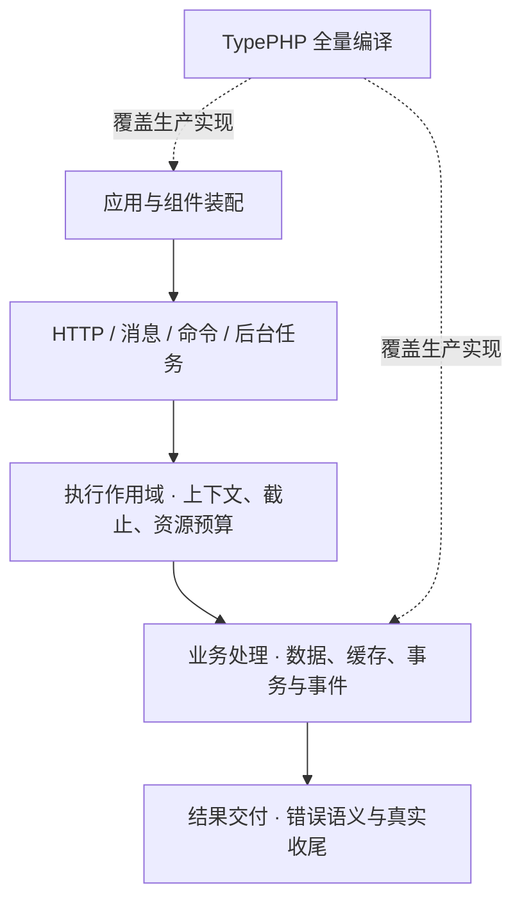

# 基础能力与验收

TypeApp 的基础能力围绕一条应用路径组织：组合组件、处理输入、执行业务、管理资源、编译交付。下面列出需求与现有入口，帮助选择组件和确定验收范围；存在接口或测试入口不代表全部平台已经通过。

## 应用与组件

需求是让新业务通过稳定公开接口装配能力，组件不依赖案例业务。

| 现有入口 | 必须验证的行为 |
| --- | --- |
| `type-project`、Composer、`type-build` | 从独立安装创建应用，锁定依赖并完整编译；不借用主仓路径或未声明源码 |
| 配置、路由与声明生成 | 未声明入口不公开；输入变化重新构建；无运行时扫描或源码解释回退 |
| 显式生命周期装配 | 配置阶段不打开外部资源，启动失败回收已启动部分 |

## 执行与资源

需求是让并发工作有明确归属、资源上限与退出责任。

| 现有入口 | 必须验证的行为 |
| --- | --- |
| `type-runtime` 的 `ExecutionScope`、上下文与受管任务 | 请求和子任务隔离；截止只能缩短；不跨线程或作用域共享连接与事务 |
| 资源池、租约和任务树预算 | 满载时有界等待或拒绝，取消不提前归还仍在使用的资源 |
| 角色生命周期与线程监督 | 撤销就绪、停止新工作、等待真实退出；超时不伪装成事务回滚 |

## 通信

需求是提供各协议的真实收发语义，并共用资源和停止约定。

| 现有入口 | 必须验证的行为 |
| --- | --- |
| `type-core` 的 HTTP、WebSocket、TCP、UDP | 路由与消息、半包/断连、TLS、慢连接、过载和恢复；共用端口时监听所有权唯一 |
| `type-mqtt` 的 Broker 与 Client | 协议互操作、QoS、会话、保活、重连、持久确认与故障恢复 |
| 内置 Swoole 网络和并发能力 | 使用目标构建实际支持的执行方式，分别验证隔离、容量和停止 |

MQTT 完整规范义务、故障域与容量仍需逐项闭合，详见[实现规划](roadmap.md#标准框架)。

## 数据

需求是统一应用的数据访问方式，同时保留 MySQL、PostgreSQL、SQLite 的真实差异。

| 现有入口 | 必须验证的行为 |
| --- | --- |
| `type-orm`、三个驱动、Model 与查询 | 字段、关系、迁移、版本、删除与输出规则在真实数据库执行 |
| 事务、租户上下文与主从路由 | 提交/回滚、未知提交、租户隔离和路由意图明确，不隐式重试未知结果 |
| 连接池与凭据代次 | 污染会话不回池，旧凭据连接退役，取消后等待底层工作结束 |

PostgreSQL 已有完整重置后物理 PDO 复用；MySQL、SQLite 当前安全关闭，完整复用仍是待交付能力。逻辑租约复用与物理连接复用不能混称。

模型标量聚合、批量新增与冲突写入，以及所选 PDO hook 的启动校验仍有缺口。具体[能力边界](database.md#常用能力边界)与 [ORM 补齐顺序](roadmap.md#orm-补齐顺序)分别说明现有入口和验收要求，不以底层 SQL 能力代替模型约束。

## 后台任务与通用服务

需求是让同步业务与异步工作遵守同一失败、资源和可观察性约定。

| 现有入口 | 必须验证的行为 |
| --- | --- |
| `type-redis`、`type-cache` | 连接、TTL、容量、提交后失效、故障与重连；不同持久化策略分别配置 |
| `type-queue`、`type-scheduler` | 确认、重试、幂等、延迟、重复投递、进程退出与持久恢复 |
| `type-validate`、`type-log` | 受控输入、稳定错误、关联日志与秘密脱敏 |

Redis 服务只由实际使用它的应用准备，不是所有 TypeApp 应用的统一前置条件。

## 构建、交付与质量

需求是让同一产物可追溯、可搬迁、可维护，最终按一个主程序加配置交付。

| 现有入口 | 必须验证的行为 |
| --- | --- |
| `type-build`、TypePHP 与锁文件 | 生产输入完整、原生 ABI 匹配、摘要一致；明确拒绝缺失或篡改的构建资源 |
| 目录包、归档与运行校验 | 当前完整包可搬迁；同一程序无源码运行、升级和恢复；配置与数据不被覆盖 |
| `type-testing`、独立消费者与平台 CI | 公开接口、真实三库和协议、故障与资源释放；结果绑定准确产物身份 |
| 性能与容量验证 | 固定负载多轮测量，记录吞吐、尾延迟、错误及资源占用 |

完整静态单程序尚未完成，验收范围见[交付约定与当前状态](deployment.md)。四平台的历史与当前工具链结果分别记录在[平台与验收](platforms.md)，实施优先顺序见[实现规划](roadmap.md#推进顺序)。
