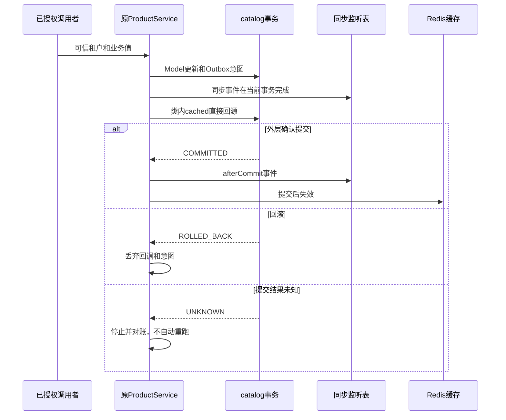
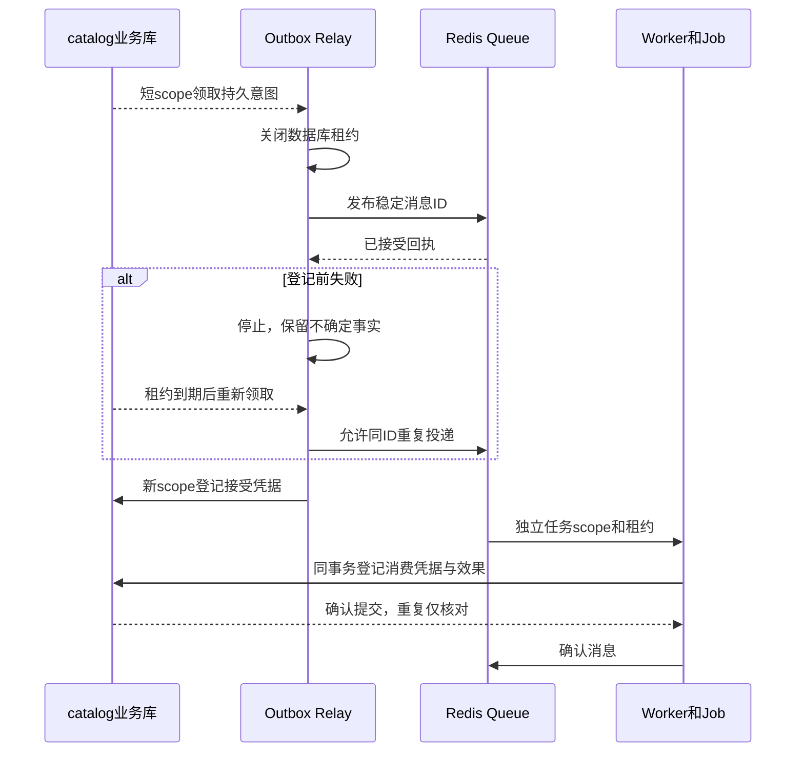
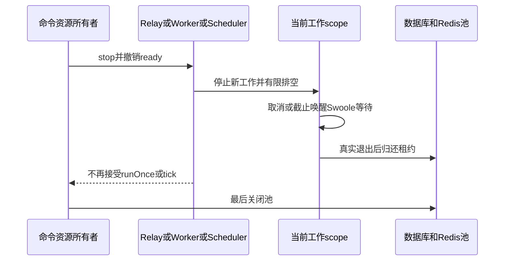

# 目录模块的后台与可靠交付

本页继续[同一个目录应用](tutorial.md)，沿用已保存的源码、组件、锁文件和冻结迁移。`setup.php` 已完成本章的生成与编辑步骤，不要再次创建同名类。生产程序不运行教程脚本。

## 1. 后台角色与基础设施

准备步骤真实执行以下公开命令。生成的 Command 和 Task 保持原样，Job 补全固定消费协议：

```bash
php vendor/bin/type make type-app.json command 'app\catalog\command\CatalogCommand' \
  '--service=app\catalog\service\Reliability' --name=catalog
php vendor/bin/type make type-app.json job 'app\catalog\job\DeliverProduct' \
  '--service=app\catalog\service\DeliveryService' --type=catalog.deliver --version=1
php vendor/bin/type make type-app.json task 'app\catalog\task\CatalogTask' \
  '--service=app\catalog\service\Maintenance' --name=catalog.maintenance --interval=60
```

| 完整源码 | 职责 |
| --- | --- |
| [ProductService](https://github.com/zoujingli/typeapp/blob/main/examples/catalog/service/ProductService.php) | 上一章 CRUD、原类型缓存声明、事务、事件及 Outbox 意图 |
| [Reliability](https://github.com/zoujingli/typeapp/blob/main/examples/catalog/service/Reliability.php) | 有限命令步骤，不自动重试 UNKNOWN |
| [Infrastructure](https://github.com/zoujingli/typeapp/blob/main/examples/catalog/runtime/Infrastructure.php) | 命令资源，命名数据源、Redis 池及关闭顺序 |
| [Delivery Job](https://github.com/zoujingli/typeapp/blob/main/examples/catalog/job/DeliverProduct.php) | 独立任务作用域、载荷校验和同库幂等效果 |
| [Maintenance](https://github.com/zoujingli/typeapp/blob/main/examples/catalog/service/Maintenance.php) | 可信租户内扫描最多二十个商品，返回 occurrence 关联 |

`catalog.infrastructure` 是命令声明的资源，先登记后借用。开始时配置一次数据库管理器，结束按 scope 逆序收回业务会话和 Redis 租约，最后关闭池。Job 和 Task 不捕获启动期连接。工作角色由应用明确授权 `catalog-a`，消息载荷只接受正整数商品 ID；追踪信息不建立身份。

使用专用 Redis 实例与本次唯一命名空间。已安装 Redis 的 Linux/macOS 可以启动自己所有的进程：

```bash
mkdir -p var/tutorial-redis
redis-server --bind 127.0.0.1 --port 6389 --save '' --appendonly yes \
  --dir "$PWD/var/tutorial-redis" >var/tutorial-redis.log 2>&1 &
tutorial_redis_pid=$!
export TYPE_REDIS_HOST=127.0.0.1 TYPE_REDIS_PORT=6389
export CATALOG_NAMESPACE="catalog-$(php -r 'echo bin2hex(random_bytes(8));')"
```

端口被占用时选择另一个端口，不停止其他服务。示例 Queue 租约一秒、容量一百，缓存 TTL 六十秒。Redis 连接失败检查本次日志、地址和扩展，不能切换成内存替身来宣称持久投递通过。

## 2. 原 Service 的缓存与事务

在已经迁移的新练习库上运行一次：

```bash
php vendor/bin/type dev type-app.json catalog cache
```

返回 `loads:7`、`null_cached:true`、`failure_cached:false`、`rollback_discarded:true`、`sync:[true]`、`after_commit:[false]`、`outbox:"pending"`。命令创建 `code=reliability` 商品；重复完整演练使用新的测试数据库。

缓存键包含可信租户与商品 ID；缺失商品的 null 也能命中，异常不会变成缓存值。原 Service 的 `change()` 类内调用 `cached()` 仍经过同一构建转换。活动 `catalog` 事务内绕过缓存读取和填充，嵌套方法返回不会提前失效；只有同源最外层确认提交后才执行失效，回滚则丢弃失效回调和 Outbox 意图。



同步 `BusinessEvents` 在当前调用中按声明顺序完成，异常中止后续监听并传播。`Db::afterCommit()` 只在当前进程确认提交后执行；回调失败不能撤销已提交数据。两者都不是持久消息保证。真实通知依赖同一 `catalog` 事务中的 Outbox 意图，不能在数据库事务中发送邮件、HTTP 通知或 Redis 消息。

UNKNOWN 先停止当前动作，核对业务身份和 Outbox 记录，再显式恢复；“收到异常”不等于“肯定没写入”。下一节接受后故障是跨系统不确定性；数据库连接中断造成的提交 UNKNOWN 使用组件既有三库故障入口验证，不在本教程伪造确定回滚。

## 3. Outbox 重复投递与消费收敛

```bash
php vendor/bin/type dev type-app.json catalog relay-fail
php vendor/bin/type dev type-app.json catalog status
sleep 1
php vendor/bin/type dev type-app.json catalog relay
php vendor/bin/type dev type-app.json catalog consume
php vendor/bin/type dev type-app.json catalog status
```

`relay-fail` 真实发布到 Redis，随后在登记 Outbox 接受凭据前故意抛出 `catalog_accepted_without_receipt`，输出 `accepted:"unknown"`、`retry:false`。此时没有接受或消费凭据，不能推断 Redis 未接受。等本演练 250 毫秒 Outbox 领取租约结束后，下一次独立 `relay` 重新领取并投递同一 ID，再登记真实 Stream 回执。生产租约须按外部调用预算配置，短租约只用于快速演练。

`consume` 返回 `processed:2`、`remaining:0`、`effects:1`。Job 在 `catalog` 事务内调用 `Store::consumed()`，仅首次取得凭据时保存 `Delivery`。消息 ID 是效果主键；`trace_id=catalog-product-<id>` 只用于核对。最终状态具有接受和消费两个凭据，再次 relay 或 consume 都处理零条。



这证明本库效果幂等收敛，不是跨数据库和 Redis 的原子事务。邮件等不能与本库共同提交的副作用仍须目标端幂等协议。

## 4. 持久调度、HTTPS 与停止

```bash
export CATALOG_CURSOR=var/catalog-schedule.json CATALOG_CLOCK=1800000000
php vendor/bin/type dev type-app.json catalog schedule
php vendor/bin/type dev type-app.json catalog schedule
```

第一次返回一条 `succeeded` 记录，包含 occurrence、计划时间、版本、结果和完成状态；第二个进程在同一时刻返回空列表。文件锁保护持久游标。恢复时遗留 running 记录明确标为 interrupted，业务效果须对账；不能自动认定未执行。正常运行取消 `CATALOG_CLOCK`，使用真实 UTC 时钟；多机器调度使用具备租约的协调存储，不用本机文件冒充分布式协调。

HTTPS 使用受控目标和匹配的 CA 文件：

```bash
export CATALOG_HTTPS_URL=https://localhost:9443/
export CATALOG_HTTPS_CA="$PWD/var/tutorial-ca.pem"
php vendor/bin/type dev type-app.json catalog https
```

受管 `Type\Core\Http\Client` 验证 TLS 链和主机名，仅接受 HTTPS，不跟随跳转、不自动重试，预算两秒、响应正文最多 4096 字节；调用者在 finally 关闭正文。`https-host` 使用错误主机名；`https-timeout` 使用五十毫秒预算；`https-cancel` 在三十毫秒后取消子任务，后二者须指向受控延迟响应端点。完整公开测试自动创建真实 TLS 对端及证书，结束后停止并删除本次私钥。某些 Swoole 构建会先输出主机名不匹配警告，结构化结果位于最后一行；警告不是成功响应。



命令各自只推进一个有界步骤，完成就退出；代码断言停止后不再领取、消费或调度。HTTP 宿主继续由模板入口持有，向上一章记录的 PID 发出 TERM 并等待退出，不把监听器嵌进命令协程调度器。

## 5. 离线诊断与共同验收

```bash
php vendor/bin/type inspect-application type-app.json
php vendor/bin/type inspect-application type-app.json --json >var/catalog-assembly.json
php vendor/bin/type test type-app.json
```

检查输出包含服务图与生命周期、路由、Model 来源、Schema、事件监听表、Job 类型/版本和 Task 计划。它不执行构造器、工厂或外部连接，不输出配置秘密。请求日志有 request ID，任务有 message/occurrence ID；用稳定错误码、角色和关联身份排障，不打印 API 令牌、密码、完整输入或私钥。

每次测试使用新专属数据库。公开 `tests/tutorial.php` 串联原模板、目录 HTTP 和本章断言；`TYPE_APP_BINARY` 选择同一原生产物，隔离验收可用显式 `TYPE_APP_COMMAND` 参数数组。PHP 行为、AOT 编译、原生行为与单程序隔离分别记录。三库和 Redis 复用相同公开入口，准确结果以本次候选回执为准。

共同验收还会调用本章的显式任务演练，实际执行原生成的 Job/Task 及其业务 Service。这些步骤用于观察失败边界，不是应用的常驻工作角色：

| 演练 | 需要观察的结果 |
| --- | --- |
| `queue-invalid` | 无效业务载荷经过三次独立尝试后隔离，同一消息 ID 保持不变，没有业务效果 |
| `queue-cancel` | 首次任务主作用域被明确取消，清理后安排有限重试；新作用域完成同一消息，效果只有一次 |
| `queue-cleanup` | 业务已经完成但资源清理失败时保留原投递与租约，既不确认也不安排重试；真实收尾后允许新 Worker 重领，幂等效果不增加 |
| `schedule-failure` / `schedule-cancel` | 数据源不可用或主作用域取消成为明确失败历史，正常收尾后记录完成时间 |
| `schedule-cleanup` | 清理未完成时保留 `finished_at:null`，停止新 tick；原作用域完成收尾后才归还在途额度 |

调度演练使用各自的游标文件。重启后，同一计划时刻不因失败而自动重跑；下一计划时刻可以正常执行。验收在资源的 `stop()` 内读取队列与持久计划，核对确认发生在实际清理之后，并检查每次角色和 scope 都是新实例。观察资源只属于可靠性演练，业务 Service 和生成模板不需要添加故障开关。HTTPS 子任务取消与 Job/Task 主作用域取消分别验证，Outbox 重领也不代替 Job 执行失败后的重试。

测试精确删除自己的 Redis Queue/Cache 命名空间、TLS 文件和游标，并停止自建 HTTPS 对端。手动练习结束后先正常停止本次 Redis，再回收其独立数据目录、专属数据库与临时应用，保留候选身份、迁移快照及必要回执：

```bash
kill -TERM "$tutorial_redis_pid"
wait "$tutorial_redis_pid"
```

不要对共享 Redis 执行 FLUSHDB，不用宽泛进程匹配清理其他用户的服务。返回：[连续目录教程](tutorial.md) · [缓存组件](plugins/type-cache.md) · [队列组件](plugins/type-queue.md) · [调度组件](plugins/type-scheduler.md)。
