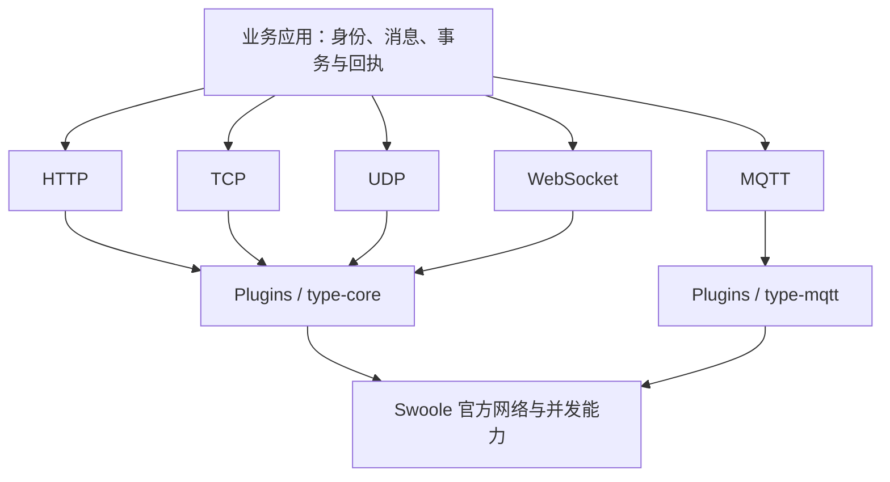

# 基础通信导读

TypeApp 通过框架组件提供通信入口，内部复用 Swoole 运行库的网络和并发机制。HTTP、TCP、UDP、MQTT、WebSocket 是面向应用的五项通信能力，分别使用独立教程说明。菜单平级表示它们都是应用可选择的入口，不表示它们处于同一网络层：HTTP、WebSocket 和 MQTT 通常建立在 TCP 之上，MQTT 也可以通过 WebSocket 传输。

## 选择通信方式

| 教程 | 应用交换的数据 | 典型应用 | TypeApp 入口 |
| --- | --- | --- | --- |
| [HTTP](communications/http.md) | 请求与响应 | API、管理后台、Webhook | `type-core` 的 `Http\SwooleServer`、PSR 消息与路由 |
| [TCP](communications/tcp.md) | 可靠有序的字节流 | 自定义设备协议、网关连接 | `type-core` 的 `TcpSocket` |
| [UDP](communications/udp.md) | 带来源的独立数据报 | 发现、短遥测、可容忍丢失的交互 | `type-core` 的 `UdpSocket` |
| [MQTT](communications/mqtt.md) | Topic 上的发布与订阅 | 设备上下行、状态分发、服务消费 | `type-mqtt` 的 `Broker` 与 `Client` |
| [WebSocket](communications/websocket.md) | 持续双向的文本或二进制消息 | 实时大屏、协作、交互通知 | `type-core` 的 `WebSocket\Server` 与 `Client` |

已有 API 通常从 HTTP 开始；需要持续服务端推送可用 WebSocket；设备需要订阅与会话语义可用 MQTT。需要自定义线路协议时再直接使用 TCP 或 UDP。TCP 可靠传输不等于业务已经提交，MQTT QoS 也不等于设备已经执行指令。

图示为能力归属。TypePHP 是编译器，Plugins 是源码组件，Swoole 是原生运行基础；TypeApp 把它们组织为可开发、编译、运行与交付的应用框架，详见[系统架构](architecture.md)。

## 如何使用教程

每篇均包含协议模型、组件入口、配置、完整示例、双端操作、预期结果、应用设计、关闭与排障。示例使用独立练习应用的 `app/main.php`，不要覆盖现有业务入口。先按[组件安装](components.md#安装组件)配置真实依赖源并固定 `composer.lock`；HTTP、TCP、UDP、WebSocket 安装 `type-core` 与 `type-runtime`，MQTT 按其教程准备依赖。

通信能力已统一接入 Swoole，应用按协议选择组件即可。以下源码练习需要 PHP CLI `>=8.4 <8.6`、Swoole `>=6.2 <7`，用 `php --ri swoole` 检查当前 CLI。原生构建默认复用 `type-build` 内置的匹配模块，生产部署使用完整运行包；安装组件不会自动修改开发 CLI 的 ini，具体分工见[环境与依赖](environment.md)。版本和构建选项固定后再验证对应协议。

示例推荐 PHP 8.5 CLI；TCP 半关闭对 PHP 8.5 常量的要求见 [TCP 实例](communications/tcp.md#完整实例：有界回显)。示例文件只声明函数和类。开发时使用[开发启动器](components.md#运行声明式示例)，安装锁定的 TypePHP 开发工具、加载官方兼容文件并调用 `main()` 或 `main($argc, $argv)`；生产时业务、Plugins、实际依赖和生成代码共同交给 TypePHP 编译。各篇终端命令均从练习应用根目录运行。

## 共用的资源与运行约定

Swoole 持有网络句柄与调度。`type-runtime` 的 `ExecutionScope`、`Deadline` 和资源预算记录应用资源的归属、上限与清理责任，不是另一套通信或协程引擎。

通信回调处在 Swoole 进程、线程和协程的执行边界内：入口先建立根作用域，消息处理需要并行时使用受管子协程，跨线程只传递有界值。上下文快照、取消传播、连接所有权和关闭顺序统一遵循[进程、线程与协程](runtime.md)；各协议只补充自己的消息边界和回执语义。

| 责任 | 使用方式 |
| --- | --- |
| 启动与归属 | TCP、UDP、WS 客户端在已有 Swoole 协程内启动；对象不得跨线程传递。具体协程归属以各篇为准 |
| 有界等待 | 连接、读写、业务处理和关闭分别设置期限；单次读写超时不能替代业务总期限 |
| 容量 | 同一连接域共享预算，按副本、滚动增量、进程和线程分配，不能让每个池都独占全局额度 |
| 清理 | `scope->open()` 启动并登记资源，退出时 `scope->close()`；实际关闭前不提前归还额度 |
| 业务正确性 | 明确消息边界、身份、去重、事务和回执；超时后结果未知时不盲目重发 |
| 观测 | 观察实际连接、在途数量、字节数、拒绝、超时和清理失败；配置上限不等于已验证吞吐量 |

示例的 `new DeploymentBudget(16, 1, 0, 1, 0, 1)` 表示连接域上限 16、1 个副本、无滚动增量、每副本 1 个进程、无管理预留、每进程 1 个线程。它只是练习预算，生产应按完整部署拓扑计算。API 详见[type-runtime](plugins/type-runtime.md)。

## 平台与执行方式

框架统一使用 Swoole 官方能力；进程不可用时应使用官方线程或协程，不按操作系统名称选另一套网络引擎。Swoole 官方平台支持与 TypeApp 某个入口完成适配需要分别验证。

当前主仓的 HTTP、TCP、UDP、MQTT 与 WebSocket 生产入口均固定使用 Swoole；角色根据目标构建能力选择 Swoole Process、Thread 或 Coroutine。完整协议矩阵、三库组合、无源码部署及各平台资源回收仍需按同一产物分别验收，单个 PHP 示例不能代替完整平台结果。

最新平台结果统一见[平台与验收](platforms.md#通信结果如何理解)。四平台默认矩阵已有真实 HTTP 与原生应用结果；Windows 的普通 HTTP、业务线程入口和模板分别验收，经典 WebSocket 服务端入口仍明确拒绝该平台。TCP/UDP/MQTT、WS/WSS 按协议和运行方式核对，默认矩阵不代表完整协议及全平台组合均已通过。

## 从示例到交付

按[构建与部署](deployment.md)把全部生产源码交给 TypePHP，在目标平台检查原生产物的启动、协议互通、异常关闭和资源回收。开发态 PHP 示例通过，只能证明对应接口的开发态行为。

运行库的准备由构建负责，程序、配置和持久数据按[部署约定](deployment.md#单程序交付约定)管理。

继续阅读：[HTTP](communications/http.md) · [TCP](communications/tcp.md) · [UDP](communications/udp.md) · [MQTT](communications/mqtt.md) · [WebSocket](communications/websocket.md)。
