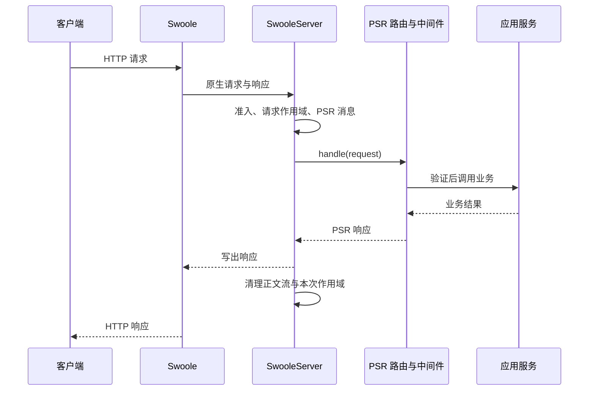

# HTTP

HTTP 用一次请求表达资源操作，用状态码、响应头和正文表达结果。TypeApp 使用 `type-core` 的 `Type\Core\Http\SwooleServer` 承接 Swoole HTTP 请求，接入 PSR-7 消息、PSR-17 工厂、PSR-15 处理器和中间件。业务与 Plugins 由 TypePHP 编译，网络与协程由 Swoole 提供；整体关系见[通信导读](../communications.md)。

本篇完成状态 API 的启动、调用与关闭，再说明配置、客户端、业务接入与上线验证。持续双向消息见 [WebSocket](websocket.md)，其中包含 HTTP 与 WebSocket 共用服务和端口的完整示例。

## 协议模型与应用选择

请求包含方法、目标路径、请求头及可选正文；响应包含状态码、响应头及可选正文。连接可以复用，多次请求不等于多条独立 TCP 连接。HTTP Keep-Alive 与 WebSocket 升级是不同机制。

| 需求 | 建议 |
| --- | --- |
| 查询状态或资源 | 使用 GET；用明确的状态码与内容类型描述结果 |
| 创建、更新或删除 | 按方法语义建模；可能重试的操作定义幂等键与去重事务 |
| 接收 Webhook | 验证签名、时间窗与事件 ID，完成持久接收后再返回约定结果 |
| 长时间任务 | 返回任务标识，另设查询或通知入口，避免无限占用请求资源 |
| 实时双向交互 | 使用 WebSocket；普通 HTTP 处理链不自动处理升级后的消息 |

超时可能发生在服务已提交之后。客户端没有收到 200，不能据此断定事务回滚。认证、业务权限和输入校验也不能仅靠 URL 或状态码代替。

## 请求在 TypeApp 中的路径



路由把请求交给业务处理器，应用服务负责事务与领域规则。不要把数据库连接绑定到客户端的整个 Keep-Alive 生命周期。参数路由、分组、资源路由和声明规则见[路由与中间件](../routing.md)。

## 配置入口

服务由构造参数装配，不会自动读取任意 `HTTP_*` 环境键。标准应用已有[配置与环境](../configuration.md)入口；独立消费者需显式读取、校验配置并传入对象。

| 配置 | 默认值及单位 | 含义 |
| --- | --- | --- |
| `serve($host, $port)` | 必填；端口 1–65535 | 本机监听地址与端口；本机练习使用 `127.0.0.1` |
| `HttpControl::maximumRequests` | 64 个，范围 1–10000 | 同时占用的请求额度，含发送与清理；不是累计请求数 |
| `maximumConnections` | 256 个 | 不低于请求上限，不高于 100000 |
| `requestSeconds` | 30.0 秒 | 请求作用域期限，范围 `(0, 3600]` |
| `drainSeconds` | 5.0 秒 | 停止后的排空期限，范围 `(0, 60]` |
| `cleanupSeconds` | 1.0 秒 | 清理等待，范围 `[0, drainSeconds]` |
| `maximumChildren` | 16 个，范围 1–1024 | 每请求作用域的子任务预算 |
| `probes` | `false` | 显式启用 `/readyz` 和 `/livez` |
| `RequestLimits::bytes` | 1048576 字节 | 输入字节限制，通过服务构造参数 `limits` 传入 |

`RequestLimits` 还限制字段、嵌套、上传数与单文件大小；`RequestPolicy` 校验 Host 与可信代理，`Authentication` 执行身份与权限检查，详见[type-core](../plugins/type-core.md)。正文限制还要与代理、Swoole 接收层和上传临时目录配合。上表是框架公开配置，不是任意 `Swoole\Server::set()` 参数透传。

`/livez` 表示入口存活，`/readyz` 表示允许接收请求，不证明数据库迁移和业务依赖已就绪。作用域期限不能强制打断任意阻塞扩展，数据库和外部请求仍需驱动超时。

## 完整实例：状态 API

在安装了 `type-core`、`type-runtime` 及传递依赖的独立练习应用中，保存下面的 `app/main.php`。依赖源与版本固定方式见[组件安装](../components.md#安装组件)。

```php
<?php

declare(strict_types=1);

use Psr\Http\Message\ResponseInterface;
use Psr\Http\Message\ServerRequestInterface;
use Type\Core\Http\ActionHandler;
use Type\Core\Http\HttpControl;
use Type\Core\Http\Message\Factory;
use Type\Core\Http\Router;
use Type\Core\Http\SwooleServer;

function main(): void
{
    $messages = new Factory();
    $router = new Router($messages, $messages);
    $router->add('GET', '/status', static fn (): ActionHandler =>
        new ActionHandler(static function (ServerRequestInterface $request) use ($messages): ResponseInterface {
            return $messages->createResponse(200)
                ->withHeader('Content-Type', 'application/json')
                ->withBody($messages->createStream('{"status":"ok"}'));
        }), 'status');
    $control = new HttpControl(
        maximumRequests: 1,
        maximumConnections: 32,
        requestSeconds: 5.0,
        drainSeconds: 2.0,
        cleanupSeconds: 0.5
    );
    $server = new SwooleServer($router, $messages, $messages, $messages, control: $control);
    try {
        $server->serve('127.0.0.1', 9501);
    } finally {
        $server->stop();
    }
}
```

先按[开发启动器约定](../components.md#运行声明式示例)安装锁定的 TypePHP 开发工具，再在应用根保存以下 `dev.php`。它是开发启动器，不进入生产编译清单：

```php
<?php

declare(strict_types=1);

require __DIR__ . '/vendor/autoload.php';
require_once __DIR__ . '/vendor/swoole/typephp/src/polyfills.php';
require __DIR__ . '/app/main.php';

main();
```

终端 A 启动：

```bash
php --ri swoole
php dev.php
```

终端 B 请求：

```bash
curl -i --max-time 5 http://127.0.0.1:9501/status
curl -i --max-time 5 http://127.0.0.1:9501/missing
```

第一条返回 `200`、`Content-Type: application/json` 与 `{"status":"ok"}`，第二条返回 `404`。重复第一条仍可成功：`maximumRequests: 1` 限制并发，不会让服务处理一次就退出。结束时在终端 A 按 Ctrl-C。

路由工厂是零参数闭包，动作接收请求并返回响应。`add()` 注册静态路径，动态路由应使用构建声明生成 `RouteDefinition` 后 `register()`。所有路由与中间件在首次请求前注册。

## 使用官方 HTTP 客户端

目前没有独立的通用 TypeApp HTTP 客户端封装，应用可直接复用 Swoole 协程 HTTP Client。下面保存为练习项目根的 `client.php`，服务运行时执行 `php client.php`：

```php
<?php

declare(strict_types=1);

Swoole\Coroutine\run(static function (): void {
    $client = new Swoole\Coroutine\Http\Client('127.0.0.1', 9501);
    try {
        $client->set(['timeout' => 5.0]);
        if (!$client->get('/status') || $client->statusCode !== 200) {
            throw new RuntimeException('HTTP 调用失败：' . $client->statusCode);
        }
        echo $client->body, "\n";
    } finally {
        $client->close();
    }
});
```

预期输出 `{"status":"ok"}`。这是独立客户端演示脚本；生产应用把调用装入声明式函数，在已有协程宿主内运行，不嵌套启动运行器。HTTPS 要显式启用 TLS、配置可信 CA 并验证证书主机名，重试要结合方法和业务幂等性。

## 应用接入与共用服务

真实 API 按“路由与中间件 → 控制器 → 应用服务 → 数据组件”组织。认证验证令牌，授权检查主体是否可操作资源；日志记录请求 ID、耗时和结果，避免记录密钥与敏感正文。

HTTPS 可由可信反向代理终止 TLS。标准应用用 `APP_TRUSTED_PROXIES` 明确信任范围，独立消费者显式装配相应策略，不直接相信公网转发头。

`HttpServerInterface` 只定义普通请求与响应；当前 `SwooleServer` 对 Upgrade 返回 `501 / upgrade_not_supported`。同端口提供 HTTP 与 WebSocket 时，由 `WebSocket\Server` 持有监听，通过 `onRequest()` 处理普通请求。配置、HTTPS/WSS 与 PSR 衔接边界见[HTTP 与 WebSocket 共用服务](websocket.md#http-与-websocket-共用服务)。

## 并发、停止与平台

`serve()` 在 Unix 使用经典 Swoole 单 worker，在 Windows 使用协程 HTTP。编译业务线程有独立入口：`serveThread()` 接收共享监听副本，`serveThreadOwned()` 在线程内创建监听；主仓生产应用由线程宿主管理。各路径复用 PSR 处理链，但监听与监督方式不同，不能只替换方法名而省略装配。

`stop()` 撤销请求准入、缩短在途期限，由宿主监督排空与停止。Unix `serve()` 沿用原生 worker 生命周期；Windows 通过 `ProcessSignals` 接收 CTRL_C/CTRL_BREAK。Windows CLI 使用 PHP 控制台处理器，embed 需要编译的控制事件桥与可用控制台。关闭窗口、注销或强制终止不保证排空；相应实现存在不代表最新 Windows HTTP 或完整应用已经通过验收。

请求结束清理本次作用域、输入与响应正文流。长生命周期连接池由所属宿主管理：`onWorkerStop` 在 Unix worker 同步停止、Windows 协程 HTTP 退出或编译线程请求完整收尾时调用，Windows `serve()` 没有独立 worker 进程。回调不再启动新工作，硬终止不保证其执行。清理失败不能提前释放额度或伪装健康。

## 排障与上线验证

| 现象 | 检查方向 |
| --- | --- |
| 连接拒绝或监听失败 | 服务存活、绑定地址、端口冲突、防火墙；客户端不连接 `0.0.0.0` |
| 404 | 方法、路径、路由注册与生成声明 |
| Upgrade 返回 501 | 当前是普通 HTTP 入口，使用 WebSocket 共用服务装配 |
| 过载拒绝或 readiness 为 503 | 并发、排空、隔离作用域和下游等待，先查瓶颈再增加额度 |
| 超时但业务已生效 | 查询幂等记录或业务结果，不直接重复创建 |
| `signals_unavailable` | 核对 Unix PCNTL，或 Windows 控制台、PHP 处理器与 embed 控制事件桥 |

发布前验证真实成功与错误响应、认证失败、超大输入、并发上限、慢客户端、下游超时和停止排空。观察 `HttpControl::statistics()` 的在途、拒绝、隔离与清理失败。按[构建与部署](../deployment.md)检查 TypePHP 原生产物，开发态 curl 成功不能替代全量编译与目标平台验收。

各平台当前结果见[平台与验收](../platforms.md#通信结果如何理解)。ARM64 独立 HTTP 场景的 AOT 通过，不代表完整物联应用的线程 HTTP 或 Windows 服务入口已通过。

协议语义参考 [RFC 9110](https://www.rfc-editor.org/rfc/rfc9110.html)，HTTP/1.1 消息格式参考 [RFC 9112](https://www.rfc-editor.org/rfc/rfc9112.html)。
