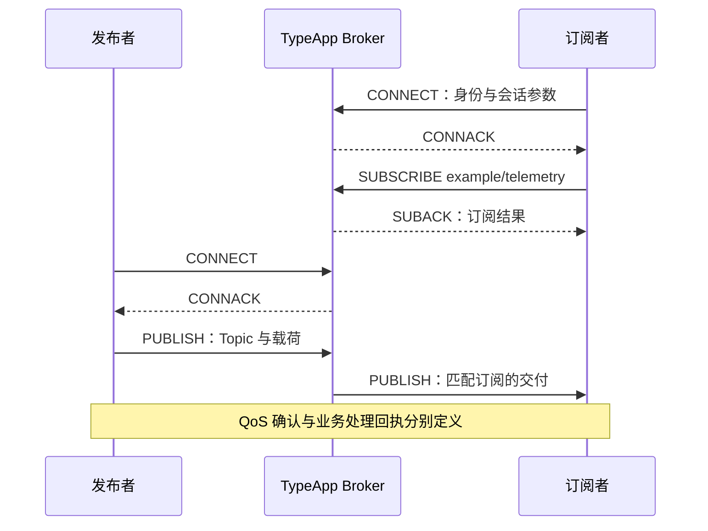

# MQTT

MQTT 通过 Broker 将发布者的消息路由给订阅者，适合设备遥测、指令下发和服务消费。TypeApp 的 `type-mqtt` 提供独立 `Broker`、协议与 Topic 路由，应用提供身份、权限和业务载荷；通信统一基于 Swoole，业务与 Plugins 由 TypePHP 编译。总体关系见[通信导读](../communications.md)。

本篇先用无持久存储的 QoS 0 示例完成认证、订阅、发布、接收和关闭，再说明 TLS、WebSocket 与可靠交付的前提。当前组件尚未完整通过 MQTT 标准验收，不能把协议中定义的所有能力写成默认已开启。

## 发布订阅模型



发布者只需知道 Topic，不必持有每个订阅者的连接。Broker 判断权限并匹配订阅；载荷可为 JSON 或二进制，MQTT 不解释其中的温度、告警或指令含义。

| 概念 | 协议含义与应用边界 |
| --- | --- |
| Topic | 区分大小写、按 `/` 分层的发布主题，例如 `devices/d1/telemetry` |
| Topic Filter | 订阅过滤器；`+` 匹配一层，`#` 匹配后续层级；发布主题不能含订阅通配符 |
| Client ID | 会话身份，必须稳定且按客户端分配；不等于已认证的业务主体 |
| QoS 0 | 至多一次的协议交付，不等待 PUBACK，不保证送达 |
| QoS 1 | 至少一次的协议交付，可能重复；业务仍需去重 |
| QoS 2 | 通过协议交换控制一次交付；不保证外部业务事务恰好执行一次 |
| 会话 | 保存订阅和适用的未完成交付；Clean Start 与 Session Expiry 决定恢复和保留 |
| Retained | 为后续匹配订阅保留主题最新值，不是完整事件历史 |
| Will | 非正常断开后的遗嘱消息；可用于离线提示，不是精确实时故障证明 |
| Shared Subscription | 多消费者按共享组分摊交付，不给每个成员复制整份消息 |

标准依据为 OASIS [MQTT 3.1.1](https://docs.oasis-open.org/mqtt/mqtt/v3.1.1/os/mqtt-v3.1.1-os.html) 与 [MQTT 5.0](https://docs.oasis-open.org/mqtt/mqtt/v5.0/os/mqtt-v5.0-os.html)。当前不提供 MQTT 3.1、MQTT-SN 或增强认证。

## 安装与配置入口

按[组件安装](../components.md#安装组件)配置依赖源后安装 `zoujingli/type-mqtt`，显式声明 `type-orm` 和 `type-runtime` 的依赖源；持久后端另需 `type-orm-pgsql`。开发版本需锁定实际提交，组件依赖与扩展基线见[type-mqtt 参考](../plugins/type-mqtt.md#安装与依赖)。

`new Broker($access, $options, $workerCommand)` 接收应用认证策略、`BrokerOptions` 与显式持久 worker 命令；不传 worker 时只开放 QoS 0。`serve($host, $port)` 使用数字本机地址和明确端口。

| `BrokerOptions` 参数 | 默认值 | 含义 |
| --- | --- | --- |
| `certificate` / `privateKey` / `privateKeyPassphrase` | 空字符串 | TLS 证书链、私钥与可选口令；生产显式配置 |
| `allowPlaintext` | `false` | 明文仅用于显式本机调试 |
| `maximumConnections` | 256 个 | Swoole Server 的连接上限，物理上限为 10100，不代表已验收的在线容量 |
| `maximumPacketBytes` | 1048576 字节 | 完整 MQTT 报文上限，范围 128–1048576 |
| `handshakeSeconds` | 10.0 秒 | 握手等待，范围 `(0, 60]` |
| `partialPacketSeconds` | 15.0 秒 | 半包等待，范围 `(0, 60]` |
| `callbackSeconds` | 30.0 秒 | 原生事件排队和业务回调共用的截止，范围 `(0, 60]`；真实收尾后才归还额度 |
| `maximumDeviceConnections` / `maximumServiceConnections` | 10000 / 100 个 | 分类预算，同时受物理连接上限约束 |
| `wsPort` / `wssPort` | 0，关闭 | MQTT over WebSocket 的额外监听；本机示例显式设 `wsPort` |
| `allowedOrigins` | `[]` | WebSocket 来源限制，生产应明确允许来源 |
| `mtlsPort` / `clientCa` | 0 / 空字符串 | 专用双向 TLS 监听与客户端 CA |
| `handleSignals` | `true` | 由 Broker 处理停止信号；嵌入时需宿主接管停止 |
| `workerCommand` | 空数组 | 通过 Swoole PROC hook 管理的进程管道启动持久 worker；为空时只开放 QoS 0 |

Broker 的 TCP、TLS、mTLS 与 WebSocket 监听均由同一个 Swoole Server 生命周期管理；WebSocket 监听启用时，HTTP 升级和 MQTT 帧共用该服务。持久 worker 使用 Swoole PROC hook 管理的进程管道，客户端统一使用 Swoole Coroutine Socket，非协程调用由现有 CoroutineRuntime 使用官方 Scheduler 执行。

`wsPort`、`wssPort`、`mtlsPort` 不能与主端口重复；同一进程不能同时开启明文 WS 与 WSS，WSS/mTLS 不能混用明文调试配置。证书生命周期、持久资源与集群参数集中在[组件参考](../plugins/type-mqtt.md)，无需把它们复制成另一套配置体系。

## 完整实例：QoS 0 Broker

在独立练习应用保存 `app/main.php`。示例身份仅用于回环测试，Topic 只开放 `example/telemetry`，拒绝匿名与其他主题，不连接数据库。

```php
<?php

declare(strict_types=1);

use Type\Mqtt\AccessPolicy;
use Type\Mqtt\Broker;
use Type\Mqtt\BrokerOptions;
use Type\Mqtt\ConnectPacket;

final class GuideAccess implements AccessPolicy
{
    public function __construct(private string $password)
    {
        if ($password === '') {
            throw new InvalidArgumentException('必须设置 MQTT_PASSWORD');
        }
    }

    public function authenticate(ConnectPacket $connect, string $peer, bool $secure): bool
    {
        return $connect->username === 'guide'
            && $connect->password !== null
            && hash_equals($this->password, $connect->password);
    }

    public function authorize(ConnectPacket $connect, string $topic, string $action, int $qos): bool
    {
        return $topic === 'example/telemetry'
            && in_array($action, ['publish', 'subscribe'], true)
            && $qos === 0;
    }
}

function main(): void
{
    $broker = new Broker(
        new GuideAccess((string) getenv('MQTT_PASSWORD')),
        new BrokerOptions(
            allowPlaintext: true,
            maximumConnections: 32,
            maximumDeviceConnections: 32,
            maximumServiceConnections: 0,
            wsPort: 8083,
            allowedOrigins: ['http://localhost:8080']
        )
    );
    try {
        $broker->serve('127.0.0.1', 1883);
    } finally {
        $broker->stop();
    }
}
```

先按[开发启动器约定](../components.md#运行声明式示例)安装锁定的 TypePHP 开发工具，再在应用根保存 `dev.php`：

```php
<?php

declare(strict_types=1);

require __DIR__ . '/vendor/autoload.php';
require_once __DIR__ . '/vendor/swoole/typephp/src/polyfills.php';
require __DIR__ . '/app/main.php';

main();
```

终端 A 启动。下面密码是隔离本机练习值，不用于生产：

```bash
export MQTT_PASSWORD=local-guide-only
php dev.php
```

保持 Broker 运行，接下来从独立客户端完成消息闭环。端口冲突时同时修改 Broker 与客户端，不能让本次实验连到已有业务 Broker。

## 标准客户端：订阅、发布与接收

使用 Eclipse Paho MQTT 客户端验证互通。Python 只是练习的外部客户端工具，不是 TypeApp 的生产运行依赖。在练习应用创建独立环境：

```bash
python3 -m venv .mqtt-client
.mqtt-client/bin/python -m pip install 'paho-mqtt==2.1.0'
```

Windows 可使用虚拟环境的 `Scripts/python.exe`；当前示例 Broker 的平台限制见文末，不能因客户端可运行就推断 Broker 已适配。保存以下完整客户端为 `mqtt-client.py`：

```python
import os
import sys
import threading
import uuid
import paho.mqtt.client as mqtt

role = sys.argv[1] if len(sys.argv) > 1 else "subscribe"
transport = sys.argv[2] if len(sys.argv) > 2 else "tcp"
if role not in ("subscribe", "publish") or transport not in ("tcp", "websockets"):
    raise SystemExit("用法：mqtt-client.py subscribe|publish [tcp|websockets]")
done = threading.Event()
errors = []
client = mqtt.Client(
    mqtt.CallbackAPIVersion.VERSION2,
    client_id="guide-" + uuid.uuid4().hex,
    protocol=mqtt.MQTTv5,
    transport=transport,
)
client.username_pw_set("guide", os.environ["MQTT_PASSWORD"])
if transport == "websockets":
    client.ws_set_options(path="/mqtt", headers={"Origin": "http://localhost:8080"})

def on_connect(client, userdata, flags, reason_code, properties):
    if reason_code.is_failure:
        errors.append(str(reason_code))
        done.set()
    elif role == "subscribe":
        client.subscribe("example/telemetry", qos=0)
    else:
        client.publish("example/telemetry", b'{"temperature":23}', qos=0)

def on_subscribe(client, userdata, mid, reason_codes, properties):
    if any(code.is_failure for code in reason_codes):
        errors.append("订阅被拒绝")
        done.set()
    else:
        print("subscribed example/telemetry", flush=True)

def on_publish(client, userdata, mid, reason_code, properties):
    print("QoS 0 已交给客户端网络层", flush=True)
    done.set()

def on_message(client, userdata, message):
    print(message.topic, message.payload.decode("utf-8"), flush=True)
    if message.topic != "example/telemetry" or message.payload != b'{"temperature":23}':
        errors.append("收到非预期消息")
    done.set()

client.on_connect = on_connect
client.on_subscribe = on_subscribe
client.on_publish = on_publish
client.on_message = on_message
client.connect("127.0.0.1", 8083 if transport == "websockets" else 1883, keepalive=30)
client.loop_start()
try:
    if not done.wait(60):
        raise TimeoutError("60 秒内未完成本次操作")
    if errors:
        raise RuntimeError("; ".join(errors))
finally:
    client.disconnect()
    client.loop_stop()
```

终端 B 先订阅，看到 `subscribed example/telemetry` 后再启动发布端；仅启动进程不表示 SUBACK 已完成。

```bash
export MQTT_PASSWORD=local-guide-only
.mqtt-client/bin/python mqtt-client.py subscribe
```

终端 C 在 60 秒内发布：

```bash
export MQTT_PASSWORD=local-guide-only
.mqtt-client/bin/python mqtt-client.py publish
```

终端 B 应输出 `example/telemetry {"temperature":23}` 后退出，终端 C 输出本地发送完成后退出。接收端的实际输出才证明本次端到端路由，发布端的 QoS 0 发送完成不构成 Broker 持久确认。最后在终端 A 按 Ctrl-C 停止 Broker。

负向验证时保持 Broker 运行，用错误密码启动客户端，预期认证失败而非输出订阅成功。要验证主题权限，另将练习客户端主题改成未授权主题，检查 SUBACK/协议拒绝；不要在生产系统试探权限。

## 通过 WebSocket 接入

沿用同一个 Broker，再次启动订阅端，把传输参数改为 `websockets`：

```bash
.mqtt-client/bin/python mqtt-client.py subscribe websockets
```

看到订阅成功后，从另一终端用 TCP 发布，或执行：

```bash
.mqtt-client/bin/python mqtt-client.py publish websockets
```

预期仍收到同一 Topic 与载荷。浏览器也需要标准 MQTT 客户端，WebSocket 上承载的是 MQTT 二进制控制报文，并协商 `mqtt` 子协议，不是任意 JSON。`/mqtt` 是此客户端请求路径，不能据此推断 Broker 已提供路径授权。

`type-mqtt` 直接使用 Swoole 的 WebSocket 能力，不依赖 `type-core` 的 WebSocket 服务包装。本文主端口 1883 与 WS 端口 8083 是不同监听；普通 HTTP 与 WebSocket 同实例共用的教程见 [WebSocket](websocket.md#http-与-websocket-共用服务)。不要把 MQTT over WebSocket 的端口配置与普通 HTTP API 自动复用混为一谈。

## TLS、身份与 Topic 授权

生产应关闭 `allowPlaintext`，配置服务端证书链和私钥，客户端校验证书 CA、主机名与有效期。MQTT over TLS 常用 8883，WSS 使用配置的独立端口；端口号本身不表示加密已经启用。需要 mTLS 时再配置客户端 CA 与证书身份规则，完整参数见[组件参考](../plugins/type-mqtt.md#认证与最小启动)。

`authenticate()` 每次 CONNECT 验证身份，`authorize()` 检查 publish/subscribe 权限，交付还需核对实际 Topic。设备 ID 不应直接由客户端任意声明；按认证身份绑定 Topic 前缀，通配符与共享组也不能扩大权限。生产授权建议区分设备的遥测发布、命令订阅与服务管理权限；示例的单个共享密码不适合真实设备部署。

Broker 在官方 Swoole 协程中处理原生事件，使用一个 Channel 保持协议状态机全局串行。认证、授权、连接观察及停止观察均能取得 `ExecutionScope::current()`；按数据源完成启动装配后，可以使用无连接 Model 或 Db。已有事件循环内不再启动 Scheduler，I/O hook 沿用应用启动期配置。

每次事件独立建立并关闭作用域，排队及回调共用 `callbackSeconds`；事件总数最多为启动连接上限加 32，输入字节总额为 32 MiB，同一连接有在途事件时暂停原生读取。回调异常只关闭对应连接，维护事件失败停止角色。关闭期间若子任务尚未结束，仍持有串行资格和事件额度，停止角色前等待真实收尾。作用域截止不能强制撤销已经发生的 SQL 或远端副作用。

进程停止信号沿用 Swoole `reload_async=true`，`workerExit` 停止接纳并清除 Broker 维护定时器，让在途协程继续收尾；`max_wait_time` 为向上取整的 `callbackSeconds + 6` 秒，覆盖回调、默认五秒清理预算及时间粒度余量。这是原生 worker 的等待上限，不包括随后持久会话的结束工作；超过上限而仍有事件未结束时明确失败，不能视为优雅退出。

作用域中的连接编号和事件名仅用于关联，不能授予租户身份。认证策略先从可信来源验证身份，再用当前作用域的 `run($operation, ['tenant_id' => $verifiedTenant])` 临时绑定业务范围；结束或异常均恢复原绑定，受管子任务只继承可信值快照。框架不会把 Client ID、用户名、Topic 或消息属性自动解释成租户。通用规则见[受管任务与作用域](https://github.com/zoujingli/typeapp/blob/main/docs/development/managed-tasks.md#当前作用域与应用绑定)。

## 可靠交付、会话与持久存储

无持久 worker 的示例只完成 QoS 0 路由。QoS 1/2、持久会话、保留消息、遗嘱、共享订阅及跨节点路由需要显式 PostgreSQL 同步存储；不要只把客户端 QoS 改成 1 就认为能力已经具备。

完整持久入口通过 `MQTT_WORKER_COMMAND` 指向同一程序的命令参数数组，使用真实 PostgreSQL 主备，在监听前显式安装存储。配置、初始化与资源预算见[type-mqtt 持久存储](../plugins/type-mqtt.md#持久存储与集群)。存储按真实 WAL 提交与重放证明区分 `committed/rejected/unknown`；主库行可见或 worker 退出不能代替同步提交证明。

`Type\Mqtt\Client` 是 MQTT 5 消费客户端，当前发布仅支持 QoS 1，接收 QoS 0/1。因此本文无持久 Broker 的 QoS 0 发布采用标准客户端，不能用内置 `publish()` 伪造可运行闭环。

| 内置 Client 操作 | 语义 |
| --- | --- |
| 构造 `coroutine: true` | 在已有 Swoole 协程中使用原生 Socket；目标必须是数字 IP，TLS 身份用 `peerName` |
| `connect($cleanStart, $timeout)` | 默认 `false / 5.0`，返回 Session Present |
| `subscribe($filter, $options, $subscriptionIdentifier, $timeout)` | 默认订阅选项为 1，即请求 QoS 1；QoS 0 场景须显式传 0 |
| `publish($message, $timeout)` | 默认 5.0 秒，仅发布 QoS 1，需要 Broker 对应能力 |
| `receive($timeout)` | 默认 1.0 秒；无消息超时返回 null，成功含 `message/receipt/duplicate/subscription_identifiers` |
| `acknowledge($receipt)` | 业务完成后显式确认 QoS 1；QoS 0 的 receipt 为空，不调用确认 |
| `close()` | 正常断开并释放网络；同实例不能跨线程或并发混用 |

实际消费顺序应为“接收 → 校验 → 业务事务与去重提交 → acknowledge”。协议确认、业务持久接收和设备执行回执分别建模。未知发布结果不能盲目换新消息重发；恢复会话和未完成协议交换应遵循客户端契约。

## 应用设计与运行观察

设备遥测可用 `devices/{id}/telemetry`，命令用 `devices/{id}/commands`，结果用 `devices/{id}/results`。载荷定义消息 ID、版本、时间与业务字段，命令与结果共用关联 ID。保留消息适合当前状态，事件历史存入业务存储；不能把每条指令都保留成后来设备上线必执行的命令。

连接 Keep Alive、会话期限、消息过期和遗嘱延迟是不同计时规则。短时间掉线可恢复会话，已过期命令应停止投递。慢消费者需要条数与字节双重限额，不能靠扩大连接上限解决积压。多节点接管还需要旧输出者隔离与持久证明，单机多进程不等于高可用验收。

运行时用 `Broker::statistics()` 观察连接与协议情况，持久积压使用组件提供的存储统计。正常停止不伪造未完成提交成功，异常或超时保留结果未知的事实。

## 排障与上线验证

| 现象 | 检查方向 |
| --- | --- |
| 连接后认证失败 | 用户名、密码、证书身份与应用认证器 |
| 订阅成功但收不到 | 发布发生时间、Topic 大小写与层级、权限、QoS、消息期限 |
| 无持久示例拒绝 QoS 1 | 正常能力边界，先完成真实持久存储装配 |
| WS 升级后断开 | `mqtt` 子协议、Origin、MQTT CONNECT 报文与认证 |
| 重复消费 | 按业务 ID 去重，不把协议可靠性解释成业务恰好一次 |
| 积压或恢复失败 | 持久配额、主备同步、稳定 Client ID 和会话参数 |

先验证本篇 TCP 与 WS 跨传输路由及认证失败，再验证实际 TLS、授权隔离、半包期限、重连、持久确认和故障恢复。完整标准、容量与多故障域验证仍需按目标平台分别记录；生产 TypePHP 全量编译与单程序交付要求见[构建与部署](../deployment.md)。

最新平台汇总见[平台与验收](../platforms.md#通信结果如何理解)。Windows 四组件消费者不包含 MQTT；HTTP 场景中编译到 MQTT 源码也不能代替 MQTT 协议、持久确认和业务回执的实际运行。
