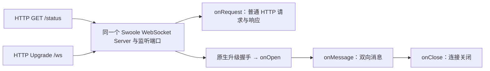

# WebSocket

WebSocket 在持续连接上交换文本或二进制消息，适合实时大屏、协作与交互通知。TypeApp 通过 `type-core` 的 `Type\Core\WebSocket\Server` 和 `Client` 提供入口；Swoole 负责 HTTP 升级、帧、控制消息、网络与 TLS，Plugins 负责业务回调、作用域和预算，TypePHP 编译业务与组件。关系见[通信导读](../communications.md)。

## 协议模型

客户端先发 HTTP Upgrade 请求，成功后以 WebSocket 消息通信。消息可能由多个帧组成，原生层完成分片重组；业务回调处理完整消息，不自行拼接 WebSocket 帧。文本消息使用 UTF-8，二进制消息由应用定义内容格式。

Ping/Pong 用于协议保活，不能证明业务已完成。Close 用于关闭握手；网络直接断开也可能发生，应用不能依赖每次都收到业务离线通知。需要恢复状态时，使用消息序号、重连游标或重新获取快照，而不是把连接 ID 当作长期身份。

## HTTP 与 WebSocket 共用服务

一个 `WebSocket\Server` 实例可以同时提供普通 HTTP 和 WebSocket，复用监听地址、端口及服务生命周期。明文监听提供 HTTP/WS，TLS 监听提供 HTTPS/WSS；不是在同一个端口再启动两个服务。



| 请求或操作 | 当前行为 |
| --- | --- |
| 普通 HTTP 请求 | 进入 `onRequest()`；未注册则返回 404 |
| WebSocket Upgrade | 由原生握手和 WebSocket 连接路径处理，不自动进入 `onRequest()` |
| WebSocket 消息 | 进入 `onMessage()`，每条业务消息有独立 `ExecutionScope` |
| `disconnect($fd, ...)` | 关闭指定连接 |
| `stop()` | 停止整个共用服务，普通 HTTP 也随之停止 |

`onRequest()` 接收原生 `Swoole\Http\Request/Response`，不会自动安装 PSR 路由、认证、可信代理或请求预算。需要 PSR 时由应用明确装配兼容处理链与输入、清理、连接控制；内部 `SwooleServer::handleNative()` 是衔接方法，单独调用不包含完整监听监督，不应当作第二个服务启动器。

普通 `Http\SwooleServer` 对 Upgrade 返回 `501 / upgrade_not_supported`，所以共用方案以 WebSocket 服务持有监听。反向代理把同一域名的 HTTP 和 WS 转发到两个后端，也能共用公网端口，但那是代理层合并入口，不是这里的同实例共用。

## 配置入口

安装 `type-core`、`type-runtime`，创建 `Server::create($budget, $host, $port, $options)`，注册回调后 `start()`。监听地址为数字 IP，端口默认 0 可由系统分配，客户端应使用实际监听端口。

| 服务端选项 | 默认值 | 含义 |
| --- | --- | --- |
| `subprotocol` | `''` | 单个合法子协议 token；非空时客户端必须提供 |
| `allowed_origins` | `[]` | 允许来源的小写字符串列表；空列表不做来源白名单限制 |
| `max_frame_bytes` | 1048576 字节 | 1–1048576；当前用于服务端 `send()` 的单条消息检查 |
| `package_max_bytes` | 2097152 字节 | 原生包限制，介于 `max_frame_bytes` 和其两倍之间 |
| `max_connections` | 64 个 | 1–4096；连接准入上限 |
| `max_queued_bytes` | 1048576 字节 | 1–1048576；单连接入站在途消息与待处理消息的合计字节上限，也分别限制正在提交的发送字节 |
| `max_pending_messages` | 16 条 | 1–1024；单连接等待进入消息回调的条数上限 |
| `idle_seconds` | `0.0` | 空闲检查默认关闭；范围 0.0–600.0 秒 |
| `heartbeat_seconds` | `0.0` | 原生检查间隔；启用空闲检查时必须大于 0 |
| `message_seconds` | `30.0` | 单消息作用域期限，范围 `(0, 60]` 秒 |
| `open_websocket_close_frame` | `true` | 原生 Close 帧开关 |
| `open_websocket_ping_frame` / `open_websocket_pong_frame` | `false` | 原生控制帧开关；控制帧不作为业务消息回调 |
| `websocket_compression` | `false` | 原生压缩开关，开启前验证客户端兼容与资源开销 |
| `open_ssl` | `false` | TLS 开关；启用后需 `ssl_cert_file` 与 `ssl_key_file` |
| `ssl_passphrase` / `ssl_protocols` | 无口令 / TLS 1.2 与 1.3 | 可选私钥口令与允许的 TLS 协议 |

秒数字段按示例使用浮点数，开关使用布尔值。这些是组件的选项白名单，其中包含应用资源策略；不能把所有键都当作 Swoole 原生参数，也不支持任意 `Server::set()` 透传。

入站先由原生 `package_max_length` 限制，重组后再按 `max_frame_bytes` 检查消息。等待业务回调的消息同时受条数、字节和 `message_seconds` 等待期限限制，超限关闭当前连接。发送侧 `max_queued_bytes` 的计数在 `push()` 返回后扣减，不代表原生缓冲已排空；慢消费者控制仍需结合原生发送结果与实际缓冲行为验收。

客户端工厂为 `Client::create($budget, $host, $port, $path, $tls, $headers, $maxMessageBytes, $connectTimeout, $tlsOptions)`：路径默认 `/`、TLS 默认 `false`、头默认空、消息上限默认 1 MiB、连接期限默认 5.0 秒。TLS 选项仅支持 `ssl_cafile`、`ssl_host_name`、`ssl_protocols`，强制验证证书链；每次收发期限为 `(0, 60]` 秒。

## 完整实例：同端口 HTTP 与消息回显

在独立练习应用保存 `app/main.php`。服务端先可接受普通 HTTP，处理一条 WebSocket 消息后停止；这使退出可观察，不是生产长连接服务的停止策略。

```php
<?php

declare(strict_types=1);

use Swoole\Coroutine;
use Swoole\Http\Request;
use Swoole\Http\Response;
use Type\Core\WebSocket\Client;
use Type\Core\WebSocket\Server;
use Type\Runtime\CoroutineRuntime;
use Type\Runtime\DeploymentBudget;
use Type\Runtime\ExecutionScope;

function main(int $argc, array $argv): void
{
    if ($argc < 4 || !in_array($argv[1], ['server', 'client'], true)) {
        throw new InvalidArgumentException('用法：server <主机> <端口> [证书 私钥] 或 client <主机> <端口> <路径> <消息> [CA]');
    }
    CoroutineRuntime::assertAvailable();
    $host = $argv[2];
    $port = (int) $argv[3];
    $plan = new DeploymentBudget(16, 1, 0, 1, 0, 1);
    if ($argv[1] === 'server') {
        if ($argc !== 4 && $argc !== 6) {
            throw new InvalidArgumentException('服务端须同时提供证书与私钥');
        }
        $options = $argc === 6
            ? ['open_ssl' => true, 'ssl_cert_file' => $argv[4], 'ssl_key_file' => $argv[5]]
            : [];
        $server = Server::create($plan->poolBudget(), $host, $port, $options);
        $server->onRequest(static function (Request $request, Response $response): void {
            if (($request->server['request_uri'] ?? '') !== '/status') {
                $response->status(404);
                $response->end('not-found');
                return;
            }
            $response->header('Content-Type', 'text/plain; charset=utf-8');
            $response->status(200);
            $response->end('http-ok');
        });
        $server->onMessage(static function (int $fd, string $data, bool $binary, ExecutionScope $scope) use ($server): void {
            $server->send($fd, $data, $binary);
            $server->stop();
        });
        $server->start();
        return;
    }
    if ($argc !== 6 && $argc !== 7) {
        throw new InvalidArgumentException('客户端须提供路径与消息，可选 CA');
    }
    $tls = $argc === 7;
    Coroutine::create(static function () use ($argv, $plan, $host, $port, $tls): void {
        $scope = new ExecutionScope();
        $client = Client::create(
            $plan->poolBudget(), $host, $port, $argv[4], $tls, [], 65536, 5.0,
            $tls ? ['ssl_cafile' => $argv[6], 'ssl_host_name' => $host] : []
        );
        try {
            $scope->open($client);
            $client->send($argv[5], false);
            $reply = $client->receive(5.0);
            if ($reply !== $argv[5]) {
                throw new RuntimeException('未收到预期回显');
            }
            echo json_encode(['data' => $reply], JSON_THROW_ON_ERROR), "\n";
        } finally {
            $scope->close();
        }
    });
    Swoole\Event::wait();
}
```

先按[开发启动器约定](../components.md#运行声明式示例)安装锁定的 TypePHP 开发工具，再在应用根保存 `dev.php`：

```php
<?php

declare(strict_types=1);

require __DIR__ . '/vendor/autoload.php';
require_once __DIR__ . '/vendor/swoole/typephp/src/polyfills.php';
require __DIR__ . '/app/main.php';

main($argc, $argv);
```

终端 A 启动：

```bash
php dev.php server 127.0.0.1 9504
```

终端 B 必须先测试 HTTP，再发送 WebSocket 消息：

```bash
curl -i --max-time 5 http://127.0.0.1:9504/status
curl -i --max-time 5 http://127.0.0.1:9504/missing
php dev.php client 127.0.0.1 9504 /ws hello
```

分别得到 `200 / http-ok`、`404 / not-found`、`{"data":"hello"}`，最后整个服务退出。`/ws` 是客户端请求的示例路径，当前封装没有声明式 WebSocket 路径路由，也没有在此例中限制只有 `/ws` 可以升级。

## HTTPS 与 WSS 共用 TLS

准备由可信 CA 签发的证书链、私钥和 CA 文件，证书 SAN 应含示例客户端验证的 `127.0.0.1`。从终端 A 启动同一个 TLS 服务：

```bash
php dev.php server 127.0.0.1 9505 ./tls/server-chain.pem ./tls/server-key.pem
```

终端 B 先 HTTPS、后 WSS：

```bash
curl --cacert ./tls/ca.pem --max-time 5 https://127.0.0.1:9505/status
php dev.php client 127.0.0.1 9505 /ws hello ./tls/ca.pem
```

预期为 `http-ok` 与回显 JSON，随后服务退出。正式域名部署时按证书域名连接与校验，监听仍使用本机数字 IP；私钥与 CA 路径来自外置配置。TLS 监听不同时接收明文 HTTP/WS，TLS 错误不能靠禁用验证解决。

经反向代理接入时，代理需要转发 Upgrade 和 Connection 语义，读写超时与业务心跳配合。TLS 可以在代理终止，也可以继续加密到后端；代理部署不改变应用必须验证会话身份的责任。

## Origin、身份与路径授权

`onOpen(int $fd, array $headers, bool $originVerified)` 在原生握手完成后调用，只提供请求头，没有 URI 参数。子协议不匹配时关闭码为 1002；配置白名单且存在不匹配 Origin 时关闭码为 1008。没有 Origin 的客户端仍可进入 `onOpen()`，此时 `originVerified` 为 `false`。Origin 检查不是用户认证，非浏览器客户端也能自行设置头。

浏览器原生 WebSocket API 不能像普通 HTTP 客户端那样任意设置 Authorization 头。应用可设计受控 Cookie 或首次消息认证，并在认证完成前禁止业务操作；使用短期凭据、限定来源并清理未认证连接。不要在 URL 放长期密钥。当前组件不提供握手前 URI 授权接口，需要严格路径隔离时，应在可信代理或明确的原生握手装配层完成并验证。

HTTP 中间件不会自动应用到 Upgrade、连接和后续消息。共用端口不等于共用认证策略：两条路径要验证同一业务身份规则，并分别落实请求/消息权限。MQTT over WebSocket 则由 `type-mqtt` 接管 MQTT 协议，不是给此服务发一段 JSON 就成为 MQTT，见 [MQTT](mqtt.md#通过-websocket-接入)。

## 应用设计与资源生命周期

当前服务端是经典 Swoole WebSocket Server、单 worker，启用官方回调协程。同一连接通过 Swoole Channel 顺序进入业务回调，`onOpen()` 完成后才处理消息；一个连接等待 I/O 时，其他连接可继续执行。每次公开回调拥有独立的当前作用域，`onMessage()` 中 `ExecutionScope::current()` 与传入的作用域相同。回调退出后收尾，连接本身不保留租户身份、数据库租约或事务；应用需按本条消息验证身份并建立可信绑定。取消或停止不提前释放仍在执行的子任务额度。

回调签名为 `(int $fd, string $data, bool $binary, ExecutionScope $scope): void`。数据库租约等短期资源跟随消息作用域清理，连接只保存必要身份和订阅状态。广播需要限制接收人数、单消息大小与慢客户端队列，不给每条连接保留无限历史。

服务端 `send()` 成功表示交给原生发送缓冲，不代表对端业务已处理。客户端在已有协程中启动、收发；`receive()` 返回 `null` 表示关闭或本次超时，空字符串是有效消息。`stop()` 关闭客户端，重连要创建新实例，并重新认证、恢复订阅或拉取快照。

当前服务端的经典 Swoole WebSocket Server 路线在 Windows 启动时明确拒绝，协程 HTTP 升级尚未接入本组件。普通 HTTP 的 Windows 协程路径、WebSocket 客户端或其他平台的 WSS 结果，都不能替代该服务端入口的实现与验收。

## 排障与上线验证

| 现象 | 检查方向 |
| --- | --- |
| HTTP 404 | 是否登记 `onRequest()`、请求路径是否匹配 |
| 握手 501 | 是否误用了普通 `Http\SwooleServer` |
| 升级后立即关闭 1002/1008 | 子协议与 Origin 配置，以及应用鉴权 |
| HTTPS/WSS 验证失败 | 证书链、SAN、CA、有效期、实际 TLS 监听 |
| 消息超限或慢客户端被关闭 | 核对包、消息与发送队列三种上限 |
| `websocket_unsupported_platform` | 当前服务端明确拒绝 Windows 原生启动，协程升级尚未接入 |

先运行同端口 HTTP/WS，再验证 HTTPS/WSS；还应覆盖错误 Origin、无身份访问、分片消息、空消息、慢消费者、异常断线与整体停止。每个平台以同一 Swoole 构建产物分别记录 PHP、AOT、协议和资源回收结果，不能将局部场景外推为完整平台验收。全量编译与交付要求见[构建与部署](../deployment.md)。

跨平台结果按当前 Swoole 构建产物记录，覆盖 HTTP 共用监听、WSS、协议边界和资源回收；统一状态见[平台与验收](../platforms.md#通信结果如何理解)。

握手、帧与关闭语义参考 [RFC 6455](https://www.rfc-editor.org/rfc/rfc6455.html)。
