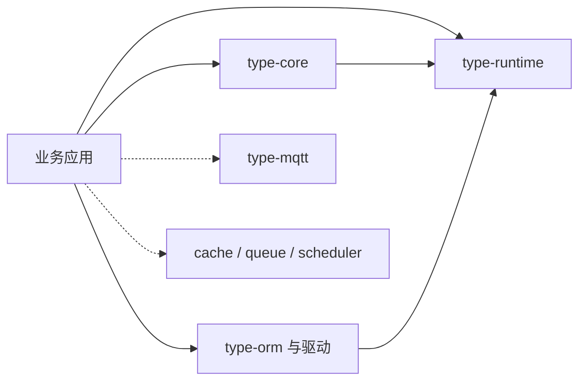
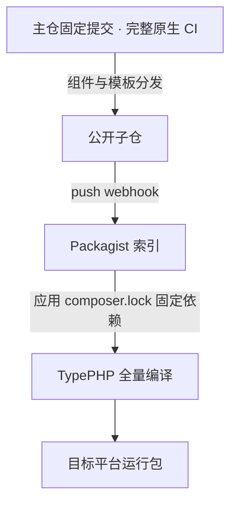

# 组件参考

Plugins 是 TypeApp 中由 Composer 管理的框架组件的统称。当前维护 15 个源码包，均以 `type-xxxx` 命名，Composer 包名为 `zoujingli/type-xxxx`。各组件页说明依赖、接口、配置与失败边界。应用按实际需要组合：生产组件随业务交给 TypePHP 编译，原生运行库随应用交付；构建与测试工具按开发依赖使用。职责分层见[系统架构](architecture.md)。物联中心是成品案例，业务契约见[物联网中心](iot-center.md)。`type-mqtt` 与其余组件使用同一套源码维护规则，其协议与容量验收状态单独记录，须使用对应组件的实际产物验证。



## 组件一览

| 组件 | 提供的能力 |
| --- | --- |
| [type-runtime](plugins/type-runtime.md) | 执行作用域、资源池与租约、截止时间、取消和部署预算 |
| [type-core](plugins/type-core.md) | 配置、命令、事件及 HTTP、WebSocket、TCP、UDP 基础通信；HTTP 使用 PSR 与路由 |
| [type-orm](plugins/type-orm.md) | 连接、查询、模型、关系、事务、迁移和 Outbox |
| [type-orm-mysql](plugins/type-orm-mysql.md) | MySQL 驱动与对应事务、标识和 TLS 语义 |
| [type-orm-pgsql](plugins/type-orm-pgsql.md) | PostgreSQL 驱动、schema、角色与 RETURNING 语义 |
| [type-orm-sqlite](plugins/type-orm-sqlite.md) | SQLite 文件/内存连接、WAL、外键和 busy 处理 |
| [type-validate](plugins/type-validate.md) | Field/Schema 规则、分源 Input、Data 与校验异常 |
| [type-log](plugins/type-log.md) | 日志通道、级别、上下文、格式化与有界输出 |
| [type-redis](plugins/type-redis.md) | 命名连接、用途隔离、会话、受管脚本与存储预检 |
| [type-cache](plugins/type-cache.md) | 类型化缓存、命名空间代次、PSR-16 与缓存声明 |
| [type-queue](plugins/type-queue.md) | 消息、任务注册、预留、Worker、重试与失败处理 |
| [type-scheduler](plugins/type-scheduler.md) | 时间计划、持久状态、多实例租约与任务执行 |
| [type-mqtt](plugins/type-mqtt.md) | MQTT 3.1.1/5.0 服务端；持久交付需 PostgreSQL；标准验收尚未完成 |
| [type-build](plugins/type-build.md) | 声明生成、生产源码审计、AOT、构建身份和运行包 |
| [type-testing](plugins/type-testing.md) | 严格断言、Suite、有界子进程与真实 HTTP 测试工具 |

## 安装组件

组件源码统一在 [TypeApp 主仓](https://github.com/zoujingli/typeapp)的 `plugin/type-*` 维护，再分发到各自的 `zoujingli/type-xxxx` 仓库。第一方内容采用 Apache-2.0，各仓库携带 LICENSE 与 NOTICE；[type-project](https://github.com/zoujingli/type-project) 提供独立应用模板。

15 个组件与应用模板均通过 [Packagist](https://packagist.org/packages/zoujingli/) 提供公共索引。Composer 默认使用该索引，应用只声明自己需要的组件，传递依赖自动解析；无需 SSH 密钥或逐个配置 Git 仓库。当前提供 `dev-main` 开发分支，尚未发布稳定版本。

组件和模板的发布批次已通过公开安装、全量 AOT 与三库原生集成，Packagist 引用和 GitHub 拆分提交一致。维护者通过主仓的固定提交分发，子仓 push webhook 通知 Packagist 更新；使用者仍以应用锁文件决定安装版本。准确已验收基线见[平台与验收](platforms.md)，开发分支更新不自动替换已有应用的依赖。



以下以 `1.0.0-rc.5` 候选批次为例，在已有 Composer 应用中安装 SQLite ORM。执行前先在[版本发布](releases.md)核对该版本的公开状态；RC 不代表稳定版本：

```bash
composer config minimum-stability RC
composer config prefer-stable true
composer require zoujingli/type-orm-sqlite:1.0.0-rc.5
```

提交应用的 `composer.lock`，让构建固定到实际安装的版本和提交。版本 tag 不会移动各子仓的 `main`；`dev-main` 表示各子仓最近一次分支同步，不能当作本批次版本的别名。

版本批次使用同一 tag 发布组件与模板，并从默认 Packagist 核对版本及拆分提交。需要固定 RC 或正式版本时，按[Composer 按版本安装](releases.md#composer-按版本安装)设置明确约束；是否已经可用以公开 Release 和 Packagist 实际版本为准。物联中心运行包与 Composer 源码组件各有用途，不需要在部署机再次安装组件。

| 选择的组件 | Composer 自动解析的第一方依赖 |
| --- | --- |
| `type-runtime` | 无 |
| `type-core`、`type-orm`、`type-validate`、`type-log`、`type-redis`、`type-build`、`type-testing` | `type-runtime` |
| 三种 `type-orm-*` 驱动 | `type-orm`、`type-runtime` |
| `type-cache`、`type-queue`、`type-scheduler` | `type-redis`、`type-runtime` |
| `type-mqtt` | `type-orm`、`type-runtime`；PostgreSQL 持久后端另需 `type-orm-pgsql` |

具体公开依赖、扩展和版本要求以所用包的 `composer.json` 为准。

构建与测试工具通常安装为开发依赖：

```bash
composer require --dev zoujingli/type-build:1.0.0-rc.5 zoujingli/type-testing:1.0.0-rc.5
```

需要跟进组件开发分支时，在独立开发项目中使用：

```bash
composer config minimum-stability dev
composer config prefer-stable true
composer require zoujingli/type-orm-sqlite:dev-main
```

`dev-main` 的分支别名为 `1.0.x-dev`，组件间使用 `~1.0.0@dev` 约束。这些是开发版本；不要在需要复现 RC 的应用中随意混用分支约束。

从旧版 VCS 配置迁移时，删除应用根 `composer.json` 中指向这些公共组件的 `repositories` 项，再执行一次受控的 `composer update 'zoujingli/type-*' --with-all-dependencies` 并审阅锁文件。保留应用自己的私有仓库配置。日常部署使用 `composer install` 复现锁定版本，不在部署时自动更新依赖。

各组件页的“安装与依赖”用于源码开发和构建准备。生产组件随业务一起编译，`type-build` 收集实际原生依赖；部署完整运行包时无需再逐个安装 Composer 组件或开发 SDK。外部数据库、Redis 等业务服务按所选能力提供，统一见[环境与依赖](environment.md)。

HTTP、TCP、UDP、MQTT、WebSocket 的独立教程见[基础通信](communications.md)，每篇包含配置、双端实例、应用设计与验证。

## 选择与组合

简单 HTTP 业务可从 core、runtime、校验与日志开始；数据持久化加入 ORM 和一个驱动。没有缓存需求时不必引入 Redis；需要队列和调度时，显式声明任务入口与资源预算。

缓存需要明确键空间、类型、TTL 和失效策略；事务外的消息或其他副作用需要可靠交付设计。队列消费与重试应保持幂等，不能假定处理只发生一次。调度使用持久状态与多实例租约，任务仍须定义失败、取消与停止边界。

MQTT 组件拥有协议与连接，认证、Topic 权限和业务消息由应用定义。持久 QoS、会话及集群路径需要显式 PostgreSQL 同步后端；Broker 的协议确认与业务持久接收、设备执行结果分别判断。完整业务组合见[物联网中心](iot-center.md)。

生产 PHP 源码、实际安装的生产依赖和生成结果共同进入 TypePHP 编译。把所需的运行实现移到开发依赖，不能替代完整编译。

## 运行声明式示例

各插件页面的完整 PHP 示例以独立消费应用为基准。先按该页安装组件，再准备 `app/main.php`；不要覆盖已有业务入口，可在单独示例项目练习。涉及数据库、Redis 和状态文件的示例，按对应页先准备环境。

开发示例另安装锁定版本的 TypePHP 工具：`composer require --dev swoole/typephp:0.9.3`。当前组件使用 `std::any()` 等编译期接口，PHP 开发启动器需显式加载该版本的官方 `src/polyfills.php`；这不增加生产源码解释回退。

生产入口只声明函数或类，加载文件不会自动执行 `main()`。在业务应用根新建开发启动器 `dev.php`：

```php
<?php

declare(strict_types=1);

require __DIR__ . '/vendor/autoload.php';
require_once __DIR__ . '/vendor/swoole/typephp/src/polyfills.php';
require __DIR__ . '/app/main.php';

main();
```

如果示例声明了 `main(int $argc, array $argv)`，将最后一行改为 `main($argc, $argv);`，再通过 `php dev.php` 传入该页要求的参数。只包含业务函数或标明“放在 try 内”的代码块是接续片段，需要调用方提供已说明的连接/对象。

`dev.php` 只在 PHP 开发时加载源码，不放进生产 `sources`。准备原生程序时按 [type-build](plugins/type-build.md) 声明应用 autoload、入口和全部生产源码；所有依赖与生成代码一起编译。示例能在 PHP 执行不代表已经通过当前平台的 AOT 验收。

各页末尾的 Composer 验证脚本属于本仓库，不是独立消费应用安装后自动拥有的命令。

## 版本与接口依据

站内文档以本仓库当前公开接口和示例为依据。安装后可在 `vendor/zoujingli/type-*/README.md` 核对对应版本；本仓库对应位置为 `plugin/type-*/README.md`。尚未进入锁定版本的修改不会自动出现在已安装副本中。

当前主仓统一使用 PHP `8.5.10 ZTS`、TypePHP `0.9.3` 和 PHPX `2.9.2` 作为 AOT 基线；Swoole 线程、协程、事件循环及内置 PHP 库按组件实际需要复用，不能由某个组件的 PHP 开发通过推导原生平台已支持。每个组件页同时说明安装、接口、配置、失败语义和验证边界；待完成工作见[实现规划](roadmap.md)。

常见流程见[HTTP 与路由](routing.md)、[数据库与模型](database.md)和[构建与部署](deployment.md)。
