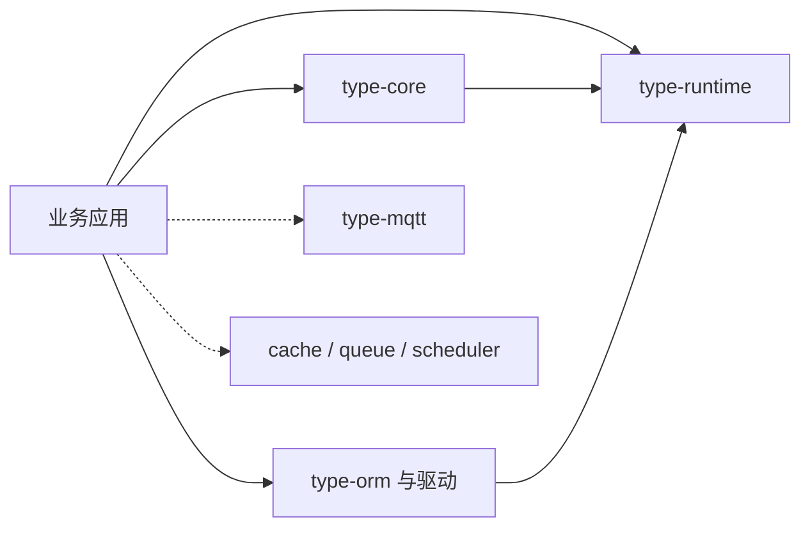
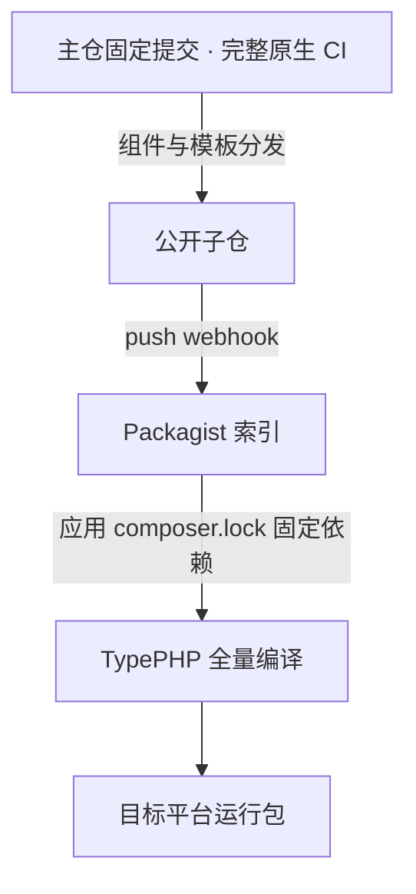
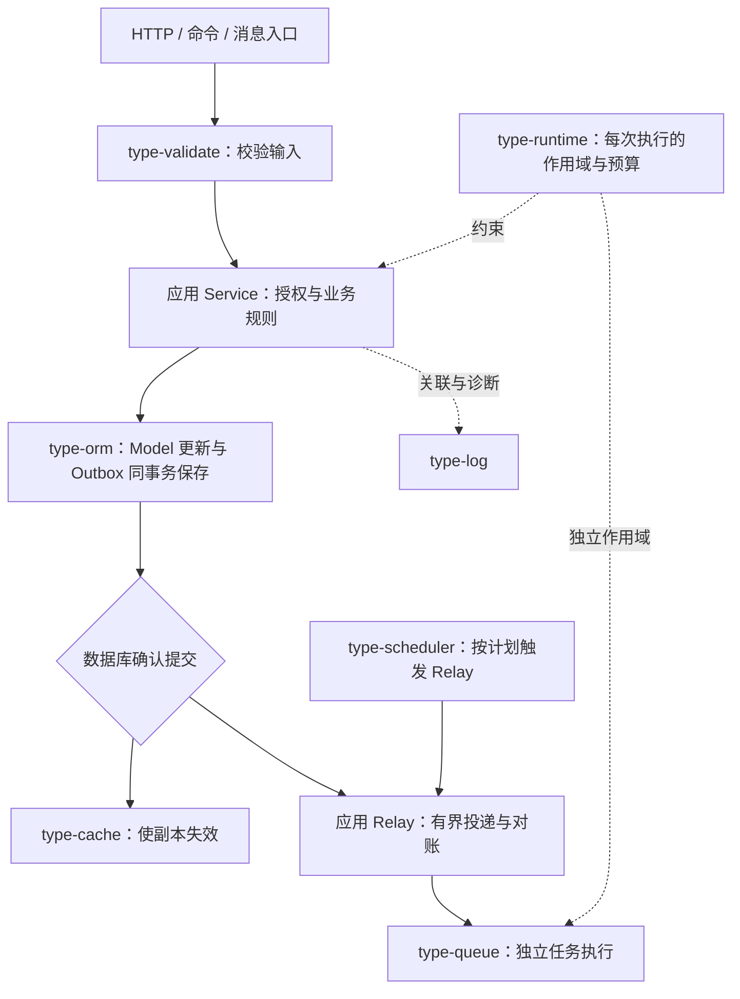

# 组件参考

Plugins 是 TypeApp 中由 Composer 管理的框架组件的统称。当前维护 15 个源码包，均以 `type-xxxx` 命名，Composer 包名为 `zoujingli/type-xxxx`。各组件页说明依赖、接口、配置与失败边界。应用按实际需要组合：生产组件随业务交给 TypePHP 编译，原生运行库随应用交付；构建与测试工具按开发依赖使用。职责分层见[系统架构](architecture.md)。物联中心是成品案例，业务契约见[物联网中心](iot-center.md)。`type-mqtt` 与其余组件使用同一套源码维护规则，其协议与容量验收状态单独记录，须使用对应组件的实际产物验证。


```mermaid
flowchart LR
  App["业务应用"] --> Core["type-core"]
  App --> Runtime["type-runtime"]
  App --> Orm["type-orm 与驱动"]
  Core --> Runtime
  Orm --> Runtime
  App -.-> Mqtt["type-mqtt"]
  App -.-> Extra["cache / queue / scheduler"]
```

## 组件一览

| 组件 | 主要入口与职责 | 第一项练习 |
| --- | --- | --- |
| [type-runtime](plugins/type-runtime.md) | `ExecutionScope`、截止、取消、资源池与租约 | 参数拒绝，再收集两个受管子任务的结果 |
| [type-core](plugins/type-core.md) | 配置、命令、事件、HTTP/WS/TCP/UDP | 读取配置，再请求 `/status` 与不存在路由 |
| [type-orm](plugins/type-orm.md) | `Model` / `Db`，关系、事务、迁移、Outbox | 迁移表，创建模型，修改后验证回滚 |
| [type-orm-mysql](plugins/type-orm-mysql.md) | `MysqlDriver`，MySQL 会话、事务和 TLS | 参数查询，检查 UTC 与严格模式 |
| [type-orm-pgsql](plugins/type-orm-pgsql.md) | `PgsqlDriver`，schema、角色、RETURNING | 参数查询，检查实际 schema 和账号 |
| [type-orm-sqlite](plugins/type-orm-sqlite.md) | `SqliteDriver`，文件/内存、WAL、外键、busy | 单连接内存 CRUD，再换持久文件 |
| [type-validate](plugins/type-validate.md) | `Input` → `Schema` → `Data` | 区分 PATCH 的缺失、null 与无效值 |
| [type-log](plugins/type-log.md) | `LogManager` / `Logger`，通道、关联、脱敏 | 观察级别过滤、脱敏和排空计数 |
| [type-redis](plugins/type-redis.md) | `RedisManager`，命名端点与用途隔离 | PING，再读写带 TTL 的专属键 |
| [type-cache](plugins/type-cache.md) | `TypedCache` / `SimpleCache`，回源和失效 | 缓存 null，切换代次并有界回收 |
| [type-queue](plugins/type-queue.md) | `Queue` / `Worker` / `Job` | 投递、消费，再验证目标端幂等 |
| [type-scheduler](plugins/type-scheduler.md) | `Definition` / `Scheduler` / `Task` | 固定时间计算，再查看持久执行历史 |
| [type-mqtt](plugins/type-mqtt.md) | `Broker` / `Client`，MQTT 3.1.1/5.0 | 离线编解码，再做鉴权与 QoS 0 互通 |
| [type-build](plugins/type-build.md) | `type` 命令，声明生成、TypePHP AOT、产物身份 | doctor → prepare → build → inspect |
| [type-testing](plugins/type-testing.md) | `Assert` / `Suite` / `Process` / `HttpClient` | 严格断言，再核对真实进程或响应 |

每篇教程给出前置条件、代码位置、预期结果和收尾方式。MQTT 持久能力另需 PostgreSQL 同步后端，完整协议与容量验收仍有边界，不能由离线示例通过推定。

## 安装组件

组件源码统一在 [TypeApp 主仓](https://github.com/zoujingli/typeapp)的 `plugin/type-*` 维护，再分发到各自的 `zoujingli/type-xxxx` 仓库。第一方内容采用 Apache-2.0，各仓库携带 LICENSE 与 NOTICE；[type-project](https://github.com/zoujingli/type-project) 提供独立应用模板。

15 个组件与应用模板均通过 [Packagist](https://packagist.org/packages/zoujingli/) 提供公共索引。Composer 默认使用该索引，应用只声明自己需要的组件，传递依赖自动解析；无需 SSH 密钥或逐个配置 Git 仓库。当前公开候选批次为 `1.0.0-rc.14`，16 个包的版本与来源提交均已核对；同时保留 `dev-main` 开发分支，尚无稳定版本。

`1.0.0-rc.14` 的组件和模板批次已完成公开安装、全量 AOT 与三库原生消费核验。维护者通过主仓固定提交分发，子仓 push webhook 通知 Packagist 更新；消费者从默认索引安装并核对本批拆分提交。准确验收基线见[平台与验收](platforms.md)，开发分支更新不自动替换已有应用的依赖。


```mermaid
flowchart TB
  Source["主仓固定提交 · 完整原生 CI"] -->|组件与模板分发| Github[公开子仓]
  Github -->|push webhook| Index[Packagist 索引]
  Index -->|应用 composer.lock 固定依赖| Build[TypePHP 全量编译]
  Build --> Package[目标平台运行包]
```

以下从已公开的 `1.0.0-rc.14` 候选批次安装 SQLite ORM。RC 不代表稳定版本，执行前按[版本发布](releases.md)核对 Packagist 实际索引、批次和平台范围：

```bash
composer config minimum-stability RC
composer config prefer-stable true
composer require zoujingli/type-orm-sqlite:1.0.0-rc.14
```

提交应用的 `composer.lock`，让构建固定到实际安装的版本和提交。版本 tag 不会移动各子仓的 `main`；`dev-main` 表示各子仓最近一次分支同步，不能当作本批次版本的别名。

版本批次使用同一 tag 发布组件与模板，并从默认 Packagist 核对版本及拆分提交。需要固定 RC 或正式版本时，按[Composer 按版本安装](releases.md#composer-按版本安装)设置明确约束；是否已经可用以公开 Release 和 Packagist 实际版本为准。物联中心运行包与 Composer 源码组件各有用途，不需要在部署机再次安装组件。

| 选择的组件 | Composer 自动解析的第一方依赖 |
| --- | --- |
| `type-runtime` | 无 |
| `type-core`、`type-orm`、`type-validate`、`type-log`、`type-redis`、`type-build`、`type-testing` | `type-runtime` |
| 三种 `type-orm-*` 驱动 | `type-orm`、`type-runtime` |
| `type-cache`、`type-queue`、`type-scheduler` | `type-redis`、`type-runtime` |
| `type-mqtt` | 当前 `main` 依赖 `type-core`、`type-orm`、`type-runtime`；RC14 的直接依赖为后两者。PostgreSQL 持久后端另需 `type-orm-pgsql` |

具体公开依赖、扩展和版本要求以所用包的 `composer.json` 为准。

构建与测试工具通常安装为开发依赖：

```bash
composer require --dev zoujingli/type-build:1.0.0-rc.14 zoujingli/type-testing:1.0.0-rc.14
```

需要跟进开发分支时，按下文[版本与接口依据](#版本与接口依据)明确选择开发依赖闭包；不要只改顶层包版本就假定其依赖都已升级。

从旧版 VCS 配置迁移时，删除应用根 `composer.json` 中指向这些公共组件的 `repositories` 项，再执行一次受控的 `composer update 'zoujingli/type-*' --with-all-dependencies` 并审阅锁文件。保留应用自己的私有仓库配置。开发和构建使用 `composer install` 复现锁定版本；单程序部署机不执行 Composer。

各组件页的“安装与依赖”用于源码开发和构建准备。生产组件随业务一起编译，`type-build` 收集实际原生依赖；部署完整运行包时无需再逐个安装 Composer 组件或开发 SDK。外部数据库、Redis 等业务服务按所选能力提供，统一见[环境与依赖](environment.md)。

HTTP、TCP、UDP、MQTT、WebSocket 的独立教程见[基础通信](communications.md)，每篇包含配置、双端实例、应用设计与验证。

## 选择与组合

简单 HTTP 业务可从 core、runtime、校验与日志开始；数据持久化加入 ORM 和一个驱动。没有缓存需求时不必引入 Redis；需要队列和调度时，显式声明任务入口与资源预算。

缓存需要明确键空间、类型、TTL 和失效策略；事务外的消息或其他副作用需要可靠交付设计。队列消费与重试应保持幂等，不能假定处理只发生一次。调度使用持久状态与多实例租约，任务仍须定义失败、取消与停止边界。

MQTT 组件拥有协议与连接，认证、Topic 权限和业务消息由应用定义。持久 QoS、会话及集群路径需要显式 PostgreSQL 同步后端；Broker 的协议确认与业务持久接收、设备执行结果分别判断。完整业务组合见[物联网中心](iot-center.md)。

生产 PHP 源码、实际安装的生产依赖和生成结果共同进入 TypePHP 编译。把所需的运行实现移到开发依赖，不能替代完整编译。

## 组件如何共同完成业务

业务以 Model 表达持久实体，Service 组织一次操作；控制器、命令、Job 和 Task 调用同一业务服务。常见的“修改数据并触发后台处理”按以下边界组合：


```mermaid
flowchart TB
    Entry[HTTP / 命令 / 消息入口] --> Input[type-validate：校验输入]
    Input --> Service[应用 Service：授权与业务规则]
    Service --> Tx[type-orm：Model 更新与 Outbox 同事务保存]
    Tx --> Commit{数据库确认提交}
    Commit --> Cache[type-cache：使副本失效]
    Commit --> Relay[应用 Relay：有界投递与对账]
    Relay --> Queue[type-queue：独立任务执行]
    Schedule[type-scheduler：按计划触发 Relay] --> Relay
    Scope[type-runtime：每次执行的作用域与预算] -.约束.-> Service
    Scope -.独立作用域.-> Queue
    Service -.关联与诊断.-> Log[type-log]
```

图中组件按需要使用；缓存失效失败是提交后错误，不能重跑已提交业务。Outbox 意图与业务数据在同一数据库事务中保存，外部投递在提交后进行，接收方以稳定业务 ID 幂等。完整的可运行案例从[连续目录教程](tutorial.md)进入，再学习[缓存、事件与可靠任务](catalog-reliability.md)。这组教程使用开发通道的共同装配入口。

| 所有者 | 持有的内容 | 结束责任 |
| --- | --- | --- |
| 构建流程 | 声明、依赖图、生成代次、内嵌资源 | 校验输入并封存产物身份 |
| 进程或线程宿主 | 配置快照、数据库/Redis 管理器、日志输出、监听 | 先停止接单和排空，再关闭长期资源 |
| 请求、消息或任务作用域 | 连接租约、模型、Logger 绑定、execution 服务 | 成功、异常、取消均回收，不能跨执行者复用 |
| 外部存储与应用运维 | 业务数据、可靠消息、调度游标、日志留存 | 备份、迁移和恢复；作用域关闭不删除持久数据 |

多个角色复用一份编译后的程序，不等于共享活动连接或业务对象。应用决定启动哪些角色；安装组件本身不会启动 Worker、Broker 或调度循环。

## 运行声明式示例

各插件页面的完整 PHP 示例以独立消费应用为基准。先按该页安装组件，再准备 `app/main.php`；不要覆盖已有业务入口，可在单独示例项目练习。涉及数据库、Redis 和状态文件的示例，按对应页先准备环境。

开发示例另安装锁定版本的 TypePHP 工具：`composer require --dev swoole/typephp:0.9.4`。当前组件使用 `std::any()` 等编译期接口，PHP 开发启动器需显式加载该版本的官方 `src/polyfills.php`；这不增加生产源码解释回退。

不含生成声明的最小组件示例，生产入口只声明函数或类，加载文件不会自动执行 `main()`。在独立示例根新建开发启动器 `dev.php`：

```php
<?php

declare(strict_types=1);

require __DIR__ . '/vendor/autoload.php';
require_once __DIR__ . '/vendor/swoole/typephp/src/polyfills.php';
require __DIR__ . '/app/main.php';

main();
```

如果示例声明了 `main(int $argc, array $argv)`，将最后一行改为 `main($argc, $argv);`，再通过 `php dev.php` 传入该页要求的参数。只包含业务函数或标明“放在 try 内”的代码块是接续片段，需要调用方提供已说明的连接/对象。

含 Model、路由或事务/缓存声明的开发应用使用标准模板或 `type dev` 的完整代次加载，不直接 require 原模型、Service。自定义入口按[type-build 开发命令](plugins/type-build.md#接通-php-开发命令)调用 `DevelopmentBuilder::loadConfiguration()` 后执行业务；不要把两种启动器叠加，否则会重复声明或绕过生成结果。

`dev.php` 只在 PHP 开发时加载源码，不放进生产 `sources`。准备原生程序时按 [type-build](plugins/type-build.md) 声明应用 autoload、入口和全部生产源码；所有依赖与生成代码一起编译。示例能在 PHP 执行不代表已经通过当前平台的 AOT 验收。

各页末尾的 Composer 验证脚本属于本仓库，不是独立消费应用安装后自动拥有的命令。

## 版本与接口依据

先选版本，再按对应接口开发。默认站点展示发布通道，`/next/` 展示当前开发文档；主仓 Markdown 和 `main` 分支 README 随源码演进，不能当作 RC14 接口说明。已安装版本以 `vendor/zoujingli/type-*/README.md` 和 `composer.lock` 为准。

| 使用目的 | 依赖选择 | 对应说明 |
| --- | --- | --- |
| 复现 RC14 | 模板与第一方组件固定 `1.0.0-rc.14` | 发布通道、各包不可变 tag 中的 README |
| 使用当前开发能力 | 同批分发的 `dev-main` / `1.0.x-dev` 组件及开发工具 | `/next/`、所用源码提交的 README |
| 验证尚未分发的修改 | 主仓锁定依赖，或受控的本地独立消费者 | 该次源码与实际验证结果，不代表公开版本可用 |

例如在独立开发项目中安装 SQLite ORM，将其第一方依赖一起明确选为开发版：

```bash
composer config minimum-stability dev
composer config prefer-stable true
composer require zoujingli/type-orm-sqlite:dev-main zoujingli/type-orm:dev-main zoujingli/type-runtime:dev-main --with-all-dependencies
composer require --dev zoujingli/type-build:dev-main --with-all-dependencies
composer show --locked 'zoujingli/type-*'
```

`dev-main` 的分支别名是 `1.0.x-dev`。`prefer-stable` 不会把所有传递依赖自动选成开发版，已有 RC 精确约束也不会被 `--with-all-dependencies` 解除；组合其他组件时，按上方依赖表核对完整第一方闭包。包可以声明更高的最低版本，例如当前 PDO 驱动要求带前置 hook 检查的 runtime；这个约束不是 RC15 已发布的声明。

核对 lock 中的版本与 source reference，再提交锁文件。主仓提交只有完成子仓同步和 Packagist 索引才可由公开 Composer 安装；`dev-main` 也不保证就是主仓最新 SHA。升级后重新生成声明、执行对应业务回归和目标平台 AOT；不要用忽略平台要求或删除锁文件解决接口不匹配。

当前主仓源码统一使用 PHP `8.5.10 ZTS`、TypePHP `0.9.4` 和 PHPX `2.9.3` 作为 AOT 基线；Swoole 线程、协程、事件循环及内置 PHP 库按组件实际需要复用，不能由某个组件的 PHP 开发通过推导原生平台已支持。每个组件页同时说明安装、接口、配置、失败语义和验证边界；待完成工作见[实现规划](roadmap.md)。

常见流程见[HTTP 与路由](routing.md)、[数据库与模型](database.md)和[构建与部署](deployment.md)。
