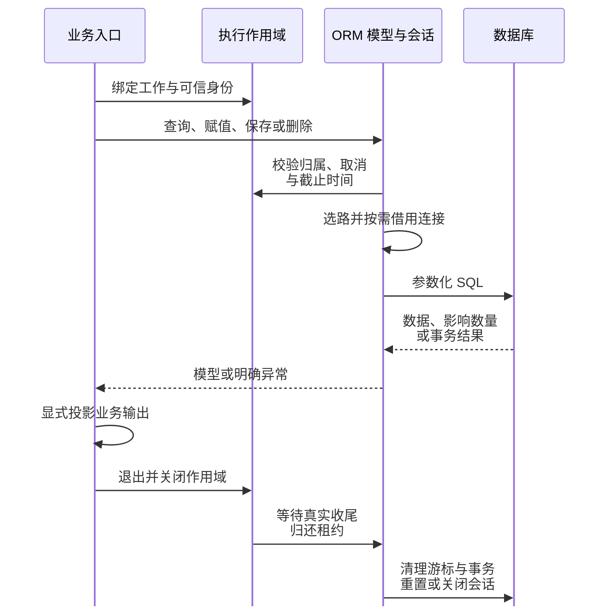
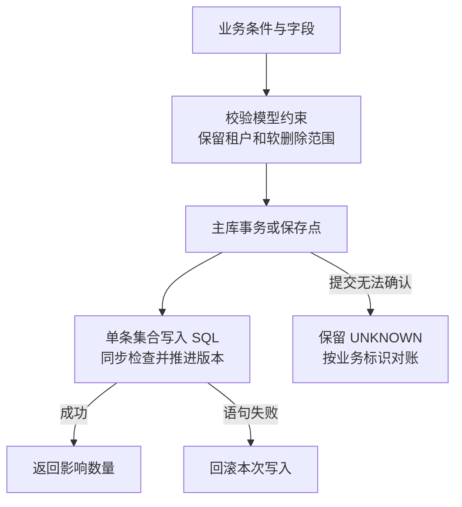

# 数据库与模型

`type-orm` 提供连接、不可变查询、生成模型、事务、关系和迁移。MySQL、PostgreSQL、SQLite 由各自驱动实现，保留真实数据库语义。

ORM 使用 PDO 访问数据库协议，Swoole 提供协程上下文、等待、Channel 和 Timer。`type-runtime` 基于这些原生能力管理执行作用域、父子取消、Deadline 和资源收尾，`type-orm` 管理连接租约与会话恢复；TypePHP 负责 ORM、模型及业务代码的全量 AOT 编译。ORM 不新增数据库网络协议、连接线程池或私有协程调度器。

业务数据访问以领域 Model 为标准。`Model::query()`、`Model::search($input)` 和模型的 `save()` 无需连接参数，框架从当前执行作用域自动取得受管连接；默认写主、读从，`master()` 指定主读，事务固定同一主库连接，从库故障明确失败。PostgreSQL 完整重置后可复用物理 PDO，MySQL、SQLite 当前归还即关闭；框架接口、驱动限制及交付条件见[模型连接与主从路由](https://github.com/zoujingli/typeapp/blob/main/docs/development/model-connections.md)和[实现规划](roadmap.md)。

## 常用能力边界

当前已具备从模型声明、数据读写到事务与资源收尾的主路径，常用接口仍有待补项。下表区分模型能力与底层表查询；已有 SQL 接口不代表它自动执行模型字段、租户、软删除、版本或事件规则。

| 需求 | 当前能力 | 使用边界 |
| --- | --- | --- |
| 单条 CRUD 与字段状态 | `create/find/save/delete`、脏字段、部分加载、严格赋值和显式输出 | 失败或回滚后的失效对象重新查询 |
| 查询、分页与遍历 | 条件组合、`exists/value/pluck/count`、三种分页及 `chunk` | 模型无逐行 `stream`；`chunk` 提供有界遍历，不用于活动事务 |
| 模型聚合 | 计数已有，模型自身的 SUM、AVG、MIN、MAX 尚未提供 | 关系 `withSum` 与底层 `Query::aggregate` 不等于模型聚合 |
| 集合修改与删除 | `update/delete/increment/decrement` 已有 | 单条写入，不设额外匹配行数上限；不触发逐模型事件 |
| 批量新增与冲突写入 | 底层 Query 已有；模型级 `insertMany/upsert` 尚未提供 | 不直接绕过模型约束；逐条 `create` 加事务与批量 SQL 的成本、返回和事件语义不同 |
| 并发查找或创建 | 尚无模型专用入口 | `first` 后 `create` 存在竞争窗口；需要数据库唯一约束和明确冲突处理 |
| 关系 | 四类关系、嵌套预加载、补加载、关系条件和计数/求和；多对多 `attach/detach/sync` | 关系读取不隐式发 SQL；没有专用多态、穿透关系或关系创建助手 |
| 软删除与生命周期 | 实例恢复/物理删除、获取器/修改器和显式观察器 | 没有集合恢复/强制删除、自动时间字段声明或 `fresh/refresh` 专用接口；重新读主库取得新对象 |
| 事务、路由与租户 | 同库事务、保存点、提交后回调、乐观锁、主从与可信上下文范围 | 子任务独立事务；未知提交需要对账，不能自动重试 |
| 迁移与外部效果 | 版本化 SQL 迁移、历史校验/恢复与事务 Outbox | 应用实现投递与目标幂等；没有迁移 `down` 或通用 Schema DSL |

模型聚合和批量冲突写入是优先补齐的基础能力；便捷方法按实际调用需求增加。隐式懒加载、动态扫描和共享活动模型不属于当前执行方式。具体交付顺序见 [ORM 补齐顺序](roadmap.md#orm-补齐顺序)，真实三库与编译范围见[独立消费矩阵](https://github.com/zoujingli/typeapp/blob/main/docs/development/orm-consumer-matrix.md)。

## 一次模型操作怎样完成

先声明模型和迁移，再由构建工具生成模型映射；开发与 TypePHP 编译共用转换结果。模型声明不自动建表，迁移成功后才进入业务读写。应用启动时装配 `DatabaseManager`，请求或任务入口创建执行作用域，并在验证访问资格后绑定租户身份。



同一作用域按数据源复用读写会话，连续操作复用已取得的租约；不会每次调用 Model 都重新连接。跨作用域再次借用时，是否保留原物理 PDO 取决于驱动的重置能力。请求结束只归还本次租约，应用所有者在请求和任务排空后关闭管理器。模型、查询和活动事务不能跨作用域共享；异步任务传递必要的值，在自己的作用域中重新查询。

| 业务动作 | 当前入口 | 完成时需要确认 |
| --- | --- | --- |
| 新增、查找 | `create/find/query/search` | 严格赋值、租户范围、未命中和输出字段 |
| 修改、删除、恢复 | 实例 `save/delete/restore/forceDelete` | 影响记录、软删除、版本冲突及对象是否仍有效 |
| 列表与关系 | `get/paginate/with/load/loadMissing` | 有界结果、稳定排序、匹配模型与数据源；关系不隐式懒加载 |
| 集合算术 | `ModelQuery::increment/decrement` | 返回影响数量，推进版本；已加载对象需要重新查询 |
| 集合更新、删除 | `ModelQuery::update/delete` | 模型字段、租户及软删除约束，整条写入原子性；不触发逐模型事件 |
| 多步写入 | `Db::transaction/afterCommit` | 同库提交、回滚、未知结果和提交后失败分别处理 |
| 外部投递 | 事务 Outbox 与应用 Publisher | 写入意图、实际投递、目标幂等和后续对账 |

模型集合写入在主库执行单条写入 SQL，不额外限制匹配行数，也不要求业务拆批。没有业务条件时须显式 `allowAll()`，它仍保留租户及软删除范围。模型级 `insertMany/upsert` 尚未提供；底层表 Query 的同名能力不自动获得模型约束。



`first()` 保留已有偏移，单表别名可组合分页；关系补加载先校验整个模型列表的归属。集合版本推进与业务字段修改在同一条 SQL 完成，失败时回滚本次写入。完整契约及尚未完成的消费、平台验收见[操作闭环与验收边界](https://github.com/zoujingli/typeapp/blob/main/docs/development/model-connections.md#操作闭环与验收边界)。

## 协程并发的成立条件

Swoole 在可让出的数据库等待期间调度其他协程；ORM 负责把连接和事务绑定到正确的工作范围。应用不能把一个 PDO 或活动模型交给多个协程共用，子任务须在自己的作用域中查询。协程并发不改变数据库约束、锁竞争和提交事实，也不保证单条 SQL 更快。

| 环节 | 当前行为 | 尚需闭合的条件 |
| --- | --- | --- |
| 数据库 I/O | `enableIo()` 启用已有的官方 hook；MySQL 依赖 mysqlnd 与网络 hook，PostgreSQL/SQLite 需要相应构建能力 | 缺所选 PDO hook 时目前仍可能接受启动；还需按实际选用驱动明确拒绝，不能只检查扩展版本 |
| 借用与隔离 | 同一作用域按需复用租约；子任务独立连接，事务绑定同一主库 | 自定义协议入口同样必须绑定并关闭作用域 |
| 容量与取消 | 有界排队、截止及取消；超时后仍持有在途连接额度，直到真实退出 | 实际数据库调用未退出时不能强称已取消或回滚，不能透明重试写入 |
| 会话归还 | 清理事务和游标；PostgreSQL 重置后可物理复用，MySQL/SQLite 关闭重建 | 后两者的完整会话重置与跨租约物理复用尚未实现 |
| 验收 | 已有真实锁等待、隔离、断连退役和独立消费者 | 普通 CRUD 复用仍需在消费者直接观测连接身份；当前提交的公开组件消费与全平台矩阵尚未齐备 |

开发和构建环境需匹配 PDO 驱动与 Swoole 构建能力；原生部署使用随应用收集的运行库，用户无需另行配置一个 Swoole 服务。当前目录包与最终单程序交付的区别见[环境与依赖](environment.md)和[构建与部署](deployment.md)。

## 选择数据库

| 数据库 | 组件 | 准备事项 |
| --- | --- | --- |
| MySQL | `type-orm-mysql` | PDO 驱动、已创建的数据库和账号 |
| PostgreSQL | `type-orm-pgsql` | PDO 驱动、数据库、账号及 schema 权限 |
| SQLite | `type-orm-sqlite` | PDO 驱动、可写的数据目录与持久化文件 |

物联中心成品案例通过 `DB_DRIVER` 选择已安装的驱动，独立模板在首次安装前选择一个驱动。切换数据库不会迁移原数据，也不会删除旧数据库。

## 显式迁移

物联中心通过 `app:install` 初始化空库，同时建立身份、租户和权限数据，具体参数见[双端身份初始化](https://github.com/zoujingli/typeapp/blob/main/docs/development/iot-identity.md#初始化)。安装完成后，在本仓库根查询迁移状态：

```bash
composer typeapp:migrate -- status
composer typeapp:migrate -- history
```

物联中心的 `migrate` 提供 `status`、`history` 和经核对后的 `recover`，不提供独立建表的 `run`。通用应用模板使用 `php dev.php migrate run` 初始化自身模型所需的表，并提供 `status`、`history` 查询；模板不包含物联中心的身份安装流程。框架迁移按版本和校验和执行，已完成版本重复运行保持幂等。

迁移具有校验和和历史记录。MySQL DDL 不等同于事务性 DDL：失败后先检查数据库实际状态与迁移历史，再决定恢复或重试，不能假定自动回滚。PostgreSQL、SQLite 也要按各自的事务、锁与文件语义验证。

独立使用 ORM 时，可参考[迁移与事务意图示例](plugins/type-orm.md#运行迁移与事务意图示例)，从 Migration 声明、显式 run 到业务写入逐步运行。模型映射和建表迁移是两份不同声明；新增模型字段也需要相应数据库迁移。

## 声明模型

在 `app/` 的领域 `model/` 目录中声明直接继承 `Type\Orm\Model` 的业务类，用 `#[Table(...)]` 指定表，用公开类型属性声明字段。物联中心先完成身份/租户模型与服务，再覆盖角色权限、产品、物模型、设备、遥测、告警、通知和导出任务；该范围是实施要求，不表示所有业务已完成 Model 迁移。`Column` 补充列名、精确类型、赋值权限和输出可见性，可空性来自 `?string` 等 PHP 类型。

构建器从 `sources` 静态识别模型，保留原类名和业务方法，生成字段映射、水合工厂、查询入口和属性钩子。应用验证租户访问资格、角色权限和设备归属后绑定可信上下文；框架按模型租户字段自动限定查询与写入，缺失或冲突时拒绝操作，业务无需逐次追加租户条件。PHP 开发入口先加载本代转换结果，AOT 编译同一结果；业务源码、完整转换结果和生成器身份都进入审计。不要直接加载未经准备的模型源码。

将 PHP 模型所在目录加入构建配置的 `sources`，再执行 prepare/build。完整声明与开发加载例子见[模型与关系](plugins/type-orm.md#models-relations-output)。

查询的 `find()`、`first()` 未命中返回 null，`get()` 返回列表。过滤、选列、排序与限制返回新的查询对象；部分字段查询保留持久化所需的主键，响应字段仍应显式选择。

## 字段与修改

字段有「未加载」「已加载为 null」「已加载为值」的区别。读取未加载字段会报 `field_not_loaded`，未知字段会报 `unknown_field`；不能用默认值掩盖数据缺失。

`fill()` 先验证整批输入，再更新对象；未知字段、不可赋值字段和持久化后修改主键会被拒绝。`dirty()` 记录真实修改，部分模型保存只写入已提供且发生变化的字段。

属性钩子与 `get/set` 共用这些检查。JSON 数组需先读取、修改副本，再整值赋回；属性不支持取引用或间接修改。关系属性只读取显式加载结果，未加载时报告 `relation_not_loaded`。

输出使用 `project()` 或业务自己的投影方法。字段可见性与赋值权限分别声明，不能将持久化对象中的所有字段直接作为 API 响应。

## 并发与删除

模型声明 `version` 后，写入使用主键与旧版本共同匹配，成功时推进版本。过期版本报 `optimistic_conflict`；物联中心成品案例将其转成 HTTP 409。冲突或事务失败后重新读取模型，不继续复用已经失效的对象。

软删除字段由 `Table(softDelete: 'deleted_at')` 声明。默认查询隐藏已删除记录，`withTrashed()`、`onlyTrashed()` 显式改变查询范围。`ModelQuery::delete()` 按声明软删除或物理删除，软删除不重复处理已删除行。集合更新、软删除及 `increment/decrement` 同时推进声明的版本列；已经读取的模型需要重新查询。集合操作不触发逐模型事件，需要领域副作用时使用实例操作。详细约束见[模型集合写入](https://github.com/zoujingli/typeapp/blob/main/docs/development/models.md#模型集合写入)。

PATCH 的缺失字段保持不变，明确的 null 用于清空可空字段。提交版本应来自最近一次读取，不应在客户端固定为 1。

## 事务与精确值

普通业务异常在确认回滚后原样抛出；提交不能确认时通过 `TransactionException::outcome()` 保留 `UNKNOWN`，不能自动重试。结束原作用域后，在新作用域通过主库和业务操作 ID 核对实际结果。`AfterCommitException` 表示外层已经提交但后续回调失败，不能把它当作可以重跑原事务的信号。

事务/缓存 Attribute 通过构建生成的操作组合对象执行；直接调用原服务不会自动开启事务。可靠外部效果可使用事务 Outbox，在事务内记录意图，再由转发器交付；消费者仍须处理重复。

Outbox 的[投递、对账与回收](plugins/type-orm.md#投递、对账与回收)需要应用明确实现 Publisher；记录 pending 不等于已经投递，published 不等于目标业务已消费。

`decimal`、`bigint` 使用精确的十进制字符串，拒绝有损浮点输入；日期统一为 UTC，并明确精度与时区。SQLite 的精确数值示例使用 TEXT，避免数值亲和转换丢失精度。三库都应按实际列类型验证，不把一种数据库的结果推论到其他数据库。

继续阅读：[组件参考](components.md) · [构建与部署](deployment.md)。
