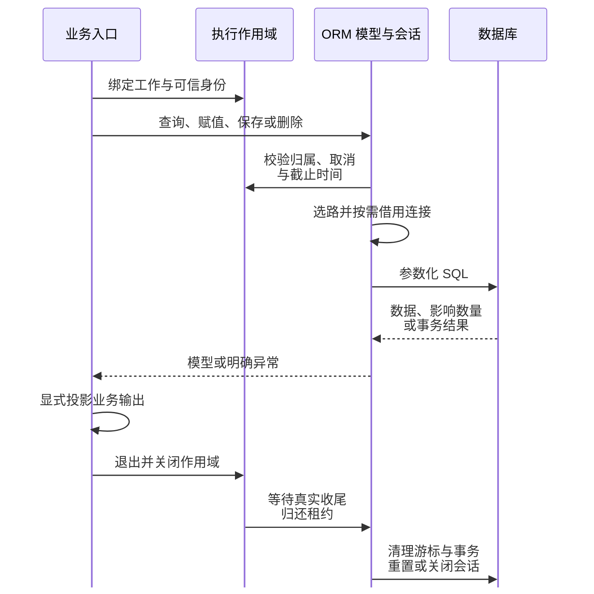
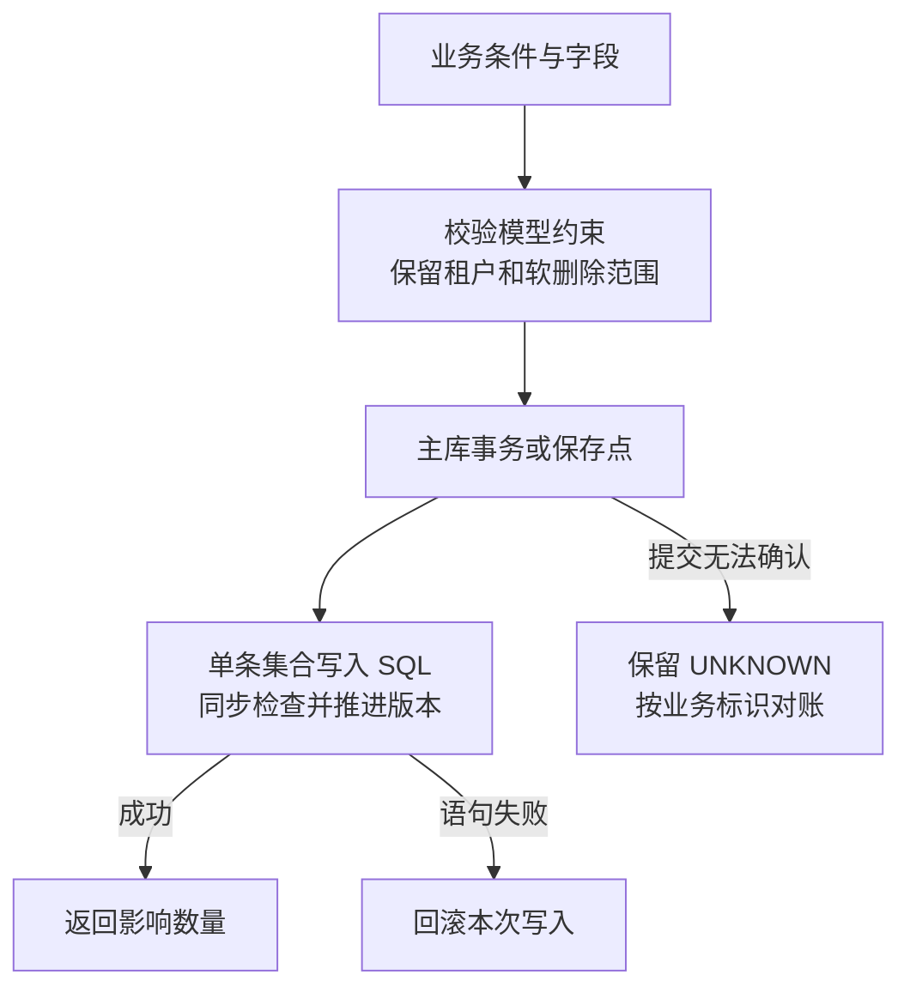
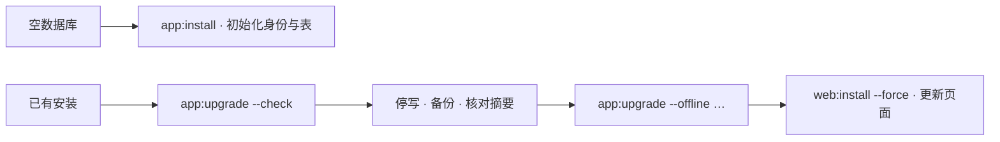
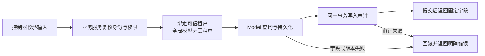
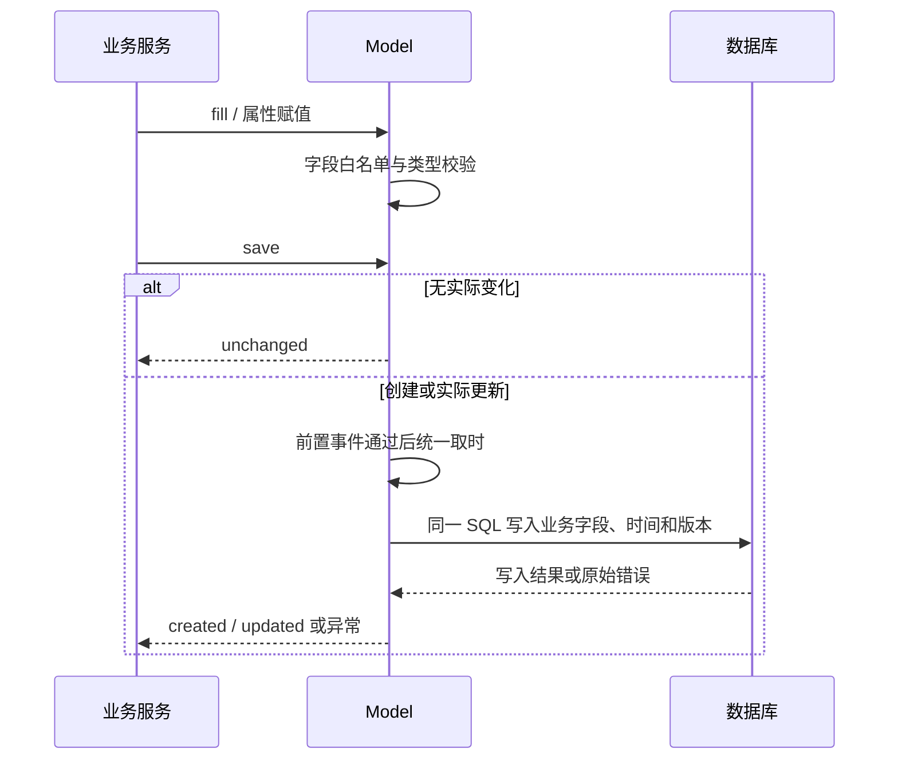

# 数据库与模型

`type-orm` 提供连接、不可变查询、生成模型、事务、关系和迁移。MySQL、PostgreSQL、SQLite 由各自驱动实现，保留真实数据库语义。

ORM 使用 PDO 访问数据库协议，Swoole 提供协程上下文、等待、Channel 和 Timer。`type-runtime` 基于这些原生能力管理执行作用域、父子取消、Deadline 和资源收尾，`type-orm` 管理连接租约与会话恢复；TypePHP 负责 ORM、模型及业务代码的全量 AOT 编译。ORM 不新增数据库网络协议、连接线程池或私有协程调度器。

业务数据访问以领域 Model 为标准。`Model::query()`、`Model::search($input)` 和模型的 `save()` 无需连接参数，框架从当前执行作用域自动取得受管连接；默认写主、读从，`master()` 指定主读，事务固定同一主库连接，从库故障明确失败。PostgreSQL 完整重置后可复用物理 PDO，MySQL、SQLite 当前归还即关闭；框架接口、驱动限制及交付条件见[模型连接与主从路由](https://github.com/zoujingli/typeapp/blob/main/docs/development/model-connections.md)和[实现规划](roadmap.md)。

## 常用能力边界

当前已具备从模型声明、数据读写到事务与资源收尾的主路径，常用接口仍有待补项。下表区分模型能力与底层表查询；已有 SQL 接口不代表它自动执行模型字段、租户、软删除、版本或事件规则。

本页的 `ModelQuery::sum/avg/min/max`、`insertMany`、受管时间字段和所选 PDO hook 前置检查属于当前 `main`，尚未包含在已发布的 RC14 中。开发应用使用含这些改动的组件源码并重新构建，版本安装仍按[发布说明](releases.md)核对。

| 需求 | 当前能力 | 使用边界 |
| --- | --- | --- |
| 单条 CRUD 与字段状态 | `create/find/save/delete`、脏字段、部分加载、严格赋值和显式输出 | 失败或回滚后的失效对象重新查询 |
| 模型身份 | 单字段主键，可使用数据库生成值或应用指定值 | 尚无复合主键模型；精确复合身份保留受控 Query，不能任取一列替代 |
| 查询、分页与遍历 | 条件组合、`exists/value/pluck/count`、三种分页及 `chunk` | 模型无逐行 `stream`；`chunk` 提供有界遍历，不用于活动事务 |
| 模型聚合 | `count/sum/avg/min/max`，保留字段映射、租户、软删除和读路由 | 空集计数为 0，其他为 null；精确文本列拒绝数据库数值聚合，不强制转浮点 |
| 集合修改与删除 | `update/delete/increment/decrement` 已有 | 单条写入，不设额外匹配行数上限；不触发逐模型事件 |
| 批量新增 | `ModelQuery::insertMany` 校验整批字段并执行单条 INSERT | 返回影响数量，不触发逐模型事件、不返回猜测主键；约束失败回滚整批 |
| 批量冲突写入 | 当前 main 提供 Model `upsert/upsertAnyUnique`，未包含 RC14 | MySQL 接受任意唯一键且拒绝软删除模型；另两库指定完整真实唯一目标，软删除冲突跳过；保留租户、时间和版本 |
| 并发查找或创建 | 尚无模型专用入口 | `first` 后 `create` 存在竞争窗口；需要数据库唯一约束和明确冲突处理 |
| 关系 | 四类关系、嵌套预加载、补加载、关系条件和计数/求和；多对多 `attach/detach/sync` | 关系读取不隐式发 SQL；没有专用多态、穿透关系或关系创建助手 |
| 软删除与生命周期 | 实例恢复/物理删除、受管创建和更新时间、获取器/修改器和显式观察器 | 没有集合恢复/强制删除或 `fresh/refresh` 专用接口；重新读主库取得新对象 |
| 事务、路由与租户 | 同库事务、保存点、提交后回调、乐观锁、主从与可信上下文范围 | 子任务独立事务；未知提交需要对账，不能自动重试 |
| 迁移与外部效果 | 版本化 SQL、Schema 三库冻结建表与有限结构变更、历史校验/恢复及事务 Outbox | 应用实现投递与目标幂等；没有迁移 `down` 或在线结构自动同步 |

批量冲突写入遵守各库的真实唯一约束和影响行数语义；会话复用的剩余范围见 [ORM 补齐顺序](roadmap.md#orm-补齐顺序)，便捷方法按实际调用需求增加。隐式懒加载、动态扫描和共享活动模型不属于当前执行方式。真实三库与编译范围见[独立消费矩阵](https://github.com/zoujingli/typeapp/blob/main/docs/development/orm-consumer-matrix.md)。

## 一次模型操作怎样完成

先声明模型和迁移，再由构建工具生成模型映射；开发与 TypePHP 编译共用转换结果。模型声明不自动建表，迁移成功后才进入业务读写。应用启动时装配 `DatabaseManager`，请求或任务入口创建执行作用域，并在验证访问资格后绑定租户身份。


```mermaid
%%{init: {'sequence': {'actorMargin': 24, 'width': 120, 'mirrorActors': false}}}%%
sequenceDiagram
    participant B as 业务入口
    participant S as 执行作用域
    participant M as ORM 模型与会话
    participant D as 数据库
    B->>S: 绑定工作与可信身份
    B->>M: 查询、赋值、保存或删除
    M->>S: 校验归属、取消<br/>与截止时间
    M->>M: 选路并按需借用连接
    M->>D: 参数化 SQL
    D-->>M: 数据、影响数量<br/>或事务结果
    M-->>B: 模型或明确异常
    B->>B: 显式投影业务输出
    B->>S: 退出并关闭作用域
    S->>M: 等待真实收尾<br/>归还租约
    M->>D: 清理游标与事务<br/>重置或关闭会话
```

同一作用域按数据源复用读写会话，连续操作复用已取得的租约；不会每次调用 Model 都重新连接。跨作用域再次借用时，是否保留原物理 PDO 取决于驱动的重置能力。请求结束只归还本次租约，应用所有者在请求和任务排空后关闭管理器。模型、查询和活动事务不能跨作用域共享；异步任务传递必要的值，在自己的作用域中重新查询。

| 业务动作 | 当前入口 | 完成时需要确认 |
| --- | --- | --- |
| 新增、查找 | `create/find/query/search` | 严格赋值、租户范围、未命中和输出字段 |
| 修改、删除、恢复 | 实例 `save/delete/restore/forceDelete` | 影响记录、软删除、版本冲突及对象是否仍有效 |
| 列表与关系 | `get/paginate/with/load/loadMissing` | 有界结果、稳定排序、匹配模型与数据源；关系不隐式懒加载 |
| 统计与导入 | `sum/avg/min/max/insertMany` | 统计遵守可见范围；导入逐行校验后整批写入，事件与返回语义区别于逐条创建 |
| 集合算术 | `ModelQuery::increment/decrement` | 返回影响数量，推进版本；已加载对象需要重新查询 |
| 集合更新、删除 | `ModelQuery::update/delete` | 模型字段、租户及软删除约束，整条写入原子性；不触发逐模型事件 |
| 多步写入 | `Db::transaction/afterCommit` | 同库提交、回滚、未知结果和提交后失败分别处理 |
| 外部投递 | 事务 Outbox 与应用 Publisher | 写入意图、实际投递、目标幂等和后续对账 |

模型集合写入在主库执行单条写入 SQL，不额外限制匹配行数，也不要求业务拆批。更新或删除没有业务条件时须显式 `allowAll()`，它仍保留租户及软删除范围。新增使用无读取条件的 `Model::query()->insertMany($rows)`；框架自动补入可信租户及声明的初始版本、软删除状态。底层表 Query 不自动获得这些模型约束。


```mermaid
flowchart TB
    A[业务条件与字段] --> B[校验模型约束<br/>保留租户和软删除范围]
    B --> C[主库事务或保存点]
    C --> D[单条集合写入 SQL<br/>同步检查并推进版本]
    D -->|成功| E[返回影响数量]
    D -->|语句失败| F[回滚本次写入]
    C -->|提交无法确认| G[保留 UNKNOWN<br/>按业务标识对账]
```

`first()` 保留已有偏移，单表别名可组合分页；关系补加载先校验整个模型列表的归属。集合版本推进与业务字段修改在同一条 SQL 完成，失败时回滚本次写入。完整契约、消费结果与剩余缺口见[操作闭环与验收边界](https://github.com/zoujingli/typeapp/blob/main/docs/development/model-connections.md#操作闭环与验收边界)。

## 协程并发的成立条件

Swoole 在可让出的数据库等待期间调度其他协程；ORM 负责把连接和事务绑定到正确的工作范围。应用不能把一个 PDO 或活动模型交给多个协程共用，子任务须在自己的作用域中查询。协程并发不改变数据库约束、锁竞争和提交事实，也不保证单条 SQL 更快。

| 环节 | 当前行为 | 尚需闭合的条件 |
| --- | --- | --- |
| 数据库 I/O | 启动时 `enableIo()` 配置官方 hook；协程中创建物理连接前检查所选驱动的构建能力与已启用标志 | MySQL 要求 PDO 使用 mysqlnd 与网络 hook；PostgreSQL/SQLite 要求对应官方 PDO hook，扩展版本不能替代能力检查 |
| 借用与隔离 | 同一作用域按需复用租约；子任务独立连接，事务绑定同一主库 | 自定义协议入口同样必须绑定并关闭作用域 |
| 容量与取消 | 有界排队、截止及取消；超时后仍持有在途连接额度，直到真实退出 | 实际数据库调用未退出时不能强称已取消或回滚，不能透明重试写入 |
| 会话归还 | 清理事务和游标；PostgreSQL 重置后可物理复用，MySQL/SQLite 关闭重建 | 后两者的完整会话重置与跨租约物理复用尚未实现 |
| 验收 | 已有真实锁等待、隔离、断连退役和独立消费者；四平台默认矩阵与公共组件三库集成通过 | 纯 CRUD 复用仍需独立身份断言；当前已验收源码及实际范围见[平台与验收](platforms.md)，不等于完整 ORM 能力已交付 |

开发和构建环境需匹配 PDO 驱动与 Swoole 构建能力；生产单程序已静态链接所需非系统运行库，用户无需另行安装或启动 Swoole。数据库服务、配置和数据的维护要求见[环境与依赖](environment.md)和[构建与部署](deployment.md)。

缺少所选驱动的编译能力报 `swoole_pdo_hook_unavailable`，已有能力但未在启动期启用报 `swoole_hook_startup_required`。检查不在业务协程里修改全局 hook，也不因未使用的数据库驱动阻止连接。协程外的同步迁移和工具仍可使用 PDO；是否真正让出等待由真实锁等待验收确认。

## 选择数据库

| 数据库 | 组件 | 准备事项 |
| --- | --- | --- |
| MySQL | `type-orm-mysql` | PDO 驱动、已创建的数据库和账号 |
| PostgreSQL | `type-orm-pgsql` | PDO 驱动、数据库、账号及 schema 权限 |
| SQLite | `type-orm-sqlite` | PDO 驱动、可写的数据目录与持久化文件 |

物联中心的发布程序按数据库 profile 分开构建，`DB_DRIVER` 必须与下载程序一致，否则返回 `runtime_profile_database_mismatch`。开发环境可在已安装驱动间选择，独立模板在首次安装前确定驱动。更换程序或配置不会迁移原数据，也不会删除旧数据库。

## 显式迁移

当前 `main` 支持通过 `#[Schema]` 声明新模块表及有限结构变更，显式 `php vendor/bin/type schema:prepare <声明.php>` 冻结并审查三库 SQL，再追加到已有迁移列表。开发和 AOT 构建只核验快照；旧迁移不改写。此能力尚未包含 RC14，完整流程与各库存储、失败恢复差异见[Schema 声明与冻结迁移](https://github.com/zoujingli/typeapp/blob/main/docs/development/schema.md)。

物联中心通过 `app:install` 初始化空库，同时建立身份、租户和权限数据，具体参数见[双端身份初始化](https://github.com/zoujingli/typeapp/blob/main/docs/development/iot-identity.md#初始化)。安装完成后，在本仓库根查询迁移状态：

```bash
composer typeapp:migrate -- status
composer typeapp:migrate -- history
```

物联中心的 `migrate` 提供 `status`、`history` 和经核对后的 `recover`，不提供独立建表的 `run`。通用应用模板使用 `php dev.php migrate run` 初始化自身模型所需的表，并提供 `status`、`history` 查询；模板不包含物联中心的身份安装流程。框架迁移按版本和校验和执行，已完成版本重复运行保持幂等。

已有物联中心数据使用 `app:upgrade`，不重新执行空库安装。该入口属于当前 `main`，未包含在已发布的 RC14 中；须先构建含此功能的新程序，按[升级与恢复](deployment.md#升级与恢复)检查安装谱系、停写、备份及摘要，再执行升级。迁移中断先核对历史与真实数据库状态，页面通过 `web:install --force` 单独更新。


```mermaid
flowchart LR
  Empty["空数据库"] --> Install["app:install · 初始化身份与表"]
  Existing["已有安装"] --> Check["app:upgrade --check"]
  Check --> Backup["停写 · 备份 · 核对摘要"]
  Backup --> Upgrade["app:upgrade --offline …"]
  Upgrade --> Web["web:install --force · 更新页面"]
```

数据库迁移和页面安装分别记录结果；页面更新失败按安装命令恢复，不重复初始化数据库。迁移和升级命令不自动停止其他实例。

迁移具有校验和和历史记录。MySQL DDL 不等同于事务性 DDL：失败后先检查数据库实际状态与迁移历史，再决定恢复或重试，不能假定自动回滚。PostgreSQL、SQLite 也要按各自的事务、锁与文件语义验证。

独立使用 ORM 时，可参考[迁移与事务意图示例](plugins/type-orm.md#运行迁移与事务意图示例)，从 Migration 声明、显式 run 到业务写入逐步运行。模型映射和建表迁移是两份不同声明；新增模型字段也需要相应数据库迁移。

## 声明模型

在 `app/` 的领域 `model/` 目录中声明直接继承 `Type\Orm\Model` 的业务类，用 `#[Table(...)]` 指定表，用公开类型属性声明字段。物联中心已将身份、租户、成员、角色、站点设置和产品资料接入 Model；设备、告警、导出任务与 Broker 资源仍有待整理的业务表操作，不表示整个应用已完成迁移。`Column` 补充列名、精确类型、赋值权限和输出可见性，可空性来自 `?string` 等 PHP 类型。

构建器从 `sources` 静态识别模型，保留原类名和业务方法，生成字段映射、水合工厂、查询入口和属性钩子。应用验证租户访问资格、角色权限和设备归属后绑定可信上下文；框架按模型租户字段自动限定查询与写入，缺失或冲突时拒绝操作，业务无需逐次追加租户条件。PHP 开发入口先加载本代转换结果，AOT 编译同一结果；业务源码、完整转换结果和生成器身份都进入审计。不要直接加载未经准备的模型源码。

将 PHP 模型所在目录加入构建配置的 `sources`，再执行 prepare/build。完整声明与开发加载例子见[模型与关系](plugins/type-orm.md#models-relations-output)。

查询的 `find()`、`first()` 未命中返回 null，`get()` 返回列表。过滤、选列、排序与限制返回新的查询对象；部分字段查询保留持久化所需的主键，响应字段仍应显式选择。

## 应用中的 Model 与数据库边界

产品服务的调用方式如下：应用入口已经绑定执行作用域，`$identity` 来自认证结果，产品服务重新核对当前权限后建立可信租户范围。调用方不用借还连接，也不把请求头中的租户值直接交给模型作为授权依据。

```php
use app\iot\service\ProductService;

$products = new ProductService();
$created = $products->create($identity, $tenantId, '温湿度传感器', '仓库环境采集');
$saved = $products->change($identity, $tenantId, $created['id'], $created['version'], [
    'name' => '仓库温湿度传感器',
    'description' => '每分钟采集一次',
]);
```

这是物联中心的业务接口，通用应用在自己的服务中使用 Model 和 `Db::transaction()`。服务内以模型完成字段读写，以同一事务记录审计；授权失败、旧版本、审计写入失败都不能留下半次业务修改。站点设置采用全局单例 `SiteSetting`，产品采用带 `tenant_id` 的 `Product`，两者分别声明数据范围。


```mermaid
flowchart LR
    A[控制器校验输入] --> B[业务服务复核身份与权限]
    B --> C[绑定可信租户<br/>全局模型无需租户]
    C --> D[Model 查询与持久化]
    D --> E[同一事务写入审计]
    E --> F[提交后返回固定字段]
    D -->|字段或版本失败| R[回滚并返回明确错误]
    E -->|审计失败| R
```

下列操作保留专用数据库入口，并不强行包装成空壳模型：

| 场景 | 保留原因 |
| --- | --- |
| 迁移、安装种子与就绪探测 | 模型操作以真实表结构及完成安装为前提 |
| 本人可用租户目录、授权关联、审计与 Outbox | 需要受控跨模型投影、授权锁或与业务同事务落库 |
| 物模型版本 `(tenant_id, product_id, model_version)` | 当前模型主键仅支持单字段，不能省略复合身份中的任何部分 |
| 物模型永久编号分配 | 在授权锁内递增，不推进产品资料版本，也不向 API 暴露内部计数器 |
| 设备运行观测、消息确认、导出快照 | 保留原子状态转换、幂等约束及集合 SQL，避免逐行加载造成语义或性能变化 |

这些例外不授予普通 CRUD 绕过模型的权利。已迁移服务通过静态门禁登记具体方法和表/SQL，登记失效或新增未许可调用会使检查失败；后续迁移先验证真实事务和租户边界，再扩大覆盖范围。

## 字段与修改

字段有「未加载」「已加载为 null」「已加载为值」的区别。读取未加载字段会报 `field_not_loaded`，未知字段会报 `unknown_field`；不能用默认值掩盖数据缺失。

`fill()` 先验证整批输入，再更新对象；未知字段、不可赋值字段和持久化后修改主键会被拒绝。`dirty()` 记录真实修改，部分模型保存只写入已提供且发生变化的字段。

属性钩子与 `get/set` 共用这些检查。JSON 数组需先读取、修改副本，再整值赋回；属性不支持取引用或间接修改。关系属性只读取显式加载结果，未加载时报告 `relation_not_loaded`。

输出使用 `project()` 或业务自己的投影方法。字段可见性与赋值权限分别声明，不能将持久化对象中的所有字段直接作为 API 响应。

## 受管创建和更新时间

创建和更新时间属于记录的持久化生命周期，可以交给 Model 统一维护。声明使用 PHP 属性名；下面的 `Article` 要求表包含 `id`、`title`、`created_at` 和 `updated_at`，主键由数据库生成：

```php
<?php

declare(strict_types=1);

namespace app\content\model;

use DateTimeImmutable;
use Type\Orm\Attribute\Table;
use Type\Orm\Model;

/** 文章资料；记录时间由持久化流程维护。 */
#[Table('articles', createdAt: 'created_at', updatedAt: 'updated_at')]
final class Article extends Model
{
    public int $id;
    public string $title;
    public DateTimeImmutable $created_at;
    public DateTimeImmutable $updated_at;
}
```

在已经装配数据库并绑定执行作用域的业务服务中：

```php
$article = Article::create(['title' => '设备接入指南']);
$created = $article->created_at;

$article->title = '设备接入与排错指南';
$article->save(); // created_at 保留，updated_at 与本次变更一同写入。
$unchanged = $article->save(); // unchanged；时间和版本均保持不变。

Article::query()->insertMany([
    ['title' => '消息订阅'],
    ['title' => '数据查询'],
]); // 整批创建和更新时间共用同一时刻。
```

需要 Unix 秒时，将两个属性声明为 `int`，真实列使用能够保存时间戳的整数类型。`DateTimeImmutable` 统一为 UTC 并保留六位微秒；MySQL 使用 `DATETIME(6)`，PostgreSQL 使用 `TIMESTAMP(6)`，SQLite 使用 `TEXT`。实际列不满足精度要求时拒绝写入，不依赖数据库静默截断。创建时间和更新时间可以只声明其中一个。

`set()`、`fill()`、属性赋值和集合输入均不能覆盖受管字段，错误码为 `field_not_fillable`；这些字段不能与主键、租户、版本或软删除字段重叠。集合 `update/increment/decrement/delete` 会为实际发出的写入补充统一更新时间，实例软删除和恢复也遵循此规则。集合写入不预读逐行差异，影响数量仍由数据库报告；无变化实例 `save()` 与只推进乐观锁版本的 `touch()` 不更新时间。


```mermaid
sequenceDiagram
    participant Service as 业务服务
    participant Model as Model
    participant DB as 数据库
    Service->>Model: fill / 属性赋值
    Model->>Model: 字段白名单与类型校验
    Service->>Model: save
    alt 无实际变化
        Model-->>Service: unchanged
    else 创建或实际更新
        Model->>Model: 前置事件通过后统一取时
        Model->>DB: 同一 SQL 写入业务字段、时间和版本
        DB-->>Model: 写入结果或原始错误
        Model-->>Service: created / updated 或异常
    end
```

时间来自执行写入的应用时钟，不代表数据库提交时刻，也不承诺跨节点严格递增。取消不写入；事务回滚及未知提交沿用模型失效与对账规则，不因时间生成而重试。物联中心的账号、租户、成员、角色、站点设置和产品资料已使用此声明。会话签发与过期、设备采样、告警发生等业务时间保留各自的计算规则。

从手工时间迁移时，更新 `type-orm` 和 `type-build` 后添加声明，移除对应字段的业务赋值与观察器填值，再通过正常开发或 AOT 入口重新生成模型。只改变声明不需要重写已有迁移；真实列需要提升精度时新增迁移，保留历史迁移及其摘要。

## 并发与删除

模型声明 `version` 后，写入使用主键与旧版本共同匹配，成功时推进版本。过期版本报 `optimistic_conflict`；物联中心成品案例将其转成 HTTP 409。冲突或事务失败后重新读取模型，不继续复用已经失效的对象。

软删除字段由 `Table(softDelete: 'deleted_at')` 声明。默认查询隐藏已删除记录，`withTrashed()`、`onlyTrashed()` 显式改变查询范围。`ModelQuery::delete()` 按声明软删除或物理删除，软删除不重复处理已删除行。集合更新、软删除及 `increment/decrement` 同时推进声明的版本列；已经读取的模型需要重新查询。集合操作不触发逐模型事件，需要领域副作用时使用实例操作。详细约束见[模型集合写入](https://github.com/zoujingli/typeapp/blob/main/docs/development/models.md#模型集合写入)。

PATCH 的缺失字段保持不变，明确的 null 用于清空可空字段。提交版本应来自最近一次读取，不应在客户端固定为 1。

## 事务与精确值

普通业务异常在确认回滚后原样抛出；提交不能确认时通过 `TransactionException::outcome()` 保留 `UNKNOWN`，不能自动重试。结束原作用域后，在新作用域通过主库和业务操作 ID 核对实际结果。`AfterCommitException` 表示外层已经提交但后续回调失败，不能把它当作可以重跑原事务的信号。

事务/缓存 Attribute 由标准入口在加载前转换到原 Service，直接调用与类内互调执行声明；活动事务绕过共享缓存且不填充，失效等待同数据源最外层确认提交。可靠外部效果可使用事务 Outbox，在事务内记录意图，再由转发器交付；消费者仍须处理重复。

Outbox 的[投递、对账与回收](plugins/type-orm.md#投递、对账与回收)需要应用明确实现 Publisher；记录 pending 不等于已经投递，published 不等于目标业务已消费。

`decimal`、`bigint` 使用精确的十进制字符串，拒绝有损浮点输入；日期统一为 UTC，并明确精度与时区。SQLite 的精确数值示例使用 TEXT，避免数值亲和转换丢失精度。三库都应按实际列类型验证，不把一种数据库的结果推论到其他数据库。

继续阅读：[组件参考](components.md) · [构建与部署](deployment.md)。
