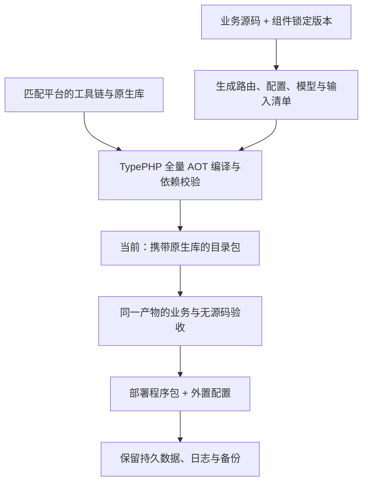

# 构建与部署

构建把应用源码、组件和原生运行依赖组织成可验收的产物。部署维护程序版本、外置配置与持久数据；开发工具及源码留在构建端。

本仓库的 Composer 脚本面向物联中心成品案例，其他应用在自己的项目根执行模板提供的命令。环境准备见[环境与依赖](environment.md)。

## 单程序交付约定

**交付约定：一个主程序文件 + 外置配置文件，启动不释放运行库。** 每个目标平台分别构建自己的程序，外置 `.env` 保存部署配置。PHPX、libphp、Swoole 及其他非系统原生依赖在构建期静态链接进程序；允许使用目标操作系统自带的库。部署人员无需手动安装、拆分或配置这些运行库。该要求尚在[静态链接可行性验证](https://github.com/zoujingli/typeapp/blob/main/docs/development/static-runtime-feasibility.md)阶段。

| 项目 | 交付和维护方式 |
| --- | --- |
| 程序文件 | 包含已编译应用、生产组件、资源及所需原生运行库；Windows 使用 `.exe` |
| 外置配置 | 与程序分开维护，保存部署参数和秘密；升级不覆盖 |
| 数据、上传和日志 | 运行时按需创建，路径以应用目录或明确的数据根为准；切换工作目录不改变目标 |
| 内部运行库 | 构建期核对版本、ABI、许可证和摘要后静态链接；启动不释放 `.so`、`.dylib` 或 `.dll` |

一个程序可按入口运行 HTTP、MQTT 或后台角色，角色间通信与进程/线程/协程仍采用 Swoole。程序文件数量与运行角色数量是不同概念，进程不可用时的执行选择见[系统架构](architecture.md#运行方式与平台)。

## 当前构建状态

**当前 `type package` 生成目录包，`archive` 生成归档，尚未生成上述静态单程序。** 目录包已经收集应用和实际运行依赖，部署时需保留完整布局；不能只复制其中的主程序。

| 已有实现 | 完成单程序还需要 |
| --- | --- |
| 生产输入审计、全量 AOT、原生依赖收集 | PHP、PHPX、Swoole、实际扩展及非系统库形成完整静态链接闭包 |
| 四平台预编译 Swoole 共享模块 | 匹配的静态目标文件或归档，并解决 PHP PDO 与 Swoole 驱动符号冲突 |
| 随包资源、许可证、运行配置及启动脚本 | 资源和许可材料可由程序读取，直接入口不依赖外部启动脚本或内部 ini 文件 |
| 目录包校验、搬迁、备份与恢复入口 | 同一产物在干净机器、只读安装目录及含空格路径中启动，证明无源码、无 SDK、无外部非系统库且不释放运行库 |

现有 `.so`／`.dll` 是可复用的构建输入，不能直接充当静态归档。`bin/`、`lib/` 或压缩包的存在也不能作为单文件完成证据。以下命令描述当前可用流程。

## 构建与交付流程



构建端使用 Composer 与 TypePHP；部署端使用已验证产物。包内只收集目标平台实际需要的依赖，不复制全部平台模块。

## 检查构建环境

工具链版本以当前项目的 `toolchain.lock.json` 为准，生产依赖以 `composer.lock` 为准。准备与目标 OS、架构一致的 SDK 和扩展，再检查构建环境。

构建组件已内置四个平台的 [Swoole 共享模块](plugins/type-build.md#内置-swoole-与运行依赖)，安装包含这些资源的版本后，构建默认校验并复用，无需另行下载、编译 Swoole。它们固定匹配 PHP 8.5.10 ZTS、非 debug、64 位 ABI；只收集所选模块与实际依赖，不要求应用声明整目录资源。PHP SDK、PHPX 和其他原生依赖在构建机准备。

独立应用根执行：

```bash
php vendor/bin/type doctor type-app.json development
php vendor/bin/type doctor type-app.json build
```

本仓库使用 `docs/build-config/type-app.json` 作为构建配置。doctor 检查所选范围的前置条件，不连接业务服务；检测通过不等于应用已编译或运行验收通过。

Linux x64 / ARM64、macOS ARM64、Windows x64 均有原生验证记录。Linux x64 已通过基础命令 AOT 与运行；其余三者已通过三库独立 ORM 的 PHP、AOT 和无源码运行，macOS ARM64 另有完整应用 AOT、三库身份 HTTP 和通信专项结果。具体范围和证据归属见[平台支持表](platforms.md#当前平台状态)。构建、运行库、数据库与停止语义都需要在实际目标环境验证；Docker 或 WSL 中的 Linux 结果不能替代 Windows/macOS 原生结果。

构建维护者为目标平台准备匹配的 SDK 与扩展，并以同一产物完成应用、通信、数据库和无源码部署验收。部署者使用对应平台经过验证的包，具体范围见[平台与验收](platforms.md)。

## 全量编译

物联中心成品案例在本仓库根执行：

```bash
composer typeapp:build
build/app/type-app check
```

独立模板在应用根执行：

```bash
composer build
```

构建将框架、业务、生成配置/路由/模型/操作组合类及实际生产依赖一起交给 TypePHP。新增路由、声明或生产代码都需要重新构建。100% 指完整生产实现的编译覆盖，不等于全部平台已验证。

## 创建当前目录包

物联中心成品案例提供以下入口，目标目录必须尚不存在：

```bash
composer typeapp:package
build/release/run verify-runtime
build/release/run help
```

独立模板用 `composer package`。Windows 使用对应发布目录中的 `run.cmd`。

运行包包含原生应用、资源、所需运行库、身份清单、配置示例及操作手册。PHPX、libphp、Swoole、PDO 等实际非系统依赖由构建收集并随包管理，部署时保留完整布局并执行校验，不需要另装开发 PHP 环境。外部数据库和 Redis 服务仍由部署环境提供。

| 文件或目录 | 用途 |
| --- | --- |
| `release.json` | 目标、构建身份、依赖与文件摘要 |
| `run` / `run.cmd` | 对应平台启动入口 |
| `bin/`、`lib/`、`runtime/` | 应用、实际运行库与受控配置 |
| `config/env.example` | 无秘密的环境示例 |
| `DEPLOY.md`、`OPERATIONS.md` | 发布目录说明与部署、备份、恢复手册 |
| `LICENSE`、`NOTICE`（应用存在时） | 与构建身份绑定的应用原始许可与归属材料 |
| `NOTICES.md` 与程序资源中的材料索引 | 实际依赖的来源、版本、摘要和许可原文 |

应用许可材料在构建时收集，打包时从已校验的产物资源导出，不依赖应用源码仍然存在。修改材料后需要重新构建；打包不会借用构建组件的许可证补空缺。

## 首次启动

将完整运行包放到匹配 OS/架构的服务器，设置应用数据根、数据库、令牌和 Host/代理配置，然后在发布目录执行；Windows 使用对应的 `run.cmd`：

```bash
./run verify-runtime
./run help
```

`verify-runtime` 检查运行身份与实际依赖，不替代业务验收。服务运行前，按应用自己的入口初始化或迁移：通用模板使用 `./run migrate run`；物联中心只允许在空库中使用 `./run app:install`，参数与受控口令环境见[初始化人员账号](iot-center.md#准备后端与人员账号)。物联中心不能用 `migrate run` 代替安装，也不自动清理已有数据库。

完成初始化后执行 `./run serve` 启动 HTTP；后台角色按应用装配独立运行。数据库、日志、上传与秘密配置放在部署环境维护的数据位置。

数据库主机名按部署网络的 DNS 规则解析。若容器网络已注册明确别名 `database`，可设置 `DB_HOST=database.`，末尾点表示不追加 DNS 搜索域；依赖搜索域补全的服务名则保留原有配置。框架不会自动改写主机名。当前 Linux 验收所用的 c-ares 1.27 在带搜索域的封闭网络中可能使短名称连接失败，因此无源码部署验收显式覆盖带搜索域的环境，并使用绝对 DNS 名称连接本轮数据库。

物联中心命令因数据库连接或初始化失败返回 `internal_error` 时，可在受控排障进程中设置 `TYPE_APP_TRACE=1` 后重试。诊断会追加底层 PDO 的 `sqlstate` 和 `driver_code`，用于区分认证、连接与数据库文件错误；不展开 PDO 原始消息、SQL 或连接参数。排障完成后移除该环境变量，HTTP 错误响应仍遵守公开错误契约。

对外提供服务时配置对应的系统服务或监督进程，保留正常排空和资源回收时间，并设置停止的总截止。TLS 可在前置反向代理终止，只信任真实受控代理。

## 物联网角色部署

本仓库的物联网中心标准项目共用完整应用构建，但运行角色分别管理：HTTP、MQTT Broker、数据接收、统计、告警、通知和导出不能用单个 `serve` 命令替代。具体角色、环境键和管理端构建见[物联网中心](iot-center.md)。`type-project` 模板不默认包含这些业务与 Web 资源。

设备 MQTT 与接收角色要求 PostgreSQL 严格同步主备和真实 TLS。先完成业务迁移及 `iot:mqtt-install`，再由角色宿主启动相应入口；`IOT_MQTT_COMMAND` 明确指向同一已验证应用产物。Swoole 原生能力由同一构建及运行包提供。管理 API 三库通过不构成 MQTT 三种存储后端或高可用通过证明。

Broker 接入、持久工作和设备授权均使用 Swoole 官方 Process、Thread 或 Coroutine 管道与网络能力；平台按实际构建能力选择执行方式，不按操作系统名称拒绝通信入口。完整角色隔离、停止和原生验收仍以对应平台产物证据为准，详见[平台与执行方式](communications.md#平台与执行方式)。

每个 Broker 配置唯一稳定节点名，并保留本次运行身份。`iot:mqtt-fence` 只登记精确旧实例已完成的基础设施硬隔离，不能代替断开网络或停止旧主。私有导出目录、WAL、备份、秘密及设备缓存与 Web 静态目录分开管理；所有角色保留有界停止、失败日志与未知结果。

## 升级与恢复

升级生成新的发布目录，保留旧版本及明确的备份。先核对版本、依赖、数据库兼容和迁移计划，再切换服务；切回旧二进制不会自动回滚数据库。

运行包内的 `OPERATIONS.md` 是该产物随附的操作手册，涵盖首次部署、升级、三库备份与恢复，以及不能自动回滚的情况。恢复演练使用新目标并保留原数据，按实际数据库语义验证。

物联网恢复另使用 `iot:recovery snapshot/status/begin/isolate/review/restore`，先隔离旧系统，再依据受信的当前授权快照核对恢复后的身份。恢复门限制新角色启动，不会代替维护人员停止旧进程。管理端仅显示相关状态，不提供绕过核对的一键恢复；旧身份、设备归属和未完成指令不能随数据库回滚自动重新授权。

发布文件摘要需从受信渠道取得。`type verify-package` 接收受信的 `release.json` SHA-256；程序和同一不受信来源的摘要不能互相证明来源可信。

## 验收自己的应用

先执行对应项目的开发检查，再用准确的原生产物运行相同业务行为。核对 HTTP、输入校验、事务、错误与资源清理，并在所选数据库和目标平台完成无源码部署验证。

独立模板提供 `composer test`；它会创建测试用户，须在专用测试数据库运行。开发检查、编译成功和原生业务验收分别记录，不能互相替代。

[返回快速开始](quickstart.md) · [查看组件参考](components.md)。
