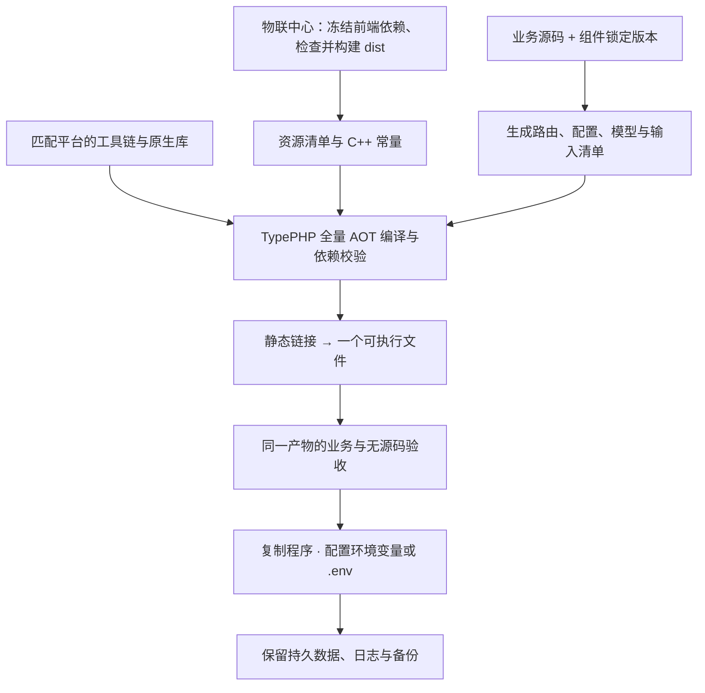
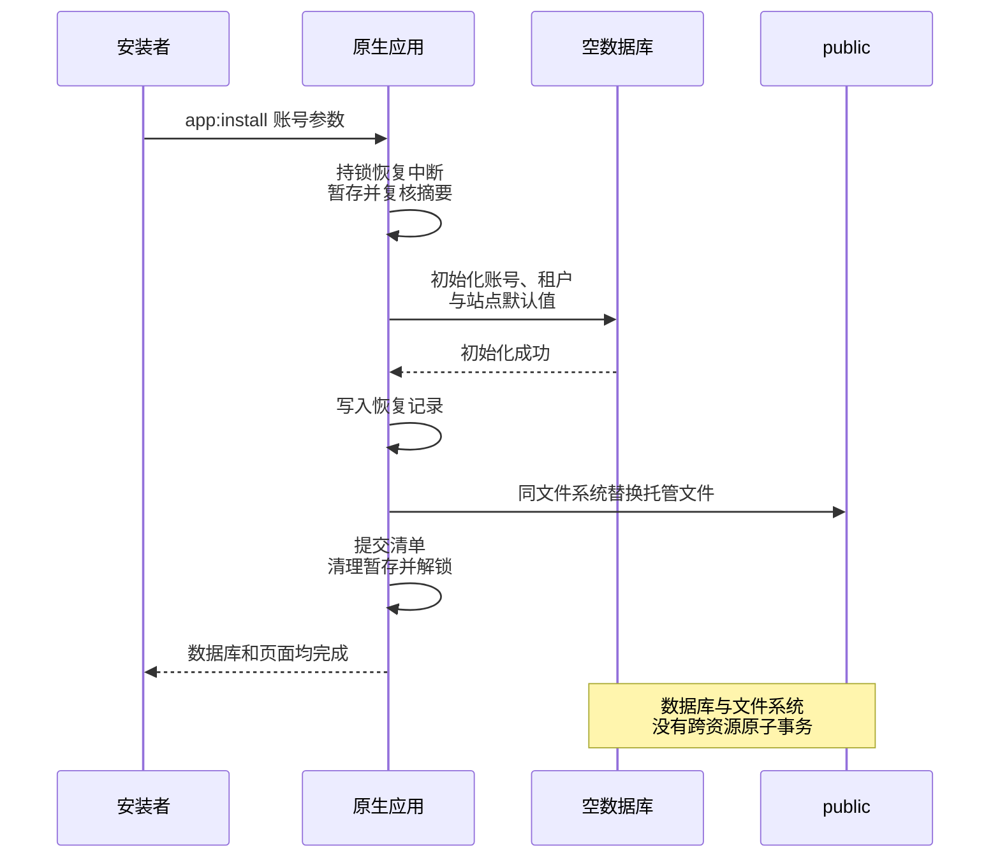

# 构建与部署

构建把应用源码、组件和原生运行依赖组织成可验收的产物。部署维护程序版本、外置配置与持久数据；开发工具及源码留在构建端。

本仓库的 Composer 脚本面向物联中心成品案例，其他应用在自己的项目根执行模板提供的命令。环境准备见[环境与依赖](environment.md)。

## 单程序交付约定

**交付约定：一个主程序文件，配置由部署环境维护，启动不释放运行库。** 每个平台分别构建自己的程序，配置可由环境变量或外置 `.env` 提供。PHP、PHPX、Swoole 及其他非系统原生依赖在构建期静态链接；允许使用操作系统自带的库。Swoole 是程序内部的通信与并发运行库，无需人工安装或启动独立 Swoole 服务。

| 项目 | 交付和维护方式 |
| --- | --- |
| 程序文件 | 包含已编译应用、生产组件、资源及所需原生运行库；Windows 使用 `.exe` |
| 外置配置 | 与程序分开维护，保存部署参数和秘密；升级不覆盖 |
| 数据、上传和日志 | 运行时按需创建，路径以应用目录或明确的数据根为准；切换工作目录不改变目标 |
| 内部运行库 | 构建期核对版本、ABI、许可证和摘要后静态链接；启动不释放 `.so`、`.dylib` 或 `.dll` |

一个程序可按入口运行 HTTP、MQTT 或后台角色，角色间通信与进程/线程/协程仍采用 Swoole。程序文件数量与运行角色数量是不同概念，进程不可用时的执行选择见[系统架构](architecture.md#运行方式与平台)。

## 当前构建状态

主仓的 `type package` 现在只交付一个可执行文件，仍有外置运行库、资源或缺少许可材料时明确拒绝。macOS ARM64 和 Linux ARM64 已有完整应用静态构建、同一程序三库隔离运行结果；macOS 本机候选依赖的最低系统版本为 26。Linux x64、macOS 15 与 Windows x64 的静态应用验收仍待完成，四平台单程序尚未发布。

| 已实现路径 | 验收与边界 |
| --- | --- |
| 静态 SDK、目标头文件和归档摘要校验 | Linux/macOS 源码制备入口已接入；共享模块不能作为静态输入 |
| 全量 AOT、内置 PHP 配置、静态运行身份 | 普通入口和线程应用分别验收；不读部署机 PHP 配置 |
| 页面和许可原文内嵌 | 页面显式安装；`licenses` 直接读取许可材料，不释放运行库 |
| 单文件输出、搬迁、只读目录、无源码隔离 | macOS ARM64、Linux ARM64 三库已有行为结果；其余目标分别验收 |

公开的 `v1.0.0-rc.7` 仍是历史目录归档，须完整解压运行；其旧附件和验收身份保持不变。新候选门禁只接受单程序和三库回执，任一平台未完成就阻止主仓 Release 公开。详细证据见[静态构建验证](https://github.com/zoujingli/typeapp/blob/main/docs/development/static-runtime-feasibility.md)。

## 构建与交付流程


```mermaid
flowchart TB
  Source["业务源码 + 组件锁定版本"] --> Generate["生成路由、配置、模型与输入清单"]
  SDK["匹配平台的工具链与原生库"] --> Compile
  Web["物联中心：冻结前端依赖、检查并构建 dist"] --> Embedded["资源清单与 C++ 常量"]
  Embedded --> Compile
  Generate --> Compile["TypePHP 全量 AOT 编译与依赖校验"]
  Compile --> Package["静态链接 → 一个可执行文件"]
  Package --> Verify["同一产物的业务与无源码验收"]
  Verify --> Deploy["复制程序 · 配置环境变量或 .env"]
  Deploy --> Data["保留持久数据、日志与备份"]
```

构建端使用 Composer 与 TypePHP；部署端只使用目标平台已验证的程序。源码、编译器、SDK、Node.js 和 Composer 留在构建端。

## 检查构建环境

工具链版本以当前项目的 `toolchain.lock.json` 为准，生产依赖以 `composer.lock` 为准。准备与目标 OS、架构一致的 SDK 和扩展，再检查构建环境。

单程序构建通过 `TYPE_STATIC_RUNTIME` 选择目标 SDK 清单，并校验 PHP ABI、目标头文件、归档、源码适配与许可材料。构建组件内的四平台 [Swoole 共享模块](plugins/type-build.md#内置-swoole-与运行依赖)仅继续用于共享库开发及历史回归，不能放进程序冒充静态链接。构建宿主 PHP 与目标静态 PHP 分开校验。

构建维护者可使用以下静态 SDK 制备入口；工作目录须为尚不存在的绝对路径，宿主 `PHP_HOME` 使用锁定的 PHP 8.5.10 ZTS。SDK 仅供构建，不随程序部署。

| 目标 | 制备入口与依赖选择 |
| --- | --- |
| Linux x64 / ARM64，Ubuntu 24.04 | `tools/prepare-static-linux.sh <新工作目录>`；固定源码制备 PHP、PHPX、Redis、Swoole、libpq、curl 与 c-ares，其他依赖取发行版的准确静态归档，逐项记录实际版本和许可材料 |
| macOS ARM64 | `tools/prepare-static-macos.sh <新工作目录> [PostgreSQL17.11静态SDK根目录]`；省略第二参数时从固定源码构建 libpq，提供时核对既有归档。其余非系统依赖使用已校验的 Homebrew 静态库 |

两个入口保留三库与协程 hook，并拒绝摘要或 ABI 不符的输入。macOS 的 `TYPE_STATIC_MINIMUM_MACOS` 默认 `15.0`，所有依赖归档也必须支持该版本；本机已有归档要求 26.0，不能把输出标为 macOS 15 可用。制备成功后仍须完成真实 embed、全量 AOT 和同一程序的部署验收，具体入口见[原生验证](https://github.com/zoujingli/typeapp/blob/main/docs/development/native-command.md)。

独立应用根执行：

```bash
php vendor/bin/type doctor type-app.json development
php vendor/bin/type doctor type-app.json build
```

本仓库使用 `docs/build-config/type-app.json` 作为构建配置。doctor 检查所选范围的前置条件，不连接业务服务；检测通过不等于应用已编译或运行验收通过。

Linux x64 / ARM64、macOS ARM64、Windows x64 已在同一已验收源码基线上通过默认原生 CI，包括完整应用 AOT 与各自的三库场景。Linux x64 另有同一运行包的三库 scratch 无源码、无 SDK 部署；macOS 与 Windows 的主应用、独立模板和搬迁包隔离范围不同，详见[平台支持表](platforms.md#当前平台状态)。应用仍须在自己的目标环境验证运行库、数据库和停止语义，Docker 或 WSL 的 Linux 结果不替代 Windows/macOS 原生结果。

构建维护者为目标平台准备匹配的 SDK 与扩展，并以同一产物完成应用、通信、数据库和无源码部署验收。部署者使用对应平台经过验证的包，具体范围见[平台与验收](platforms.md)。

## 全量编译

物联中心成品案例在本仓库根执行：

```bash
: "${TYPE_STATIC_RUNTIME:?先设置本平台已校验的静态SDK清单路径}"
composer typeapp:build
build/app/type-app check
```

独立模板在应用根执行：

```bash
composer build
```

构建将框架、业务、生成配置/路由/模型/操作组合类及实际生产依赖一起交给 TypePHP。新增路由、声明或生产代码都需要重新构建。100% 指完整生产实现的编译覆盖，不等于全部平台已验证。

物联中心的 `composer typeapp:build` 先冻结安装前端依赖，执行类型检查与构建，再校验入口、许可及资源摘要，最后全量 AOT。`web/dist` 以 `web/` 前缀编入程序；Node.js 与 pnpm 只用于构建。版本发布中前端只构建一次，四个平台消费同一份已校验资源，流程见[版本发布与安装](releases.md)。独立模板与组件不携带这份业务前端。

## 输出一个程序文件

物联中心提供以下入口，目标文件必须尚不存在。打包不重新编译，输出字节与已验收程序一致：

```bash
composer typeapp:package
build/typeapp-iot verify-runtime
build/typeapp-iot help
build/typeapp-iot licenses
```

独立模板用 `composer package`，输出 `build/type-project-release`。Windows 文件保留 `.exe` 后缀，但当前静态 SDK 尚未完成，命令不能用共享 DLL 产物通过验收。

部署只复制程序文件；外置配置与业务数据另行维护。校验摘要由交付渠道提供，`type verify-package <程序文件> <受信SHA256>` 用于构建端离线校验。程序内的 `licenses` 命令输出材料索引，`licenses notices/texts/…` 读取其中登记的原文。许可证声明完整不替代分发方履行相应源码或重链接材料义务。

`package-directory` 和 `archive` 保留给历史共享库产物的回归及维护。这些产物需要完整目录，不能只复制 `bin/app`；不进入新的单程序发布候选。主仓 `tools/build-application.php --shared-development` 显式选择旧开发构建，默认生产构建缺少静态 SDK 时直接失败。

## 首次启动

将已验收的单程序放到匹配 OS/架构和最低系统版本的服务器，下文将程序命名为 `app`。设置应用数据根、数据库、令牌和 Host/代理配置，再执行：

```bash
./app verify-runtime
./app help
```

`verify-runtime` 检查运行身份与实际依赖，不替代业务验收。服务运行前，按应用自己的入口初始化或迁移：通用模板使用 `./app migrate run`；物联中心只允许在空库中使用 `./app app:install`，参数与受控口令环境见[初始化人员账号](iot-center.md#准备后端与人员账号)。物联中心不能用 `migrate run` 代替安装，也不自动清理已有数据库。

静态程序核对内置扩展、实际加载映像与资源摘要，只允许目标系统库。历史目录包的 macOS 审计另外绑定 dyld 共享缓存；该旧限制及排障方式见[环境检查](environment.md#检查与定位)。

完成初始化后执行 `./app serve` 启动 HTTP；后台角色按应用装配独立运行。数据库、日志、上传与秘密配置放在部署环境维护的数据位置。

物联中心首次安装示例（在已配置的空库和应用数据根执行）：

```sh
APP_ADMIN_PASSWORD='至少12字节的管理密码' \
APP_CUSTOMER_PASSWORD='至少12字节的客户密码' \
./app app:install platform-admin '平台管理员' customer-admin '客户管理员' '初始租户'
./app serve
```

安装完成后访问客户登录页 `/#/login` 或平台登录页 `/#/admin/login`。页面与 API 由同一 Swoole HTTP 入口提供，继续执行 Host 和路径校验。部署端不需要另外启动前端开发服务器。

数据库主机名按部署网络的 DNS 规则解析。若容器网络已注册明确别名 `database`，可设置 `DB_HOST=database.`，末尾点表示不追加 DNS 搜索域；依赖搜索域补全的服务名则保留原有配置。框架不会自动改写主机名。当前 Linux 验收所用的 c-ares 1.27 在带搜索域的封闭网络中可能使短名称连接失败，因此无源码部署验收显式覆盖带搜索域的环境，并使用绝对 DNS 名称连接本轮数据库。

物联中心命令因数据库连接或初始化失败返回 `internal_error` 时，可在受控排障进程中设置 `TYPE_APP_TRACE=1` 后重试。诊断会追加底层 PDO 的 `sqlstate` 和 `driver_code`，用于区分认证、连接与数据库文件错误；不展开 PDO 原始消息、SQL 或连接参数。排障完成后移除该环境变量，HTTP 错误响应仍遵守公开错误契约。

对外提供服务时配置对应的系统服务或监督进程，保留正常排空和资源回收时间，并设置停止的总截止。TLS 可在前置反向代理终止，只信任真实受控代理。

## 前端安装与更新

物联中心把已构建页面编入程序，**只在显式安装时写出静态文件，普通启动不释放资源**。目标固定为应用根的 `public/`，可通过既有 `APP_BASE_PATH` 选择持久运行根，切换当前工作目录不改变目标。`var/web-install/` 保存私有清单、互斥锁和恢复记录，不作为静态目录公开。

| 命令 | 行为 |
| --- | --- |
| `./app app:install …` | 校验并暂存页面，初始化空库与双端账号，再提交页面安装 |
| `./app web:install` | 只安装页面；相同内容重复执行成功，不同内容拒绝覆盖 |
| `./app web:install --dry-run` | 输出 `actions.add/replace/delete` 和 `conflicts`，不写目录、锁或文件 |
| `./app web:install --dry-run --force` | 预览强制更新的新增、替换与删除 |
| `./app web:install --force` | 更新内置路径，清理旧清单中的过期资源，保留上传等非托管内容 |

历史 RC7 目录包将 `./app` 换为 `./run`，Windows 旧包使用 `run.cmd`；不要混用两种产物布局。升级先停止旧 HTTP 服务、核对新运行包和数据库兼容，再预览、更新页面并启动新程序；避免升级期间旧页面与新 API 混用。

在新运行包目录中执行页面更新，沿用原应用根与外置配置：

```bash
set -eu
./app verify-runtime
./app web:install --dry-run
# 核对变更路径后，预览并执行强制更新。
./app web:install --dry-run --force
./app web:install --force
./app serve
```

安装命令输出 JSON。`actions.add`、`actions.replace`、`actions.delete` 分别列出新增、替换和删除的托管路径；`generation` 标识程序内的这一组资源。未加 `--force` 的预览通过 `conflicts` 列出已有但内容不同的文件，**预览成功不表示没有冲突，也不表示已经安装**。实际安装成功才返回 `ready: true`；相同内容再次安装时，三类变更列表为空。


```mermaid
sequenceDiagram
  participant Operator as 安装者
  participant App as 原生应用
  participant DB as 空数据库
  participant Public as public
  Operator->>App: app:install 账号参数
  App->>App: 持锁恢复中断<br/>暂存并复核摘要
  App->>DB: 初始化账号、租户<br/>与站点默认值
  DB-->>App: 初始化成功
  App->>App: 写入恢复记录
  App->>Public: 同文件系统替换托管文件
  App->>App: 提交清单<br/>清理暂存并解锁
  App-->>Operator: 数据库和页面均完成
  Note over DB,Public: 数据库与文件系统<br/>没有跨资源原子事务
```

写入前保全旧文件，不先清空 `public/`。中断后下一次安装持锁恢复；发现恢复记录之外的文件变动会停止并保留现场。若数据库已完成而页面失败，命令明确报告部分完成，执行 `web:install --force` 修复，不重复初始化数据库。只读目录需在安装阶段由部署者提供正确写权限，服务启动不会自动改权或修复页面。

| 安装反馈 | 处理方式 |
| --- | --- |
| 已有文件内容不同 | 用 `web:install --dry-run` 核对路径；确认更新托管页面后执行 `web:install --force` |
| 前端安装正在进行 | 等待当前安装进程结束后重试；保留安装锁文件，由程序管理互斥 |
| 有待恢复事务 | 保留 `var/web-install/` 及其暂存内容，先执行 `web:install`；恢复后若仍有版本冲突，再按预览结果强制更新 |
| 数据库初始化已完成，前端安装失败 | 修复目录权限或文件冲突后，只执行 `web:install --force`；不再次运行 `app:install` |
| 暂存与公开目录不在同一文件系统 | 调整应用根的挂载布局，使 `public/` 与 `var/web-install/` 位于同一文件系统，再重试 |
| 内嵌资源摘要不一致 | 停止安装，核对 Release 下载摘要并恢复完整、匹配版本的运行包；`--force` 不会跳过摘要校验 |

静态服务仅允许程序清单登记的文件，支持 GET/HEAD、MIME、ETag 和缓存：入口页要求重新校验，`assets/` 使用长缓存。Hash 路由由浏览器处理，API 和未知路径不会回退成首页；`public/uploads` 中的非托管文件也不会因此自动公开。缺少页面或版本不匹配时，启动提示安装修复命令。

## 物联网角色部署

本仓库的物联网中心标准项目共用完整应用构建，但运行角色分别管理：HTTP、MQTT Broker、数据接收、统计、告警、通知和导出不能用单个 `serve` 命令替代。具体角色、环境键和管理端构建见[物联网中心](iot-center.md)。`type-project` 模板不默认包含这些业务与 Web 资源。

设备 MQTT 与接收角色要求 PostgreSQL 严格同步主备和真实 TLS。先完成业务迁移及 `iot:mqtt-install`，再由角色宿主启动相应入口；`IOT_MQTT_COMMAND` 明确指向同一已验证应用产物。Swoole 原生能力由同一构建及运行包提供。管理 API 三库通过不构成 MQTT 三种存储后端或高可用通过证明。

Broker 接入、持久工作和设备授权均使用 Swoole 官方 Process、Thread 或 Coroutine 管道与网络能力；平台按实际构建能力选择执行方式，不按操作系统名称拒绝通信入口。完整角色隔离、停止和原生验收仍以对应平台产物证据为准，详见[平台与执行方式](communications.md#平台与执行方式)。

每个 Broker 配置唯一稳定节点名，并保留本次运行身份。`iot:mqtt-fence` 只登记精确旧实例已完成的基础设施硬隔离，不能代替断开网络或停止旧主。私有导出目录、WAL、备份、秘密及设备缓存与 Web 静态目录分开管理；所有角色保留有界停止、失败日志与未知结果。

## 升级与恢复

升级生成新的发布目录，保留旧版本及明确的备份。先核对版本、依赖、数据库兼容和迁移计划，再切换服务；切回旧二进制不会自动回滚数据库。

[运维手册](https://github.com/zoujingli/typeapp/blob/main/plugin/type-build/docs/operations.md)涵盖三库备份、恢复和不能自动回滚的情况；其中目录包启动与监督脚本仅适用于旧交付布局。恢复演练使用新目标并保留原数据，按实际数据库语义验证。

物联网恢复另使用 `iot:recovery snapshot/status/begin/isolate/review/restore`，先隔离旧系统，再依据受信的当前授权快照核对恢复后的身份。恢复门限制新角色启动，不会代替维护人员停止旧进程。管理端仅显示相关状态，不提供绕过核对的一键恢复；旧身份、设备归属和未完成指令不能随数据库回滚自动重新授权。

发布文件摘要需从受信渠道取得。`type verify-package` 对单程序接收程序 SHA-256，对历史目录包接收 `release.json` SHA-256；程序和同一不受信来源的摘要不能互相证明来源可信。

## 验收自己的应用

先执行对应项目的开发检查，再用准确的原生产物运行相同业务行为。核对 HTTP、输入校验、事务、错误与资源清理，并在所选数据库和目标平台完成无源码部署验证。

独立模板提供 `composer test`；它会创建测试用户，须在专用测试数据库运行。开发检查、编译成功和原生业务验收分别记录，不能互相替代。

[返回快速开始](quickstart.md) · [查看组件参考](components.md)。
