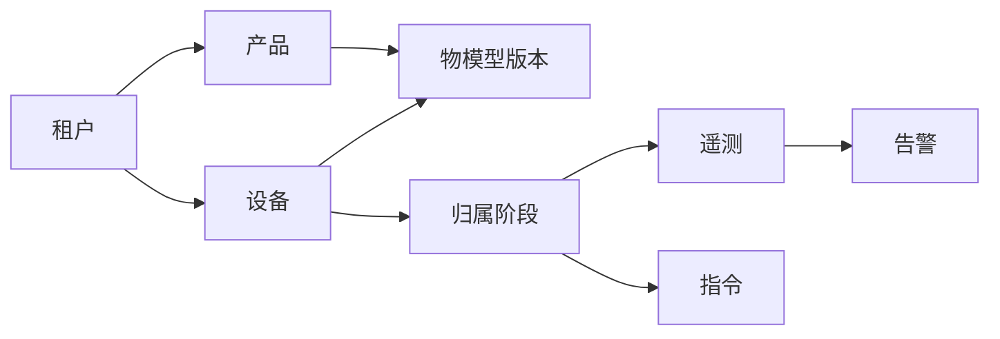
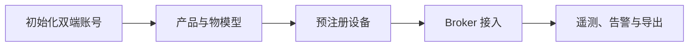
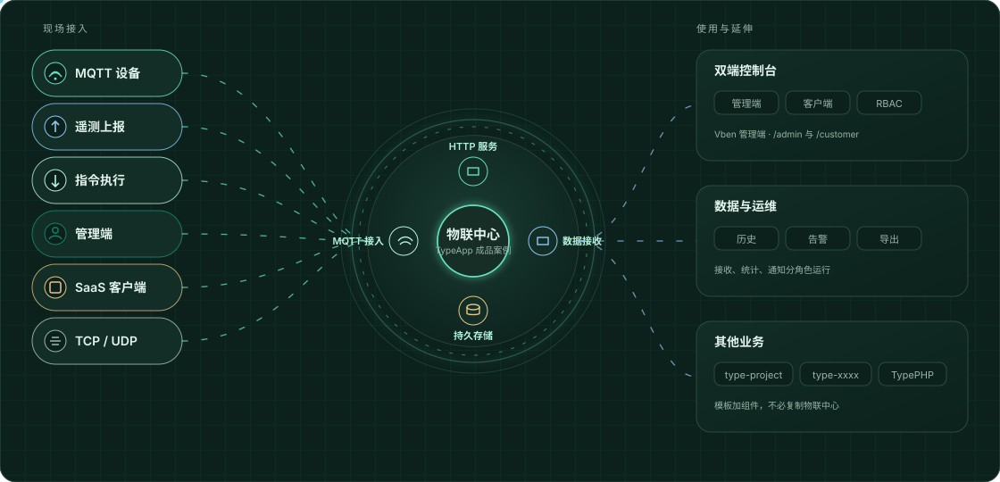
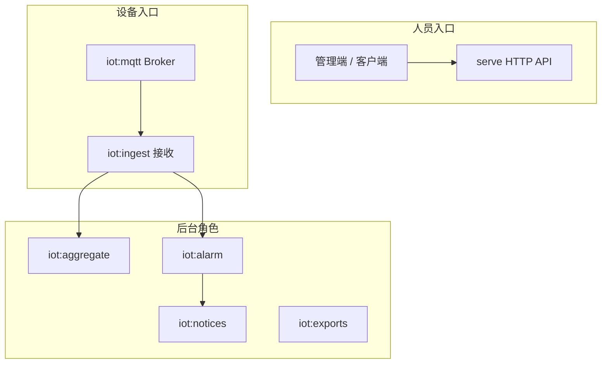
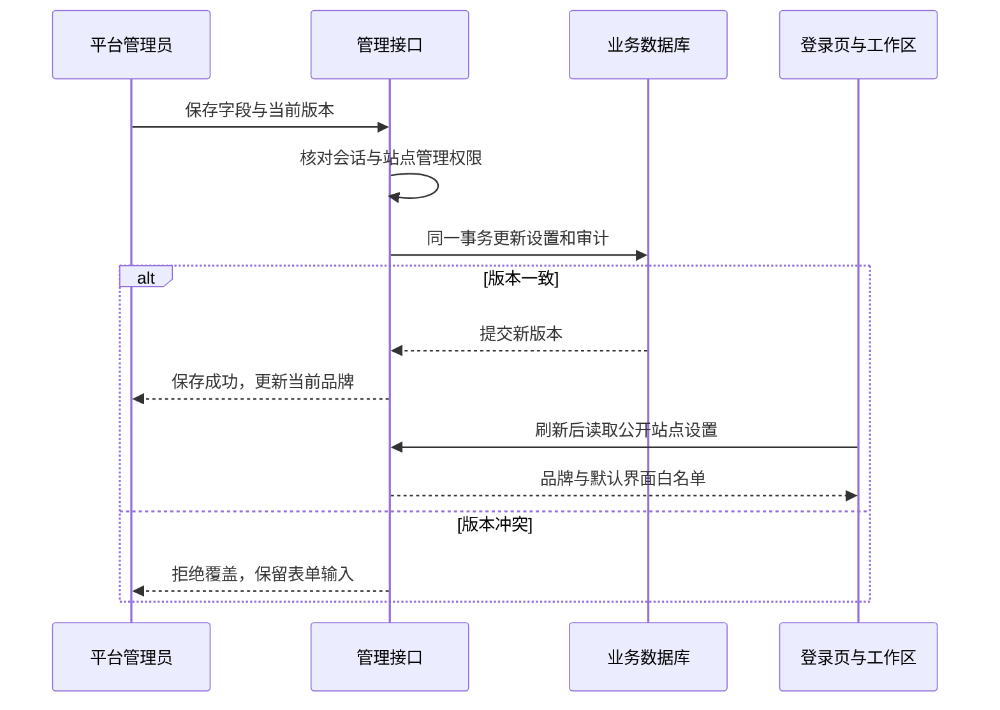
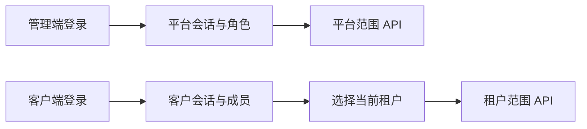
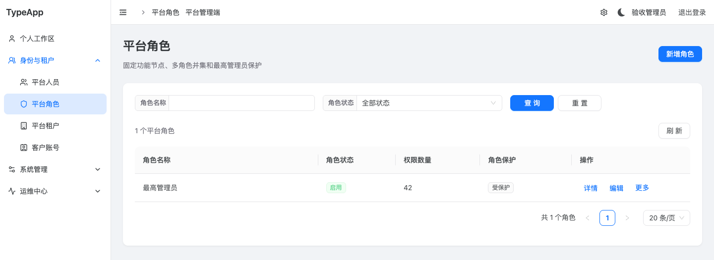
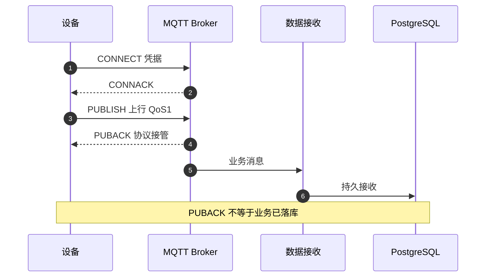
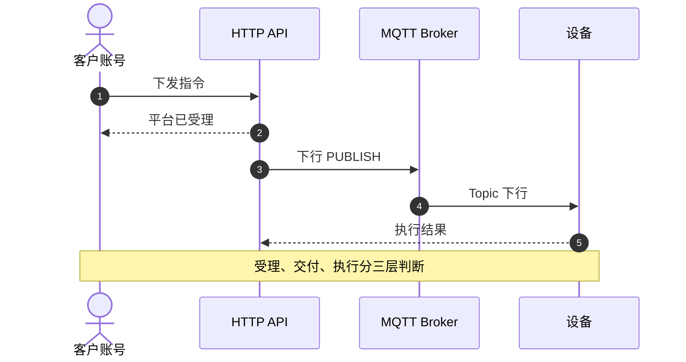

# 物联网中心

物联中心是基于 TypeApp 构建的成品案例，通过框架组件组织物联网业务，以 TypePHP 编译生产实现，原生运行库随应用交付。框架开发文档在侧栏「TypeApp 框架」和「开发指南」；职责分层见[系统架构](architecture.md)，本页说明案例的业务、使用契约和交付边界。

本案例提供两个人员入口：平台管理端面向平台人员，维护账号、租户、站点与全局观察；SaaS 用户端面向客户账号，在当前租户内管理成员、产品、设备、数据与告警。设备经独立 MQTT Broker 接入，遥测由独立接收进程落库，统计、告警、通知和导出分角色运行。MQTT 标准、高可用、目标容量与真实设备按对应产物和平台证据分别验收。

## 能力范围

| 范围 | 当前提供 | 边界 |
| --- | --- | --- |
| 平台管理端 | 平台人员与角色、客户账号、租户工作区、站点品牌、系统配置、设备资产观察、Broker 观察与审计 | 平台身份不会自动获得租户内的客户权限 |
| SaaS 用户端 | 租户成员与角色、产品与物模型、设备生命周期、指令、历史、告警、站内通知、CSV 导出、设备转移 | 必须选择当前租户；不能靠 URL 或请求头扩大范围 |
| 设备接入 | MQTT 5、TLS、QoS 1；独立 Broker 与数据接收；设备凭据、Topic 与归属阶段 | 持久设备路径要求 PostgreSQL 严格同步主备；执行方式按 Swoole 实际构建能力选择 |
| 数据与运维 | 原始历史、分钟统计、告警规则、导出任务、WAL/备份/恢复核对 | 各角色须分别监督启动，不能用单个 `serve` 代替 |



租户拥有产品、设备和业务数据。产品通过已发布的物模型版本解释设备属性、事件和指令。设备同一时刻只归属于一个租户；转移后形成新的归属阶段，旧历史留在源租户。

## 如何装配 TypeApp

本案例按需组合 Plugins，不把物联网规则写进框架组件。

| TypeApp 能力 | 本案例用法 |
| --- | --- |
| Swoole | 通信与基础并发的必需底层；人员生产 HTTP API 已走原生线程与协程，Broker 尚需收敛内部通信路径 |
| TypePHP | `app/`、组件与生产依赖全量编译；前端先构建为静态资源，再作为原生常量链接进程序 |
| `type-core` / `type-runtime` | HTTP PSR 链、命令入口、作用域与资源预算 |
| `type-orm` 与驱动 | 管理 API 可用 MySQL、PostgreSQL、SQLite；设备持久接收只用 PostgreSQL |
| `type-mqtt` | 独立 Broker 进程，不由 `serve` 内嵌 |
| `type-redis` | 通知与导出的专用连接；通用缓存默认关闭 |
| Vben Admin Pro | `web/` 双端控制台，走 `/admin` 与 `/customer` |

其他业务不要改写这份 `app/` 冒充新产品，应使用 `type-project` 创建独立应用后再安装所需组件。

## 建议阅读顺序

1. 先看能力范围和业务架构，确认本案例覆盖哪些角色。
2. 按准备后端创建双端账号，再启动 HTTP 与管理端。
3. 在客户端创建产品、发布物模型、预注册设备，再按设备接入契约连 Broker。
4. 需要持久遥测、告警或导出时，分别启动接收与后台角色。
5. 上线前阅读进程清单和当前验收边界，不要把页面存在或编译成功当成完整交付。



## 业务架构

<figure class="orbit-diagram" data-src="../assets/iot-architecture.svg">
  
  <figcaption>左侧是设备、人员与自定义接入；中间是本案例的 MQTT、HTTP、接收与存储；右侧是双端控制台、数据运维。示意图不是云厂商或大模型集成声明。</figcaption>
</figure>

## 运行角色



各角色来自同一应用入口，生产须分别监督启动；不能用单个 `serve` 代替 Broker 与接收。

## 源码布局

本案例业务源码在 `app/`，管理端在 `web/`。组件仍在 `plugin/type-*`，由 Composer 组合，不反向依赖本案例。

```text
app/
  main.php                    原生应用入口
  common/                     配置、身份、RBAC、审计与跨端入口
  admin/                      平台管理端控制器与服务
  broker/                     Broker 管理与节点控制器
  iot/                        租户、产品、设备、数据与运维
web/                          Vben Admin Pro 管理端
config/                       应用、数据库与路由声明
docs/build-config/type-app.json  本案例构建配置
```

| 目录 | 当前责任 | 关键入口 |
| --- | --- | --- |
| `app/common` | 启动配置、数据库、认证、RBAC、审计、共享中间件与控制器 | `Application`、`Settings`、`AuthController`、`RoleService` |
| `app/admin` | 平台人员、角色、租户、站点与配置 API | `AdminController` |
| `app/iot` | 租户业务、设备、数据、告警、导出与恢复 | `app/iot/controller`、`app/iot/service` |
| `app/broker` | Broker 节点、资源、接入授权、审计和管理 API | `BrokerController`、`AccessController`、`NodeAccess` |
| `web` | 管理端静态资源和业务页面 | Vben Admin Pro 应用 |

## 准备后端与人员账号

以下步骤用于源码开发：准备 PHP CLI `>=8.4 <8.6`、Composer、匹配的 Swoole 与所选数据库的 PDO 扩展。框架已接入 Swoole，原生构建默认复用构建组件内置的匹配模块；生产部署使用完整运行包，无需安装 Composer 或编译 SDK，分工见[环境与依赖](environment.md)。在仓库根安装依赖并准备空数据库：

```bash
git clone https://github.com/zoujingli/typeapp.git
cd typeapp
composer install --no-scripts --no-plugins
cp -n .env.example .env
composer web:build
composer typeapp:prepare
```

管理 API 支持 MySQL、PostgreSQL、SQLite；持久设备接入与接收进程要求 PostgreSQL 严格同步主备。只体验管理页面时，不必把默认 SQLite 当作 MQTT 存储。

在仓库根读取命令帮助，并在空库中一次性创建两类初始账号：

```sh
php bin/typeapp help
APP_ADMIN_PASSWORD='至少12字节的管理密码' \
APP_CUSTOMER_PASSWORD='至少12字节的客户密码' \
php bin/typeapp app:install platform-admin '平台管理员' customer-admin '客户管理员' '初始租户'
```

`app:install` 只接受空数据库；管理口令和客户口令由受控进程环境提供，长度为 12–72 字节，不写入 `.env`、命令参数或日志。安装先暂存并验证页面，再建立平台角色目录、客户初始租户和两套独立会话域，最后安装页面到应用根的 `public/`。数据库成功但页面失败时单独报告，通过 `web:install --force` 修复；后续账号、角色和成员由各自端的 RBAC 接口管理。

平台人员通过 `/admin/auth/login` 登录，管理平台人员、客户账号、租户、设备资产、站点展示设置和运行配置；客户人员通过 `/customer/auth/login` 登录，选择自己所属的租户后管理成员、角色和物联业务数据。两套令牌、密码、会话和权限完全隔离，API 每次请求重新验证当前角色和租户关系。

全新安装会在数据库中保存站点设置，不需要先进入页面逐项填写。管理端“系统管理 → 站点设置”（`/#/admin/site`）维护名称、官网、Logo 地址、说明和默认界面；“系统配置”维护进程启动参数，两者分别生效。官网链接指向项目文档，不会改写本机 API 或设备接入地址。

| 初始化内容 | 默认值与用途 |
| --- | --- |
| 站点名称、官网、说明 | `TypeApp`、`https://iots.top`、物联中心管理平台 |
| Logo | 地址留空，Vben 品牌区域显示站点名称；自定义图片加载失败时使用原生头像回退 |
| 界面 | 浅色、主题色 `#1677ff`、圆角 `0.5`、侧栏导航、侧栏展开、圆润导航、启用面包屑；标签页和页脚默认关闭 |
| 时区记录 | `Asia/Shanghai`；当前业务时间和历史导出仍按浏览器时区，不应把此字段的保存视为已统一时间显示 |
| 平台账号与角色 | 安装命令指定的一个平台账号，绑定受保护的最高管理员角色 |
| 客户账号与租户 | 安装命令指定的一个客户账号、一个租户及其成员关系；客户绑定该租户最高管理员 |
| 租户预设角色 | 最高管理员、操作员、只读成员；后两者初始仅含个人工作区权限，业务权限需管理员分配 |
| 业务数据 | 不预置虚拟产品、设备、遥测、告警或演示客户；这些列表首次打开为空，需要按实际业务创建或接入 |

初始账号名、显示姓名、租户名由安装命令指定，密码由受控环境提供，没有通用默认密码。安装只接受空库，不会重置已有站点或替换已有业务数据。

未登录页面通过 `GET /public/site` 读取公开白名单；管理设置通过 `/admin/site` 读写，检查权限与版本并在同一事务内记录变更字段。保存成功后当前页面品牌立即更新，其他浏览器在刷新后读取最新设置；版本冲突保留输入并提示人工核对后刷新。页面标题由当前页面、站点名称和备案名称“物联开源分享”组成。



个人界面偏好保存在当前浏览器，按身份域、账号及模拟来源隔离；个人资料页可恢复本次加载的站点默认值。当前仍需完善跨页面刷新后的默认值与个人覆盖合并、Vben 设置面板的重置行为以及统一时区消费。站点尚无独立的备案号、联系信息或页脚文案管理字段，页脚仅使用站点名称和官网，不能把“页脚开关”理解为完整网站信息管理。

## 账号域与授权

管理端和客户端是两个独立的账号域，不能用请求头互相切换，也不能把其中一个域的权限当作另一个域的权限。

| 账号域 | 登录入口 | 管理范围 | 权限来源 |
| --- | --- | --- | --- |
| 管理端（admin） | `POST /admin/auth/login` | 平台用户、平台角色、固定菜单、客户端租户、管理配置、审计与 Broker 观察 | 管理端角色目录与平台范围授权 |
| 客户端（customer） | `POST /customer/auth/login` | 当前用户可见租户、成员、客户角色、产品、物模型、设备、数据、告警、导出与操作记录 | 客户角色、成员关系与当前租户 |



登录成功后的 `GET /admin/auth/me` 或 `GET /customer/auth/me` 返回当前用户、权限、菜单、固定目录和身份上下文。客户可以拥有多个租户，必须明确选择当前租户；管理端身份不会因为创建或查看租户而自动获得该租户的客户权限。

管理端可以为平台用户和客户用户维护账号、角色、状态、密码和会话，也可以设置租户管理员。删除、禁用、改密和撤销会话都在服务端重新校验当前权限，并使用版本字段拒绝陈旧写入。客户端只能在当前租户范围内维护成员和角色，不能通过修改 URL、`X-Tenant-Id` 或请求体扩大范围。

RBAC 的权限节点和菜单是代码中的固定目录，由 `app\common\service\RoleService` 提供。前端菜单用于导航和隐藏无权操作，真正的授权发生在每个 HTTP 请求的中间件、控制器和业务服务中；隐藏按钮不是安全边界。

- 管理端固定分组：个人工作区、身份与租户（平台人员、平台角色、平台租户、客户账号）、系统管理（站点设置、系统配置）、运维中心（设备资产、操作审计、运行概览、Broker 资源与授权）。
- 客户端固定分组：个人工作区、组织与成员（我的租户、租户成员、租户角色）、物联管理（产品管理、设备管理、设备转移）、数据与告警（历史数据、告警规则、告警中心、站内通知）、运维中心（操作审计、运行概览、Broker 资源与授权）。
- 租户业务节点必须带租户标识，服务层根据当前身份和成员关系重新查询归属；平台范围的节点不复用客户范围的权限。
- 模拟身份拥有独立上下文、期限和审计记录，结束或过期后不会把权限合并回本人会话。

菜单按功能分组，不把所有页面平铺到一级。`web/` 使用锁定的 Vue Vben Admin 5.6.0 `BasicLayout`、菜单、主题和偏好机制；业务表格与表单主要直接使用 Ant Design Vue，仍有 `CrudSearchField`、`CrudTableActions`、`AppDrawer` 等应用封装。当前是已接入 Vben 布局的业务应用，尚未完全达到项目规定的原生表单、表格、抽屉及用户入口复用标准。菜单分组与路由层级也需继续对齐，才能保持完整的分组面包屑和详情父级关系。



图示来自 `v1.0.0-rc.5` macOS ARM64 原候选的隔离验收，页面由程序内资源安装后提供。图中使用专用测试账号，临时新增角色已在 CRUD 验收后删除；不是预置演示账号或生产数据。实际菜单和操作由登录身份与权限决定。

## 启动管理端

使用原生运行包时，首次 `app:install` 已从程序内安装管理端；直接启动 `./run serve`，访问 `/#/login` 或 `/#/admin/login`。升级使用 `./run web:install --dry-run --force` 预览，再执行 `./run web:install --force`。命令不会重置账号、站点设置或上传文件；完整步骤和恢复规则见[前端安装与更新](deployment.md#前端安装与更新)。

前端开发和构建使用 Node.js 20.19 以上和 `pnpm@10.28.2`，它们不是原生后端的运行依赖。以下命令从仓库根执行：

```sh
pnpm --dir web install --frozen-lockfile
IOT_API_ORIGIN=http://127.0.0.1:9501 pnpm --dir web dev
```

后端需另行启动：

```bash
composer typeapp:serve
```

默认 HTTP 监听 `127.0.0.1:9501`。也可用 `php bin/typeapp serve`。前端监听 `127.0.0.1:5173`，将 `/admin`、`/customer` 及业务 API 代理到指定后端。`IOT_API_ORIGIN` 只用于开发服务器；生产静态资源和 API 配置同源 HTTPS。`pnpm --dir web build` 只生成 `web/dist`，不部署或替换本地站点。

页面使用统一的搜索字段、表格行操作、列宽和右侧抽屉，列表默认 20 条、最多 100 条。主题与亮暗模式遵循 Vben 偏好，窄屏保留操作入口；异步提交防重，危险操作需要明确确认。切租户取消旧请求，旧响应不能覆盖当前页面。

## 页面与使用顺序

管理端和客户端使用 Hash 路由，平台个人工作区为 `/#/admin/profile`，客户默认入口为 `/#/profile`；设备、告警和数据详情从所属分组列表进入，不占独立一级菜单。

| 页面 | 使用方式 |
| --- | --- |
| 我的租户、成员管理 | 选择成员租户，维护角色 |
| 平台租户 | 平台管理员维护平台租户目录；不代替成员租户选择 |
| 产品管理、物模型版本 | 创建产品，编辑模型草稿并发布不可变版本 |
| 设备管理、设备详情 | 预注册、交付凭据，查看连接、当前数据与缓存，管理生命周期、模型切换和指令 |
| 设备转移 | 双方审批后冻结、排空、隔离旧身份并完成新归属确认 |
| 历史数据 | 查询原始记录、分钟统计与曲线，管理 CSV 导出任务 |
| 告警规则、告警中心、站内通知 | 发布规则，处理告警确认并查看触发或结束通知 |
| 运行概览、平台运行 | 分别查看当前租户与平台范围的运行观察及恢复隔离门状态 |
| 操作审计 | 按当前权限查询脱敏操作记录 |
| 站点设置、系统配置 | 平台维护站点品牌与默认主题；运行配置继续按独立的保存、校验和重启生效规则管理 |
| Broker 审计 | 独立、平台或当前租户范围分别查询，详情区分事件阶段与操作当前结果 |

产品、模型与设备属于租户。模型先编辑草稿，再发布版本；发布后不原地修改结构。预注册设备必须选择该产品的已发布版本。注册或轮换仅当次返回密码及精确 Topic，请及时通过受控渠道交付；普通列表和详情无法找回秘密。

设备首次完整成功连接后激活。生命周期的未激活、启用、禁用、退役，与在线、离线、未知以及数据新鲜度分别展示。没有新观察时保留未知或过期状态；浏览器断网不证明设备离线。禁用会撤销旧凭据，重新启用不会恢复它；退役为终态，保留期内历史仍按原权限查询。

轮换、吊销、禁用或退役提交后，旧授权可能显示“待完成”。这表示 Broker 尚未完成旧连接、会话和持久工作的隔离，不能按 HTTP 受理成功提前认定撤权完成。秘密响应丢失时先刷新核对，不能通过自动重试重复生成新凭据。

## 设备接入与确认

独立 Broker 的协议契约见 [type-mqtt](plugins/type-mqtt.md)。物联网业务固定使用 MQTT 5、TLS 和 QoS 1，JSON 业务载荷与通用 Broker 的二进制能力分开。客户端必须验证证书链与服务端身份。

| 设备连接字段 | 契约 |
| --- | --- |
| Client ID | 预注册的设备标识 |
| Username | `设备标识:凭据标识` |
| Password | 当次交付的 64 位小写十六进制随机秘密 |
| Keep Alive / Session Expiry | 30 秒 / 86400 秒 |
| 上行 Topic | `iot/{tenant}/devices/{device}/epochs/{ownership}/up` |
| 下行 Topic | `iot/{tenant}/devices/{device}/epochs/{ownership}/down` |

使用注册响应返回的归属与 Topic，不猜测另一设备或旧归属的地址。设备以稳定业务标识持久缓存待确认数据；MQTT PUBACK 只说明 Broker 的协议接管，收到平台业务持久接收回执后才清理对应缓存。超时、重复和重连沿用原标识；事件、重复和乱序数据不会伪装成新的实时遥测。



“设备详情”从三个独立层次显示指令：平台受理、MQTT 交付、设备执行。在线单次指令使用原 60 秒期限；期限内无结果保持等待，到期仍无结果才显示未知，不推断成功或失败。响应丢失可用同一标识确认原受理；设备必须持久去重，不能把重投当作第二次动作。主动对账是独立结果查询，也不能重新执行动作。



模型切换同样等待设备明确确认其支持并持久应用目标版本。请求受理后暂停新控制，超时继续原切换，不能提前修改设备绑定；旧缓存和历史仍按原模型版本解释。

## 数据、告警与导出

原始历史保留 7 天，分钟统计独立保留 90 天。曲线支持 `count/min/max/sum/avg/last` 六项统计和最多 2000 点，显示实际时间粒度与当时模型单位；页面时间采用浏览器时区。旧原始记录到期不代表统计同时删除。

告警规则针对单个数值属性配置上下限、恢复回差和连续三次样本判断，发布新版本保留旧规则语义。确认表示人员已知悉并登记确认，数值恢复另行判断。站内通知保留触发或结束时的租户与规则版本，跳转原告警；规则停用或设备退役不会伪造数值恢复。

历史页内创建异步 CSV 导出任务，支持进度、取消、恢复和下载，没有独立导出菜单。文件保留 24 小时，每次下载重新检查当前权限；撤权后不能继续使用旧下载地址。导出目录是私有存储，不作为静态站点目录。

## 转移与恢复

临时支持授权已从当前应用移除，管理端不再提供支持授权的创建、进入与撤销入口。旧客户端继续携带 `X-Support-Id` 等旧身份请求头时会被服务端拒绝。

设备转移从双方审批开始，依次进入 `frozen → isolating → activating → completed`。源归属冻结后仍需排空缓存、处理未知指令、证明旧身份隔离，再受控交付新凭据并等待设备持久确认。目标租户不会提前获得源历史；旧历史留在源租户，新数据使用新归属。

恢复由维护人员通过 `iot:recovery` 执行，管理端没有可直接恢复数据库的页面。先停止旧系统并完成网络及基础设施隔离，再按受信的当前授权快照核对，依次进行 `begin/isolate/review/restore`。恢复门会限制应用角色启动，但不会替操作者停止已经运行的旧进程，也不自动删除旧数据或重新开放全部权限。

## 进程与维护入口

所有角色来自同一个应用入口。以下为角色清单，不是一段可以不经配置直接启动的脚本；生产使用已验证的原生产物或运行包入口替换 `php bin/typeapp`。

| 角色 | 用途及前置条件 |
| --- | --- |
| `serve` | 人员与租户 HTTP API；先通过 `app:install` 完成空库安装 |
| `iot:mqtt-install` | 显式安装 MQTT 持久表，并取得同步提交证明 |
| `iot:mqtt` | 独立 Broker；使用 Swoole Server 与 Process/Thread/Coroutine 角色能力；准备真实 TLS、PostgreSQL 同步主备、唯一节点身份和 worker 命令 |
| `iot:ingest` | 独立数据接收；准备单独服务凭据与 TLS CA |
| `iot:aggregate`、`iot:alarm`、`iot:notices` | 分别执行统计、告警和通知的有界批次；由部署调度重复运行 |
| `iot:exports`、`iot:exports-work` | 分别按步数或有界时间执行导出后台任务，需专用 Redis 和私有目录 |
| `iot:device state/enqueue/send/listen/transfer` | 受控设备模拟器，使用独立持久缓存；不代表真实固件已验收 |
| `iot:mqtt-statistics`、`iot:mqtt-nodes` | 读取持久配额及节点观察，失败或未知不能当作零 |
| `iot:mqtt-fence` | 登记精确节点及运行代次已完成的硬隔离，可追加原操作ID；不执行基础设施隔离 |
| `iot:mqtt-fence-result` | 按原操作ID查询同步隔离结果；查不到或资源未确认时继续未知，不重发隔离 |
| `iot:wal`、`iot:backup`、`iot:recovery` | WAL 归档、备份保留和恢复核对；具体参数先看当前 `help` |

`iot:history-clean`、`iot:aggregate-clean`、`iot:notices-clean`、`iot:exports-clean`、`app:audit-clean`、`iot:command-clean` 是各自有界清理入口。按 `help` 提供批次与续扫参数，不把一次批次完成当作所有积压已经处理。

Broker 操作事件保留180天，复用人员审计、服务端筛选与有界分页。租户查询每页及详情重验 `audit.read` 与 `broker.read`；在线修改接入主体、凭据代次和 Topic 授权另需 `broker.write`。平台身份不自动获得租户控制权。到期清理不删除异步操作事实、去重凭据、隔离、撤权或恢复依据。未知操作用原 ID 对账，不能仅凭日志缺失或命令非零退出认定动作未执行。

完整配置在 `config/app.php` 与 `.env.example`。应用必须使用匹配的 Swoole 原生扩展；Broker、客户端、持久 worker 和设备授权直接使用 Swoole 官方通信与并发能力，不再配置网络驱动选择。设备 10000、服务 100、物理连接 10100 及会话 20000 是配置预算，尚不是目标负载通过证明。通知和导出各自配置 Redis，缓存开启与否不替代这两个后台角色的依赖。

## 当前验收边界

已有本机 PHP、全量 AOT、无源码运行包及多项真实数据库和 MQTT 局部验证。独立候选的 MQTT 首轮出现重复回执数不匹配和接收 `internal_error`；同产物一次复验通过，但首轮原因未解释，原候选仍记失败。双设备 90 秒混合负载也未通过，不能把编译成功、三库管理 API 或某个协议专题通过合并成完整交付结论。

MQTT 全部适用标准、Linux x64 环境、独立故障域、受控旧主硬隔离、目标容量与真实设备验收仍需完成。自行组合时锁定实际源码、依赖、工具链和产物，再验证自己的设备协议、恢复流程与负载。

[快速开始](quickstart.md) · [MQTT 组件](plugins/type-mqtt.md) · [构建与部署](deployment.md)。
