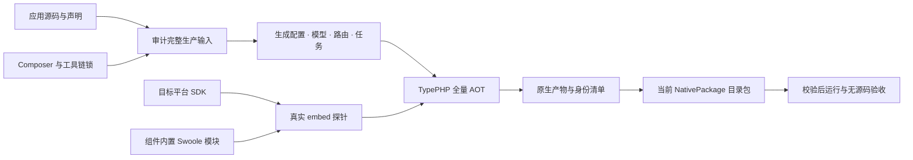
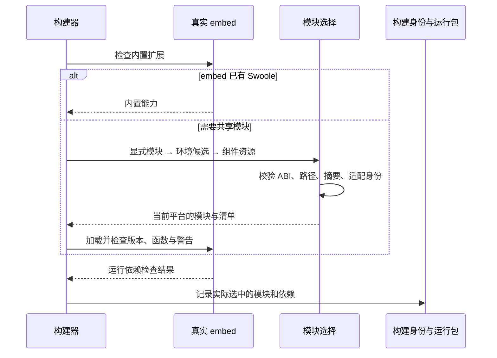

# type-build · 构建工具

[返回组件总览](../components.md)

在开发和构建环境中生成配置、路由、模型、任务与操作包装，审计全部生产源码，调用锁定的 TypePHP 编译，并形成可校验的原生产物与运行包。

组件已内置四平台 Swoole 模块，匹配构建无需另行下载、编译 Swoole，并自动收集选中模块与实际运行依赖。部署者使用完整运行包，无需安装本构建工具；按阶段的要求见[环境与依赖](../environment.md)。最终目标是一个主程序加外置配置、启动不释放运行库，当前仍提供目录包。

## 构建链路与职责

`type-build` 负责确认“这次编译用了什么”，TypePHP 负责把完整生产实现编译为原生代码。构建工具还要确认真实 embed 能加载需要的原生库，再把选中的运行依赖纳入产物身份；这些步骤不能用开发 PHP 的扩展列表替代。



单程序静态链接是后续交付门槛；本图如实展示当前目录包链路。运行配置在启动时从外部读取，真实 `.env` 不进入编译输入或发布归档。

## 内嵌静态资源

构建配置可显式声明项目根内的资源目录与目标前缀：

```json
{"embedded-resources": [{"source": "web/dist", "target": "web"}]}
```

构建器排序收集普通文件，记录相对路径、大小和 SHA-256，拒绝越界、符号链接、秘密文件、PHP 源码及大小写冲突；每次构建最多 1000 个文件、总计 64 MiB。资源生成 C++ 常量数据并链接进 ELF、Mach-O 或 PE，内容变化使构建缓存失效。已有 `resources` 仍表示随产物管理的外置资源，两者不会互相替代。

生成的 `Type\Generated\EmbeddedResources::manifest()` 返回资源清单，`read(string $path, int $offset, int $length)` 按块读取，单次最多 65536 字节。应用负责决定何时安装及如何服务资源；组件不会在普通启动时自动解包。物联中心采用[显式安装流程](../deployment.md#前端安装与更新)，通用模板不默认携带页面。

## 安装与依赖

使用 `require-dev` 安装。PHP 范围为 `>=8.4 <8.6`；原生构建还需要项目锁定的 ZTS PHP、PHPX 与 TypePHP SDK。以应用 lock 和工具链声明为准，不能仅凭 PHP CLI 可以运行就认定 embed 环境完整。

在消费应用根执行以下命令，源码与完整 API 说明也随包安装：

```bash
composer config minimum-stability dev
composer config prefer-stable true
composer require --dev zoujingli/type-build:dev-main
```

Composer 从 Packagist 自动解析组件及其传递依赖，无需额外配置 VCS 仓库。提交应用的 `composer.lock`；`dev-main` 是开发版本，不能等同稳定发布。公共安装约定见[组件总览](../components.md#安装组件)。

## 最小使用示例

在独立应用的 `app/main.php` 中放入以下声明式入口，全局只保留声明：

```php
<?php

declare(strict_types=1);

/** 声明式业务入口，编译后不需要源码加载器。 */
function main(): void
{
    echo "Type 应用已启动。\n";
}
```

## 准备构建配置

应用根目录的 `composer.json` 应声明实际生产入口，例如将 `app` 放入 `autoload.classmap`，然后执行 `composer dump-autoload`。根 `type-app.json`：

```json
{
  "name": "type-example",
  "version": "1.0.0-dev",
  "entry": "app/main.php",
  "sources": ["app"],
  "output": "build/type-example",
  "build-directory": "build/compiler"
}
```

在该应用根执行：

```bash
vendor/bin/type doctor type-app.json build
vendor/bin/type prepare type-app.json
vendor/bin/type type-app.json
vendor/bin/type --inspect build/type-example
```

成功构建后运行当前平台生成的可执行文件，应输出 `Type 应用已启动。`。可执行后缀和依赖布局以实际产物为准。本仓库使用 `docs/build-config/` 下的配置；独立应用仍可使用根 `type-app.json`。

按顺序观察每一步，而不只检查最终目录是否出现：

| 步骤 | 应观察的结果 | 失败后处理 |
| --- | --- | --- |
| `doctor … build` | 配置归属、锁定 SDK 与构建要求得到检查 | 按实际诊断补齐构建环境 |
| `prepare` | 生成当前输入对应的开发代次 | 修改声明后重跑，不手改生成文件 |
| 全量构建 | 当前命令成功退出，并返回本次产物身份 | 保留错误报告，旧二进制不能算本次成功 |
| `--inspect` | 能读取当前产物的构建 ID、平台和清单 | 清单缺失或损坏时停止打包 |
| 运行产物 | 输出与 PHP 入口一致 | 分别检查原生加载和业务失败 |

首次构建前还要准备与应用匹配的 `toolchain.lock.json`；标准模板已携带该声明。自行创建最小项目时应沿用[工具链约定](../typephp.md)，不能只复制上面的 JSON 便假定 SDK 已具备。

| 配置 | 含义 |
| --- | --- |
| `project-root` | 相对配置文件目录解析；未填时项目根就是配置文件所在目录 |
| `entry` | 声明式应用入口 |
| `sources` | 应用生产源码目录/文件，必须覆盖 Composer 生产入口 |
| `output` | 项目 build 目录内的产物路径 |
| `build-directory` | 项目 build 目录内的编译工作目录 |
| `imports` | 第三方包的精确版本编译适配 |
| `runtime` | 分平台声明真实 embed 运行依赖 |

除 `project-root` 外，上述源码与产物路径按选定项目根解析。不要在应用配置写入本机 SDK 的固定安装路径，SDK 在构建环境显式提供。

## 内置 Swoole 与运行依赖

`type-build` 的 Composer 分发内容包含 Swoole 6.2.1 四平台共享模块、清单和原始许可证。主仓位置是 `plugin/type-build/resources/swoole/`，独立应用通常安装在 `vendor/zoujingli/type-build/resources/swoole/`；构建组件按自身安装位置查找，不依赖应用根目录或当前工作目录。应用无需复制主仓目录，也无需增加 `resources` 声明；根目录 `build/` 继续只保存不入仓的生成产物。

公共 `type-build` 开发分支已包含上述资源，并完成独立安装与字节核对。应用提交 `composer.lock` 固定实际版本；旧锁文件指向不含清单的分发版本时，须先受控更新再使用默认内置模块。

预编译模块固定使用 **PHP 8.5.10、ZTS、非 debug、64 位 ABI**。当前主仓工具链为 TypePHP 0.9.3、PHPX 2.9.2，准确版本以应用的工具链锁和 Composer 锁文件为准。

| 资源子目录 | 平台与限制 |
| --- | --- |
| `linux-x64/php-8.5.10-zts/swoole.so` | Linux x86-64，Debian 12 / glibc 2.36 构建基线 |
| `linux-arm64/php-8.5.10-zts/swoole.so` | Linux ARM64，Debian 12 / glibc 2.36 构建基线 |
| `macos-arm64/php-8.5.10-zts/swoole.so` | macOS ARM64，部署目标 15.0；已通过 macOS 15 原生 ARM64 默认矩阵 |
| `windows-x64/php-8.5.10-zts/php_swoole.dll` | Windows x64，PHP 官方 VS17 ZTS ABI |

Linux 模块不适用于 Alpine/musl；NTS、其他 PHP 版本、macOS Intel 和 Windows ARM64 未提供内置文件。模块包含项目的编译线程、HTTP、Socket 与 TLS 适配，普通官方 Thread 可用不代表满足项目的编译入口 ABI。

### 选择与失败处理

运行依赖按以下顺序选择：

1. 真实 embed 已内置 Swoole 时，不重复加载共享模块。
2. 使用显式 `runtime.modules` 声明的候选。
3. 未显式声明时，使用有效的 `TYPE_SWOOLE_MODULE` 文件候选。
4. 否则从组件的 `manifest.json` 选择匹配模块，校验 SHA-256 和源码适配身份。

默认内置清单缺失、ABI 不匹配、文件越界、摘要不符或源码适配过期时，构建明确失败，不自动回退到 SDK 中的 Swoole。修复方式是安装完整且匹配的组件，或明确提供已验证的模块覆盖；不要只修改清单摘要。其他扩展仍按 SDK 或显式候选解析。最终还要通过真实 embed 的加载、版本、必需函数与警告检查，PHP CLI 加载成功不能替代这些检查。



覆盖模块适用于已验证的自建 SDK，不会改变全量编译要求。检查失败时修复输入或适配，不能把失败候选作为可分发产物。

匹配模块的选择无需联网，也无需另行下载或编译 Swoole；PHP SDK、PHPX 和其他依赖仍需准备，Composer 安装及整个构建不因此自动离线。组件安装也不会自动修改开发 PHP 的 ini；`type dev` 所用 CLI 仍需加载匹配的扩展。

所选清单和模块进入构建身份，应用产物只收集当前平台选中的模块及实际依赖，不会携带全部四平台模块。再分发须保留适用的原始许可证，见[许可证与归属](../licensing.md#第三方边界)。源码、摘要、依赖和维护者的 `TYPE_SWOOLE_BUILD_FROM_SOURCE=1` 重建入口见[资源说明](https://github.com/zoujingli/typeapp/blob/main/plugin/type-build/resources/swoole/README.md)。

这些 `.so/.dll` 是共享扩展构建输入。**完整静态链接、单程序加配置、启动不释放运行库仍未完成**，当前目录包与最终交付要求见[构建与部署](../deployment.md#单程序交付约定)。

## 开发与编译入口

| 命令 | 用途 |
| --- | --- |
| `create` | 从 `type-project` 创建独立业务应用，不复制物联中心；参数与模板来源通过帮助确认 |
| `doctor` | 检查配置与工具链环境 |
| `prepare` | 生成 PHP 开发所需声明结果 |
| `dev` | 使用同一业务源码执行 PHP 开发入口 |
| `watch` | 观察源码变化并重建开发入口 |
| `test` | 执行配置声明的测试流程 |
| `build` 或直接传配置文件 | 全量原生编译 |
| `--inspect` / `--verify` | 读取或校验构建身份 |

先运行 `vendor/bin/type help` 查看安装版本的准确参数。PHP 开发执行与 AOT 是两个验证结果；prepare/dev 成功不等于原生验收通过。

### 接通 PHP 开发命令

最小构建 JSON 只定义原生入口。要使用 `type dev`，先创建[组件示例的开发启动器](../components.md#运行声明式示例)，再将以下字段合入根 `type-app.json`：

```json
{
  "development": {
    "entry": "dev.php",
    "output": "build/development"
  }
}
```

这是补充字段，不是替换整个构建文件。在应用根运行 `php vendor/bin/type dev type-app.json`，最小示例应输出 `Type 应用已启动。`。命令后的参数原样交给开发启动器；带参数 main 要用 `main($argc, $argv)` 调用。

使用生成声明时，由开发启动器先调用 `DevelopmentBuilder::prepareConfiguration()`，加载返回的准确代次文件，再加载业务入口，具体代码见[模型生成加载](type-orm.md#models-relations-output)。单独运行 prepare 只生成文件，不会自动为任意 dev.php 加载类。watch 自动 prepare 后重启开发入口，可通过 `development.check` 声明启动前检查参数；可参考标准模板，最小入口若没有 serve 命令，则不会因使用 watch 而成为 HTTP 服务。

首次生成会静态解析完整生产源码。标准应用本轮在 CLI `memory_limit=256M` 下通过，128 MiB 不足；可使用 `php -d memory_limit=256M vendor/bin/type prepare type-app.json`。watch/test 的子进程也要使用相应 CLI 配置，父进程的单次 `-d` 不会自动传给子进程。此限制属于开发生成，生产运行内存按实际角色另行测量。

## 声明生成与显式调用

`config`、`routing`、`queue` 和 `operations` 配置分别交给对应生成器；模型从生产 `sources` 的 PHP 类型属性与 Attribute 静态识别。生成结果必须进入编译输入，业务必须调用生成入口：

- 路由：构建期从控制器注解或 `config/route.php` 生成 `register()`。`type-app.json` 只写 PHP 路径，旧 JSON 路由表明确报迁移错误；生产请求不扫描 Attribute。
- 模型：保留业务类名和方法，生成字段映射、水合、查询入口与属性钩子，变更后重新 prepare/build。旧 `models` 键明确报迁移错误，原源码、转换结果和生成器身份共同使旧缓存失效。
- 队列：按 type/version/handler 生成 Registry，工厂接收一个 `JobContext`。
- 事务与缓存：生成组合类；原服务方法没有运行时拦截。

当前 PHP `prepare` 生成配置、模型、路由和操作包装，尚不生成 queue 注册表。PHP 开发的队列示例使用显式 `Registry::register()`；配置中的 queue 由原生 build 调用 JobCompiler 生成。不能把 prepare 成功当作生成队列类已经可用。

配置文件与 `config/route.php` 都只解析允许的声明语法，构建时不执行任意 PHP，不读取运行秘密。完整例子见[配置](../configuration.md)、[路由](../routing.md)、[模型](../database.md)和[缓存](type-cache.md)。

## 第三方依赖与源码完整性

生产包通过协议 1 的 `extra.type.sources` 声明输入；没有协议的依赖由应用 `imports` 绑定精确版本。已知源码适配须注明文件摘要、有限替换次数和原因。版本或摘要改变时拒绝旧适配。

根应用的 PSR-4、PSR-0、classmap 和 files 也与源码清单交叉核对。禁用模块不注册命令，但生产源码仍须编译。不能通过排除难编译文件或把生产实现移入 require-dev 绕开完整性检查。

## 产物、运行包与服务配置

`type package <产物> <新目录> [.env.example]` 生成运行目录，包含依赖清单、资源与操作手册。`type verify-package <目录> <受信清单SHA256>` 校验运行包；可信摘要应来自已验证的交付渠道。

发布根的 `LICENSE`、`NOTICE` 只复制构建身份已记录的应用原文；应用未提供的材料不会以框架许可补位，外部应用也不必采用 Apache-2.0。组件和第三方依赖的原始文本继续按各自归属保存在资源索引中。是否要求材料齐全由构建配置 `notices.require-complete` 决定；缺失项仍会记录在构建报告。新产物使用身份生成协议 4；协议 3 的旧产物只有同时含应用 LICENSE、NOTICE 时可以继续打包，否则需要重新构建。

例如最小示例在构建成功后运行 `php vendor/bin/type package build/type-example build/release`，目标目录必须尚不存在。命令返回的发布清单摘要应通过受信交付记录保存。校验或归档时，在应用根将 `TYPE_RELEASE_SHA256` 设置为该受信 SHA-256，然后执行：

```bash
php vendor/bin/type verify-package build/release "$TYPE_RELEASE_SHA256"
php vendor/bin/type archive build/release build/type-example.tar.gz "$TYPE_RELEASE_SHA256"
```

归档目标同样必须尚不存在，支持 `.zip` 与 `.tar.gz`；归档前会校验运行包。收到产物后，不能仅在同一不受信目录重新计算摘要便认定来源可信。Windows 的可执行文件路径与归档格式按实际平台选择。

`type service <发布目录> <服务声明.json> <新服务目录> <受信清单SHA256>` 生成 launchd、systemd 或 WinSW 配置，不自动安装服务或修改权限。部署使用独立的数据和环境文件路径，不能将真实 `.env` 纳入构建。

运行包包含匹配 PHPX/libphp 和实际原生扩展，不包含 Composer、编译 SDK 或业务 PHP 回退入口。生产资源与开发工具分开，平台可用性以该版本实际验收为准。

四平台默认原生 CI、公共组件与模板分发已在同一源码基线上通过，覆盖完整应用 AOT、三库场景及运行包回归。Linux x64 的 scratch 部署、macOS 的独立模板隔离与 Windows 的搬迁包分别记录，不能合并隔离结论。准确提交、SDK 与限制见[平台与验收](../platforms.md)；目录包与归档不等于静态单程序完成。

## 常见问题

| 现象 | 处理 |
| --- | --- |
| 生产源码遗漏 | 对照 Composer autoload 和 sources 补齐输入 |
| imports 摘要不匹配 | 核对锁定依赖，更新真实适配并重新验证 |
| CLI 有扩展但构建缺失 | 以真实 embed 探针为准，核对内置 Swoole 的 ABI、显式覆盖及其他 SDK 扩展 |
| 内置 Swoole 校验失败 | 核对完整安装、清单、模块及源码适配身份；更新组件或提供已验证覆盖，不绕过摘要校验 |
| 缓存未复用 | 检查源码、锁文件、工具链、参数和资源身份变化 |
| 构建失败但旧文件还在 | 失败不会把旧产物认定为本次成功；检查本次退出码与报告 |

## 验证与继续阅读

本仓库验证入口：`composer test:build-errors`、`composer test:build-source-collection`、`composer test:build-cache`、`composer test:imports`。`composer test:bundled-swoole-consumer` 验证组件真实拆分和 Composer 独立安装后的本地选择、字节及许可材料；原生发布和无源码运行另做对应产物验收。

继续阅读：[构建与部署](../deployment.md)、[测试工具](type-testing.md)、[组件安装](../components.md)。

本文以本仓库当前公开接口为依据；安装版本请同时核对包内 README。[对应源码与包说明](https://github.com/zoujingli/type-build)。
