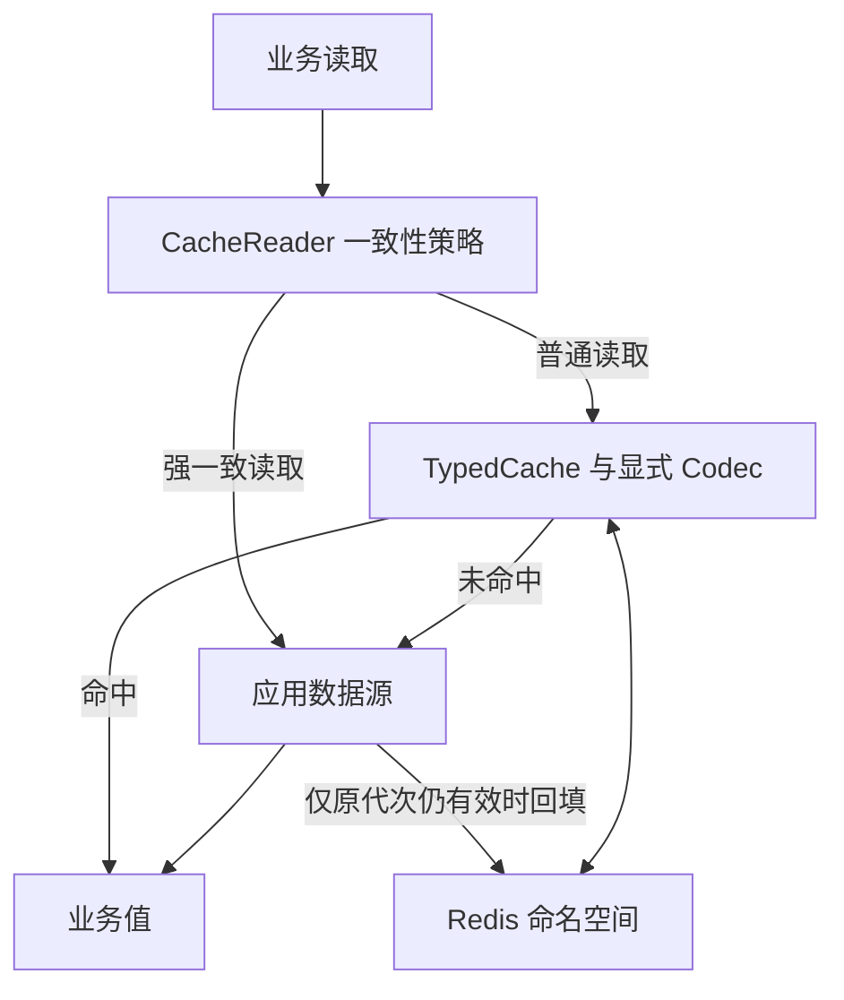
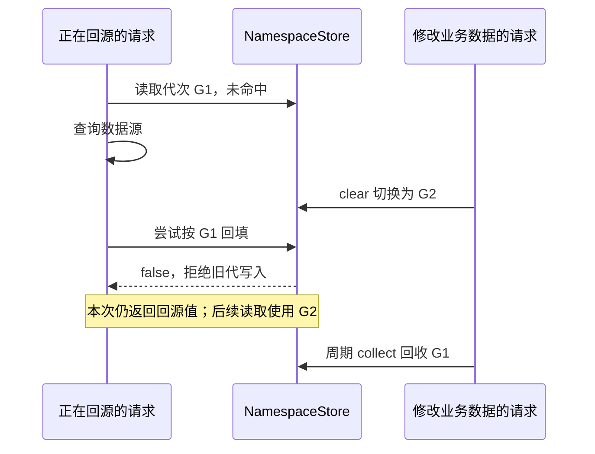

# type-cache · 缓存

[返回组件总览](../components.md)

提供类型化缓存、显式序列化、有限 TTL、回源与命名空间失效；也可通过 SimpleCache 接入 PSR-16。缓存基于 Redis script 用途连接，业务须明确一致性与回收策略。

学习顺序是：用独立命名空间跑通一次回源，再区分命中与 null，最后验证整体失效和旧数据回收。应用拥有数据源与一致性选择，缓存只保存可重新取得的副本。



## 安装与依赖

需要 PHP `>=8.4 <8.6`、`type-redis`、`type-runtime`、phpredis 与 PSR-16 接口。准备与可靠任务存储分离的 Redis；使用事务组合时另装 ORM/build。

在消费应用根执行以下命令，源码与完整 API 说明也随包安装：

```bash
composer config minimum-stability dev
composer config prefer-stable true
composer require zoujingli/type-cache:dev-main
```

以上安装 `dev-main` 开发分支。需要固定已发布批次时，按[版本安装说明](../releases.md#composer-按版本安装)选择明确的组件版本和依赖稳定性。Composer 从默认 Packagist 解析传递依赖，无需配置 VCS 仓库；提交应用的 `composer.lock` 固定实际版本。公共安装约定见[组件总览](../components.md#安装组件)。

## 最小使用示例

下面在 `readme-example/local/profile-v1` 命名空间缓存一份示例数据。按[运行声明式示例](../components.md#运行声明式示例)保存入口并用 `main()` 启动；Redis 连接配置详见 [Redis 插件](type-redis.md)。

```php
<?php

declare(strict_types=1);

use Type\Cache\JsonCodec;
use Type\Cache\NamespaceStore;
use Type\Cache\TypedCache;
use Type\Redis\Purpose;
use Type\Redis\RedisConfiguration;
use Type\Redis\RedisManager;
use Type\Runtime\ExecutionScope;

/**
 * 缓存有限 TTL 的公开示例数据，资源不得跨本次执行作用域使用。
 */
function main(): void
{
    $host = getenv('REDIS_HOST');
    $port = filter_var(getenv('REDIS_PORT') === false ? '6379' : getenv('REDIS_PORT'), FILTER_VALIDATE_INT,
        ['options' => ['min_range' => 1, 'max_range' => 65535]]);
    if (!is_int($port)) {
        throw new InvalidArgumentException('REDIS_PORT 必须为有效整数端口');
    }
    $manager = new RedisManager(['default' => new RedisConfiguration($host === false ? '127.0.0.1' : $host, $port)]);
    $scope = new ExecutionScope();
    try {
        $redis = $manager->connection($scope, 'default', Purpose::SCRIPT);
        $store = new NamespaceStore($redis, 'readme-example', 'local', 'profile-v1');
        $cache = new TypedCache($store, JsonCodec::data('profile-v1'), 60000);
        $profile = $cache->remember('user:7', static fn (): array => ['id' => 7, 'name' => '示例']);
        echo json_encode($profile, JSON_THROW_ON_ERROR | JSON_UNESCAPED_UNICODE) . "\n";
    } finally {
        try {
            $scope->close();
        } finally {
            $manager->close();
        }
    }
}
```

执行 `php dev.php` 输出 id=7 的 JSON。有效 TTL 内再次读取命中已有值；首次回源和缓存命中都返回同一业务数据类型。

## 命名空间与格式

`NamespaceStore($redis, $application, $environment, $format)` 区分应用、环境和数据格式。使用 script 连接，不复用普通命令用途。`JsonCodec::data('profile-v1')` 支持 null、标量和数组；DTO 用显式 encode/decode 工厂，不接受载荷决定类名。

格式身份不匹配或解码失败按未命中处理；写入类型不符合 codec 时明确抛错。改变 DTO 结构时更新格式身份，不让不同版本误读同一载荷。

## 读取、写入与 null

下例放在最小示例取得 `$cache` 后的位置：

```php
$cache->put('optional-profile', null, 30000);
$item = $cache->get('optional-profile');
if ($item->hit()) {
    $value = $item->value(); // 此处为 null，仍然是缓存命中。
}

$cache->putMany(['a', 'b'], [['id' => 1], ['id' => 2]], 30000);
$items = $cache->getMany(['a', 'b']);
$cache->delete('a');
```

`getMany` 按输入位置返回 CacheItem 列表，不能当作键值关联数组。批量键和值数量须相同，资源对象不能直接作为 JSON 数据缓存。

| 参数 | 默认值 | 单位 |
| --- | --- | --- |
| `TypedCache.ttlMilliseconds` | 60000 | 毫秒 |
| `TypedCache.maximumTtlMilliseconds` | 86400000 | 毫秒，默认最大一天 |
| `put/remember` 的 TTL | null | null 用配置默认，非正值不保留数据 |
| `collect($limit)` | 100 | 每次有界回收数量 |

类型化缓存只允许有限 TTL；构造默认 TTL 必须为正，不能超过最大值。`put` 的零/负 TTL 删除对应键。

### 验证命中、失效与收尾

把下面片段放在最小示例取得 `$cache` 后执行。它只操作该示例命名空间：

```php
$cache->put('optional-profile', null, 30000);
$before = $cache->get('optional-profile');
$generation = $cache->clear();
$after = $cache->get('optional-profile');
echo json_encode([
    'before_hit' => $before->hit(),
    'before_value' => $before->value(),
    'after_hit' => $after->hit(),
    'generation_length' => strlen($generation),
], JSON_THROW_ON_ERROR) . "\n";
$cache->collect(100);
```

正常输出为 `{"before_hit":true,"before_value":null,"after_hit":false,"generation_length":32}`。`clear()` 的结果是新代身份，`collect()` 的结果是实际删除键数；有多少旧键取决于此前运行情况，不应断言每次固定删除数量。最后仍沿用最小示例的 `finally` 关闭资源。

## 回源与一致性

`remember($key, static fn (): mixed => ..., $ttl, $bypass)` 命中直接返回；未命中执行回源，异常不缓存。bypass=true 只回源，不读取或回填缓存。它不提供跨请求互斥，多个并发未命中可能各自回源。

`CacheReader($cache, $fallbackOnRedisFailure = false)` 提供明确策略，`read($key, $source, $strong = false)` 的 source 必须是 `Closure(bool): mixed`。strong 标志传给数据源，数据源自己选择满足一致性的数据库读取。默认 Redis 故障向外传播，只有显式允许才降级回源。

## 整体失效与旧代回收

`$cache->clear()` 原子切换命名空间代次，立即使旧代不可见；不调用 FLUSHDB/FLUSHALL。回源过程中发生 clear，旧请求不会把结果回填到新代。

`$cache->collect(100)` 分批回收旧代键和标记，需要应用周期调用。有限 TTL 的数据会自行过期；永久 PSR 缓存还依赖索引完整性，应使用不会驱逐回收元数据的配置并持续回收。



代次保护解决旧请求污染新缓存的问题，不改变已经进行中的业务读取，也不使数据库和 Redis 组成分布式事务。

## PSR-16 用法

下例接续最小示例的 `$redis`，使用独立命名空间；运行环境 `CACHE_SIGNING_KEY` 必须提供至少 32 字节密钥：

```php
$key = getenv('CACHE_SIGNING_KEY');
if ($key === false || strlen($key) < 32) {
    throw new \InvalidArgumentException('CACHE_SIGNING_KEY 至少 32 字节');
}
$psrStore = new \Type\Cache\NamespaceStore($redis, 'readme-example', 'local', 'psr-v1');
$simple = new \Type\Cache\SimpleCache(
    $psrStore,
    new \Type\Cache\SignedSerializer($key),
    60
);
$simple->set('profile', ['id' => 7], 30);
$profile = $simple->get('profile', []);
```

PSR 的 TTL 使用秒，也支持 DateInterval；null 使用配置默认，构造默认 null 表示永久，非正数删除。非法键抛 PSR InvalidArgumentException。

SignedSerializer 保留 PHP 类型；对象必须提前加载并登记受信类，资源拒绝。HMAC 绑定命名空间、代次、键、类型策略和完整载荷；篡改、错误密钥和未知类型按未命中。登记对象的序列化钩子属于应用可信代码，密钥不能进入构建产物。

## 编译期缓存声明

`#[Cacheable]` 和 `#[CacheEvict]` 只表达构建策略，必须调用 OperationCompiler 生成的组合对象。cache 指向 TypedCache 参数，业务标量参数须进入 key 模板；直接调用原方法不会缓存或失效。

与事务组合的失效发生在最外层提交确认后；失效失败按提交后错误处理，不重跑已经提交的业务。Cacheable 不与同方法事务或 CacheEvict 混用。

## 常见问题与验证

- null 被误认为未命中：用 CacheItem.hit()，不要只比较 value。
- 缓存过期过快：检查毫秒与 PSR 秒的区别。
- clear 后内存未立刻下降：失效与物理回收分开，定期 collect。
- Redis 写错误：Lua 可能已有部分效果，按底层 outcome 处理，不能假设回滚。
- 需要强一致读：显式绕过缓存并在数据源选择正确连接/事务。

生产包含 codec、受信对象、PSR 接口与实际 Redis 依赖。主仓入口为 `composer test:cache`、`composer test:psr-cache`、`composer test:cache-consistency`；相应 native 脚本先构建后执行。

继续阅读：[Redis](type-redis.md)、[ORM 事务](type-orm.md)、[构建工具](type-build.md)。

本文以本仓库当前公开接口为依据；安装版本请同时核对包内 README。[对应源码与包说明](https://github.com/zoujingli/type-cache)。
