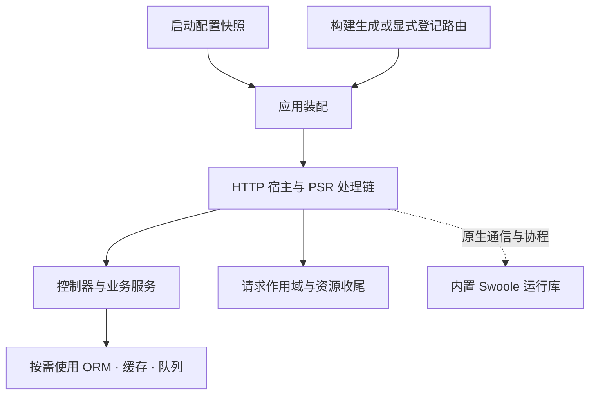
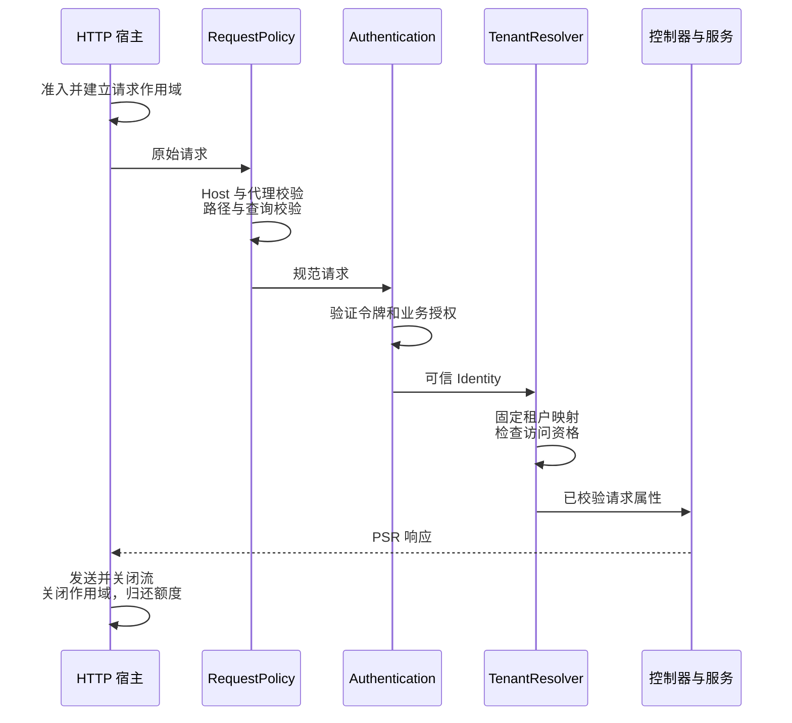

# type-core · 配置、命令与基础通信

[返回组件总览](../components.md)

提供启动配置、命令生命周期、同步事件，以及 HTTP、WebSocket、TCP、UDP 基础通信。HTTP 使用 PSR-7/15/17、路由和处理链；其他协议通过各自的消息、字节流和数据报入口处理。数据库、校验、日志等能力由应用显式组合。

## 从配置走到一个请求

本页按“读配置 → 创建路由 → 本地调用 → 监听 HTTP → 加入身份和资源边界”的顺序推进。前两步无需外部服务，便于先验证业务输入和响应；监听阶段再验证真实协议与关闭行为。



TypePHP 将应用、核心组件、生产依赖及生成声明编译为原生程序。图中的 Swoole 是底层运行库，HTTP 路由、认证和资源所有权仍由应用与框架表达。当前可交付包的组成与静态单程序目标见[构建与部署](../deployment.md)。

## 安装与依赖

需要 PHP `>=8.4 <8.6`、Swoole `>=6.2 <7`，依赖 `type-runtime` 和 PSR HTTP 接口。Swoole 是本组件配置、命令与 HTTP、WebSocket、TCP、UDP 通信入口的运行时基础；安装本包时即校验该硬依赖。

以上是源码开发与构建要求。框架已接入 Swoole，原生构建默认复用 `type-build` 的匹配内置模块；部署使用包含实际运行库的完整包，见[环境与依赖](../environment.md)。

在消费应用根执行以下命令，源码与完整 API 说明也随包安装：

```bash
composer config minimum-stability dev
composer config prefer-stable true
composer require zoujingli/type-core:dev-main
```

以上安装 `dev-main` 开发分支。需要固定已发布批次时，按[版本安装说明](../releases.md#composer-按版本安装)选择明确的组件版本和依赖稳定性。Composer 从默认 Packagist 解析传递依赖，无需配置 VCS 仓库；提交应用的 `composer.lock` 固定实际版本。公共安装约定见[组件总览](../components.md#安装组件)。

## 最小使用示例

以下入口只读取配置，不启动服务。保存为独立示例的 `app/main.php`，按[运行声明式示例](../components.md#运行声明式示例)使用零参数 `main()` 启动。

```php
<?php

declare(strict_types=1);

use Type\Core\Config\Environment;
use Type\Core\Config\Repository;

/**
 * 只读取启动配置，示例不会连接外部服务或加载配置 PHP。
 */
function main(): void
{
    $environment = Environment::load(null);
    $configuration = new Repository([
        'app' => [
            'name' => $environment->get('APP_NAME', 'type-example'),
            'port' => $environment->get('APP_PORT', 9501),
        ],
    ]);
    echo $configuration->text('app.name') . ':' . $configuration->integer('app.port') . "\n";
}
```

未设置环境变量时输出 `type-example:9501`。设置 `APP_NAME`、`APP_PORT` 可覆盖默认值；非法端口文本会被整数读取拒绝，端口的 1–65535 范围仍由应用校验。

## 配置与环境

`Environment::load(null)` 只读取进程环境，不自动搜索 `.env`；传入文件路径才加载指定文件。进程环境优先，不调用 `putenv()`；空字符串、0、false 与缺失分别处理。

`Repository` 是不可变嵌套快照，使用 `app.port` 等点路径。`has()` 区分不存在和已声明 null；`text()/integer()/boolean()/array()` 严格检查类型。旧 `Type\Core\Configuration` 只保存字符串快照，不能混用两个接口。

在标准应用里修改 `config.files` 中的受限数组/env 声明，然后重新生成配置工厂；秘密在启动时读取。`config/route.php` 是路由声明，见[HTTP 与路由](../routing.md)。完整配置操作见[配置与环境](../configuration.md)。

## HTTP

HTTP 服务入口为 `Type\Core\Http\SwooleServer`。本节保留组件装配与 API 参考；完整教程见 [HTTP](../communications/http.md)、[TCP](../communications/tcp.md)、[UDP](../communications/udp.md)、[WebSocket](../communications/websocket.md)，共有约定见[通信导读](../communications.md)。

### 创建一个静态 HTTP 路由

下面是一个可放入应用源码的装配函数。它只构建处理链；下一节给出调用它并监听网络的完整入口。

```php
<?php

declare(strict_types=1);

use Psr\Http\Message\ResponseInterface;
use Psr\Http\Message\ServerRequestInterface;
use Type\Core\Http\ActionHandler;
use Type\Core\Http\Message\Factory;
use Type\Core\Http\Router;

/** 构建一个只返回公开状态、不借用外部资源的路由。 */
function exampleRouter(): Router
{
    $messages = new Factory();
    $router = new Router($messages, $messages);
    $router->add('GET', '/status', static fn (): ActionHandler =>
        new ActionHandler(static function (ServerRequestInterface $request) use ($messages): ResponseInterface {
            return $messages->createResponse(200)
                ->withHeader('Content-Type', 'application/json')
                ->withBody($messages->createStream('{"status":"ok"}'));
        }), 'status');
    return $router;
}
```

在调用方先创建 `$router = exampleRouter()` 和 `$messages = new Factory()`，再执行 `$router->handle($messages->createServerRequest('GET', '/status'))`，可得到 200 响应，正文为 `{"status":"ok"}`。`$router->url('status')` 返回 `/status`。处理器与中间件工厂均为零参数；动作接收一个请求并返回响应。手动调用处理链时，请求和响应正文流由调用方在结束后关闭。

`add()` 只接受完整静态路径。参数路由、分组和资源路由使用[路由构建声明](../routing.md)生成 `RouteDefinition`，再通过 `register()` 注册。重复名称与歧义在注册或构建时失败。所有路由和中间件须在首次处理请求前注册。

### 先在本地验证响应

保留上面的 `exampleRouter()`，用以下入口替换配置演示的 `main()`。这一步直接走相同 PSR 路由，不监听网络；因此可以验证路由结果，但不能替代下一步的真实 HTTP 验收。

```php
/** 检查静态路由的实际状态与正文，并显式关闭手动创建的流。 */
function main(): void
{
    $messages = new \Type\Core\Http\Message\Factory();
    $router = exampleRouter();
    $request = $messages->createServerRequest('GET', '/status');
    $response = null;
    try {
        $response = $router->handle($request);
        echo $response->getStatusCode() . "\n";
        echo (string) $response->getBody() . "\n";
        echo $router->url('status') . "\n";
    } finally {
        $request->getBody()->close();
        if ($response !== null) {
            $response->getBody()->close();
        }
    }
}
```

运行 `php dev.php`，依次输出 `200`、`{"status":"ok"}` 和 `/status`。改为 `/missing` 可观察 404；不要通过返回固定成功状态隐藏路由未命中。这里手工关闭正文流，进入 `SwooleServer` 后由其请求生命周期完成对应清理。

### 启动 HTTP 服务

在独立示例的 `app/main.php` 保留上一节的 imports 和 `exampleRouter()`，追加下面的 `main()`，替换本页最初的配置演示入口。一个应用只能保留一个 main。

```php
/** 监听本地示例接口；SwooleServer 负责每次请求的 Scope 与正文流清理。 */
function main(): void
{
    $messages = new \Type\Core\Http\Message\Factory();
    $control = new \Type\Core\Http\HttpControl(
        maximumRequests: 1,
        maximumConnections: 32,
        requestSeconds: 5.0,
        drainSeconds: 2.0,
        cleanupSeconds: 0.5
    );
    $server = new \Type\Core\Http\SwooleServer(
        exampleRouter(), $messages, $messages, $messages,
        control: $control
    );
    try {
        $server->serve('127.0.0.1', 9501);
    } finally {
        $server->stop();
    }
}
```

使用零参数[开发启动器](../components.md#运行声明式示例)运行 `php dev.php`，然后在另一个终端执行：

```bash
curl -i --max-time 5 http://127.0.0.1:9501/status
curl -i --max-time 5 http://127.0.0.1:9501/missing
```

分别得到 200 与 `{"status":"ok"}`、404 响应。示例只监听回环地址，无需数据库和认证令牌；业务 API 的认证见[快速开始](../quickstart.md)。端口被占用时同时修改 serve 和 curl 的端口。

前台示例按 Ctrl-C 请求退出。Unix 使用 Swoole 的经典 worker 与停止机制；Windows 使用协程 HTTP，通过 `ProcessSignals` 接收 CTRL_C/CTRL_BREAK。Windows CLI 需要可用控制台处理器，embed 还需要编译的控制事件桥；关闭窗口或强制结束不保证排空。此实现分支的存在不等于最新 Windows HTTP 已验收，实际范围见[平台与验收](../platforms.md)。

`SwooleServer` 没有 `handleSignals` 参数；`stop()` 撤销请求准入并进入排空，宿主的监督定时器随后停止服务。以上期限以秒计，业务驱动仍需自己的 I/O 超时。

### 中间件与请求边界

实现 PSR-15 `MiddlewareInterface::process($request, $handler)`，通过 `$router->middleware(static fn (): MiddlewareInterface => new YourMiddleware())` 注册全局中间件；`register()` 的第三个参数接收该路由的中间件工厂列表。依赖由工厂显式捕获或构造传入。

认证、可信代理、租户识别、正文与上传限制由 `Http` 下的相应策略负责。认证器为 `(string $token): ?Identity`，授权器为 `(Identity $identity, CanonicalRequest $request, string $method): bool`。请求输入须通过明确策略校验，不能仅凭调用方 header 认定身份。

一个需要租户隔离的业务请求可以依下图装配。策略必须由应用显式登记；安装组件不会自动替业务选择 Host、令牌校验器或租户权限。



认证失败返回 401，已认证但未授权返回 403；输入策略异常通过 HTTP 边界转为相应错误。`Identity` 和 `Tenant` 是可信处理步骤的结果，业务仍需核对具体资源的访问权。停止服务时先撤销准入，等待发送和资源清理结束后才能归还请求额度。

### HTTP 引擎

`SwooleServer::serve()` 在 Unix 采用经典单 worker，在 Windows 直接启动协程 HTTP；要求 Swoole `>=6.2 <7`，允许固定官方内置 PHP 库。编译业务线程有独立入口：`serveThread()` 接收共享监听副本，`serveThreadOwned()` 在线程内创建监听，两者都不会由 `serve()` 自动启用。各路径共用 PSR 处理链，但监听与停止监督分别装配；缺少相应运行能力时明确失败。TLS 可交给受信任反向代理终止。

本 HTTP 入口对协议升级返回 `501 / upgrade_not_supported`。要共用 HTTP 与 WebSocket 服务和端口，使用下一节的 `WebSocket\Server` 持有监听，通过 `onRequest()` 接收普通 HTTP 请求并显式装配处理链，见[共用服务](../communications/websocket.md#http-与-websocket-共用服务)。同步数据库调用要配置超时；生产并发和资源预算按实际入口验收。

`onWorkerStop` 是零参数资源清理回调：Unix `serve()` 在实际 worker 的同步停止阶段调用；Windows `serve()` 在协程 HTTP 事件循环退出后调用，没有另一个 worker 进程。回调应关闭该宿主持有的连接池和日志，不再启动新工作。调用者仍在自己的 `finally` 中关闭自身资源；请求 Scope 不能代替长期资源所有者，强制终止不能保证清理回调执行。

## WebSocket

`Type\Core\WebSocket\Server::create()` 创建监听，通过 `onOpen()`、`onMessage()`、`onClose()` 登记回调，再调用 `start()`。`Client::create()` 创建客户端，在已有协程中启动，使用 `send()`、`receive()` 收发消息，结束时 `stop()`。握手、帧和 TLS 复用 Swoole 原生能力。

服务端通过 `onMessage()` 登记消息回调，回调的第四个参数提供独立 `ExecutionScope`；数据库租约在回调结束时释放。当前服务端为单 worker，启用 Swoole 回调协程，同一连接经 Channel 顺序进入业务回调；一条连接等待可让出的 I/O 时，其他连接可以继续执行。客户端消息处理资源由调用方管理；其 `receive()` 返回 `null` 表示关闭或超时，空字符串可以是有效消息。单条消息与发送队列分别受字节上限约束。

同一个 `Server` 实例通过 `onRequest()` 处理普通 HTTP 请求，通过 `onOpen()`、`onMessage()`、`onClose()` 处理 WebSocket 连接与消息，共用一个地址、端口和服务生命周期。未登记 `onRequest()` 时普通请求返回 404；登记后接收原生请求和响应，PSR 路由与 HTTP 策略仍需显式装配，Upgrade 不自动经过普通 HTTP 中间件。`stop()` 会停止整个共用服务，详见[HTTP 与 WebSocket 共用服务](../communications/websocket.md#http-与-websocket-共用服务)。

明文监听同时提供 HTTP/WS；`open_ssl=true` 配合证书与私钥时，同一 TLS 监听提供 HTTPS/WSS。客户端通过 `tls=true` 启用证书链和主机名校验。HTTP 与 WebSocket 共用同一个 Swoole Server 生命周期，具体配置与身份边界见[WebSocket 通信](../communications/websocket.md)。

此 WebSocket 服务端仍依赖经典 Swoole WebSocket Server，当前 Windows 的 `start()` 明确抛出 `websocket_unsupported_platform`。普通 HTTP 的 Windows 协程入口不提供 WebSocket 升级，不能用其可用性代替 WS/WSS 的接入与验收。

## TCP

`Type\Core\TcpSocket::client()` 创建客户端，`listener()` 创建监听。两者在已有协程内通过 `ExecutionScope::open()` 启动；监听的 `accept()` 返回尚未启动的连接，由同线程的处理协程接管并在自己的作用域内启动。

`send()`、`receive()` 操作有界字节流片段；空字符串表示 EOF，消息边界与总长度由业务协议定义。TLS 使用 `open_ssl` 与相应证书选项。`shutdownWrite()` 支持半关闭；`stop()` 请求停止，`awaitClosed()` 等待真实关闭。接口和完整双端示例见[TCP 通信](../communications/tcp.md)。

## UDP

`Type\Core\UdpSocket` 共用于客户端与服务端，在已有协程内通过 `ExecutionScope::open()` 绑定本地地址。`sendTo()` 发送完整数据报，`receive()` 返回数据、来源地址和端口；空数据报仍是有效消息。客户端通常使用本地端口 `0`，服务端绑定约定端口。

每个端点只允许一个在途收发，单报文与原生缓冲分别设限；发送成功只表示本地提交，重试、去重和顺序语义由业务决定。结束时通过作用域清理并按 `statistics()` 核对关闭状态。接口、超时和完整双端示例见[UDP 通信](../communications/udp.md)。

## 命令、事件与资源

实现 `Command::run(Configuration $configuration, array $arguments): int`；由 `Application::run($command, $configuration, $arguments, $resources, $events)` 执行。资源按数组顺序启动、逆序关闭；构造函数不应打开外部连接。

`Events::listen($event, $listener)` 登记 `Listener`，`dispatch($event, $configuration)` 按顺序同步通知。监听器异常终止本次通知并传播。命令装配可以交给[构建工具](type-build.md)生成直接工厂，`help/check` 不应连接业务数据库。

## 常见问题与验证

- `.env` 没有生效：核对传给 `Environment::load()` 的路径及更高优先级进程环境。
- 带花括号的路径无法 add：改用构建期参数路由；仅安装 Attribute 类不会自动发布接口，需要生产控制器上的注解或 `config/route.php` 中的 `routes` 表，并经过构建生成。
- 处理完仍占连接：检查请求 Scope 和工作进程级资源是否各自清理。
- 方法不匹配和无路由分别处理；不要把所有失败都转成 200。

生产编译包含核心、PSR 接口、业务处理器及生成路由。本仓库的配置与路由可分别通过 `composer test:configuration`、`composer test:routing` 验证；原生检查先构建对应产物。

继续阅读：[基础通信](../communications.md)、[HTTP 与路由](../routing.md)、[校验](type-validate.md)、[日志](type-log.md)。

本文以本仓库当前公开接口为依据；安装版本请同时核对包内 README。[对应源码与包说明](https://github.com/zoujingli/type-core)。
