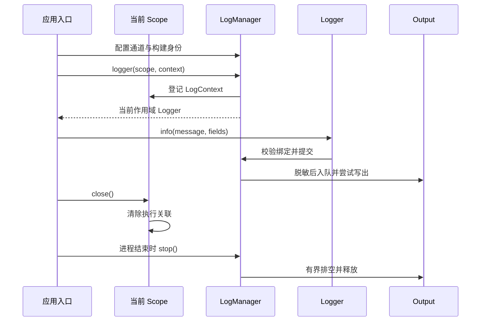

# type-log · 日志

[返回组件总览](../components.md)

提供 PSR-3 八级日志、命名通道、JSON Lines、执行关联和脱敏，以有界输出控制内存与停止时间。适合命令、HTTP、队列与调度，由应用显式装配日志生命周期。

## 一条日志的路径

应用在启动时配置 LogManager，每个请求或任务在自己的 Scope 中取得 Logger。关联在绑定时复制，记录在入队前格式化，输出失败通过计数回报。Swoole 提供运行时 I/O 能力；通道、脱敏和容量策略由日志组件负责。



最小示例把管理器也登记到命令 Scope，因此命令退出时一起停止。HTTP 等多请求进程共享管理器时，请求只回收自己的绑定，管理器由进程入口收尾。

## 安装与依赖

需要 PHP `>=8.4 <8.6`、JSON、`type-runtime` 与 `psr/log`，不强制 HTTP、数据库或 Redis。

在消费应用根执行以下命令，源码与完整 API 说明也随包安装：

```bash
composer config minimum-stability dev
composer config prefer-stable true
composer require zoujingli/type-log:dev-main
```

Composer 从 Packagist 自动解析组件及其传递依赖，无需额外配置 VCS 仓库。提交应用的 `composer.lock`；`dev-main` 是开发版本，不能等同稳定发布。公共安装约定见[组件总览](../components.md#安装组件)。

## 最小使用示例

下面绑定命令 Scope 并向 stdout 输出两条日志。保存为独立示例的 `app/main.php`，按[运行声明式示例](../components.md#运行声明式示例)用 `main()` 启动。

```php
<?php

declare(strict_types=1);

use Type\Log\Channel;
use Type\Log\Formatter;
use Type\Log\LogManager;
use Type\Log\Output;
use Type\Runtime\ExecutionScope;

/**
 * 在一个命令作用域中绑定日志并有界清理，不记录实际数据库凭据。
 */
function main(): void
{
    $password = getenv('DB_PASSWORD');
    $secrets = $password === false || $password === '' ? [] : [$password];
    $logs = new LogManager('readme-example', [
        'app' => new Channel(Output::stdout(), 'info'),
        'security' => new Channel(Output::stdout(), 'warning'),
    ], 0.25, new Formatter(['payment_card'], $secrets));
    $scope = new ExecutionScope(context: ['command_id' => 'command-123']);
    try {
        $scope->open($logs);
        $logger = $logs->logger($scope, ['trace_id' => 'trace-123']);
        $logger->info('任务开始：{name}', ['name' => '数据同步']);
        $logger->channel('security')->warning('访问被拒绝');
    } finally {
        $scope->close();
    }
}
```

执行 `php dev.php` 输出两行 JSON，分别来自 app/info 和 security/warning，包含构建 ID 与 command_id/trace_id。示例读取的数据库密码仅用于登记脱敏值，不连接数据库。

## 通道与级别

`LogManager($buildId, $channels, $stopSeconds = 0.25, $formatter = null)` 接收明确构建身份和通道。`Channel($output, $minimumLevel = 'debug')` 决定最低记录级别。

`$logs->logger($scope, $context, $channel = 'app')` 返回 PSR-3 实现；`$logger->channel('security')` 选择同 Scope 的通道。支持 debug、info、notice、warning、error、critical、alert、emergency，无效级别抛 PSR InvalidArgumentException。

构建 ID 由应用传入 Git SHA 或制品摘要，不隐式读取 Git。不要用日志内容判断数据库是否提交成功。

## 生命周期与关联

`$scope->open($logs)` 先登记管理器，再创建 logger。逆序关闭时先使 Logger 失效、清空关联，再排空并关闭输出。进程共享 LogManager 时，请求只关闭自己的 Scope，进程结束再 stop 管理器。

Scope context 保存 request_id/message_id/occurrence_id 等权威关联，logger context 提供补充字段。绑定时复制并脱敏，同名关联以 Scope 为准；普通日志参数不能覆盖构建和执行身份。

Logger 不跨进程、Fiber 或协程复用；子任务使用自己的 Scope 创建绑定。已排队记录保留产生时的上下文，不会在晚些排空时串到下一个请求。

## 消息与脱敏

以下片段放在最小示例 logger 创建后：

```php
$logger->info('同步完成：{count}', ['count' => 12]);
$logger->warning('凭据校验失败', [
    'authorization' => 'Bearer example-placeholder',
    'user_id' => 7,
]);
$statistics = $logs->stats();
```

authorization 字段被替换为 `[REDACTED]`。默认递归处理 password、token、secret、cookie、apikey、privatekey 等名称，忽略大小写和标点；Formatter 可增加敏感字段和已知敏感字符串。

| Formatter 预算 | 默认值 |
| --- | --- |
| `maxDepth` | 6 |
| `maxItems` | 128 个上下文节点 |
| `maxStringBytes` | 2048 字节 |
| Throwable 堆栈 | 最多 12 层，无参数，不记录异常链 |

未知上下文对象只记录类型，不调用其 __toString/jsonSerialize；消息本身的 Stringable 仍是应用代码，应避免阻塞。脱敏不是识别任意自然语言秘密的保证，业务应主动使用明确敏感字段。

## 练习：确认脱敏与级别过滤

在最小示例的 `try` 内、两条日志之后追加以下代码。所有凭据都是练习占位文本，不应替换成需要展示的真实秘密。

```php
$logger->debug('调试记录不会进入 info 通道');
$logger->info('设备状态变更', [
    'device_id' => 'demo-1',
    'authorization' => 'Bearer demo-secret',
    'state' => 'online',
]);
$logs->drain(0.1);
$stats = $logs->stats();
echo json_encode([
    'filtered' => $stats['app']['filtered'],
    'accepted' => $stats['app']['accepted'],
    'pending' => $stats['app']['pending_records'],
], JSON_THROW_ON_ERROR) . "\n";
```

在 stdout 正常可写时，新增的 JSON 日志中 `authorization` 为 `[REDACTED]`，`device_id` 与 `state` 保留。原示例 app 通道已有一条 info，追加后其 `filtered=1`、`accepted=2`、`pending=0`。这是功能观察，不是持久审计保证；管道满载时应按实际 pending/dropped 计数判断。

练习保留原来的 `finally { $scope->close(); }`，让日志绑定先退出、再排空输出。若改成文件输出，先创建应用自己的日志目录，文件轮转与保留由应用或日志收集器管理。

## 输出选择与容量

| Output | 使用方式与边界 |
| --- | --- |
| `stdout()` | 推荐交给独立日志收集进程 |
| `file($path)` | 本地绝对路径，已建父目录；追加写，不自动轮转 |
| `stream($stream, ...)` | 专用可写、支持非阻塞的原生流；默认不接管关闭责任 |

文件输出拒绝远程包装器、符号链接和非普通文件。已有文件权限保持，新建权限服从 umask。轮转后重建 Output，不在进程中假定文件句柄自动指向新文件。

默认每个 Output 最多 1024 条、总 1 MiB、单条 4096 字节。容量满丢弃新记录；格式化后单条过大整体丢弃，不输出无效 JSON。多个通道共享 Output 时容量合并。

每次日志调用只做一次不等待写入，积压可由 `$logs->drain($seconds)` 排空。stop 使用一个总预算，默认 0.25 秒，超时丢弃剩余记录。输出失败退役该 Output，不无限重试，不递归写入另一个日志通道。

## 观测与故障

`stats()` 不发送告警，应用采集以下计数：

| 指标 | 含义 |
| --- | --- |
| `filtered` | 被通道最低级别过滤 |
| `accepted / written` | 进入缓冲 / 完整写出 |
| `dropped_full / dropped_oversize` | 满载 / 单条超限 |
| `write_failures / dropped_failure` | 输出退役 / 失败丢弃 |
| `pending_records / pending_bytes` | 当前积压 |
| `partial_records / drain_timeouts` | 部分记录 / 排空超时 |
| `failed / stopped` | 输出当前状态 |

共享 Output 的输出计数会在多个通道中重复显示，汇总时去重；filtered 属于单通道。普通日志不保证 fsync、跨进程原子写或可靠消息投递。

## 常见问题与编译

- info 没出现：检查通道最低级别、容量与 dropped 计数。
- stop 后日志报错：Logger 所属 Scope 已关闭，不能在下一请求重用。
- 文件停止超时：普通文件系统内核 I/O 无法被 PHP 非阻塞选项强制中断；需要故障隔离时使用 stdout 收集进程。
- 上下文串号：确认每个执行建立自己的绑定，没有进程全局“当前请求”。

PSR 源码、格式化与业务日志代码一起 AOT；日志文件和真实秘密不进入构建。本仓库验证入口为 `composer test:log`；原生执行 `composer build:log` 后 `composer test:log-native`。

继续阅读：[运行时](type-runtime.md)、[核心](type-core.md)、[队列](type-queue.md)。

本文以本仓库当前公开接口为依据；安装版本请同时核对包内 README。[对应源码与包说明](https://github.com/zoujingli/type-log)。
