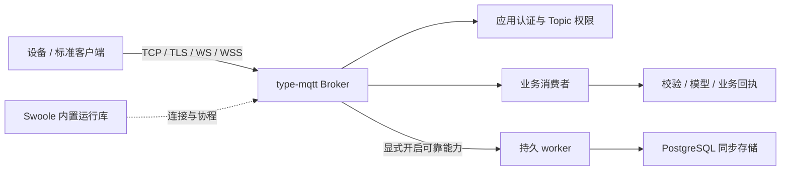
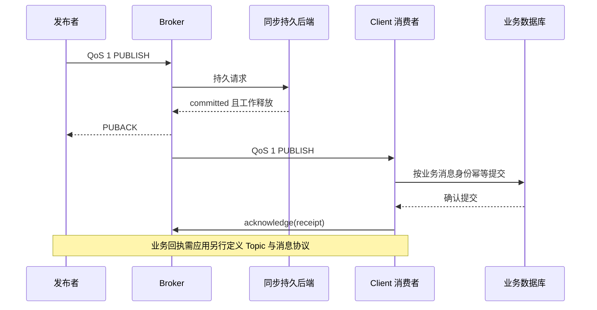

# type-mqtt · MQTT

`type-mqtt` 是 TypeApp 自研的独立 MQTT 服务端组件，负责连接、协议状态机和 Topic 路由。认证与 Topic 权限由消费应用提供；报文载荷的业务含义也由应用解释。运行不依赖 EMQX，也不提供 EMQX 专有管理 API。

默认只做 QoS 0 转发。QoS 1/2、持久会话、保留、遗嘱、共享订阅和跨节点路由，要另接 PostgreSQL 同步存储。当前还不能称为已完整通过标准验收的 Broker。

协议模型、完整 Broker 与标准客户端实例、TCP/WS 互通和应用设计见 [MQTT 通信教程](../communications/mqtt.md)。本页保留组件依赖、持久配置与高级接口参考。

## 组件在应用中的位置

MQTT 是设备与服务交换消息的协议组件。应用定义身份、Topic 权限和载荷规则，Broker 维护协议交换，Swoole 作为内置运行库提供连接与协程能力。消息进入业务后，仍由业务服务决定校验、存储和回执。



先在回环地址完成 [QoS 0 Broker 与标准客户端练习](../communications/mqtt.md#完整实例：qos-0-broker)，观察认证、订阅和转发；再配置真实 TLS，最后接入持久后端验证恢复语义。安装组件不会自动启动监听、创建数据库表或开放匿名访问。

## 安装与依赖

组件源码按 Apache-2.0 提供，位于 `plugin/type-mqtt/`。尚未发布稳定版本标签。独立消费者应核对真实安装副本并提交 `composer.lock`。`type-orm`、`type-runtime` 由 Composer 从 Packagist 自动解析；启用 PostgreSQL 持久后端时应用另行安装 `type-orm-pgsql`，见[组件安装](../components.md)。

```sh
composer config minimum-stability dev
composer config prefer-stable true
composer require zoujingli/type-mqtt:dev-main
```

通过 Packagist 安装，传递依赖由 Composer 自动解析；版本策略见[组件安装](../components.md#安装组件)。`dev-main` 表示开发版本，不是稳定标签。源码与包说明见 [type-mqtt 仓库](https://github.com/zoujingli/type-mqtt)。启用 PostgreSQL 持久后端时，在上述基础上添加：

```sh
composer require zoujingli/type-orm-pgsql:dev-main
```

PHP 要求 `>=8.4 <8.6`，依赖 OpenSSL、PCRE、JSON 及上述组件；持久后端需要 PDO PostgreSQL。通信、进程、线程、协程与事件循环统一使用 Swoole `>=6.2 <7` 的官方能力，允许固定官方内置 PHP 库按官方机制加载。Broker 服务端由 Swoole Server 承担，客户端统一使用 Swoole Coroutine Socket，非协程调用沿现有 CoroutineRuntime 使用官方 Scheduler，持久 worker 使用 Swoole PROC hook 管理的进程管道。原生运行仍需对应扩展，不回退执行业务 PHP 源码。

## 最小离线示例：连接字段与消息编码

先确认安装后的公开类型能够在应用中使用。将以下代码保存为声明式 `app/main.php`，由开发启动器调用 `main()`；它解析一个完整 CONNECT 正文、编码 QoS 0 PUBLISH，并观察非法 Topic 的拒绝，不打开网络或数据库。

```php
<?php

declare(strict_types=1);

use Type\Mqtt\ConnectPacket;
use Type\Mqtt\Message;
use Type\Mqtt\ProtocolError;

/** 验证公开消息类型的离线协议边界，不启动 Broker 或认证任何客户端。 */
function main(): void
{
    $clientId = 'guide-client';
    $connectBody = pack('n', 4) . 'MQTT' . "\x05\x02" . pack('n', 30)
        . "\x00" . pack('n', strlen($clientId)) . $clientId;
    $connect = new ConnectPacket();
    $connect->decode($connectBody);

    $message = new Message('example/up', '{"temperature":23}', qos: 0);
    $packet = $message->packet(5);
    $invalidTopicRejected = false;
    try {
        new Message('example/+', '23');
    } catch (ProtocolError $error) {
        $invalidTopicRejected = $error->reason === 0x90;
    }
    echo json_encode([
        'protocol' => $connect->version,
        'client_id' => $connect->clientId,
        'topic' => $message->topic,
        'qos' => $message->qos,
        'packet_bytes' => strlen($packet),
        'publish_header' => ord($packet[0]),
        'invalid_topic_rejected' => $invalidTopicRejected,
    ], JSON_THROW_ON_ERROR) . "\n";
}
```

预期输出为 `protocol=5`、`client_id=guide-client`、`topic=example/up`、`qos=0`、`packet_bytes=33`、`publish_header=48`，且 `invalid_topic_rejected=true`。CONNECT 正文解析不代表认证通过；Topic 中的 `+/#` 用于订阅过滤器，不能作为实际发布 Topic。此例只验证离线编解码边界，不替代 TCP、TLS、持久交付或完整协议验收；没有进程、连接或状态文件需要清理。

## 认证与最小启动

消费者实现两个公开方法：

```php
authenticate(ConnectPacket $connect, string $peer, bool $secure): bool;
authorize(ConnectPacket $connect, string $topic, string $action, int $qos): bool;
```

这只是 `Type\Mqtt\AccessPolicy` 的接口签名。`peer` 与 `secure` 来自实际网络连接，`action` 为 `publish` 或 `subscribe`。每次 CONNECT 重新认证，发布、订阅及接收排队按当前规则授权；外部数据库查询必须有界。遗嘱恢复不持久保存密码，应根据保存的认证身份重新查询权限。

下面是已有应用创建 Broker 的接续片段：`$access` 必须是应用提供的 `AccessPolicy` 实例，环境中须有可读的真实证书链和匹配私钥；加密私钥用 `MQTT_PRIVATE_KEY_PASSPHRASE`，口令错误或尚未生效的服务端证书会拒绝启动。

```php
$broker = new \Type\Mqtt\Broker($access, new \Type\Mqtt\BrokerOptions(
    certificate: (string) getenv('MQTT_CERTIFICATE'),
    privateKey: (string) getenv('MQTT_PRIVATE_KEY'),
    privateKeyPassphrase: (string) getenv('MQTT_PRIVATE_KEY_PASSPHRASE'),
));
$broker->serve('127.0.0.1', 8883);
```

主仓的 `examples/mqtt/main.php` 是完整声明式消费者示例，包含 `ExampleMqttAccess`、配置校验、停止及持久 worker 分支。把它作为独立应用入口时，按[声明式示例](../components.md#运行声明式示例)准备开发启动器，并调用 `main($argc, $argv)`；生产只编译声明入口，不加载开发启动器。

示例 `example` 用户必须设置非空 `MQTT_PASSWORD`，`service` 用户须另行设置非空 `MQTT_SERVICE_PASSWORD`。两者限于 `example/` Topic 前缀，`example/read-only/` 仅允许订阅；实际应用应替换成自己的授权规则。TLS 默认开启并支持 1.2/1.3，优先 1.3，拒绝 1.1，TLS 1.2 仅 ECDHE AEAD，ECDH 限 X25519 与 P-256，不启用 0-RTT；可监听明确 IPv4 或 IPv6 地址；服务端证书可为叶加中间 CA 的 PEM 链，过期或非 serverAuth 的叶证书拒绝启动，运行中到期则断开 TLS 会话；可另配一组 SNI 主机证书；客户端验证证书链和主机名。专用 mTLS（含配置了客户端 CA 的 WSS）在校验证书链后再核 SSL 客户端用途、有效期、可选签名 CRL、平台吊销名单和换证重叠窗口；客户端 CA 文件可含根与签发中间 CA，文件更新后重载 SSL_CTX 只影响新连接；CRL 文件更新、HTTPS 源刷新、CRL 缺失或过期、平台名单增列、重叠结束或已连接证书到期后断开对应会话。`--plaintext` 仅供显式回环调试，物联网设备接入不开放此选项。

## 协议与资源配置

标准依据为 OASIS [MQTT 3.1.1](https://docs.oasis-open.org/mqtt/mqtt/v3.1.1/os/mqtt-v3.1.1-os.html) 和 [MQTT 5.0](https://docs.oasis-open.org/mqtt/mqtt/v5.0/os/mqtt-v5.0-os.html)。业务策略可以限制身份、Topic 和资源，但不能把实现差异描述成标准已经兼容。

| 能力 | 当前行为 |
| --- | --- |
| 协议与传输 | MQTT 3.1.1 / 5.0，TCP / TLS；可选 WS/WSS 与专用 mTLS（含 WSS 客户端证书）；不提供 3.1、MQTT-SN 或增强认证 |
| 普通路由 | 精确、`+`、`#` 过滤器，重叠订阅、取消及二进制载荷 |
| MQTT 5 属性 | 订阅选项与标识、Topic Alias、消息期限、内容与关联属性，受各自上下文限制 |
| 无持久 worker | QoS 0 路由；不声称提供持久会话或可靠离线交付 |
| 显式同步持久后端 | QoS 1/2 双向交付、保留、会话恢复、遗嘱及延迟遗嘱、共享订阅和跨节点路由 |
| 完整入站报文 | 最大 1 MiB；默认握手 10 秒、半包 15 秒，Keep Alive 使用实际完整控制报文刷新；Swoole 入口关闭 Nagle |
| Swoole Server 连接预算 | 上限 10100；示例默认设备 10000、服务 100，仍受物理额度限制 |

这些额度是拒绝和资源约束，不是万台在线验收结果。每连接最多 100 个订阅，重复订阅替换选项；分类必须由已认证身份确定，不能相信客户端自行申报。TLS/认证/订阅/报文或存储失败不伪造成功确认。

同一连接取消订阅后，新匹配发布不再派生投递，未开始的保留游标停止；已经开始的 QoS 1/2 交换仍须完成。MQTT 标准允许继续发送取消前已经缓冲但未开始的交付，不能用 UNSUBACK 推断全部历史输出已经清空。

## 持久存储与集群

完整示例通过 `MQTT_WORKER_COMMAND` 指定同一应用的 JSON 命令参数数组，使用 `TYPE_PGSQL_*`、`MQTT_STANDBY` 配置实际 PostgreSQL 主备。监听前显式执行 `--install-store`；运行时不自动迁移。参数数组不经 shell，生产应指向当前原生产物，不从 `PHP_BINARY` 猜测入口。

`PostgresStore` 使用指定同步备库、`remote_apply` 及真实 WAL 提交与重放证明。`CommitResult` 区分 `committed/rejected/unknown`，只有确认提交且工作释放后才能给出对应成功。超时、同步取消或未知结果保留不确定性；数据库行可见、进程退出或本地主库写成功都不能代替同步证明。

| 示例预算 | 默认上限 |
| --- | --- |
| `MQTT_MAX_SESSIONS` | 20000 个持久会话 |
| `MQTT_DEVICE_MAX_MESSAGES/BYTES` | 单设备 10000 条 / 16 MiB |
| `MQTT_APPLICATION_MAX_MESSAGES/BYTES` | 单应用 1000000 条 / 2 GiB |
| `MQTT_PENDING_MAX_MESSAGES/BYTES` | 全局待投递原件及副本 2000000 条 / 4 GiB |
| `MQTT_RETAINED_MAX_MESSAGES/BYTES` | 保留原件独立 2000000 条 / 4 GiB |
| `MQTT_SHARED_MAX_MESSAGES/BYTES` | 每共享组 1000000 条 / 2 GiB，包含已分配在途 |

条数与逻辑字节先满者生效，不能通过增加共享成员扩大组额度。降低配置不会删除已确认的未完成消息。`--store-statistics` 返回同一事务快照的分类用量，失败或未知不能当作零积压。

集群模式使用 `--clustered --node-id=broker-a`，每节点另有精确运行身份。接管等待旧输出者关闭、相关持久工作结束及会话屏障证明；节点失联不等于旧主已硬隔离。`--fence-node` 只登记操作者已经完成的基础设施隔离，必须提供精确节点、运行身份、操作人和证据标识。单机多进程故障验证不能代替独立故障域高可用验收。

主动撤权可向 `Broker` 的可选第七参数 `invalidations` 提供 `AuthorizationInvalidations`，第六参数仍是 `classify`。来源先拒绝旧凭据并保存精确旧主体意图；Broker 完成网络关闭和持久会话终止后才回报完成。未知或失败保留意图，已进入网络的字节不能撤回。应用不得把受理成功或在线状态变化当作撤权完成证明。

精确管理断开、会话终止与清保留可向第八参数 `disconnects` 提供 `ConnectionDisconnects`。断开按 owner 与代次匹配并保留仍有效会话；终止按 `session_id` 与代次删除该会话并放弃其未完成交付；清保留按 `resource_id` 与原件代次取消未来重放，不制造普通发布，也不撤回已有交付。MQTT 5 断开与终止发送 `0x98`，不伪造客户端正常断开。完成前须取得同步提交及适用的观察消失；不能把 HTTP 受理当成已执行。

在线连接、会话与消息额度可向第九参数 `quotas` 提供 `QuotaUpdates`。降低到现有用量以下时不删除已确认积压，也不据此终止可靠会话；新的超额占用返回 `0x97`。连接立即在本进程生效，持久额度写入存储后才推进已应用版本。Swoole 连接上限保持启动值。

## MQTT 5 消费客户端

`Client` 用于独立服务消费，发布 QoS 1、接收 QoS 0/1。`receive()` 返回消息后，由业务持久处理并显式 `acknowledge()`；Broker PUBACK、客户端协议确认与应用业务回执分别定义。

客户端默认 TLS，使用明确 IP 连接，并通过 `peerName` 指定证书身份，避免同步 DNS 越过等待预算。每次公开等待大于零且不超过 60 秒；默认入站 Receive Maximum 为 32，完整包最大 1 MiB。缓冲有条数和字节界限，半包从首字节起最多等待 5 秒，消费前面的完整包不会刷新尾部半包的期限。调用方持续接收以处理保活，不能无限阻塞业务处理。

在协程内建连时，连接自动绑定到建连执行者；传入 `coroutine: true` 另要求入口已有协程。非协程入口可使用默认参数，由现有 CoroutineRuntime 在官方 Scheduler 中执行网络等待。两种调用方式共用 Coroutine Socket 与相同的连接、TLS、收发、保活、超时和关闭语义；已有事件循环的原生回调须先进入其协程，不能嵌套 Scheduler。

## 发布确认与业务回执

可靠模式至少包含两段独立确认。发布者收到 PUBACK，说明 Broker 对该协议交换给出了成功确认；消费应用何时落库、是否向设备返回业务结果，仍由消费方的处理流程决定。



如果业务提交结果未知，不要因为方法抛异常就发布“未处理”或自动生成新业务 ID。先对账；只有确认业务效果已完成时，再确认该次接收凭据。`receipt` 是当前网络交付的不透明凭据，业务幂等键应来自经过认证和校验的应用消息，不能把 receipt 当成跨重连身份。

## 练习顺序与结果检查

| 步骤 | 使用入口 | 应观察的结果 |
| --- | --- | --- |
| 1. 本地 QoS 0 互通 | [完整通信示例](../communications/mqtt.md) | 正确凭据可连接，已授权 Topic 可收发 |
| 2. 认证与权限拒绝 | 相同入口，错误密码或未授权 Topic | 明确拒绝，不出现伪造成功 |
| 3. TLS 身份核验 | 配置真实证书链、私钥与客户端信任 | 正确主机身份成功，错误身份拒绝 |
| 4. 可靠持久交付 | 显式安装同步存储并配置 worker | 按 committed/rejected/unknown 处理，未知结果不冒充成功 |
| 5. 业务恢复 | 业务先持久处理，再显式 acknowledge | 重复交付由业务身份防重，可核对业务回执 |

练习使用专属端口、Topic、客户端 ID 和持久命名空间。结束时先关闭 Client、停止 Broker，再处理测试进程和存储；业务会话及未完成交付不能通过“清空数据库”恢复。高级功能的验收范围按实际平台和故障场景记录。

## 验证与使用边界

专题回归不能当作完整标准验收。WS/WSS、mTLS、持久后端、多节点接管及协议容量均由 MQTT 组件按目标平台独立验证。真实设备、业务接收回执和下行指令属于应用接入验收，成品案例见[物联网中心](../iot-center.md)。

`IOT_MQTT_*` 是业务配置，与本页独立示例的 `MQTT_*` 不同。接口以安装副本的 `plugin/type-mqtt/README.md` 为准。
