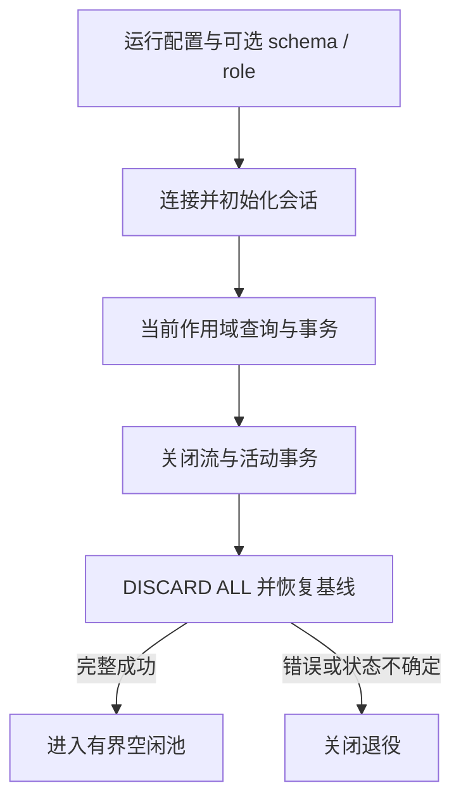

# type-orm-pgsql · PostgreSQL 驱动

[返回组件总览](../components.md)

通过 PDO 连接 PostgreSQL，复用 ORM 的查询、模型、事务与迁移。驱动只保存配置，实际连接由当前执行作用域借用时建立。

## 安装与依赖

需要 PHP `>=8.4 <8.6`、`ext-pdo_pgsql`、`type-orm` 和 `type-runtime`。先准备数据库、应用账号与相应权限，安装包不会创建数据库或账号。

在消费应用根执行以下命令，源码与完整 API 说明也随包安装：

```bash
composer config minimum-stability RC
composer config prefer-stable true
composer require zoujingli/type-orm-pgsql:1.0.0-rc.5
```

以上固定该组件的候选版本 `1.0.0-rc.5`，RC 不代表稳定版本；执行前按[版本安装说明](../releases.md#composer-按版本安装)核对公开状态。Composer 从默认 Packagist 解析传递依赖，无需配置 VCS 仓库；提交应用的 `composer.lock` 固定实际版本。开发分支与版本安装的区别见[组件总览](../components.md#安装组件)。

## 最小使用示例

将下例保存为独立应用的 `app/main.php`，从进程环境读取连接配置。按[运行声明式示例](../components.md#运行声明式示例)使用 `main()` 启动；示例只做参数绑定 SELECT。

```php
<?php

declare(strict_types=1);

use Type\Orm\Database;
use Type\Orm\Pgsql\PgsqlDriver;
use Type\Runtime\ExecutionScope;

/** 只在环境键不存在时采用默认值，保留合法的空字符串。 */
function databaseSetting(string $key, string $default): string
{
    $value = getenv($key);

    return $value === false ? $default : $value;
}

/**
 * 借用一个 PostgreSQL 会话执行参数绑定查询，凭据仅在运行时读取。
 */
function main(): void
{
    $port = filter_var(databaseSetting('DB_PORT', '5432'), FILTER_VALIDATE_INT,
        ['options' => ['min_range' => 1, 'max_range' => 65535]]);
    if (!is_int($port)) {
        throw new InvalidArgumentException('DB_PORT 必须为有效整数端口');
    }
    $driver = new PgsqlDriver(databaseSetting('DB_HOST', '127.0.0.1'), $port,
        databaseSetting('DB_DATABASE', 'type_example'), databaseSetting('DB_USERNAME', 'type_example'),
        databaseSetting('DB_PASSWORD', ''));
    $database = new Database($driver, 1, 0);
    $scope = new ExecutionScope();
    try {
        $connection = $database->connect($scope);
        echo json_encode($connection->query('SELECT ? AS value', [7]), JSON_THROW_ON_ERROR) . "\n";
    } finally {
        try {
            $scope->close();
        } finally {
            $database->close();
        }
    }
}
```

提供有效配置后执行 `php dev.php`，输出含 `value=7` 的 JSON 行列表。读取不创建业务表；整数的具体 PDO 返回类型应以实际驱动结果为准。

### 确认实际数据库身份

先用专属开发数据库运行最小示例，再把下面片段放在取得 `$connection` 后。它只读取当前会话：

```php
$baseline = $connection->query("SELECT current_schema() AS schema, current_user AS role, current_setting('TimeZone') AS timezone");
echo json_encode($baseline, JSON_THROW_ON_ERROR) . "\n";
```

timezone 应为 `UTC`；schema 与 role 应符合实际账号和驱动的显式配置。未指定 schema 时沿用该账号的数据库默认 search_path，不应一律假定是 public。确认身份后再运行迁移并声明 Model，避免表创建在与查询不同的 schema。



这条路径解释了“保留物理连接”的前提：必须证明会话基线恢复，而不仅是事务结束。后续用户仍取得新租约，不能复用前一作用域的 Connection 对象。

## 连接配置

| 最小示例环境键 | 默认值 | 含义 |
| --- | --- | --- |
| `DB_HOST` | 127.0.0.1 | 主机，TLS 时应匹配证书 |
| `DB_PORT` | 5432 | 1–65535 整数端口 |
| `DB_DATABASE` | type_example | 已存在的数据库 |
| `DB_USERNAME` | type_example | 已有账号 |
| `DB_PASSWORD` | 空字符串 | 启动时注入的密码 |

这些环境键由示例函数读取。`PgsqlDriver` 的后续可选参数为 `generation=1`、`role='writer'`、`schema=null`、`databaseRole=null`、`caFile=null`。

schema 与 databaseRole 只接受已验证的简单标识符，账号应具有相应访问或 SET ROLE 权限。role 的 reader/writer 表达连接用途，databaseRole 表达实际数据库角色，两者不同。初始化采用 UTC、ISO/YMD 日期、原生预处理和 5 秒连接超时。

## RETURNING 与显式冲突目标

在最小示例的 `try` 中，对预先迁移的 `users` 表操作：

```php
$created = $connection->table('users')->insertReturning(
    [['name' => '示例', 'age' => 20]],
    ['id', 'name']
);
$id = $created[0]['id'];
$user = $connection->table('users')->where('id', '=', $id)->first();
```

id 列应由数据库 identity 或默认值生成。返回的是所选列的行列表，不依赖 MySQL 自增会话语义。`upsert($rows, $uniqueBy, $updateColumns)` 显式声明冲突列，数据库中必须存在对应唯一约束。

锁与高级语句按 PostgreSQL 方言处理，使用 `capabilities()` 核对当前驱动能力；不能据此推定任意 PostgreSQL 兼容产品已通过验证。

## schema、角色与会话隔离

指定 schema 会在连接初始化时设置 search_path；指定 databaseRole 会 SET ROLE。应用若需要多个身份，使用 `DatabaseManager` 以名字登记驱动，不能每次请求临时拼接不可信标识符。

`query/execute/raw/rawQuery` 采用同一会话边界。归还时先关闭结果和事务，执行官方 `DISCARD ALL` 并恢复配置的角色、schema、时区、DateStyle 与只读用途，成功后允许物理连接进入有界空闲池；重置失败、SQL 错误或未知提交则关闭退役。跨进程、Fiber 或协程使用已借出的 Connection 会被拒绝。

## 事务与迁移

业务 `Db::transaction()` 的闭包不接收连接；模型在事务内固定主库。基础设施的 `Connection::transaction()` 闭包接收实际 `Connection`。异常回滚，嵌套使用 savepoint；提交确认失败仍是未知结果，不自动重跑。

普通表/索引 DDL 可和迁移成功记录在同一事务提交；`CREATE INDEX CONCURRENTLY`、`DROP INDEX CONCURRENTLY` 和 `VACUUM` 等需要显式非事务迁移。迁移互斥使用当前数据库/schema/记录表对应的 advisory lock；锁竞争立即拒绝，不窃取仍在运行的会话锁。

失败后通过 Migrator 的历史和数据库实际状态决定 `recover`，详见[ORM 迁移](type-orm.md#迁移与-outbox)。

## TLS

默认 `caFile=null` 时此驱动使用 `sslmode=disable`。显式设置可读 CA 文件才启用 `verify-full`，同时验证证书链与主机名。不要误以为服务器支持 TLS 就会自动加密本连接。

CA 内容摘要属于连接身份，证书变更后创建新驱动并轮换代次；错误 CA 或主机名不匹配会拒绝连接。

## 常见问题

| 现象 | 处理 |
| --- | --- |
| 找不到业务表 | 检查 schema/search_path 和迁移目标 |
| SET ROLE 失败 | 检查账号切换角色权限 |
| RETURNING 结果为空或类型不符 | 检查真实 SQL、默认值、返回列和字段映射 |
| 事务发生 SQL 错误 | 交给事务边界回滚，不在失败事务中继续业务 |
| 连接 TLS 失败 | 核对 CA、主机名、服务端证书与驱动配置 |

## 编译与验证

AOT 运行包含 pdo_pgsql、实际 libpq 及传递依赖、匹配 PHPX/libphp；外部 CA 是运行配置。以实际产物清单交付库，不复制另一平台的模块。

本仓库验证入口：`composer build:pgsql`、`composer test:pgsql`、`composer test:pgsql-consumer`。独立三库行为对照为 `php tests/orm-suite-consumer.php pgsql`，原生模式加 `--native`。

继续阅读：[ORM](type-orm.md)、[数据库指南](../database.md)、[MySQL](type-orm-mysql.md)、[SQLite](type-orm-sqlite.md)。

本文以本仓库当前公开接口为依据；安装版本请同时核对包内 README。[对应源码与包说明](https://github.com/zoujingli/type-orm-pgsql)。
