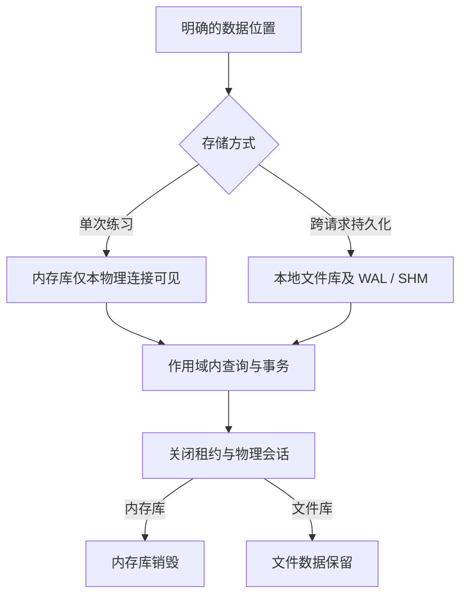

# type-orm-sqlite · SQLite 驱动

[返回组件总览](../components.md)

使用本地文件或单连接内存库，复用 ORM 的查询、模型和事务。连接显式启用外键，并限制 busy 等待；文件数据库默认验证 WAL 和 FULL 同步。

## 安装与依赖

需要 PHP `>=8.4 <8.6`、`ext-pdo_sqlite`、`type-orm` 和 `type-runtime`。无需数据库服务器；文件库需要已有的本地目录。

在消费应用根执行以下命令，源码与完整 API 说明也随包安装：

```bash
composer config minimum-stability RC
composer config prefer-stable true
composer require zoujingli/type-orm-sqlite:1.0.0-rc.5
```

以上固定该组件的候选版本 `1.0.0-rc.5`，RC 不代表稳定版本；执行前按[版本安装说明](../releases.md#composer-按版本安装)核对公开状态。Composer 从默认 Packagist 解析传递依赖，无需配置 VCS 仓库；提交应用的 `composer.lock` 固定实际版本。开发分支与版本安装的区别见[组件总览](../components.md#安装组件)。

## 最小使用示例

将下例保存为独立应用的 `app/main.php`，默认用 `:memory:` 只执行参数绑定查询。按[运行声明式示例](../components.md#运行声明式示例)使用带参数的 `main($argc, $argv)` 启动。

```php
<?php

declare(strict_types=1);

use Type\Orm\Database;
use Type\Orm\Sqlite\SqliteDriver;
use Type\Runtime\ExecutionScope;

/**
 * 在单一连接内执行查询，内存库会随连接关闭销毁。
 *
 * @param list<string> $argv 可选第二项为已准备目录中的 SQLite 绝对路径。
 */
function main(int $argc, array $argv): void
{
    $filename = $argv[1] ?? ':memory:';
    $database = new Database(new SqliteDriver($filename), 1, 0);
    $scope = new ExecutionScope();
    try {
        $connection = $database->connect($scope);
        echo json_encode($connection->query('SELECT ? AS value', [7]), JSON_THROW_ON_ERROR) . "\n";
    } finally {
        try {
            $scope->close();
        } finally {
            $database->close();
        }
    }
}
```

执行 `php dev.php` 应输出含 `value=7` 的 JSON。内存库随该连接关闭销毁；传入文件路径时用 `php dev.php "$TYPE_SQLITE_FILE"`，路径必须符合下文约定。

## 内存库与文件库

`:memory:` 只属于当前物理连接，两个连接不是同一个数据库。即使池容量为 1，归还时关闭物理会话也会销毁该内存库；它适合一次执行内的示例，不用于跨请求数据持久化。

文件库必须使用运行时解析的绝对路径及已存在目录。以应用根为明确基准解析部署提供的数据位置，不把开发电脑路径写入配置。当前驱动接受以 `/` 开头的路径，在 Windows 上还接受盘符绝对路径，支持正斜杠和反斜杠分隔符。Linux ARM64、macOS ARM64、Windows x64 的 SQLite 独立消费者已完成 PHP、AOT 和无源码运行，具体范围见[平台与验收](../platforms.md)。

## 配置参数

| `SqliteDriver` 参数 | 默认值 | 说明 |
| --- | --- | --- |
| `filename` | 必填 | `:memory:` 或满足驱动校验的本地文件路径 |
| `busyMilliseconds` | 1000 | 毫秒，0–60000，写竞争等待上限 |
| `wal` | true | 文件库启用并验证 WAL；内存库自动关闭 |
| `generation` | 1 | 正整数身份代次 |
| `role` | writer | reader 启用 query_only |

文件 WAL 模式同时设置 FULL 同步；外键检查在每个连接明确开启并验证。不采用共享网络文件系统存放 WAL 数据库。

## 在单连接内体验 CRUD

将以下片段放到最小示例取得 `$connection` 后的位置，用于默认内存库：

```php
$connection->raw('CREATE TABLE users (id INTEGER PRIMARY KEY, name TEXT NOT NULL, age INTEGER NOT NULL)');
$connection->table('users')->insert(['id' => 7, 'name' => '示例', 'age' => 20]);
$connection->transaction(static function (\Type\Orm\Connection $transaction): void {
    $transaction->table('users')->where('id', '=', 7)->update(['age' => 21]);
});
$rows = $connection->table('users')->where('id', '=', 7)->get();
echo json_encode($rows, JSON_THROW_ON_ERROR | JSON_UNESCAPED_UNICODE) . "\n";
```

结果包含 id=7、age=21。这里的 DDL 只在该内存会话创建示例表；持久文件应通过版本化 Migrator 管理结构，避免每次请求执行建表。SQLite 当前在租约归还时关闭物理连接，以隔离 PRAGMA、附加库和临时对象；执行 `raw()` 不会立即关闭当前租约。

### 验证回滚，而不只验证成功

接在上述 CRUD 片段之后，主动制造一次业务异常：

```php
try {
    $connection->transaction(static function (\Type\Orm\Connection $transaction): void {
        $transaction->table('users')->where('id', '=', 7)->update(['age' => 99]);
        throw new \LogicException('docs_rollback');
    });
} catch (\LogicException $error) {
    if ($error->getMessage() !== 'docs_rollback') {
        throw $error;
    }
}
$user = $connection->table('users')->where('id', '=', 7)->first();
echo json_encode(['age' => $user['age']], JSON_THROW_ON_ERROR) . "\n";
```

正常输出仍为 `{"age":21}`。原事务已经回滚，不能把 99 当作成功写入。本练习使用表查询；业务 Model 在回滚后还会失效，需要重新查询后继续操作。



关闭连接只是资源收尾，不会删除持久文件。完成文件库练习后，先确认所有使用该专属数据库的进程均已退出，再处理其数据库、WAL/SHM 与迁移锁；不要把清理开发样例目录用于生产数据目录。

## 并发、锁与事务

WAL 可以让读者与写者并行，但同一时刻仍只有一个写者。长读事务可能阻止检查点完成；缩短事务并及时关闭流，不用无限 busy 等待掩盖争用。

SQLite 没有 MySQL/PostgreSQL 的行锁语义，`lockForUpdate()` 不能模拟成功。事务开始模式及具体能力通过 ORM 方言处理，跨数据库业务须保留真实差异。

普通 DDL 可与迁移记录在同一事务提交。文件迁移使用稳定的 `.type-migration.lock`，不能在迁移运行中替换数据库或删除锁文件。锁只约束迁移协作者，不阻止普通业务写入。

## 字段与持久化

精确 decimal、bigint 和 UTC 时间按模型声明存储在能保持语义的 TEXT 列；不要依赖 SQLite 数值亲和把精确十进制字符串转换成浮点数。

数据库、WAL/SHM 与迁移状态属于持久化数据。reader 的 query_only 是会话策略，不是文件权限沙箱。部署给数据目录适当权限；只读代码目录不等于数据目录也应只读。

## 常见问题

| 现象 | 原因与处理 |
| --- | --- |
| 第二次请求表消失 | 使用了内存库且上一次连接已关闭；持久业务改用文件库 |
| 文件路径无效 | 相对路径、未建父目录或平台形式不满足当前检查 |
| database is locked | 排查长事务/写竞争，按预算处理 busy，不盲目重试写入 |
| 无法进入 WAL | 检查文件系统和目录权限，不能把失败当作已启用 |
| 外键插入失败 | 驱动确实启用外键，检查先后顺序和实际关联数据 |

## 编译与验证

AOT 携带实际 PDO SQLite、SQLite 库与匹配 PHPX/libphp。静态内置模块不能靠删除 ini 卸载；应以真实 embed 模块检查为准。

本仓库验证入口：`composer build:sqlite`、`composer test:sqlite`、`composer test:sqlite-consumer`。`php tests/orm-suite-consumer.php sqlite` 验证完整独立消费，原生模式加 `--native`。

继续阅读：[ORM](type-orm.md)、[数据库指南](../database.md)、[MySQL](type-orm-mysql.md)、[PostgreSQL](type-orm-pgsql.md)。

本文以本仓库当前公开接口为依据；安装版本请同时核对包内 README。[对应源码与包说明](https://github.com/zoujingli/type-orm-sqlite)。
