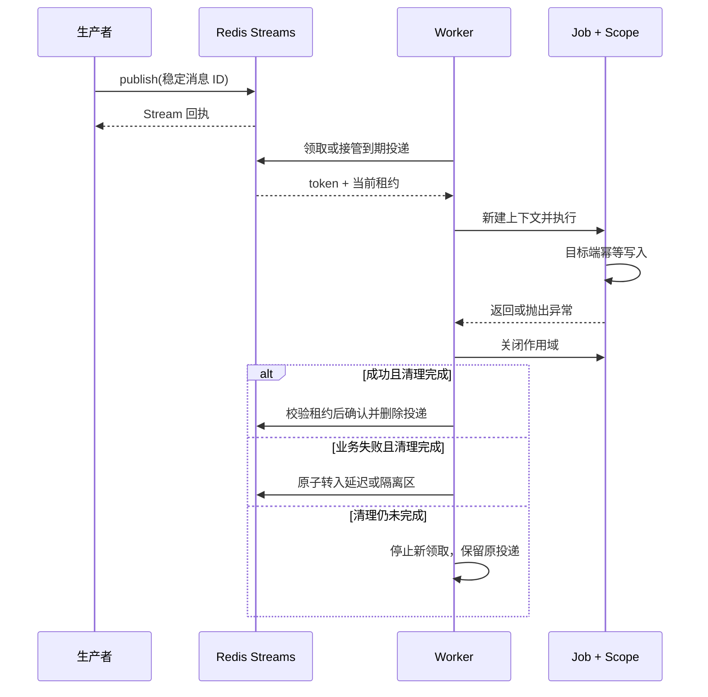

# type-queue · 任务队列

[返回组件总览](../components.md)

以 Redis Streams 保存消息，通过显式 Job 注册、租约领取、Worker、有限重试和隔离记录执行后台任务。交付模型是至少一次，消费者应按稳定消息 ID 在实际业务写入目标实现幂等。

## 投递与业务完成的区别

Queue 负责保存和领取消息，Worker 负责创建独立任务作用域，Job 负责真实业务效果。一次成功投递只是取得 Redis 回执；只有处理器正常返回且作用域已清理，Worker 才确认当前投递。



租约防止旧执行者继续操作受管 Redis 状态，不能撤回已发生的数据库、HTTP 或设备效果。业务防重必须与实际效果放在同一目标的原子边界内。

## 安装与依赖

需要 PHP `>=8.4 <8.6`、`type-runtime`、`type-redis` 和 phpredis。使用专属可靠 Redis，配置容量、noeviction 与 AOF；无需自动安装 core、ORM、cache 或 scheduler。

在消费应用根执行以下命令，源码与完整 API 说明也随包安装：

```bash
composer config minimum-stability dev
composer config prefer-stable true
composer require zoujingli/type-queue:dev-main
```

Composer 从 Packagist 自动解析组件及其传递依赖，无需额外配置 VCS 仓库。提交应用的 `composer.lock`；`dev-main` 是开发版本，不能等同稳定发布。公共安装约定见[组件总览](../components.md#安装组件)。

## 最小使用示例

以下入口在专属示例命名空间投递并消费一条任务。使用[声明式启动器](../components.md#运行声明式示例)调用 `main()`，连接配置见 [Redis](type-redis.md)。

```php
<?php

declare(strict_types=1);

use Type\Queue\Job;
use Type\Queue\JobContext;
use Type\Queue\Message;
use Type\Queue\Queue;
use Type\Queue\Registry;
use Type\Queue\Worker;
use Type\Redis\Purpose;
use Type\Redis\RedisConfiguration;
use Type\Redis\RedisManager;
use Type\Runtime\ExecutionScope;

/** 示例任务只输出稳定消息 ID；实际业务效果需在写入目标原子防重。 */
final class ReadmeJob implements Job
{
    /** @param array<string, mixed> $payload 已由消息协议验证的 JSON 数据。 */
    public function handle(JobContext $context, array $payload): void
    {
        $context->assertActive();
        echo $context->message()->id() . "\n";
    }
}

/**
 * 在启动期启用 I/O hook，并在同一协程内装配、执行及关闭队列资源。
 * 示例命名空间只用于投递与消费演示，不提供业务幂等保证。
 */
function main(): void
{
    \Type\Runtime\CoroutineRuntime::enableIo();
    \Type\Runtime\CoroutineRuntime::run(static function (): void {
        $host = getenv('REDIS_HOST');
        $port = filter_var(getenv('REDIS_PORT') === false ? '6379' : getenv('REDIS_PORT'), FILTER_VALIDATE_INT,
            ['options' => ['min_range' => 1, 'max_range' => 65535]]);
        if (!is_int($port)) {
            throw new InvalidArgumentException('REDIS_PORT 必须为有效整数端口');
        }
        $manager = new RedisManager(['default' => new RedisConfiguration($host === false ? '127.0.0.1' : $host, $port)]);
        $scope = new ExecutionScope();
        try {
            $redis = $manager->connection($scope, 'default', Purpose::SCRIPT);
            $queue = new Queue($redis, 'readme-example', 'example', 30000, 100);
            $registry = new Registry();
            $registry->register('readme.echo', 1, static fn (JobContext $context): Job => new ReadmeJob());
            $queue->publish(new Message('readme-' . bin2hex(random_bytes(8)), 'readme.echo', 1, []));
            $worker = new Worker($queue, $registry, 'readme-worker');
            try {
                $worker->run(1);
            } finally {
                $worker->stop();
            }
        } finally {
            try {
                $scope->close();
            } finally {
                $manager->close();
            }
        }
    });
}
```

执行 `php dev.php` 应输出一个 `readme-` 开头的消息 ID。启动期先启用 I/O hook，随后在 `CoroutineRuntime::run()` 的同一协程内创建管理器、作用域、Queue 和 Worker，并在退出前关闭；不能先在外层借连接再把它带进协程。下面的重试与幂等练习继续放在对应的协程入口或 Job 方法中。示例仅打印流程；stdout 不具备业务幂等保证，已有积压时本轮可能先消费较早消息。

## 定义消息与处理器

`Message($id, $type, $version, $payload, $context = [])` 只保存稳定 ID、类型版本、JSON 数据和字符串关联上下文，不从消息反序列化任意类。

`Registry::register($type, $version, $factory)` 的工厂为 `Closure(JobContext): Job`。每次执行创建新 Job 与 Scope，即使不使用上下文也要保留参数。Job 的 `handle(JobContext $context, array $payload): void` 负责校验具体业务载荷。

Worker 在当前 Swoole 协程内串行处理投递，工厂与 Job 回调中的 `ExecutionScope::current()` 等于 `$context->scope()`。消息关联 context 只用于追踪，不自动成为可信绑定。应用在验证任务身份后建立绑定；失败、重试和下一条投递均使用各自的作用域。Worker、Queue 和连接在同一协程内创建，非协程调用 `runOnce()` 会在领取前报告 `coroutine_required`。

`$context->message()->id()` 是权威消息身份；在业务数据库唯一约束或目标服务的幂等接口内同时核对 ID 和载荷身份，不能仅靠“先查询是否处理”防重。

## 队列参数

| `Queue` 参数 | 默认值 | 含义 |
| --- | --- | --- |
| `application / name` | name=default | 队列命名空间，滚动升级保持稳定 |
| `leaseMilliseconds` | 30000 | 毫秒，当前领取租约 |
| `capacity` | 10000 | Stream、延迟和隔离记录的总容量 |
| `retentionSeconds` | 604800 | 秒，隔离保留期默认七天 |

容量满拒绝新投递，不裁剪未确认消息。同一队列使用自身 workers 消费组，不为其他应用在同一 Stream 任意添加组。Queue 使用 script 连接，领取是非阻塞操作。

## Worker 与有限重试

可把最小示例中的 Worker 替换为：

```php
$policy = new \Type\Queue\RetryPolicy(
    maxAttempts: 5,
    baseDelayMilliseconds: 1000,
    maxDelayMilliseconds: 30000,
    maxExecutionMilliseconds: 20000
);
$worker = new \Type\Queue\Worker($queue, $registry, 'docs-worker', $policy);
try {
    $processed = $worker->run(10);
} finally {
    $worker->stop();
}
```

`run(10)` 最多处理本轮 10 次，当前固定一条预取、一条在途；不是永久阻塞服务。返回值是本轮处理次数，包含重试或隔离处理，不是业务成功数；成功数看 `$worker->statistics()['completed']`。没有可领取消息时提前返回，不等待延迟任务到期。

持续消费由应用在退出条件内轮询或进程监督器组织。空轮询应有适当间隔，避免忙循环；每个进程使用可区分的 consumer 名称。退出时先 stop Worker，再关闭外层 Scope 和 RedisManager。

RetryPolicy 默认尝试 3 次、基础延迟 1000ms、最大延迟 60000ms、执行预算 30000ms。重试采用有上限的退避与抖动；崩溃重领也计入尝试次数。未知类型/版本、非法载荷或超过次数进入隔离。

## 延迟、续租与重领

`publishDelayed($message, $delayMilliseconds)` 延迟投递，`promote($limit)` 有界提升到期消息；时间来自 Redis TIME。Worker 也会在消费流程中处理到期提升。

长任务在检查点调用 `$context->reservation()->renew()` 并 `assertActive()`；没有后台续期可以保护任意阻塞代码的保证。租约到期后，`reclaim($consumer)` 有界重领并替换 token，旧执行者不能确认、续租或发起新的受管效果。

`Reservation::effect($lua, $keys, $arguments)` 在同一 Redis 脚本里先验证租约；其他数据库和 HTTP 效果仍需目标端版本/幂等约束。Lua 异常可能发生在部分写入之后。

## 练习：把 Redis 业务结果与防重放在同一次写入

如果真实业务结果就是 Redis 中的一份接收记录，可以将最小示例 `ReadmeJob::handle()` 的方法体替换为以下代码。它按稳定消息 ID 保存 JSON，并核对重复消息的内容；不另建一个“先查后写”的防重窗口。

```php
$context->assertActive();
$message = $context->message();
$encoded = json_encode($payload, JSON_THROW_ON_ERROR | JSON_PRESERVE_ZERO_FRACTION);
$created = $context->reservation()->effect(<<<'LUA'
local previous=redis.call('GET',KEYS[1])
if previous then
 if previous~=ARGV[1] then return redis.error_reply('message payload conflict') end
 return 0
end
redis.call('SET',KEYS[1],ARGV[1])
return 1
LUA, ['readme:received:' . $message->id()], [$encoded]);
echo json_encode(['id' => $message->id(), 'created' => $created === 1], JSON_THROW_ON_ERROR) . "\n";
```

为了观察重复，在生产者处给同一个 `Message` 投递两次，并将 `run(1)` 改为 `run(2)`。专属空示例队列中，第一次输出 created=true，第二次 false；两次租约均可正常确认。更换载荷而复用 ID 会失败并进入重试流程。对比的是本例编码后的 JSON 字节，业务若需要语义等价应先定义统一编码。

此例只保护同一 Redis 的记录。写 SQL 数据库时应由该数据库的唯一约束和事务共同保护业务效果；不要先在 Redis 标记成功再写数据库。Lua 运行错误也没有通用事务回滚，因此脚本先完成检查，再执行本例唯一的写操作。

示例新增的 `readme:received:<消息 ID>` 是业务数据，队列确认不会删除它。练习后只在专属测试实例按实际生成的 ID 清理；生产去重记录保留时间应覆盖可能的重试与人工重放窗口。

## 隔离与人工重放

`quarantined(20)` 返回保留期内的有界隔离记录，包含 receipt、编码后的原消息、尝试次数和原因。在维护命令中取得与 Worker 相同命名空间的 `$queue` 后，可以只查看定位字段：

```php
foreach ($queue->quarantined(20) as $entry) {
    echo json_encode([
        'receipt' => $entry['receipt'],
        'attempt' => $entry['attempt'],
        'reason' => $entry['reason'],
    ], JSON_THROW_ON_ERROR | JSON_UNESCAPED_UNICODE) . "\n";
}
```

先修复处理器/数据问题并核对既有副作用，再在维护入口显式调用 `$newReceipt = $queue->replay($receipt)`。这里的 `$receipt` 必须来自已核对的具体隔离记录，不是业务 Message ID，也不应无条件重放整个列表。返回值是新的 Redis Stream receipt；重放保留业务消息 ID，但开始新的重试周期，不能据此生成新的业务幂等键。`quarantine_missing` 表示记录已不存在或超过保留期。

`collect(100)` 回收过期隔离记录；过期后不可重放。实际回收前仍占容量，应周期调用。重试/隔离转移失败时保留源消息等待重领，故障可能造成重复，不能把异常当成“从未执行”。

## 停止与观测

`stop($drainSeconds = 5.0)` 取消就绪并停止新领取，缩短在途业务与清理预算。合作式停止无法撤销已开始 I/O 或任意 PHP 循环，进程监督器需要独立总硬截止；强制退出留下 pending，租约到期后恢复。

`Queue::statistics()` 提供容量、backlog、延迟、隔离和 Stream 年龄；`counters()` 返回本对象故障/拒绝计数，无 Redis 访问。Worker statistics 包含 received/completed/failed/retried/quarantined 和就绪状态。记录数 leased 可能包含过期未回收租约，不等于实时运行任务数。

队列 Redis 故障会取消 Worker 就绪，恢复后建立新连接和 Worker，不在失效会话上无限循环。

## 常见问题与编译

| 现象 | 处理 |
| --- | --- |
| 重复业务写入 | 使用稳定消息 ID 和目标端原子幂等 |
| `lease_lost` | 停止新效果，检查任务时长、租约与主动续期 |
| 未知类型/版本 | 部署兼容 Registry 后核对隔离记录再重放 |
| 投递超时 | 结果可能未知，按 ID 对账，不能假定没有投递 |
| 满容量 | 处理积压与过期隔离，核对消费速度，不能删除未确认消息 |

原生 build 可由构建配置 queue 调用 JobCompiler 生成 Registry；当前 PHP prepare 不生成该注册表，开发时使用本页显式登记方式。类型版本和处理器全量 AOT，生产没有类扫描。主仓入口：`composer test:queue`、`composer test:queue-leases`、`composer test:queue-retries`；对应 native 验收先构建。

继续阅读：[Redis 可靠存储](type-redis.md#脚本与可靠存储)、[调度](type-scheduler.md)、[ORM Outbox](type-orm.md#迁移与-outbox)。

本文以本仓库当前公开接口为依据；安装版本请同时核对包内 README。[对应源码与包说明](https://github.com/zoujingli/type-queue)。
