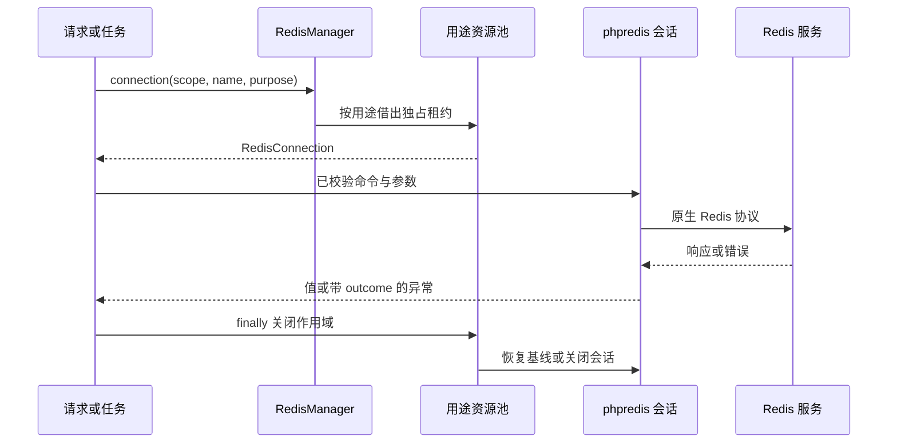

# type-redis · Redis 连接

[返回组件总览](../components.md)

通过命名连接和用途隔离管理 phpredis 会话。提供普通命令、阻塞命令、pipeline、事务和可信脚本入口，供缓存、队列和调度复用。

先用下方 PING 确认端点，再练习带 TTL 的读写与 pipeline，最后按需要接入 WATCH 或 Lua。Redis 服务是外部数据服务；phpredis 和 Swoole 属于应用的原生运行依赖，构建与部署责任见[环境说明](../environment.md)。



## 安装与依赖

需要 PHP `>=8.4 <8.6`、phpredis `^6.3` 与 `type-runtime`。当前面向独立 Redis 服务，不提供 Cluster、Sentinel 或自动故障切换协议。

在消费应用根执行以下命令，源码与完整 API 说明也随包安装：

```bash
composer config minimum-stability dev
composer config prefer-stable true
composer require zoujingli/type-redis:dev-main
```

Composer 从 Packagist 自动解析组件及其传递依赖，无需额外配置 VCS 仓库。提交应用的 `composer.lock`；`dev-main` 是开发版本，不能等同稳定发布。公共安装约定见[组件总览](../components.md#安装组件)。

## 最小使用示例

下面只发出 PING。保存为独立应用的 `app/main.php`，设置可达的 `REDIS_HOST/REDIS_PORT`，按[运行声明式示例](../components.md#运行声明式示例)使用 `main()` 启动。

```php
<?php

declare(strict_types=1);

use Type\Redis\RedisConfiguration;
use Type\Redis\RedisManager;
use Type\Runtime\ExecutionScope;

/**
 * 只对声明的 Redis 发出 PING，所有退出路径关闭租约及连接管理器。
 */
function main(): void
{
    $host = getenv('REDIS_HOST');
    $port = filter_var(getenv('REDIS_PORT') === false ? '6379' : getenv('REDIS_PORT'), FILTER_VALIDATE_INT,
        ['options' => ['min_range' => 1, 'max_range' => 65535]]);
    if (!is_int($port)) {
        throw new InvalidArgumentException('REDIS_PORT 必须为有效整数端口');
    }
    $manager = new RedisManager(['default' => new RedisConfiguration($host === false ? '127.0.0.1' : $host, $port)]);
    $scope = new ExecutionScope();
    try {
        $redis = $manager->connection($scope);
        echo $redis->command('PING', ['type-redis-readme']) . "\n";
    } finally {
        try {
            $scope->close();
        } finally {
            $manager->close();
        }
    }
}
```

执行 `php dev.php` 应输出 `type-redis-readme`。默认连接为本机 6379；需要认证或 TLS 时按下文修改 `RedisConfiguration`，不会自动读取其他环境键。

## 配置命名连接

`RedisManager` 接收连接名称到 `RedisConfiguration` 的映射；名称如 default、cache、reliable。实际连接在工作进程第一次借用时创建。

| `RedisConfiguration` 参数 | 默认值 | 单位/限制 |
| --- | --- | --- |
| `host / port` | 127.0.0.1 / 6379 | host 不含协议，port 为 1–65535 |
| `database` | 0 | 非负逻辑数据库编号 |
| `password / username` | null / null | username 非空时必须同时给密码 |
| `connectTimeout / readTimeout` | 1.0 / 1.0 | 秒，大于 0 且不超过 60 |
| `tls` | false | true 时强制证书和主机名验证 |
| `caFile` | null | 可选可读 CA 文件；设置时必须启用 tls |

认证和 CA 从运行环境或配置快照显式传入，不写进构建常量。连接不持久化，phpredis 自动重试关闭；命令不隐式添加前缀或序列化。

## 用途与容量

`$manager->connection($scope, 'default', Purpose::COMMAND)` 取得指定用途的连接。容量是每个命名连接的各用途上限，可通过管理器第二个参数覆盖。

| Purpose | 默认容量 | 操作 |
| --- | --- | --- |
| `COMMAND` | 4 | `command()` 普通命令 |
| `BLOCKING` | 1 | `blocking()`，阻塞单独占池 |
| `PIPELINE` | 1 | `pipeline()` 批次，无原子性保证 |
| `TRANSACTION` | 1 | `transaction()`，WATCH + MULTI/EXEC |
| `SCRIPT` | 1 | `script()` 可信 Lua |

容量范围 1–1024。同步调用满载立即拒绝；Swoole 协程默认最多等待 1 秒、排队 64 项，同时受作用域更短截止与取消约束。传入 `connection($scope, 'default', Purpose::COMMAND, 0)` 显式即时借用。普通会话可保留少量空闲连接；其余用途归还即销毁。不要使用 command 绕过状态、管理、阻塞或脚本限制。

## 常用命令与 pipeline

下例放在最小示例的 `try` 中，操作专属示例键：

```php
$redis->command('SET', ['docs:redis:message', 'hello', 'EX', 60]);
$value = $redis->command('GET', ['docs:redis:message']);

$pipeline = $manager->connection($scope, 'default', \Type\Redis\Purpose::PIPELINE);
try {
    $replies = $pipeline->pipeline([
        ['GET', ['docs:redis:message']],
        ['EXISTS', ['docs:redis:message']],
    ]);
} finally {
    $pipeline->close();
}
```

批次格式为 `[[命令, 参数列表]]`，最多 1000 项。pipeline 只是批量传输，失败时可能已有部分命令执行。

在片段之后打印结果，正常应得到 `hello` 及 `["hello",1]`：

```php
echo $value . "\n";
echo json_encode($replies, JSON_THROW_ON_ERROR) . "\n";
$redis->command('DEL', ['docs:redis:message']);
```

这些键专供教程使用，并带 60 秒 TTL；显式删除只清理本例键。若两次操作间超过 TTL，GET 可以返回 false，EXISTS 可以返回 0。业务需根据缺失语义处理，不能把有效期当作跨命令快照。

## WATCH 事务

```php
$transaction = $manager->connection($scope, 'default', \Type\Redis\Purpose::TRANSACTION);
try {
    $result = $transaction->transaction(
        ['docs:redis:counter'],
        static function (\Type\Redis\RedisConnection $connection): array {
            $current = $connection->command('GET', ['docs:redis:counter']);
            return [['SET', ['docs:redis:counter', (string) ((int) $current + 1), 'EX', 60]]];
        }
    );
    $committed = $result->committed();
} finally {
    $transaction->close();
}
```

示例键只存普通整数文本。WATCH 冲突时 committed 为 false，回调不会自动重跑。EXEC 内部某命令失败不回滚已执行命令，不能按数据库事务解释。

## 脚本与可靠存储

`script($lua, $keys, $arguments)` 只执行应用可信脚本，不能接受请求提供的 Lua。脚本有原子执行顺序但无错误回滚；Redis 错误可能发生在部分写入之后。

`ScriptGuard` 让上层组件在实际写入脚本里检查租约或权限，队列/调度组合复用此接口。普通业务不需要自己实现保护器。

`StoragePolicy::verify($reliable, $cache, $appendFsync = 'always')` 用真实 run_id 区分故障域，并检查可靠主库的容量、noeviction、AOF 和 fsync 策略。需要 INFO 与 CONFIG GET 只读诊断权限；不会修改服务。可靠存储不能仅靠在缓存实例里换逻辑 database 隔离。

## 错误与清理

`RedisException::errorCode()` 给稳定错误码，`outcome()` 表达结果：

| 状态 | 处理含义 |
| --- | --- |
| `NOT_STARTED` | 操作未开始，如配置或连接初始化失败 |
| `REJECTED` | 服务拒绝；按具体错误处理 |
| `MAY_HAVE_APPLIED` | 可能已有部分效果，先核对目标状态 |
| `UNKNOWN` | 无法确认结果，不能据此盲目重试写入 |

错误会让不可信会话失效。连接不能跨请求、Fiber、协程或进程使用；Scope 关闭清理租约，最后仍需关闭 RedisManager。嵌套 finally 保证前一次清理异常不跳过管理器。

## 编译与验证

AOT 包含 phpredis、匹配 PHPX/libphp 和实际 TLS 依赖。本仓库可运行 `composer test:redis`、`composer test:redis-security`；原生先 `composer build:redis` 再 `composer test:redis-native`，使用专属 Redis 环境。

继续阅读：[缓存](type-cache.md)、[队列](type-queue.md)、[调度](type-scheduler.md)。

本文以本仓库当前公开接口为依据；安装版本请同时核对包内 README。[对应源码与包说明](https://github.com/zoujingli/type-redis)。
