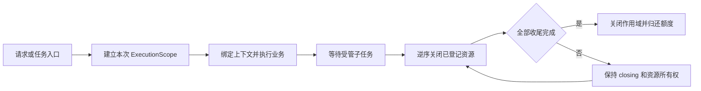
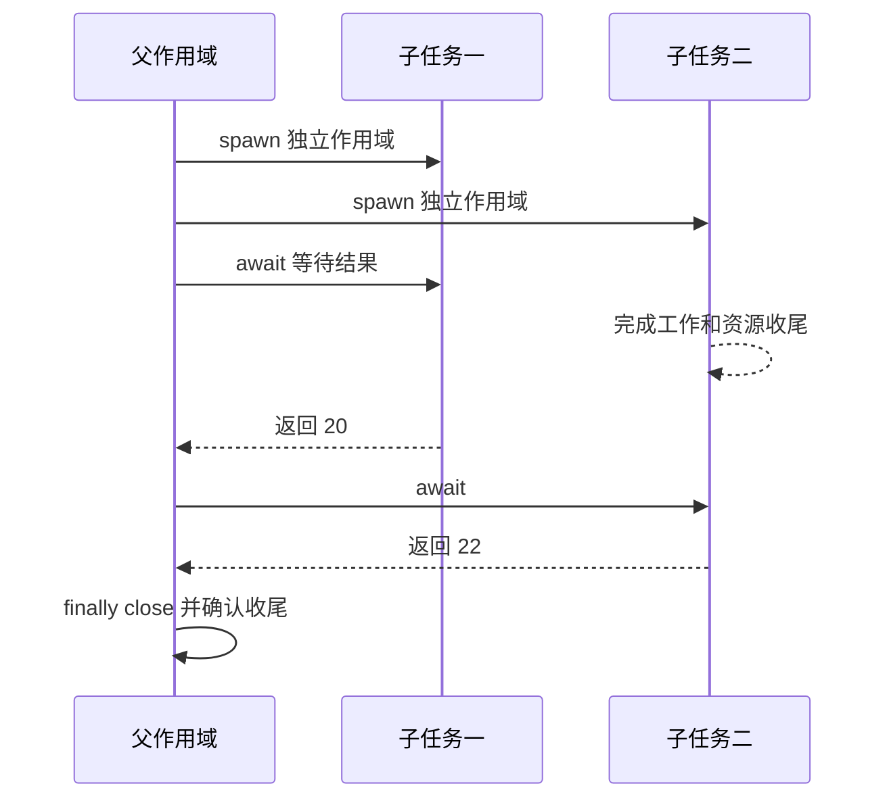

# type-runtime · 执行作用域与资源管理

[返回组件总览](../components.md)

为一次 HTTP 请求、命令或后台任务建立明确的资源边界：参数先校验，资源按顺序启动，结束时逆序关闭；截止时间、取消和容量沿调用链传递。其他插件的数据库连接、Redis 租约和日志绑定都复用这一层。进程、线程和协程的整体选择见[进程、线程与协程](../runtime.md)。

## 先理解一次执行

作用域回答三个问题：这次操作还允许继续吗、哪些资源属于它、何时才能归还额度。业务返回和资源收尾是两个时刻；数据库、网络和后台任务都沿用这个区别。



图中的再次清理由既有资源所有者或完成路径驱动，不会凭空创建后台重试。先运行下面的参数示例，再尝试受管协程示例，最后接入 ORM 或 Redis，能够分清参数、并发与外部依赖各自的失败。

## 安装与依赖

需要 PHP `>=8.4 <8.6`、`ext-filter` 和 Swoole `>=6.2 <7`。Swoole 是 TypeApp 通信、进程、线程、协程及事件循环的运行时基础；同步作用域可以只做本地计算，但使用通信或受管子任务时必须进入匹配的 Swoole 执行上下文。

在消费应用根执行以下命令，源码与完整 API 说明也随包安装：

```bash
composer config minimum-stability dev
composer config prefer-stable true
composer require zoujingli/type-runtime:dev-main
```

Composer 从 Packagist 自动解析组件及其传递依赖，无需额外配置 VCS 仓库。提交应用的 `composer.lock`；`dev-main` 是开发版本，不能等同稳定发布。公共安装约定见[组件总览](../components.md#安装组件)。

## 最小使用示例

将以下代码保存为独立应用的 `app/main.php`。按[运行声明式示例](../components.md#运行声明式示例)准备开发启动器，使用带参数的 `main($argc, $argv)` 调用。

```php
<?php

declare(strict_types=1);

use Type\Runtime\Arguments;
use Type\Runtime\ExecutionScope;

/**
 * 读取受限命令参数并在命令作用域中计算；结束时收回所有受管资源。
 *
 * @param list<string> $argv 命令入口提供的完整参数。
 */
function main(int $argc, array $argv): void
{
    $arguments = new Arguments($argv, ['name', 'times'], ['quiet']);
    $scope = new ExecutionScope();
    try {
        $scope->assertActive();
        $result = str_repeat($arguments->text('name', 'Type') . "\n", $arguments->integer('times', 1, 1, 10));
        if (!$arguments->has('quiet')) {
            echo $result;
        }
    } finally {
        $scope->close();
    }
}
```

执行 `php dev.php --name TypeApp --times 2`，应输出两行 `TypeApp`；增加 `--quiet` 后不输出。`--times 0`、重复或未知选项均抛出异常，不能当作默认值继续运行。

## 参数解析

`Arguments($argv, $valueOptions, $switches)` 的第一个数组包含程序名。上例允许 `--name value`、`--name=value` 和 `--quiet`；通过 `text()` 读取字符串，通过 `integer()` 声明默认值及闭区间。值选项必须非空，`--name=` 会被拒绝；字符串 `0` 保留为显式输入，整数读取再按业务区间校验。

## 截止、取消与资源清理

以下片段放在业务函数内，替换最小示例的作用域创建与处理部分：

```php
$cancel = new \Type\Runtime\Cancellation();
$scope = new \Type\Runtime\ExecutionScope(
    deadline: new \Type\Runtime\Deadline(2.0),
    context: ['command_id' => 'sync-42'],
    childLimit: 4,
    cleanupSeconds: 0.5,
    cancellation: $cancel
);
try {
    $scope->assertActive();
    // 在业务循环和外部效果前重复检查。
    $cancel->cancel();
} finally {
    $scope->close();
}
```

| 配置 | 单位与作用 |
| --- | --- |
| `Deadline($seconds)` | 秒，使用单调时钟；默认 null 无业务截止 |
| `context` | 字符串键值，保存执行关联身份 |
| `childLimit` | 1–1024，默认 16，限制直接子任务数量 |
| `cleanupSeconds` | 秒，0–60，默认 5，控制合作式清理 |
| `TaskBudget` | 可共享的执行额度，限制任务树总在途量 |

自定义资源实现 `ManagedResource::start()/stop()`，以 `$scope->open($resource)` 登记。登记发生在启动之前，因此部分启动失败也会清理；`stop()` 必须能处理该状态。单个关闭异常不阻止其他资源关闭。

## 协程上下文与所有权

`ExecutionScope` 是业务上下文的显式边界，不使用进程全局“当前请求”。上下文只接受有界字符串键和值，例如 `request_id`、`tenant_id`、`operation_id`；连接、事务、Socket、可变模型、闭包和大载荷必须由作用域单独登记或传递受控值。

在已有协程内用 `$scope->run($operation, $bindings)` 绑定当前作用域，回调签名为 `Closure(ExecutionScope): mixed`。组件通过 `ExecutionScope::current()` 取得它；无绑定抛 `scope_missing`，非协程抛 `coroutine_required`。嵌套返回或异常都会恢复外层，同作用域重入复用资源，独立作用域不继承外层身份；创建者仍负责 `close()`。

构造参数 `context` 是关联信息，消息可以携带它，不能直接视为授权依据。`run()` 的 `bindings` 必须由应用验证后显式提供，`binding($name)` 读取指定值，缺失返回 null。运行时只保存字符串快照并校验生命周期，不读取业务账号或权限表；子任务继承创建时的绑定值，不能继承连接和事务。

独立入口使用 `CoroutineRuntime::run(Closure(): mixed)` 进入官方 Swoole Scheduler，在回调内创建资源。已有协程时直接执行，保留原 hook 配置并传回结果或异常。生成的 CLI 装配先进入协程再创建命令依赖；HTTP 请求、WebSocket 公开回调、队列 Job 和调度 Task 各自绑定本次作用域，退出时恢复原绑定并清理。Worker、Scheduler 及其连接必须在同一协程内装配；直接使用 Socket 或其他自定义协议入口时，调用方负责在消息边界创建并绑定作用域。完整示例与验证方法见[当前作用域](https://github.com/zoujingli/typeapp/blob/main/docs/development/managed-tasks.md#当前作用域与应用绑定)。

`CoroutineRuntime::enableIo()` 是启动配置入口，在主线程补齐网络、等待及已加载 PDO 扩展对应的官方 hook，并保留已有 flags。生成 CLI 和 HTTP 宿主在运行前调用；自定义数据库任务入口应在 `run()` 前调用。业务线程复用启动前安装的 hook，只有无需修改配置时才允许重复调用。PostgreSQL、SQLite 的 hook 还需要相应 Swoole 编译选项，具体要求见 [ORM 安装与依赖](type-orm.md#安装与依赖)。

`spawn()` 在当前线程内创建 Swoole 协程，并为子协程建立新的作用域和执行者：字符串上下文按快照复制，`Deadline`、取消信号和 `TaskBudget` 继续共享，父作用域登记的连接和租约不自动转移。父作用域缩短截止或取消后，子协程只能在合作式检查和可让出的原生操作处停止；`await()` 超时不会提前释放仍在途的资源。

资源使用会校验进程、原生线程、请求代次、Swoole 协程和 Fiber 身份。把父连接捕获到子协程、把作用域传到另一线程，或在关闭后继续借用，都会被拒绝。跨线程只传递有界标量或编码数据，进入新执行者后重新创建作用域和资源。

## 资源池与租约

`ResourcePool($factory, $capacity, $idleLimit)` 接收零参数工厂，返回实现 `ReusableResource` 的对象；通过 `borrow($scope)` 获取 `ResourceLease`。业务使用 `hold(static function (ReusableResource $resource): mixed { ... })`，在途操作结束前持有容量。不要把租约内资源保存到其他请求。

池满时立即抛 `CapacityException`，不进入等待队列。`idleLimit` 不得超过总容量。Scope 负责归还本次租约；池的所有者在进程结束时调用 `close()`。需要 SQL 或 Redis 时直接使用对应插件的管理器，通常无需自己再包装一层池。

## 受管并发

### 等待两个独立子任务

将下面代码完整替换为示例的 `app/main.php`，开发启动器调用零参数 `main()`。这个例子只使用本地计算和 Swoole 等待，不需要数据库或 Redis；等待用于观察两个子任务交错执行，不能用它推导性能结论。

```php
<?php

declare(strict_types=1);

use Swoole\Coroutine;
use Type\Runtime\CoroutineRuntime;
use Type\Runtime\Deadline;
use Type\Runtime\ExecutionScope;

/** 由父作用域收集两个独立结果，并在退出前确认子任务收尾。 */
function main(): void
{
    CoroutineRuntime::run(static function (): void {
        $scope = new ExecutionScope(new Deadline(2.0), childLimit: 2);
        try {
            $first = $scope->spawn(static function (ExecutionScope $child): int {
                Coroutine::sleep(0.02);
                $child->assertActive();
                return 20;
            });
            $second = $scope->spawn(static function (ExecutionScope $child): int {
                Coroutine::sleep(0.01);
                $child->assertActive();
                return 22;
            });
            echo (string) ($first->await() + $second->await()) . "\n";
        } finally {
            $scope->close();
        }
    });
}
```

执行 `php dev.php` 应输出 `42`。子任务的完成顺序可以不同，但父任务按明确句柄取得结果。把总截止改为 `0.005` 秒可观察截止或等待失败；这是故意失败的练习，仍要保留 `finally`。接入数据库时，连接应在每个 `$child` 内重新借用，不能捕获父连接供两个任务共享。



### 接入实际业务

在 `CoroutineRuntime::run()` 的协程中调用 `$scope->spawn(static function (ExecutionScope $child): mixed { ... })`。子任务使用自己的 Scope 登记资源，通过任务对象等待结果；父 Scope 关闭时取消并等待受管子任务。回调即使不使用上下文，也必须保留参数。线程入口使用 `CoroutineRuntime::startThread()`，进程角色使用 Swoole Server/Process；三者都遵守同一作用域关闭和真实收尾规则。

同步命令不必启用协程。缺少协程上下文抛 `TaskException`，错误码为 `coroutine_required`；不会自动改成串行执行。

## 停止信号与宿主

`ProcessSignals` 只把系统停止请求转为一次 `Closure(): void` 通知，排空和资源回收仍由宿主负责。一个进程只允许一个所有者；`attach()` 注册，`close()` 释放注册并恢复原状态。不要在已由 HTTP 入口或 `ThreadSupervisor` 管理信号的进程里重复注册。

| 环境 | 停止来源与条件 |
| --- | --- |
| Unix | PCNTL 接收 SIGINT/SIGTERM |
| Windows PHP CLI | 可用控制台中的 PHP 控制处理器接收 CTRL_C/CTRL_BREAK |
| Windows embed | 编译的原生控制事件桥；宿主在等待循环调用 `dispatch()` 分发停止标记 |

缺少必需能力时抛出 `signals_unavailable`。关闭窗口、注销或系统强制终止不保证资源排空；线程停止后也必须完成真实 join。HTTP 的 `serve()` 已内置对应停止接入，自定义宿主须显式安排通知、合作式退出与最后清理。各平台实际通过范围见[平台与验收](../platforms.md)。

## 常见问题

| 现象 | 原因与处理 |
| --- | --- |
| `deadline_exceeded` / `cancelled` | 当前预算耗尽或已取消，停止发起新操作并清理 |
| 执行者不匹配 | Scope/连接跨了进程、线程、Fiber 或协程；在当前执行者重新创建 |
| 池满 | 检查租约释放与进程数，再按下游容量调整上限 |
| close 后仍有底层 I/O | 取消是合作式的；原生阻塞操作还需要驱动超时和进程监督 |

## 编译与验证

作用域、资源实现及回调与应用一起全量编译，运行仍需要匹配 PHPX/libphp。自定义并发回调按 TypePHP 的完整参数签名编写。

本仓库可运行 `composer test:tasks` 与 `composer test:deployment-budget`；对应原生验收为 `composer build:tasks` 后执行 `composer test:tasks-native`。

继续阅读：[核心](type-core.md)、[数据库](type-orm.md)、[Redis](type-redis.md)、[日志](type-log.md)。

本文以本仓库当前公开接口为依据；安装版本请同时核对包内 README。[对应源码与包说明](https://github.com/zoujingli/type-runtime)。
