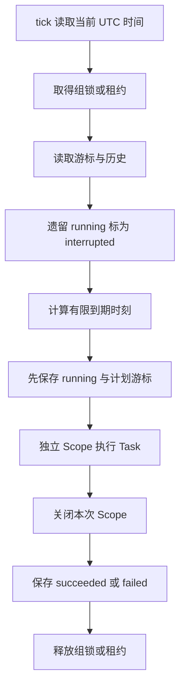

# type-scheduler · 定时调度

[返回组件总览](../components.md)

按 Cron 或固定间隔执行显式登记的 Task，持久化游标和执行历史，并通过本地锁或 Redis 租约协调执行。任务、时间策略和依赖在构建时确定，运行时不扫描 PHP 文件。

## 时间计划如何变成一次执行

Schedule 只计算时刻，Definition 决定任务身份与错过策略，Scheduler 用持久游标决定本轮执行范围。文件锁或 Redis 租约协调一整个 tick；Swoole 协程承载执行与等待，不代替业务计划或状态协议。



因此需要分别观察“本轮没有到期任务”“业务失败”“存储失败”和“上次执行结果待核对”。不能用控制台是否有输出代替任务状态。

## 安装与依赖

需要 PHP `>=8.4 <8.6`、runtime、Redis、Cron Expression 和 PSR-20。文件调度不连接 Redis，但当前 Composer 传递依赖仍检查 phpredis 扩展。

在消费应用根执行以下命令，源码与完整 API 说明也随包安装：

```bash
composer config minimum-stability dev
composer config prefer-stable true
composer require zoujingli/type-scheduler:dev-main
```

Composer 从 Packagist 自动解析组件及其传递依赖，无需额外配置 VCS 仓库。提交应用的 `composer.lock`；`dev-main` 是开发版本，不能等同稳定发布。公共安装约定见[组件总览](../components.md#安装组件)。

## 最小使用示例

此例在 Asia/Shanghai 每天 09:00 触发报表任务，单次运行只执行一次 tick。先准备安全的本地状态目录，再按[运行声明式示例](../components.md#运行声明式示例)使用带参数启动器。

```php
<?php

declare(strict_types=1);

use Type\Scheduler\CronSchedule;
use Type\Scheduler\Definition;
use Type\Scheduler\FileStateStore;
use Type\Scheduler\Scheduler;
use Type\Scheduler\SystemClock;
use Type\Scheduler\Task;
use Type\Scheduler\TaskContext;

/** 展示显式任务接口；每次计划执行由调度器建立独立上下文。 */
final class DailyReport implements Task
{
    /** @return array{completed: bool} 有界且可记录的执行结果。 */
    public function run(TaskContext $context): array
    {
        $context->assertActive();

        return ['completed' => true];
    }
}

/**
 * 在启动期启用 I/O hook，再于同一协程装配并执行一次有限调度。
 * 文件目录的创建与权限属于部署方责任。
 *
 * @param list<string> $argv 第二项为安全本地状态文件路径。
 */
function main(int $argc, array $argv): void
{
    \Type\Runtime\CoroutineRuntime::enableIo();
    \Type\Runtime\CoroutineRuntime::run(static function () use ($argv): void {
        $path = $argv[1] ?? '';
        if ($path === '') {
            throw new InvalidArgumentException('请传入已准备目录中的调度状态文件绝对路径');
        }
        $scheduler = new Scheduler(new SystemClock(), new FileStateStore($path), [
            new Definition('reports.daily', new CronSchedule('0 9 * * *', 'Asia/Shanghai'),
                static fn (TaskContext $context): Task => new DailyReport()),
        ]);
        try {
            echo json_encode($scheduler->tick(), JSON_THROW_ON_ERROR | JSON_UNESCAPED_UNICODE) . "\n";
        } finally {
            $scheduler->stop();
        }
    });
}
```

在独立应用根准备状态目录并运行：

```bash
mkdir -p var/scheduler
export TYPE_SCHEDULER_STATE="$(pwd)/var/scheduler/state.json"
php dev.php "$TYPE_SCHEDULER_STATE"
```

状态目录应只允许调度进程和维护者写入。通常不在计划宽限内时输出 `[]`，属于无到期任务；不是失败。重复 tick 不会重复处理已经推进的计划时刻。演示立即观察结果时，可将 CronSchedule 替换为 `new \Type\Scheduler\IntervalSchedule(1)`；完成体验后使用业务需要的计划和独立状态文件。

## 时间计划与任务定义

| 入口 | 含义 |
| --- | --- |
| `CronSchedule($expression, $timezone = 'UTC', $overlap = 'first')` | 五段 Cron，显式 IANA 时区 |
| `IntervalSchedule($seconds, $anchor = 0)` | 1 秒至 366 天，按固定 UTC 锚点计算 |
| `Definition($id, $schedule, $factory, ...)` | 稳定任务 ID、计划与 `Closure(TaskContext): Task` |
| `Task::run(TaskContext): array` | 返回可记录的有界 JSON 数据 |

任务 ID 在滚动升级中保持稳定。occurrence ID 由稳定任务 ID 与 UTC 计划秒生成，revision 不改变身份；不同业务任务使用新 ID。固定间隔不从进程启动/任务结束重新计时，因此重启不改变节拍。

Cron 默认 UTC；夏令时前跳时不存在的当地时间跳过，后退重叠默认只执行第一次，显式 overlap='both' 才执行两个不同 UTC 时刻。

## 错过执行与有限补跑

`Definition` 默认 misfire='skip'、graceSeconds=59，只考虑宽限内最新的一个时刻。希望补跑时显式设置 catch-up。例如在 main 内创建下列定义，再将它放入 Scheduler 的定义数组：

```php
$definition = new \Type\Scheduler\Definition(
    'reports.interval',
    new \Type\Scheduler\IntervalSchedule(60),
    static fn (\Type\Scheduler\TaskContext $context): \Type\Scheduler\Task => new DailyReport(),
    misfire: 'catch-up',
    catchUpLimit: 3,
    lookbackSeconds: 180
);
```

首次运行也在有限回看窗口内选取计划，按时间升序最多执行三次。每个任务每轮最多补跑 1000 次，回看最多 366 天。同步任务耗时会影响下一轮，不以无限补跑追赶积压。

Scheduler 还有 historyLimit=1000、tickLimit=100、executionMilliseconds=30000；tickLimit 是同一轮所有定义的总触发上限，范围 1–1000，单任务执行预算最大一小时。

入口先在启动期启用 I/O hook；Scheduler、状态存储与连接在 `CoroutineRuntime::run()` 的同一 Swoole 协程内装配和使用，`tick()` 不在已有协程时于读取状态前报告 `coroutine_required`。连接不能从外层执行者带入该协程。每次计划的工厂与 Task 回调内，`ExecutionScope::current()` 等于 `$context->scope()`；正常返回和失败均恢复前一绑定。不同计划不会继承前一次执行的身份、连接或事务。

## 练习：先验证补跑窗口，再接真实时钟

在现有 `DailyReport` 声明下，以下片段可放入 `main()`，单独观察计划选择，不打开状态文件或执行任务。固定输入有助于先确认时间语义。

```php
$definition = new Definition(
    'reports.window',
    new \Type\Scheduler\IntervalSchedule(60),
    static fn (TaskContext $context): Task => new DailyReport(),
    misfire: 'catch-up',
    catchUpLimit: 3,
    lookbackSeconds: 180
);
echo json_encode($definition->due(120, 300), JSON_THROW_ON_ERROR) . "\n";
echo json_encode($definition->due(300, 300), JSON_THROW_ON_ERROR) . "\n";
```

输出分别是 `[180,240,300]` 和 `[]`，数值单位为 Unix UTC 秒。第一个区间 `(120,300]` 有三个到期时刻；第二个游标已经推进至本轮时间，没有重复执行空间。`due()` 返回的是待执行计划，不会自行保存游标。

回到文件示例后，把计划临时改为 `IntervalSchedule(1)`，执行 `once` 再看 `history`，核对 `scheduled_at`、`started_at`、`finished_at` 和 `state`。完成后先停止该示例角色，再清理专属练习目录；生产状态文件不能当缓存删除，删除游标可能重新选择历史计划。

## 持久状态与中断

开始执行前保存 occurrence、running 与游标；任务和清理结束后写 succeeded/failed。清理失败同样记录，不把打印日志当成功。

FileStateStore 使用同机本地文件与稳定 .lock，写临时文件后同步并原子替换。目录由部署方准备；损坏直接报错，不重置游标。状态文件不应放 NFS 或作为多主机共享锁。结果最多 64 KiB、历史最多 10000 条、状态文件上限 16 MiB。

当前 FileStateStore 以 `/` 前缀校验绝对路径，以上文件示例适用于 Unix 风格路径；不能将 Windows 盘符路径视为已经支持。多主机协调使用 RedisStateStore，并按实际平台验证运行依赖。

新执行者把遗留 running 标为 interrupted，保留身份供对账，该次不会自动重试。任务失败也不自动重试；有重试需要时显式投递[队列](type-queue.md)，仍以业务稳定 ID 幂等。

## 多实例 Redis 调度

在应用外层 Scope 中取得 script 连接，再创建 `RedisStateStore($redis, $application, $name = 'default', $leaseMilliseconds = 30000)` 替换文件存储。多个实例使用同一应用名、组名和任务 ID；每组同一时刻只执行一个完整 tick。

任务调用 `$context->assertActive()` 检查当前作用域与租约，在可控检查点调用 `renew()`。长任务不能依赖状态保存时续租保护任意阻塞调用。

状态与代次不设 TTL，需专属 noeviction、持久化 Redis。检测到代次仍在但状态缺失会停止；完全丢失命名空间无法由客户端区分首次部署，必须有备份恢复约定。

## 调度投递队列

应用安装 queue 后可以在 Task 内构造 Message，以 `$context->occurrenceId()` 作为稳定消息 ID，再调用 `$queue->publish($message, $context->lease())`。

使用 Redis 租约保护时，Queue 与 RedisStateStore 必须使用同一个 RedisConnection 对象，保护检查与 XADD 在实际写入脚本内完成。跨 Redis 实例不能借此获得原子性，需要持久化意图与对账。

开始状态、投递和完成状态仍是不同操作；网络或进程中断时不能擅自重新投递 interrupted 记录。先根据 occurrence/message ID 核对，消费者仍须处理重复。

## 命令、停止与观测

`SchedulerConsole($scheduler)->run($arguments)` 提供 once、history 和 `work <次数> <间隔毫秒>`。help 不打开状态文件；失败/恢复中断返回 70，本地执行冲突返回 75。work 是有界轮询，应用或进程管理器控制持续运行。

在本页 main 已构造 `$scheduler` 后，将原来的 try/finally 替换为以下代码，保留路径为第一个参数，后面的参数交给调度命令：

```php
$console = new \Type\Scheduler\SchedulerConsole($scheduler);
try {
    $status = $console->run(array_slice($argv, 2));
} finally {
    $scheduler->stop();
}
exit($status);
```

然后在同一应用根执行：

```bash
php dev.php "$TYPE_SCHEDULER_STATE" help
php dev.php "$TYPE_SCHEDULER_STATE" once
php dev.php "$TYPE_SCHEDULER_STATE" history
php dev.php "$TYPE_SCHEDULER_STATE" work 3 1000
```

work 3 1000 总共检查三轮，轮间相隔 1000 毫秒，不代表必然执行三个任务；是否到期仍由计划和游标决定。一次成功记录在 history 中的 state 为 succeeded，业务返回值保存在 result。CLI 退出码应传递给监督进程，不能只根据输出非空判断任务成功。

`stop($drainSeconds = 5.0)` 取消 ready、停止后续 tick 和本轮剩余补跑；不能撤销已执行外部效果。`statistics()` 提供 triggered、failed、interrupted、lease_conflicts、storage_failures 和 limit_reached 等有界计数。

Scheduler 不拥有应用另行创建的 RedisManager。停止调度后，仍需关闭外层 Redis Scope 和管理器。

## 常见问题与验证

| 现象 | 处理 |
| --- | --- |
| tick 返回空列表 | 核对时区、计划、游标和宽限窗口 |
| 重启后未补跑 | 默认 skip；按业务需求显式配置有界 catch-up |
| interrupted 未重试 | 属于明确协议，先核对业务效果再恢复 |
| 多实例重复业务效果 | 计划锁不是跨系统恰好一次，目标端仍需幂等 |
| 租约竞争 | 正常待命情况；与存储故障导致取消就绪区分 |

Cron、PSR 时钟、任务和生成依赖一起 AOT；时区数据与实际 Redis 模块属于运行依赖。主仓入口：`composer test:scheduler`、`composer test:scheduler-consumer`、`composer test:scheduler-coordination`；原生验收先构建对应产物。

继续阅读：[队列](type-queue.md)、[Redis](type-redis.md)、[运行时](type-runtime.md)。

本文以本仓库当前公开接口为依据；安装版本请同时核对包内 README。[对应源码与包说明](https://github.com/zoujingli/type-scheduler)。
