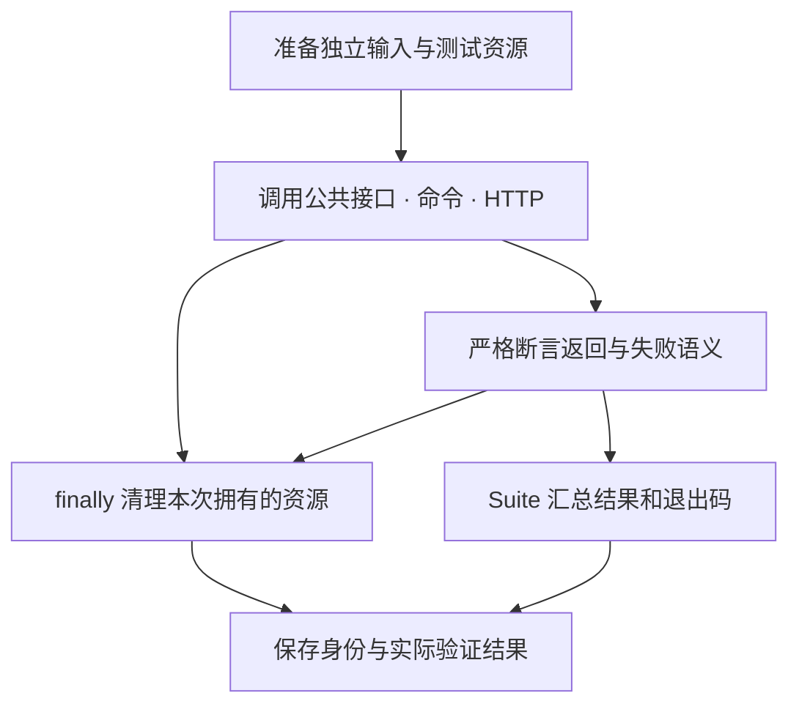
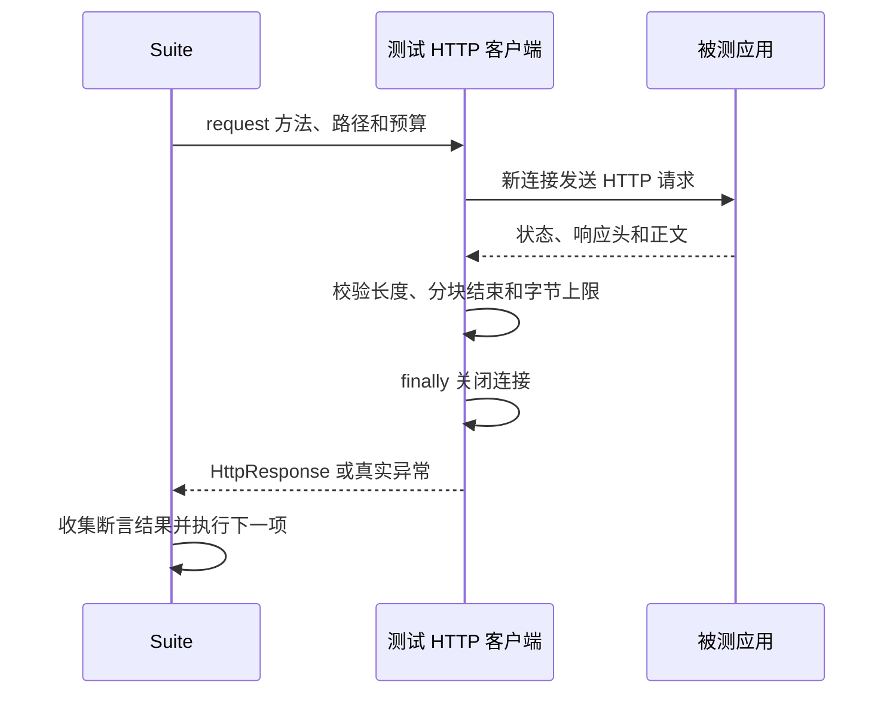

# type-testing · 测试工具

[返回组件总览](../components.md)

提供严格断言、Suite、有界子进程和真实 HTTP 客户端，用于验证安装后的插件接口以及应用的命令/HTTP 行为。它是开发工具，通常放在 `require-dev`。

## 建立可重复的验收闭环

每个测试先描述一个外部可见结果，再选择观察入口。组件行为直接调用安装后的公共接口，命令检查完整退出状态，HTTP 检查真实响应。所有测试专属进程、端口、数据库和临时文件都有明确的创建者与清理责任。



下面从不连接数据库的帮助命令开始，再扩展为真实 HTTP。这样在配置、进程和业务请求之间可以准确定位失败，不需要先准备全部业务环境。

## 安装与依赖

需要 PHP `>=8.4 <8.6`、JSON 和 `type-runtime`。被测应用需要的数据库/Redis 由测试环境另行准备；测试工具本身不要求这些服务。

在消费应用根执行以下命令，源码与完整 API 说明也随包安装：

```bash
composer config minimum-stability dev
composer config prefer-stable true
composer require --dev zoujingli/type-testing:dev-main
```

以上安装 `dev-main` 开发分支。需要固定已发布批次时，按[版本安装说明](../releases.md#composer-按版本安装)选择明确的组件版本和依赖稳定性。Composer 从默认 Packagist 解析传递依赖，无需配置 VCS 仓库；提交应用的 `composer.lock` 固定实际版本。公共安装约定见[组件总览](../components.md#安装组件)。

## 最小使用示例

下面的声明式验收入口接收待测原生应用路径，并确认 `help` 正常退出。保存为独立测试项目的 `app/main.php`，按[运行声明式示例](../components.md#运行声明式示例)使用带参数的启动器。

```php
<?php

declare(strict_types=1);

use Type\Testing\Assert;
use Type\Testing\Process;
use Type\Testing\Suite;

/**
 * 验收调用方明确传入的应用二进制，不扫描进程或寻找系统中的服务。
 *
 * @param list<string> $argv 第二项为待验收二进制路径。
 */
function main(int $argc, array $argv): void
{
    $binary = $argv[1] ?? '';
    if ($binary === '') {
        throw new InvalidArgumentException('请传入待验收的原生应用绝对路径');
    }
    $suite = new Suite();
    $suite->test('帮助命令无需数据库', static function () use ($binary): void {
        $process = new Process([$binary, 'help']);
        try {
            $result = $process->wait(3.0);
            Assert::true($result->successful());
        } finally {
            $process->stop();
        }
    });
    $exit = $suite->run();
    echo json_encode($suite->results(), JSON_THROW_ON_ERROR | JSON_UNESCAPED_UNICODE) . "\n";
    exit($exit);
}
```

执行 `php dev.php "$TYPE_TEST_BINARY"`，变量应指向你要验证的原生应用。成功时输出含测试结果的 JSON 并以 0 退出，失败为 1；路径缺失会明确抛异常。

## 严格断言与测试集合

`Suite::test($name, $callback)` 以唯一名称登记零参数闭包；`run()` 收集各项结果，单个失败不停止后续测试。调用方决定如何显示 `results()`，避免将业务秘密放在名称或错误说明里。

```php
<?php

declare(strict_types=1);

use Type\Testing\Assert;
use Type\Testing\Suite;

function main(): void
{
    $suite = new Suite();
    $suite->test('严格保留数字类型', static function (): void {
        Assert::same(7, 7);
        Assert::throws(static function (): void {
            Assert::same(7, '7');
        }, \Type\Testing\AssertionFailed::class);
    });
    exit($suite->run());
}
```

此例可单独替换最小入口并使用 `main()` 启动。`Assert::same` 不进行宽松比较；`throws` 返回符合预期类型的真实异常，以便进一步检查稳定错误码。

## 启动与关闭子进程

`Process($command, $directory, $environment, $maximumBytes, $stdinFile)` 使用参数数组，不通过 shell 解释。用绝对可执行路径或已解析的工具路径，参数中的空格仍是同一参数。

| 入口或参数 | 单位与语义 |
| --- | --- |
| `wait($seconds)` | 秒，单调总截止；等待期间同时排空 stdout/stderr |
| `maximumBytes` | 字节，默认 2 MiB，总输出预算 |
| `stdinFile` | 可读普通文件，直接作为子进程标准输入 |
| `stop()` | 结束本工具创建的直接子进程，重复调用保持终态 |
| `ProcessResult` | 退出码、信号、stdout/stderr、超时与失败原因 |

无论正常退出、断言失败还是等待超时，均在 `finally` 中调用 `stop()`。不要通过字符串拼接重定向或依赖析构等待未知时长。`stdinFile` 的相对路径按调用方工作目录解析；文件内容在执行期间须保持稳定。

Unix 先使用 SIGTERM，宽限后使用 SIGKILL；Windows 创建独立进程组，可用时发送 CTRL_BREAK，否则终止直接子进程并保留实际非零状态。控制事件发送成功不等于应用已经排空，仍要检查退出结果与业务资源。它不是沙箱，也不拥有任意子孙进程；需要管理进程树时使用操作系统监督机制。

## 验证真实 HTTP

以下代码放在测试函数内，对应服务须由测试环境事先启动：

```php
$client = new \Type\Testing\HttpClient('http://127.0.0.1:9501', 3.0, 1048576);
$response = $client->request('GET', '/status', ['Accept' => 'application/json']);
\Type\Testing\Assert::same(200, $response->status);
\Type\Testing\Assert::same(['status' => 'ok'], $response->json());
```

这里的 `/status` 可由[核心文档](type-core.md#创建一个静态-http-路由)的示例路由提供；标准应用接口请以实际[路由指南](../routing.md)为准。客户端不跟随重定向、不复用连接；目标地址只含 scheme/host/port，请求路径放在 `request()` 的第二个参数。

响应大小和总时限有界；截断 Content-Length 或未完整结束的 chunked 响应会失败。HTTPS 校验证书和主机名，没有忽略证书开关。响应重复头保留为列表，不应用单值覆盖。

### 把成功和未命中一起验收

先按[核心 HTTP 教程](type-core.md#启动-http-服务)启动 `/status` 服务，再在独立测试项目使用以下完整入口。它只连接明确的本地服务，服务进程仍由启动它的终端或测试资源所有者关闭。

```php
<?php

declare(strict_types=1);

use Type\Testing\Assert;
use Type\Testing\HttpClient;
use Type\Testing\Suite;

/** 通过真实 HTTP 验证正常响应与不存在路由的状态区别。 */
function main(): void
{
    $client = new HttpClient('http://127.0.0.1:9501', 3.0, 1048576);
    $suite = new Suite();
    $suite->test('公开状态接口', static function () use ($client): void {
        $response = $client->request('GET', '/status');
        Assert::same(200, $response->status);
        Assert::same(['status' => 'ok'], $response->json());
    });
    $suite->test('不存在路由', static function () use ($client): void {
        Assert::same(404, $client->request('GET', '/missing')->status);
    });
    $exit = $suite->run();
    echo json_encode($suite->results(), JSON_THROW_ON_ERROR | JSON_UNESCAPED_UNICODE) . "\n";
    exit($exit);
}
```

按零参数开发启动器运行 `php dev.php`，结果应包含两条 `passed: true`，退出码为 0。停止服务后再次运行应出现连接失败并以 1 退出；这不是业务 404，错误类别不能混为一谈。客户端每次请求都会在返回或异常时关闭自身连接，无需手动清理连接池。



`type-testing` 的协议客户端独立验证服务器输出，只用于测试。生产通信使用核心组件和内置 Swoole，不能把这个客户端当作业务网络驱动或重试层。

## PHP 与原生双路径

同一断言可以把 `Process` 的命令数组从 PHP 开发入口切换为已编译二进制。数据库测试使用实际所选驱动，HTTP 测试走真实端口。PHP 通过、AOT 编译通过和原生产物行为通过应分别记录。

通常测试由 PHP 执行，被测生产包无需带测试源码。若确需编译独立验收程序，将 testing 明确加入该验收程序的编译输入；不能因此把测试框架加入业务生产依赖。

## 常见问题与验证

- 看似退出成功但测试失败：检查 `successful()`、超时/信号和断言结果，不能只看 stdout。
- 大量输出卡住：保留有界输出与双管道排空；增加预算前先缩减测试输出。
- HTTP 连接失败：确认测试进程已就绪，并核对端口和路径，不能用固定长等待代替就绪观察。
- 清理影响其他进程：只保留本次创建的 Process 所有权，外部服务由其测试资源所有者关闭。

本仓库可运行 `composer test:testing`、`composer test:testing-portable` 和 `composer test:testing-consumer`。

继续阅读：[构建工具](type-build.md)、[核心 HTTP](type-core.md)、[组件总览](../components.md)。

本文以本仓库当前公开接口为依据；安装版本请同时核对包内 README。[对应源码与包说明](https://github.com/zoujingli/type-testing)。
