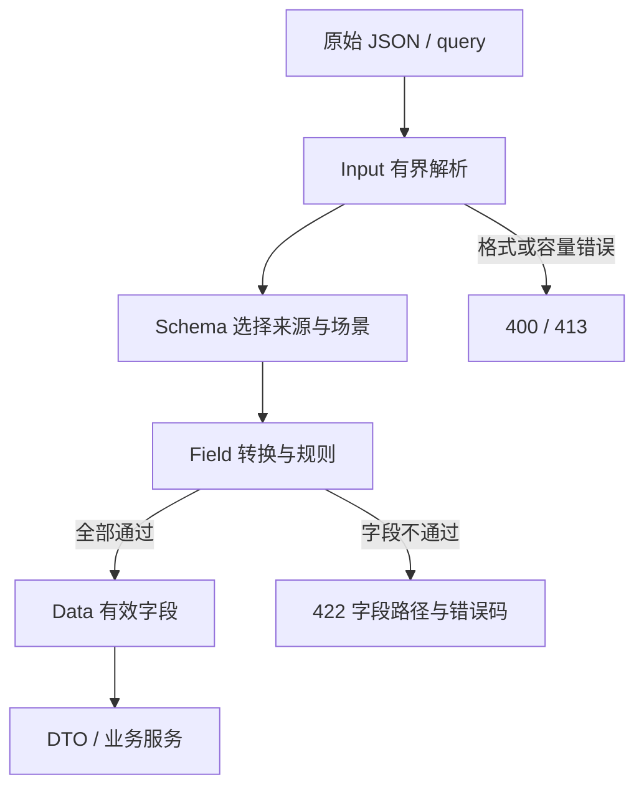

# type-validate · 输入校验

[返回组件总览](../components.md)

以不可变 Field 和 Schema 校验明确来源的输入，返回 Data 或不携带原始值的 ValidationException。适合 HTTP JSON、查询参数以及应用 DTO，不依赖 HTTP 核心或数据库。

## 从原始输入到业务字段

把解析、字段规则和业务写入分为三个明确边界。客户端传来的字段只有经过 Schema 声明后才会进入 Data；Data 可用于构造 DTO 或部分更新模型，校验器本身不写数据库。



建议先运行下方最小示例，确认字段来源与类型，再练习 PATCH，最后接入 HTTP 控制器。纯校验不需要创建协程；自定义规则涉及 I/O 时，连接与执行预算仍由调用方作用域管理。

## 安装与依赖

需要 PHP `>=8.4 <8.6`、Swoole `>=6.2 <7` 和 `type-runtime`；Swoole 依赖由运行组件传递提供。本组件不额外要求 PDO 或 Redis。

在消费应用根执行以下命令，源码与完整 API 说明也随包安装：

```bash
composer config minimum-stability dev
composer config prefer-stable true
composer require zoujingli/type-validate:dev-main
```

以上安装 `dev-main` 开发分支。需要固定已发布批次时，按[版本安装说明](../releases.md#composer-按版本安装)选择明确的组件版本和依赖稳定性。Composer 从默认 Packagist 解析传递依赖，无需配置 VCS 仓库；提交应用的 `composer.lock` 固定实际版本。公共安装约定见[组件总览](../components.md#安装组件)。

## 最小使用示例

把下面代码保存为独立示例的 `app/main.php`，按[运行声明式示例](../components.md#运行声明式示例)用 `main()` 启动；不需要外部服务。

```php
<?php

declare(strict_types=1);

use Type\Validate\Field;
use Type\Validate\Input;
use Type\Validate\Schema;

/**
 * 校验固定示例 JSON，展示缺失/null 与 query 来源的独立语义。
 */
function main(): void
{
    $schema = new Schema([
        'name' => Field::text()->required()->trim()->length(2, 40),
        'age' => Field::integer()->required()->range(0, 150),
        'email' => Field::text()->nullable()->email(),
        'page' => Field::integer()->from('query')->cast()->range(1, 100),
    ]);
    $input = Input::json('{"name":"示例用户","age":20,"email":null}')->withQuery('page=1');
    $data = $schema->validate($input, 'default', false);
    echo json_encode($data->toArray(), JSON_THROW_ON_ERROR | JSON_UNESCAPED_UNICODE) . "\n";
}
```

执行 `php dev.php` 输出 `name`、整数 `age=20`、`email=null` 和整数 `page=1`。page 从 query 读取并显式转换，其他字段来自 body。

## 字段类型与规则

| 声明 | 语义 |
| --- | --- |
| `text / integer / number / boolean` | 严格标量类型，number 只允许有限值 |
| `object(new Schema(...))` | 嵌套对象，保留字段路径 |
| `listOf($field)` | 每项按同一规则校验 |
| `required()` | 必须实际提供，不等于非空字符串 |
| `nullable()` | 显式允许 null |
| `trim / length / range` | 文本处理、Unicode 字符长度和数值范围 |
| `oneOf / matches / email` | 枚举、正则和邮箱 |
| `cast()` | 显式整数、JSON 数值和布尔文本转换 |

默认不把字符串 '20' 当整数；启用 cast 仍拒绝溢出和非法格式。required 与 length 组合才能表达“必填且非空”。

## 分源输入与解析预算

`Input::json($body)` 在解析前限制大小，检查深度并拒绝重复对象键，大整数保留为字符串。`withQuery($query)` 限制字节和字段数，拒绝重复标量与非法编码，`name[]` 表示列表；嵌套方括号语法不支持，嵌套对象使用 JSON。

字段用 `from('query')`、`from('route')` 或 `from('header', 'X-Origin')` 选择来源；header 的大小写归一由 HTTP 适配方完成。body/query/route/header 不自动合并，未知字段不进入 Data。

若直接 `new Input(['body' => $values, ...])`，表示输入已经解析，不会再验证原始 JSON 重复键或字节预算；HTTP 路径应在解析边界保留这些检查。

## 默认值、PATCH 与场景

下例可放在最小示例的 main 中，沿用 Field、Input、Schema 的 import：

```php
$schema = new Schema([
    'limit' => Field::integer()->cast()->range(1, 100)->defaultValue('20'),
    'name' => Field::text()->required()->length(1, 40),
]);
$created = $schema->validate(Input::json('{"name":"示例"}'));
$patched = $schema->validate(Input::json('{}'), 'default', true);
```

created 的 limit 为整数 20；patched 为零字段 Data，不因 required 报缺失，也不补默认值。PATCH 提供 null 时仍按 nullable 校验，嵌套对象递归保留缺失语义；提供列表表示替换整个列表，列表元素按完整对象验证。

默认值也经过转换、类型及规则检查，不能代替 required，也不覆盖明确 null、空串、0、false。默认值只接受受限数据树，不执行工厂、不接受任意对象或循环引用。

`inScenarios(['create'])` 限制适用场景，`validate($input, 'create')` 选择场景；不适用字段不进入结果。

## 练习：更新邮箱时保留缺失与 null

在最小示例的 `main()` 中替换 Schema 和输入代码，运行以下片段。这里邮箱可清空，但不接受空字符串；PATCH 未提供邮箱时不产生更新字段。

```php
$profile = new Schema([
    'email' => Field::text()->nullable()->email(),
]);
foreach (['{}', '{"email":null}', '{"email":"reader@example.com"}', '{"email":""}'] as $body) {
    try {
        $patch = $profile->validate(Input::json($body), 'default', true);
        echo json_encode([
            'provided' => $patch->has('email'),
            'changes' => $patch->toArray(),
        ], JSON_THROW_ON_ERROR) . "\n";
    } catch (\Type\Validate\ValidationException $error) {
        echo json_encode(['status' => $error->status(), 'fields' => $error->errors()], JSON_THROW_ON_ERROR) . "\n";
    }
}
```

| 输入 | 预期结果 | 业务处理 |
| --- | --- | --- |
| `{}` | provided=false，changes 为空 | 保留原邮箱 |
| `{"email":null}` | provided=true，email=null | 明确清空邮箱 |
| 有效邮箱 | provided=true，保留邮箱文本 | 更新邮箱 |
| 空字符串 | status=422，email 字段报错 | 不进行业务写入 |

把 `changes` 交给支持部分更新的模型接口即可保留这一区别，不应在校验后再补一个 `email => null`。这一练习不建立外部资源，结束后不需要清理服务或状态文件。

## 自定义规则与 DTO

```php
$slug = Field::text()->required()->rule(
    'reserved_slug',
    static fn (mixed $value, Input $input, string $scenario): bool => $value !== 'admin'
);
```

`rule` 回调完整声明值、Input 和场景，返回 bool；`when` 的条件签名为 `(Input $input, string $scenario): bool`。开发者规则抛出的异常向外传播，不包装成用户输入错误。

`Data::has()` 区分结果缺失与实际 null；`get()` 读取缺失字段抛异常。`map(static function (Data $data): object { ... })` 调用显式 DTO 工厂。是否原始请求提供字段须检查 Input.source，不从已经填默认值的 Data 推断。

## 处理错误

```php
try {
    $data = $schema->validate($input);
} catch (\Type\Validate\ValidationException $error) {
    $response = [
        'code' => $error->errorCode(),
        'fields' => $error->errors(),
    ];
    $status = $error->status();
    // HTTP 适配层使用 $status 和 $response 构造响应。
}
```

解析非法输入为 400、体积超限为 413、字段规则失败为 422。errors 是字段路径到稳定错误码列表，不含原始值；不要自行把完整请求、密码或令牌附到响应。

## 常见问题与编译

- 空字符串通过 required：required 只检查存在，补 length 或业务规则。
- page 明明是数字却失败：URL query 是文本，需要显式 cast。
- PATCH 把数据覆盖：只用 Data 中存在的字段更新，避免在业务层再次填默认值。
- 自定义规则在 AOT 报实参数量：即使未使用，仍保留全部上下文参数。

Schema、DTO 和业务闭包与应用全量 AOT。主仓 `composer test:validate` 验证 PHP 行为，`composer build:validate` 后通过 `composer test:validate-native` 验证原生入口。

继续阅读：[核心 HTTP](type-core.md)、[ORM 部分更新](type-orm.md)、[配置与环境](../configuration.md)。

本文以本仓库当前公开接口为依据；安装版本请同时核对包内 README。[对应源码与包说明](https://github.com/zoujingli/type-validate)。
