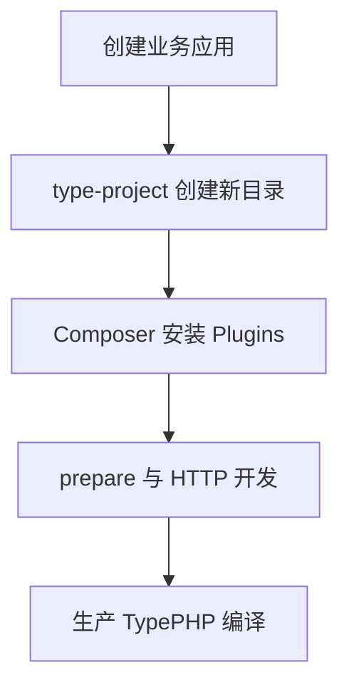

# 快速开始

用 `type-project` 创建 TypeApp 应用，再按需用 Composer 安装 Plugins（`type-xxxx` 组件）。TypePHP 负责编译生产 PHP 实现，Swoole 提供原生运行能力，详细关系见[系统架构](architecture.md)。组件源码位于 `plugin/type-*`；尚未发布稳定版本标签。物联中心是成品案例，安装与业务契约见[物联网中心](iot-center.md)。



## 准备环境

开发 CLI 使用 PHP `>=8.4 <8.6`、Composer、Swoole `>=6.2 <7` 和所选数据库的 PDO 扩展。SQLite 需要 `pdo_sqlite`；MySQL、PostgreSQL 分别需要 `pdo_mysql`、`pdo_pgsql`。HTTP 服务还需要目标平台支持的 Unix 信号能力，具体要求见[type-core](plugins/type-core.md#启动-http-服务)。

```bash
php -v
php -m
composer --version
```

原生编译还需要与目标平台匹配的 SDK，版本取自 `toolchain.lock.json`，详见[构建与部署](deployment.md)。

先核对[平台与验收](platforms.md)：当前 Windows SDK 尚缺匹配的 Swoole 模块，本文经典 HTTP 服务入口也尚未完成 Windows 适配；组件测试通过不表示本教程的整条应用链路已经通过该平台验收。

## 创建业务应用

如果已经安装 type-build，并已下载 type-project 模板，可创建不存在的新目录：

```bash
php vendor/bin/type create /本地模板目录 /新项目目录 sqlite
cd /新项目目录
composer install --no-plugins --no-scripts
php vendor/bin/type doctor type-app.json development
php vendor/bin/type dev type-app.json help
```

也可以从 [type-project 仓库](https://github.com/zoujingli/type-project)直接克隆 `main` 分支模板，再选择驱动。使用以下 HTTPS 地址，无需 SSH 密钥：

```bash
git clone https://github.com/zoujingli/type-project.git my-app
cd my-app
php configure.php sqlite
composer install --no-plugins --no-scripts
php dev.php help
php dev.php check
```

`configure.php <mysql|pgsql|sqlite>` 只在没有 vendor 和 composer.lock 时运行。模板不默认包含物联网业务与管理端。按[组件参考](components.md)用 Composer 安装 HTTP、ORM、缓存、队列或 MQTT 等 Plugins。

## 启动服务

HTTP 传输固定复用 Swoole。当前通用模板使用经典 Swoole worker 与协程入口；主仓物联中心的生产 HTTP 使用业务线程内协程。监听配置与双端示例见 [HTTP 通信](communications/http.md)，其他协议见[通信导读](communications.md)。独立应用开发入口：

```bash
php dev.php serve
```

默认监听见该应用配置。独立部署探针为 `/livez`、`/readyz`，不表示数据库已迁移。

## 构建与发布

独立应用在项目根执行：

```bash
php vendor/bin/type doctor type-app.json build
composer build
composer package
```

完整构建将应用、Plugins、生成代码和生产依赖交给 TypePHP；运行包不携带业务源码。修改路由、模型或生产代码后需要重新构建。

## 成品案例

本仓库还附带物联中心，用来展示如何把 TypeApp 装配成完整业务。它不是框架本身，也不应改写成另一套产品。运行步骤、双端账号、设备与 MQTT 契约见[物联网中心](iot-center.md)。

下一步：[了解系统架构](architecture.md) · [查看组件](components.md) · [配置数据库](configuration.md)。
