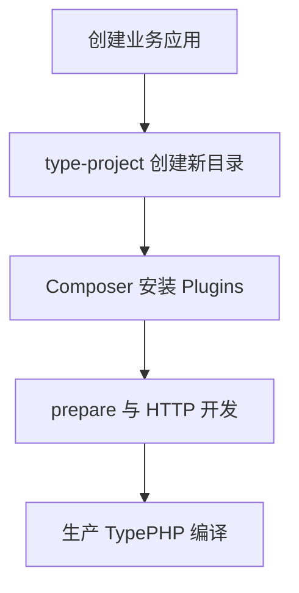

# 快速开始

用 `type-project` 创建 TypeApp 应用，再按需用 Composer 安装 Plugins（`type-xxxx` 组件）。生产 PHP 实现通过[TypePHP 全量编译](typephp.md)形成原生应用，运行库由构建统一管理。组件源码位于 `plugin/type-*`；版本号以[GitHub Release](https://github.com/zoujingli/typeapp/releases)为准，`v1.0.0-rc.10` 仅是历史候选示例。物联中心是成品案例，安装与业务契约见[物联网中心](iot-center.md)。

本文带你从源码开始开发；如果只负责运行成品，请直接看[部署环境](environment.md#部署者需要管理什么)与[首次启动](deployment.md#首次启动)。


```mermaid
flowchart TB
  Start["创建业务应用"] --> Create["type-project 创建新目录"]
  Create --> Pick["Composer 安装 Plugins"]
  Pick --> Dev["prepare 与 HTTP 开发"]
  Dev --> Aot["生产 TypePHP 编译"]
```

## 准备环境

**已验证平台：Linux x64 / ARM64、macOS ARM64、Windows x64。** 各平台通过的命令、ORM 和应用场景不同，选定环境前先核对[平台支持表](platforms.md#当前平台状态)。

以下是开发机要求，完整分工见[环境与依赖](environment.md)：PHP CLI `>=8.4 <8.6`、Composer、Swoole `>=6.2 <7` 和所选数据库的 PDO 扩展。SQLite 需要 `pdo_sqlite`，无需单独数据库服务；MySQL、PostgreSQL 分别需要 `pdo_mysql`、`pdo_pgsql` 及可连接的数据库服务。HTTP 按平台选择 Swoole worker 或协程服务，并要求可用的停止控制，见[type-core](plugins/type-core.md#启动-http-服务)。下载单文件 Release 时不安装这些构建工具，运行端只准备对应数据库和配置。

```bash
php -v
php -m
php --ri swoole
composer --version
```

原生编译还需要与目标平台匹配的 SDK，版本取自 `toolchain.lock.json`，详见[构建与部署](deployment.md)。

`type-build` 已携带匹配 PHP 8.5.10 ZTS 的四平台 Swoole 6.2.1 共享模块，供开发及历史目录包回归使用；安装组件不会自动为开发 CLI 修改 ini。当前单程序构建使用静态 SDK，平台限制与选择规则见[内置 Swoole 与运行依赖](plugins/type-build.md#内置-swoole-与运行依赖)。

Windows x64 的匹配 Swoole SDK、三库独立 ORM、主应用和模板已有原生验收记录，准确版本与隔离范围见[平台支持表](platforms.md#当前平台状态)。模板 HTTP 使用协程服务与 ProcessSignals 控制桥，缺少可用控制台或桥接能力时明确失败；自己的应用仍需在目标环境验收。

## 创建业务应用

通过 Composer 从 Packagist 创建应用。本例使用 SQLite，将模板和实际第一方组件一起固定到同一公开版本；下面的 `1.0.0-rc.10` 只用于复现历史候选，开始新项目时替换为 Release 页面列出的版本，先选择驱动，再安装依赖：

```bash
composer create-project --no-install --no-plugins --no-scripts zoujingli/type-project my-app 1.0.0-rc.10
cd my-app
php configure.php sqlite
composer config minimum-stability RC
composer config prefer-stable true
composer require --no-update \
  zoujingli/type-core:1.0.0-rc.10 \
  zoujingli/type-orm:1.0.0-rc.10 \
  zoujingli/type-orm-sqlite:1.0.0-rc.10 \
  zoujingli/type-runtime:1.0.0-rc.10 \
  zoujingli/type-log:1.0.0-rc.10 \
  zoujingli/type-validate:1.0.0-rc.10
composer require --dev --no-update \
  zoujingli/type-build:1.0.0-rc.10 \
  zoujingli/type-testing:1.0.0-rc.10
composer install --no-plugins --no-scripts
php dev.php help
php dev.php check
```

RC 是候选版本，尚非稳定版。Composer 自动解析其余传递依赖，无需配置各个 Git 仓库；创建后提交应用的 `composer.lock`。改用 MySQL 或 PostgreSQL 时，同时更换 `configure.php` 的驱动和对应组件，详见[版本安装说明](releases.md#composer-按版本安装)。`dev-main` 跟进子仓开发分支，不一定包含当前版本的接口和构建命令。

如果已安装本版本 type-build，并已下载对应 tag 的 type-project 模板，也可创建不存在的新目录：

```bash
php vendor/bin/type create /本地模板目录 /新项目目录 sqlite
cd /新项目目录
```

该入口已经选择驱动，随后执行上例从 `composer config minimum-stability RC` 开始的版本约束、安装和检查步骤，不再运行 `configure.php`。

也可以从 [type-project 仓库](https://github.com/zoujingli/type-project)克隆对应版本 tag，再选择驱动。使用 HTTPS 地址，无需 SSH 密钥：

```bash
git clone --branch v1.0.0-rc.10 --single-branch https://github.com/zoujingli/type-project.git my-app
cd my-app
php configure.php sqlite
```

接着执行上例的相同版本约束、安装和检查步骤。`configure.php <mysql|pgsql|sqlite>` 只在没有 vendor 和 composer.lock 时运行。模板不默认包含物联网业务与管理端。按[组件参考](components.md)用 Composer 安装 HTTP、ORM、缓存、队列或 MQTT 等 Plugins。

## 启动服务

HTTP 传输固定复用 Swoole。通用模板在 Unix 使用 worker，在 Windows 使用协程 HTTP 与停止控制桥；主仓物联中心的生产 HTTP 使用业务线程内协程。监听配置与双端示例见 [HTTP 通信](communications/http.md)，其他协议见[通信导读](communications.md)。独立应用开发入口：

```bash
php dev.php serve
```

默认监听见该应用配置。独立部署探针为 `/livez`、`/readyz`，不表示数据库已迁移。

## 构建与发布

独立应用在项目根执行：

```bash
: "${TYPE_STATIC_RUNTIME:?先设置本平台已校验的静态SDK清单路径}"
php vendor/bin/type doctor type-app.json build
composer build
composer package
```

完整构建将应用、Plugins、生成代码和生产依赖交给 TypePHP；运行包不携带业务源码。修改路由、模型或生产代码后需要重新构建。

按版本安装的 RC10 模板通过 `package` 输出 `build/type-project-release`，Windows 使用 `.exe` 后缀；运行 `build/type-project-release verify-runtime` 核对运行身份。静态 SDK 仅在构建端需要，部署端只复制程序并维护配置与业务数据。`dev-main` 由独立分支分发维护，不一定等于当前版本；按[构建与部署](deployment.md#当前构建状态)核对所用版本的命令与平台范围。

## 成品案例

本仓库还附带物联中心，用来展示如何把 TypeApp 装配成完整业务。它不是框架本身，也不应改写成另一套产品。运行步骤、双端账号、设备与 MQTT 契约见[物联网中心](iot-center.md)。

下一步：[完成一个真实应用练习](tutorial.md) · [查看组件](components.md) · [配置数据库](configuration.md)。
