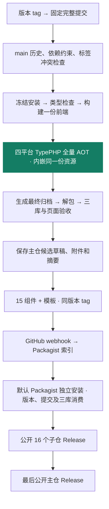

# 版本发布与安装

版本由主仓的不可变 tag 驱动：`vX.Y.Z` 是正式版本，`vX.Y.Z-rc.N` 是候选版本。一次发布关联同一主仓提交、15 个组件、应用模板、四个平台运行包及各自的验收记录。RC 标记为预发布，不成为稳定最新版。

首次公开 RC 正准备以 `v1.0.0-rc.5` 重新验收，尚未公开 Release。RC4 已通过四平台完整矩阵并保存原候选，但发布检查误用了缓存十二小时的 Packagist 包详情 API；修正改用 Composer v2 静态索引。此前候选保留原标签、草稿和执行记录，具体见[首次 RC 验收](https://github.com/zoujingli/typeapp/blob/main/docs/evidence/rc-release-20260926.md)。以下命令须在对应版本公开后使用。只有[主仓 Release](https://github.com/zoujingli/typeapp/releases)公开后，才表示该批次的四平台构建、分发和公开消费均已通过。

## 一次 tag 如何形成版本



四个平台分别编译、验收。任何一个平台失败都会阻止主仓版本公开。验收使用最终归档重新解包后的程序，上传前核对程序和归档摘要；不会用验收后重新编译的文件替换候选附件。

## 下载物联中心

选择与操作系统、CPU 和系统库基线匹配的附件，具体要求见[平台与验收](platforms.md)。文件名中的版本不带前缀 `v`：

| 目标 | 附件名 |
| --- | --- |
| Linux x64 | `typeapp-iot-1.0.0-rc.5-linux-x64.tar.gz` |
| Linux ARM64 | `typeapp-iot-1.0.0-rc.5-linux-arm64.tar.gz` |
| macOS ARM64 | `typeapp-iot-1.0.0-rc.5-macos-arm64.tar.gz` |
| Windows x64 | `typeapp-iot-1.0.0-rc.5-windows-x64.zip` |

同一 Release 提供 `SHA256SUMS` 和 `release-manifest.json`。前者用于核对下载字节，后者记录源码、版本、候选运行轮次、平台及同一产物的三库验收。摘要应从受信发布渠道取得。

下面以 Linux x64 为例，发布公开后在一个新目录中下载和解压：

```bash
set -eu
release_version=1.0.0-rc.5
release_base="https://github.com/zoujingli/typeapp/releases/download/v${release_version}"
release_archive="typeapp-iot-${release_version}-linux-x64.tar.gz"
curl --fail --location --output "$release_archive" "$release_base/$release_archive"
curl --fail --location --output SHA256SUMS "$release_base/SHA256SUMS"
curl --fail --location --output release-manifest.json "$release_base/release-manifest.json"
sha256sum --check --ignore-missing SHA256SUMS
mkdir typeapp-iot
tar -xzf "$release_archive" -C typeapp-iot
cd typeapp-iot
./run verify-runtime
```

校验失败就停止，不继续解压和启动。Linux ARM64 换用对应归档；macOS 使用 `shasum -a 256 文件名` 对照 `SHA256SUMS`，Windows 使用 PowerShell 的 `Get-FileHash -Algorithm SHA256 文件名`，再解压 ZIP 并执行 `run.cmd verify-runtime`。系统基线仍须匹配，尤其注意[macOS 部署审计限制](environment.md#检查与定位)。

当前附件是**包含原生运行库的目录归档**，解压后须保留完整目录。前端内容已编入主程序，安装命令将页面写到应用根下的 `public/`；运行端无需 Node.js、pnpm、Composer 或业务 PHP 源码，也无需另行部署 Swoole 服务。所选 MySQL/PostgreSQL、Redis 等业务服务仍需准备，SQLite 使用本地数据文件。完整静态“一个主程序 + 配置”尚未完成，见[构建与部署](deployment.md)。

核对下载、解压和运行库后，按[首次启动](deployment.md#首次启动)完成账号、数据库与页面安装。后续替换程序版本时，使用 `web:install --dry-run --force` 查看页面变化，再执行 `web:install --force`，不要重新执行空库初始化。

## Composer 按版本安装

组件与通用模板不包含物联中心前端。发布公开且 Packagist 已列出该版本后，可从默认公共索引安装 RC。下面以 SQLite 独立应用为例：

```bash
composer create-project --no-install --no-plugins --no-scripts zoujingli/type-project my-app 1.0.0-rc.5
cd my-app
php configure.php sqlite
composer config minimum-stability RC
composer config prefer-stable true
composer require --no-update \
  zoujingli/type-core:1.0.0-rc.5 \
  zoujingli/type-orm:1.0.0-rc.5 \
  zoujingli/type-orm-sqlite:1.0.0-rc.5 \
  zoujingli/type-runtime:1.0.0-rc.5 \
  zoujingli/type-log:1.0.0-rc.5 \
  zoujingli/type-validate:1.0.0-rc.5
composer require --dev --no-update \
  zoujingli/type-build:1.0.0-rc.5 \
  zoujingli/type-testing:1.0.0-rc.5
composer install --no-plugins --no-scripts
php dev.php check
```

改用 MySQL 或 PostgreSQL 时，在首次安装前选择 `configure.php mysql` 或 `configure.php pgsql`，并将上面的 `type-orm-sqlite` 约束换为对应驱动。所选数据库服务和开发 PDO 扩展也须准备，见[环境与依赖](environment.md)。

示例固定模板使用的第一方组件；仅指定 `create-project` 的模板版本，不会将传递依赖也固定为同一批次。新增组件也应选择明确版本。`minimum-stability RC` 允许解析候选依赖，不表示 RC 已稳定。安装后可核对实际版本和来源：

```bash
composer show 'zoujingli/type-*'
composer show zoujingli/type-build --format=json
```

第一条列出已安装的组件版本；第二条的 `source.reference` 是对应子仓的拆分提交，不是主仓 SHA。发布流程会核对这两种身份的对应关系。提交生成的 `composer.lock`，日常构建用 `composer install` 复现实际版本；升级依赖时再受控更新。开发分支用法继续见[快速开始](quickstart.md)。

## 维护者触发与重试

发布工作流为 `.github/workflows/release.yml`。推送版本 tag 即触发；手动重试时选择原 tag 作为工作流 ref，并填写同一个版本。tag 必须解析为 `main` 历史中的完整提交，不得移动已有标签。

创建新版本时，先确定未使用的版本号，并在已检查的 `main` 提交上执行：

```bash
# 先设置已决定且尚未使用的版本号，例如 vX.Y.Z-rc.N。
: "${release_tag:?请先设置本次新版本的 release_tag}"
git tag -a "$release_tag" -m "TypeApp ${release_tag} 候选发布"
git push origin "$release_tag"
```

需要补齐既有候选时，使用原版本重试，不创建或移动标签：

```bash
gh workflow run release.yml --ref v1.0.0-rc.5 -f version=v1.0.0-rc.5
```

候选尚未封存时，重新执行完整工作流；不要把不同运行轮次的零散平台结果拼为一次验收。候选草稿已存在时，工作流复用原运行的验收和已保存附件；附件上传不完整时从原 Actions artifact 恢复。原证据过期或同名附件摘要不同会停止，不能靠重编译冒充原候选。

工作流代码同样固定在所选 tag，后续 `main` 上的修复不会自动注入旧版本。当前 `main` 的发布工具对创建和公开后的列表回读增加了有界重试；超过预算仍保留失败与已有草稿，可按上述命令继续原候选。

子仓 Git 写入使用各仓独立 deploy key。跨仓 Release 使用主仓 Actions secret `TYPE_RELEASE_TOKEN`，凭据为仅授权映射中 16 个子仓 **Contents: Read and write** 的 fine-grained PAT；主仓 Release 使用自身 `GITHUB_TOKEN`。未配置该 secret 时在构建前明确失败。Packagist 沿用各子仓 webhook，有界等待 Composer v2 静态索引中的版本与提交，再执行公开安装验证。包详情 API 存在长时间缓存，不用它判断新版本是否可安装。

版本模式只创建固定的子仓 tag，不移动各子仓的 `main`。`dev-main` 由独立的分支分发维护，不一定与最新版本 tag 指向同一提交。需要复现本批次时安装明确版本并提交锁文件，不用 `dev-main` 代替该版本。

跨仓发布不具有原子性。失败时已成功的标签和 Release 保留，回执写入 `release-receipts-<轮次>`；用同一 tag 重试后补齐。全部 16 个子仓公开并回读通过，主仓才公开。标签或附件内容冲突需要核对原因和新版本计划，不能强制覆盖。

[安装与更新页面](deployment.md#前端安装与更新) · [组件职责](components.md) · [环境与依赖](environment.md)
