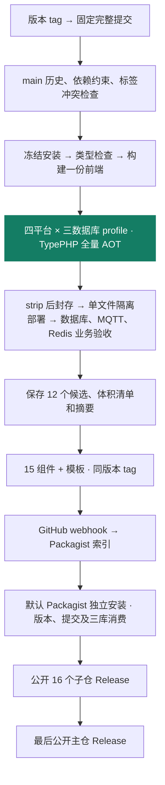

# 版本发布与安装

版本由主仓的不可变 tag 驱动：`vX.Y.Z` 是正式版本，`vX.Y.Z-rc.N` 是候选版本。一次发布关联同一主仓提交、组件、应用模板和四个平台的数据库 profile 矩阵。RC 标记为预发布，不成为稳定最新版。

[v1.0.0-rc.14](https://github.com/zoujingli/typeapp/releases/tag/v1.0.0-rc.14) 已公开为预发布版本。四平台 × `sqlite`、`mysql`、`pgsql` 的 12 个单文件程序、15 个组件与应用模板均通过同批发布门禁；17 个 Release、16 个 Packagist 版本及全部公开附件已回读核对。固定源码、工具链与原生验证见[升级验收记录](https://github.com/zoujingli/typeapp/blob/main/docs/evidence/typephp-upgrade-0.9.4.md)。RC13 的标签、附件和验收身份保持不变。

每个“平台 × profile”下载一个可执行文件，外置配置独立维护。PHP、PHPX、Swoole 等非系统原生库已静态链接，普通启动不释放运行库。历史 RC7 的目录归档与旧标签保持原样，其使用方式和验收身份保留在[历史记录](https://github.com/zoujingli/typeapp/blob/main/docs/evidence/rc-release-20260926.md)。

## 一次 tag 如何形成版本


```mermaid
flowchart TB
  Tag["版本 tag → 固定完整提交"] --> Gate["main 历史、依赖约束、标签冲突检查"]
  Gate --> Web["冻结安装 → 类型检查 → 构建一份前端"]
  Web --> AOT["四平台 × 三数据库 profile · TypePHP 全量 AOT"]
  AOT --> Verify["strip 后封存 → 单文件隔离部署 → 数据库、MQTT、Redis 业务验收"]
  Verify --> Draft["保存 12 个候选、体积清单和摘要"]
  Draft --> Split["15 组件 + 模板 · 同版本 tag"]
  Split --> Index["GitHub webhook → Packagist 索引"]
  Index --> Consume["默认 Packagist 独立安装 · 版本、提交及三库消费"]
  Consume --> Children["公开 16 个子仓 Release"]
  Children --> Main["最后公开主仓 Release"]
  style AOT fill:#147d64,color:#fff,stroke:#147d64
```

四个平台和三个 profile 分别编译、验收。每个候选只对其对应数据库执行初始化、迁移和 CRUD；任何一个组合失败都会阻止主仓版本公开。新候选验收直接使用待上传程序的同一字节，移走构建端前端资源后验证安装、登录和 CRUD；程序 SHA-256 必须与该 profile 回执一致，不能重新编译后替换附件。旧版本恢复仍按原归档身份读取，不改写旧标签或附件。

每个最终候选另执行真实 MQTT 授权、告警通知、Redis 队列导出及维护调度，逐项记录同一程序摘要和日志摘要；业务扩展回归与无源码隔离部署分别留证。Windows 的 Redis 测试服务来自固定摘要的 Cygwin 构建，仅用于 Actions 专用实例，不安装为系统服务、不进入部署程序，也不构成 Redis 官方原生 Windows 支持声明。设备持久 MQTT 的 PostgreSQL 同步语义仍按既有完整业务门禁验证，普通 MQTT 授权测试不替代该语义。

发布链保留各平台完整业务回归，并单独核验最终静态候选。Linux 两种架构调用 `static-linux.yml`，macOS 调用 `native-macos.yml` 的 `single-program` 范围，Windows 调用 `static-windows-candidate.yml`；它们使用同一固定提交及前端清单。每个平台/profile 先构建并验证对应静态 SDK，再全量编译程序，以该文件完成对应数据库的无源码部署。分发门禁同时检查这些任务的成功状态、源码和执行轮次，只有旧共享库回归或静态核心探针成功不能继续发布。任一候选或重建材料失败均阻止发布。

新候选附件名为 `typeapp-iot-<版本>-<平台>-<profile>`，Windows 追加 `.exe`，Unix 不加 `.tar.gz`。每个下载项就是一个主程序；同一平台不能在运行时切换数据库，必须选择对应 profile。`SHA256SUMS` 和 `release-manifest.json` 是下载核验材料，不是运行依赖。下载后在 Unix 赋予执行权限，按[单程序部署](deployment.md)直接运行；运行库不会释放到磁盘，页面只在显式安装时写入 `public`。

重建 SDK、源码和许可证履约材料仍会生成并验收，但只作为 Actions Artifact 保存，并在 `release-manifest.json` 中记录身份和摘要；它们不进入公开部署下载列表，也不是部署依赖。清单保存 Artifact ID、名称、摘要、运行轮次及过期时间；维护者需在保留期内将需要长期提供的材料转存到独立维护附件。维护方法见[静态程序重新构建](https://github.com/zoujingli/typeapp/blob/main/docs/development/rebuild.md)。

## 下载程序

[v1.0.0-rc.14 下载页](https://github.com/zoujingli/typeapp/releases/tag/v1.0.0-rc.14)的程序附件名包含数据库 profile。每次部署只下载匹配平台和数据库的一个程序；其余 11 个程序是其他环境的选择项。公开附件共 14 项：12 个程序、`SHA256SUMS` 和 `release-manifest.json`，不包含重建 SDK。历史版本的附件名称和摘要不变。

选择与操作系统、CPU、系统库基线和数据库匹配的附件，具体要求见[平台与验收](platforms.md)。文件名中的版本不带前缀 `v`：

| 目标 | 附件名 |
| --- | --- |
| Linux x64 | `typeapp-iot-<版本>-linux-x64-<profile>` |
| Linux ARM64 | `typeapp-iot-<版本>-linux-arm64-<profile>` |
| macOS ARM64 | `typeapp-iot-<版本>-macos-arm64-<profile>` |
| Windows x64 | `typeapp-iot-<版本>-windows-x64-<profile>.exe` |

GitHub 自动生成的 `Source code` 归档是源码下载入口，部署时无需下载。

同一 Release 提供 `SHA256SUMS` 和 `release-manifest.json`。前者用于核对下载字节，后者记录源码、版本、候选运行轮次、平台/profile、对应数据库验收、扩展/归档/系统库闭包和体积统计。摘要应从受信发布渠道取得。

下面以 Linux x64 为例，在一个新目录中下载、校验并运行：

```bash
set -eu
release_version="${TYPEAPP_RELEASE_VERSION:-1.0.0-rc.14}"
release_base="https://github.com/zoujingli/typeapp/releases/download/v${release_version}"
release_program="typeapp-iot-${release_version}-linux-x64-sqlite"
curl --fail --location --output "$release_program" "$release_base/$release_program"
curl --fail --location --output SHA256SUMS "$release_base/SHA256SUMS"
curl --fail --location --output release-manifest.json "$release_base/release-manifest.json"
sha256sum --check --ignore-missing SHA256SUMS
chmod +x "$release_program"
mv "$release_program" app
./app verify-runtime
./app licenses
```

校验失败就停止。Linux ARM64 换用对应程序；macOS 使用 `shasum -a 256 文件名` 对照 `SHA256SUMS`，再赋予执行权限；Windows 使用 PowerShell 的 `Get-FileHash -Algorithm SHA256 文件名`，校验后可改名为 `app.exe`，执行 `.\app.exe verify-runtime`。程序名称可变，应用根和持久数据路径按[配置规则](configuration.md)确定。

运行端只需匹配平台的主程序和配置，无需 PHP、Swoole、Node.js、Composer 或编译 SDK。前端内容已编入程序，显式安装命令在应用根生成 `public/`；数据库文件、上传和日志由应用按需创建。操作系统基线仍须匹配，所选 MySQL/PostgreSQL、Redis 等外部业务服务仍需准备，SQLite 使用本地文件。运行要求见[环境与依赖](environment.md)。

核对下载摘要和运行身份后，按[首次启动](deployment.md#首次启动)完成账号、数据库与页面安装。若配置中的 `DB_DRIVER` 与程序 profile 不一致，程序会返回 `runtime_profile_database_mismatch` 并拒绝启动。后续替换程序版本时，使用 `web:install --dry-run --force` 查看页面变化，再执行 `web:install --force`，不要重新执行空库初始化。

## 程序体积与依赖

下表是已公开 RC14 的程序大小，单位为 MiB（1 MiB = 1048576 字节），已从公开下载入口逐个核验。各 profile 都保留 HTTP、MQTT、告警、导出、队列与调度，只链接对应数据库驱动；前端已包含在程序中。相对 RC13 的体积增长均低于 0.26%，不代表性能提升。准确字节和摘要见发布清单及[升级记录](https://github.com/zoujingli/typeapp/blob/main/docs/evidence/typephp-upgrade-0.9.4.md#rc14-最终程序验收)。

| 平台 | SQLite | MySQL | PostgreSQL |
| --- | ---: | ---: | ---: |
| Linux x64 | 56.27 | 54.10 | 54.19 |
| Linux ARM64 | 47.98 | 47.72 | 47.84 |
| macOS ARM64 | 45.55 | 44.01 | 44.10 |
| Windows x64 | 48.39 | 47.50 | 47.67 |

发布程序已经清理调试信息并裁剪未使用代码。PHP/PHPX、Swoole、TLS、所选 PDO 和前端仍是实际功能的一部分；数据库服务与 Redis 服务在程序外运行。重建 SDK、源码及许可履约材料单独存放，不需要随部署下载。体积清单区分代码、数据、符号、前端与链接前归档输入，归档大小不能作为程序内部占用再次相加。

## Composer 按版本安装

组件与通用模板不包含物联中心前端。15 个组件与模板的 `1.0.0-rc.14` 均已由 Packagist 索引，并通过准确版本和来源提交核验。下面以 SQLite 独立应用为例：

```bash
composer create-project --no-install --no-plugins --no-scripts zoujingli/type-project my-app 1.0.0-rc.14
cd my-app
php configure.php sqlite
composer config minimum-stability RC
composer config prefer-stable true
composer require --no-update \
  zoujingli/type-core:1.0.0-rc.14 \
  zoujingli/type-orm:1.0.0-rc.14 \
  zoujingli/type-orm-sqlite:1.0.0-rc.14 \
  zoujingli/type-runtime:1.0.0-rc.14 \
  zoujingli/type-log:1.0.0-rc.14 \
  zoujingli/type-validate:1.0.0-rc.14
composer require --dev --no-update \
  zoujingli/type-build:1.0.0-rc.14 \
  zoujingli/type-testing:1.0.0-rc.14
composer install --no-plugins --no-scripts
php dev.php check
```

改用 MySQL 或 PostgreSQL 时，在首次安装前选择 `configure.php mysql` 或 `configure.php pgsql`，并将上面的 `type-orm-sqlite` 约束换为对应驱动。所选数据库服务和开发 PDO 扩展也须准备，见[环境与依赖](environment.md)。

示例固定模板使用的第一方组件；仅指定 `create-project` 的模板版本，不会将传递依赖也固定为同一批次。新增组件也应选择明确版本。`minimum-stability RC` 允许解析候选依赖，不表示 RC 已稳定。安装后可核对实际版本和来源：

```bash
composer show 'zoujingli/type-*'
composer show zoujingli/type-build --format=json
```

第一条列出已安装的组件版本；第二条的 `source.reference` 是对应子仓的拆分提交，不是主仓 SHA。发布流程会核对这两种身份的对应关系。提交生成的 `composer.lock`，日常构建用 `composer install` 复现实际版本；升级依赖时再受控更新。接着按[快速开始](quickstart.md#启动服务)启动服务，或进入[应用开发实战](tutorial.md)。

## 维护者触发与重试

发布工作流为 `.github/workflows/release.yml`。推送版本 tag 即触发；手动重试时选择原 tag 作为工作流 ref，并填写同一个版本。tag 必须解析为 `main` 历史中的完整提交，不得移动已有标签。

用于自动发布的提交不要带 `[skip ci]` 等跳过标记，否则 GitHub 会跳过 tag 的 push 工作流。已有 tag 遇到这种情况时，使用下方同 tag 的 `workflow_dispatch` 入口启动；无需移动标签或重新打版本。RC14 使用的就是该手动入口。

创建新版本时，先确定未使用的版本号，并在已检查的 `main` 提交上执行：

```bash
# 先设置已决定且尚未使用的版本号，例如 vX.Y.Z-rc.N。
: "${release_tag:?请先设置本次新版本的 release_tag}"
git tag -a "$release_tag" -m "TypeApp ${release_tag} 候选发布"
git push origin "$release_tag"
```

需要补齐既有候选时，使用原版本重试，不创建或移动标签：

```bash
gh workflow run release.yml --ref v1.0.0-rc.14 -f version=v1.0.0-rc.14
```

候选尚未封存时，重新执行完整工作流；不要把不同运行轮次的零散平台结果拼为一次验收。候选草稿已存在时，工作流复用原运行的验收和已保存附件；附件上传不完整时从原 Actions artifact 恢复。原证据过期或同名附件摘要不同会停止，不能靠重编译冒充原候选。

工作流代码同样固定在所选 tag，后续 `main` 上的修复不会自动注入旧版本。当前 `main` 的发布工具对创建和公开后的列表回读增加了有界重试；超过预算仍保留失败与已有草稿，可按上述命令继续原候选。

子仓 Git 写入使用各仓独立 deploy key。跨仓 Release 使用主仓 Actions secret `TYPE_RELEASE_TOKEN`，凭据为仅授权映射中 16 个子仓 **Contents: Read and write** 的 fine-grained PAT；主仓 Release 使用自身 `GITHUB_TOKEN`。未配置该 secret 时在构建前明确失败。Packagist 沿用各子仓 webhook，有界等待 Composer v2 静态索引中的版本与提交，再执行公开安装验证。包详情 API 存在长时间缓存，不用它判断新版本是否可安装。

版本模式只创建固定的子仓 tag，不移动各子仓的 `main`。`dev-main` 由独立的分支分发维护，不一定与最新版本 tag 指向同一提交。需要复现本批次时安装明确版本并提交锁文件，不用 `dev-main` 代替该版本。

跨仓发布不具有原子性。失败时已成功的标签和 Release 保留，回执写入 `release-receipts-<轮次>`；用同一 tag 重试后补齐。全部 16 个子仓公开并回读通过，主仓才公开。标签或附件内容冲突需要核对原因和新版本计划，不能强制覆盖。

[安装与更新页面](deployment.md#前端安装与更新) · [组件职责](components.md) · [环境与依赖](environment.md)
