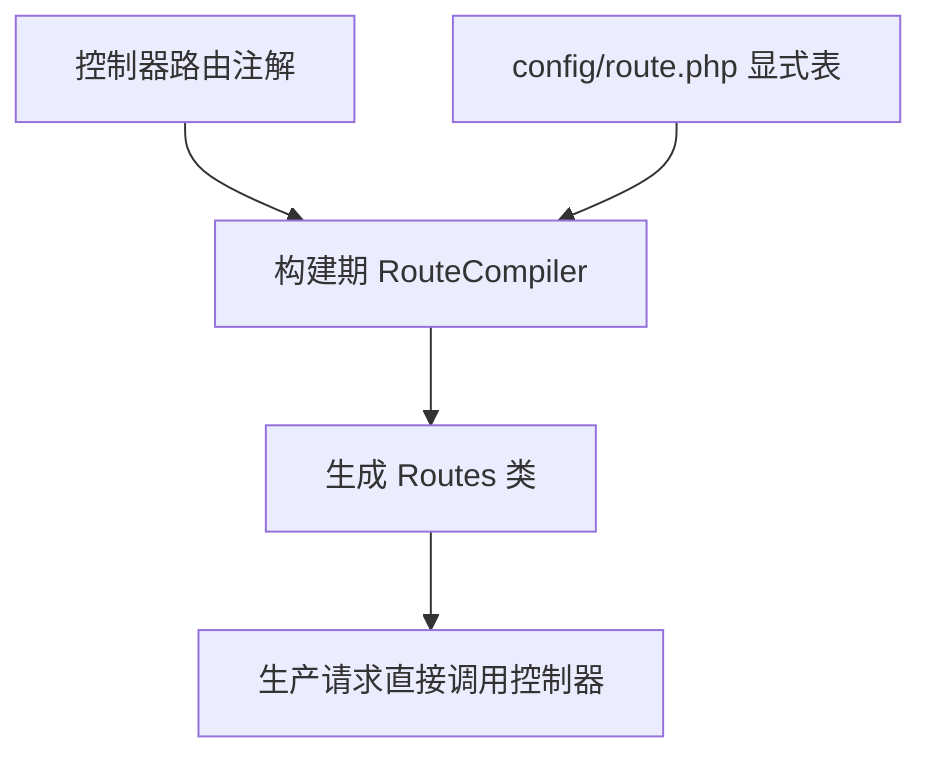
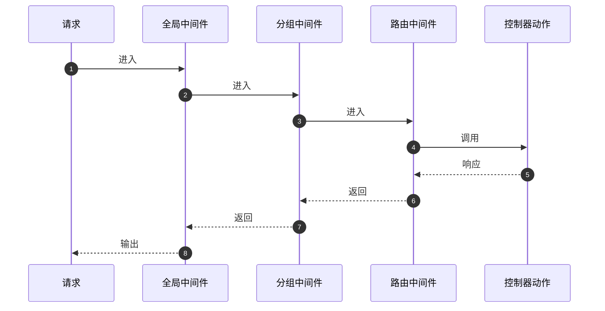

# 路由与中间件

本篇说明 HTTP 路由与中间件；协议、监听配置、服务端与客户端实例见 [HTTP 通信](communications/http.md)。

TypeApp 使用 PSR-7/15/17 消息与处理链。路由由控制器注解或 `config/route.php` 声明，在构建期生成直接控制器调用。生产请求不读取 `route.php`、不扫描控制器目录、不反射 Attribute。



## 声明控制器路由

下面展示一个读取路径参数并返回文本的控制器。将文件纳入生产 `sources` 并写上 `#[Route]`、`#[Group]` 或 `#[Resource]` 后，构建就会把它编进生成类。没有这些注解、也没有写入 `route.php` 的 `routes` 表的类不会暴露。

```php
<?php

declare(strict_types=1);

namespace app\controller;

use Psr\Http\Message\ResponseInterface;
use Psr\Http\Message\ServerRequestInterface;
use Type\Core\Http\Attribute\Group;
use Type\Core\Http\Attribute\Route;
use Type\Core\Http\Message\Factory;

/** 使用静态路由参数返回文本的控制器示例。 */
#[Group(prefix: '/api', namePrefix: 'api.')]
final class BooksController
{
    /** 路由已约束 id 格式，动作只读取匹配后的参数。 */
    #[Route(path: '/books/{id}', methods: ['GET'], name: 'books.show', constraints: ['id' => '[0-9]+'])]
    public function show(ServerRequestInterface $request): ResponseInterface
    {
        $parameters = $request->getAttribute('type.route.params');
        $messages = new Factory();

        return $messages->createResponse()
            ->withBody($messages->createStream($parameters['id']));
    }
}
```

构建 JSON 只指向 PHP 声明文件，不再内嵌路由表，也不再读取 JSON 路由文件：

```json
{
  "routing": "config/route.php"
}
```

```php
<?php

declare(strict_types=1);

return [
    'class' => 'app\\generated\\Routes',
];
```

`route.php` 只接受 `declare(strict_types=1)` 和一次 return 常量数组，构建期不执行该文件、不读取环境。常用写法只给出生成类名，让构建器展开生产源码中的路由注解；需要不用注解、按表登记时，在同一文件中写 `routes` 列表。应用启动时使用生成类的 `register()` 装配 Router，并提供所需的控制器和中间件工厂；仅增加注解不会自动替换启动装配。

## 参数与命名 URL

路径参数位于请求属性 `type.route.params`，当前路由名位于 `type.route`。参数占据完整路径段，约束匹配整个解码后的值；不支持可选段或跨段通配符。

Router 的 `url()` 接受路由名、路径参数和查询参数，例如路由名 `api.books.show` 与 `id=42` 对应 `/api/books/42`。缺少参数、未知参数或违反约束会被拒绝。路由名应作为生成链接的稳定入口。

## 请求处理

控制器动作接收一个 `ServerRequestInterface` 并返回 `ResponseInterface`。控制器与中间件工厂均为零参数闭包，依赖由应用显式捕获和注入。

中间件依次进入全局、外层分组、内层分组、路由和动作，响应沿相反顺序返回。每次请求创建对应实例；第一条请求到达后注册表冻结。



静态路由优先于参数路由。路径存在但方法不匹配时返回 405 和 `Allow`，不存在时返回 404。显式 HEAD 优先，没有 HEAD 时复用 GET；重复名称和同方法的歧义路由在构建期拒绝。

## HTTP 引擎

| 入口 | 使用条件与行为 |
| --- | --- |
| `SwooleServer::serve()` | 经典 worker 与协程；用于开发 HTTP、Broker 管理 HTTP 和通用模板 HTTP |
| `SwooleServer::serveThread()` | 业务线程内协程服务；用于主仓物联中心的生产 HTTP |

两者使用相同的 PSR 业务处理链与逐请求清理逻辑，要求匹配的 Swoole 扩展和原生 ABI。对外 TLS 可由受信任的反向代理终止。进程不可用时使用 Swoole 线程或协程，平台组合按实际构建产物独立验收。

`SwooleServer` 对协议升级返回 `501 / upgrade_not_supported`。要在同一服务、同一端口同时提供 HTTP 与 WebSocket，使用 `WebSocket\Server` 承载监听，在 `onRequest()` 中显式装配普通 HTTP 处理链；WebSocket Upgrade、连接与消息由原生握手及对应回调处理。普通 HTTP 路由和中间件不会自动约束升级路径或验证 WebSocket 身份。具体分工、TLS 与生命周期见[HTTP 与 WebSocket 共用服务](communications/websocket.md#http-与-websocket-共用服务)。

`/livez`、`/readyz` 是独立部署探针，不表示数据库已迁移。对外接入须明确 Host 白名单和真实可信代理，应用输入、数据库连接和停止过程均使用有界预算。

继续阅读：[数据库与模型](database.md) · [组件参考](components.md)。
