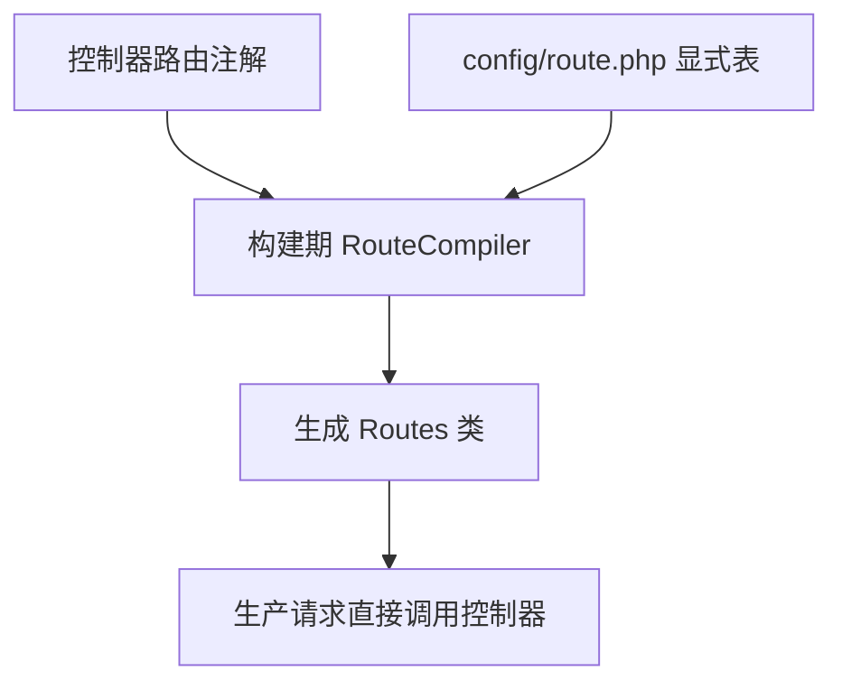
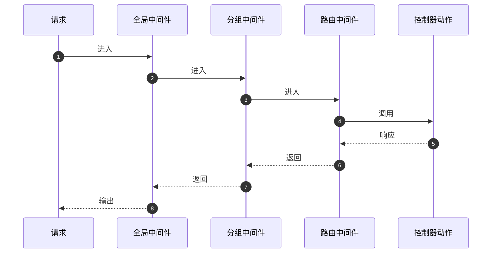
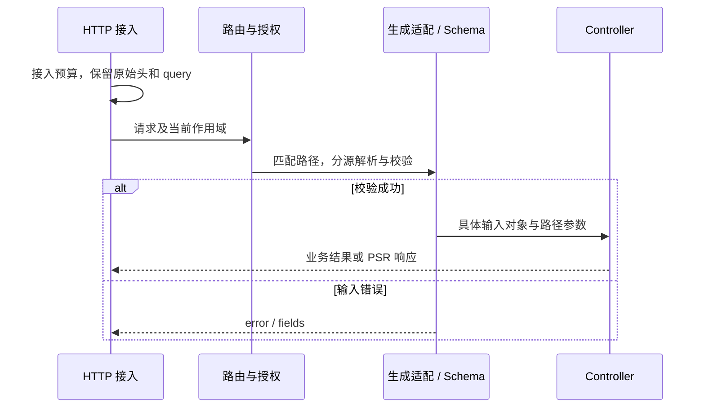

# 路由与中间件

本篇说明 HTTP 路由与中间件；协议、监听配置、服务端与客户端实例见 [HTTP 通信](communications/http.md)。

TypeApp 使用 PSR-7/15/17 消息与处理链。路由由控制器注解或 `config/route.php` 声明，在构建期生成直接控制器调用。生产请求不读取 `route.php`、不扫描控制器目录、不反射 Attribute。


```mermaid
flowchart TB
  Ann["控制器路由注解"] --> Comp["构建期 RouteCompiler"]
  Table["config/route.php 显式表"] --> Comp
  Comp --> Gen["生成 Routes 类"]
  Gen --> Run["生产请求直接调用控制器"]
```

## 声明控制器路由

下面展示一个读取路径参数并返回业务数组的控制器。将文件纳入生产 `sources` 并写上 `#[Route]`、`#[Group]` 或 `#[Resource]` 后，构建就会把它编进生成类。没有这些注解、也没有写入 `route.php` 的 `routes` 表的类不会暴露。

```php
<?php

declare(strict_types=1);

namespace app\controller;

use Type\Core\Http\Attribute\Group;
use Type\Core\Http\Attribute\Route;

/** 使用静态路由参数返回文本的控制器示例。 */
#[Group(prefix: '/api', namePrefix: 'api.')]
final class BooksController
{
    /** 路由已约束 id 格式，构建器会把匹配值严格转换为 int。 */
    #[Route(path: '/books/{id}', methods: ['GET'], name: 'books.show', constraints: ['id' => '[0-9]+'])]
    public function show(int $id): array
    {
        return ['id' => $id];
    }

    /** 数组结果默认是 UTF-8 JSON 与 200；固定 201 适用于有正文的创建结果。 */
    #[Route(path: '/books', methods: ['POST'], name: 'books.store', status: 201)]
    public function store(): array
    {
        return ['created' => true];
    }

    /** 无正文动作使用 204；路径参数仍由 Router 提供。 */
    #[Route(path: '/books/{id}', methods: ['DELETE'], name: 'books.destroy', constraints: ['id' => '[0-9]+'])]
    public function destroy(int $id): void
    {
    }
}
```

构建 JSON 只指向 PHP 声明文件，不再内嵌路由表，也不再读取 JSON 路由文件：

```json
{
  "routing": "config/route.php"
}
```

```php
<?php

declare(strict_types=1);

return [
    'class' => 'app\\generated\\Routes',
];
```

`route.php` 只接受 `declare(strict_types=1)` 和一次 return 常量数组，构建期不执行该文件、不读取环境。常用写法只给出生成类名，让构建器展开生产源码中的路由注解；需要不用注解、按表登记时，在同一文件中写 `routes` 列表。应用启动时使用生成类的 `register()` 装配 Router，并提供所需的控制器和中间件工厂；仅增加注解不会自动替换启动装配。

## 参数与命名 URL

路径参数位于请求属性 `type.route.params`，当前路由名位于 `type.route`。参数占据完整路径段，约束匹配整个解码后的值；不支持可选段或跨段通配符。

Router 的 `url()` 接受路由名、路径参数和查询参数，例如路由名 `api.books.show` 与 `id=42` 对应 `/api/books/42`。缺少参数、未知参数或违反约束会被拒绝。路由名应作为生成链接的稳定入口。

## 请求处理

普通控制器动作可以直接声明与路径占位符同名的 `int` 或 `string` 参数，并返回 `array`、`void` 或完整的 `ResponseInterface`。`array` 由生成代码校验为 JSON 数据值并编码为 UTF-8 JSON，默认状态为 200；`void` 生成 204。`#[Route(status: 201)]` 或配置式 `status` 可为数组结果指定 2xx 状态。完整 PSR 响应保留自己的状态、头和正文，不能同时声明固定状态。

动作需要 query、header、body 或请求上下文时，可以额外声明一个 `ServerRequestInterface`；它最多出现一次，也可以完全省略。路径值始终来自 Router 的匹配结果，同名 query/body 不会覆盖路径值。构造函数依赖仍由应用提供的控制器工厂注入，控制器动作不会通过容器或运行时反射调用。

构建器会拒绝未知路径参数、联合类型、引用、可变参数、默认路径参数和不支持的返回类型。匹配约束失败仍是 404；约束已匹配但整数溢出或格式错误返回 `422 / route_parameter_invalid`。数组包含对象、资源、非法 UTF-8 或非有限浮点时返回 `500 / response_encoding_failed`，不会把内部对象隐式序列化。

以下是需要请求对象的传统 PSR 动作，和上面的类型化动作可以在同一控制器中并存：

```php
#[Route('/books/export', methods: ['GET'], name: 'books.export')]
public function export(ServerRequestInterface $request): ResponseInterface
{
    // 流、文件下载和需要完整头部控制的接口保留 PSR 响应。
}
```

控制器与中间件工厂均为零参数闭包，依赖由应用显式捕获和注入。

中间件依次进入全局、外层分组、内层分组、路由和动作，响应沿相反顺序返回。每次请求创建对应实例；第一条请求到达后注册表冻结。


```mermaid
sequenceDiagram
  autonumber
  participant Req as 请求
  participant Global as 全局中间件
  participant Group as 分组中间件
  participant Route as 路由中间件
  participant Action as 控制器动作

  Req->>Global: 进入
  Global->>Group: 进入
  Group->>Route: 进入
  Route->>Action: 调用
  Action-->>Route: 响应
  Route-->>Group: 返回
  Group-->>Global: 返回
  Global-->>Req: 输出
```

静态路由优先于参数路由。路径存在但方法不匹配时返回 405 和 `Allow`，不存在时返回 404。显式 HEAD 优先，没有 HEAD 时复用 GET；重复名称和同方法的歧义路由在构建期拒绝。

## 已校验输入

本节属于开发版能力，尚未包含在 RC14。应用将 `type-validate` 安装为生产依赖，把输入类纳入生产源码；动作最多接收一个 `ValidatedInput`。构建器核对签名，运行时直接调用规则与工厂，不使用反射。

把以下文件保存为 `app/input/BookInput.php`。保留 `Data` 可以区分 PATCH 中没有提供字段和明确传入 null：

```php
<?php

declare(strict_types=1);

namespace app\input;

use Type\Validate\Data;
use Type\Validate\Field;
use Type\Validate\Schema;
use Type\Validate\ValidatedInput;

/** 书籍输入只保存本次请求通过校验的字段。 */
final class BookInput implements ValidatedInput
{
    /** 保留有效字段的存在性，避免将缺失值转换为 null。 */
    public function __construct(public Data $data)
    {
    }

    /** 规则声明不访问外部服务，也不决定请求授权。 */
    public static function schema(): Schema
    {
        return new Schema([
            'name' => Field::text()->required()->trim()->length(2, 80),
            'note' => Field::text()->nullable(),
        ]);
    }

    /** 工厂明确返回当前输入类型。 */
    public static function fromData(Data $data): BookInput
    {
        return new BookInput($data);
    }
}
```

控制器直接接收输入。以下动作只回显校验结果，持久化由注入的业务 Service 完成：

```php
/** id 来自路径，更新字段仅来自 JSON body。 */
#[Route('/books/{id}', methods: ['PATCH'], input: ['maxBytes' => 16384, 'maxDepth' => 8])]
public function update(int $id, \app\input\BookInput $input): array
{
    return ['id' => $id, 'hasNote' => $input->data->has('note'), 'values' => $input->data->toArray()];
}
```

`PATCH /books/7` 发送 `{"note":null}` 得到 `hasNote=true`，发送 `{}` 得到 `hasNote=false`。PATCH 默认跳过缺失字段且不填默认值，明确提供 null 仍须 `nullable()`。不要把活动 Model、输入对象或 Service 直接放入响应数组；业务选择公开字段。

| `input` 选项 | 默认值与含义 |
| --- | --- |
| `maxBytes` | `16384`，JSON 正文字节上限 |
| `maxDepth` | `8`，JSON 解析深度 |
| `maxQueryBytes` | `16384`，原始 query 字节上限 |
| `maxQueryFields` | `100`，查询字段数量上限 |
| `scenario` | `default`，现有 Schema 场景 |
| `patch` | PATCH 请求为 true，其余为 false；可显式声明布尔值 |

配置式路由使用同名 `input`。实际预算取声明与接入层的较小值，不放宽服务端限制。只声明 query、route 或 header 字段时不要求 JSON 或 Content-Type；有 body 规则时，未提供正文进入必填校验，有正文则要求 JSON 对象，拒绝空白文本和重复对象键。

`from('header', 'X-Origin')` 的名称不区分大小写；标量字段收到多值头返回 `422 / validation_failed`，字段原因为 `multiple_values`，列表字段保留各值。body/query/route/header 互不合并，路径身份不会被同名 query 覆盖。输入校验不建立身份或租户，也不代替 Host、路径和授权中间件。


```mermaid
sequenceDiagram
  participant HTTP as HTTP 接入
  participant MW as 路由与授权
  participant Input as 生成适配 / Schema
  participant Action as Controller
  HTTP->>HTTP: 接入预算，保留原始头和 query
  HTTP->>MW: 请求及当前作用域
  MW->>Input: 匹配路径，分源解析与校验
  alt 校验成功
    Input->>Action: 具体输入对象与路径参数
    Action-->>HTTP: 业务结果或 PSR 响应
  else 输入错误
    Input-->>HTTP: error / fields
  end
```

接入层字段或结构深度超限为 413。进入 Input 后，JSON 语法、根类型、重复键及解析深度错误为 400（深度保留 `invalid_json / too_deep`）；非法 query 为 400，字节或 query 字段超限为 413，媒体类型不符为 415，字段错误为 422。字段响应保持 `error/fields` 且不回显原值；业务异常交给统一错误边界，未知异常仍为 500。

## HTTP 引擎

| 入口 | 使用条件与行为 |
| --- | --- |
| `SwooleServer::serve()` | 经典 worker 与协程；用于开发 HTTP、Broker 管理 HTTP 和通用模板 HTTP |
| `SwooleServer::serveThread()` | 业务线程内协程服务；用于主仓物联中心的生产 HTTP |

两者使用相同的 PSR 业务处理链与逐请求清理逻辑，要求匹配的 Swoole 扩展和原生 ABI。对外 TLS 可由受信任的反向代理终止。进程不可用时使用 Swoole 线程或协程，平台组合按实际构建产物独立验收。

`SwooleServer` 对协议升级返回 `501 / upgrade_not_supported`。要在同一服务、同一端口同时提供 HTTP 与 WebSocket，使用 `WebSocket\Server` 承载监听，在 `onRequest()` 中显式装配普通 HTTP 处理链；WebSocket Upgrade、连接与消息由原生握手及对应回调处理。普通 HTTP 路由和中间件不会自动约束升级路径或验证 WebSocket 身份。具体分工、TLS 与生命周期见[HTTP 与 WebSocket 共用服务](communications/websocket.md#http-与-websocket-共用服务)。

`/livez`、`/readyz` 是独立部署探针，不表示数据库已迁移。对外接入须明确 Host 白名单和真实可信代理，应用输入、数据库连接和停止过程均使用有界预算。

继续阅读：[数据库与模型](database.md) · [组件参考](components.md)。
