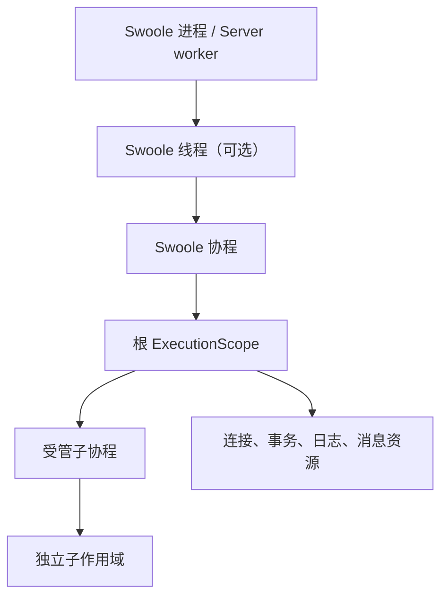

# 进程、线程与协程

TypeApp 的运行时只有一条主线：TypePHP 在构建期把生产 PHP 编译为原生入口，Swoole 在运行期负责进程、线程、协程、通信和事件循环，Plugins 组合应用能力。业务代码面对的是明确的执行作用域和资源边界，不需要再维护一套调度器或网络引擎。

本页说明三种执行层次的知识、使用方式和控制边界。它与 [系统架构](architecture.md)、[基础通信](communications.md) 和 [type-runtime](plugins/type-runtime.md) 共同构成运行时约定。

## 三种执行层次

| 层次 | 主要职责 | 状态隔离 | 适合的工作 | 控制方式 |
| --- | --- | --- | --- | --- |
| 进程 | 承载应用角色、信号和故障边界 | 独立地址空间与 PHP 请求运行时 | HTTP 服务、Broker、持久 worker、需要独立故障域的角色 | `Swoole\Process`、Server worker、停止信号和外部监督 |
| 线程 | 在同一角色内提供并行执行单元 | 独立 PHP/ZTS 运行时；不能共享 PHP 对象 | 编译后的业务角色、需要并行但不必独立部署的工作 | `Swoole\Thread`、受控参数、显式 `join()` 和线程监督 |
| 协程 | 在一个进程或线程内交错执行 I/O 工作 | 共享执行单元，但有独立协程身份和作用域 | 网络读写、数据库等待、定时任务、有限子任务 | `Swoole\Coroutine`、Channel、截止时间、取消和作用域收尾 |

进程提供最强的隔离和最清晰的退出边界，但进程间不能直接共享 PHP 对象；线程减少部署角色数量并提供真正的并行执行，但仍需要独立运行时、独立连接和显式数据传递；协程不提供 CPU 并行或故障隔离，而是让一个线程在等待网络、数据库或定时器时处理其他有界工作。协程不能把阻塞的任意 PHP 代码变成异步代码。

执行方式按角色需要和目标构建实际能力选择：

1. 角色需要独立故障边界且 Swoole Process 可用时，使用进程或 Server worker。
2. 进程不可用而线程能力可用时，使用 Swoole Thread，并在线程内建立协程运行环境。
3. 角色无需更强隔离或线程能力不可用时，在当前执行单元运行 Swoole 协程。

降级只改变隔离层次，不改变业务的截止、取消、资源额度和真实收尾要求。线程或协程不能被描述成进程的等价替代；降级后必须重新核对共享状态、硬停止、连接归属和部署总额。

## 从入口到协程

所有需要业务资源的入口都先建立一个根执行作用域，再把它传给需要资源的组件。HTTP 请求和 WebSocket 消息由核心组件创建消息作用域；TCP/UDP 端点在启动协程中登记；MQTT 协议会话由 Broker 持有，业务持久化和后台工作按操作建立独立作用域。协议对象本身由 Swoole 持有，业务资源由作用域登记。



根作用域负责本次工作是否仍可继续；子作用域只负责自己的资源和结果。作用域状态为 `active → closing → closed`：进入 `closing` 后拒绝新工作并发出取消，等待子任务和底层资源真实结束，再按登记顺序的逆序释放资源。清理超时不会把仍在运行的操作标成完成，也不会提前归还连接或任务额度。

## 协程上下文管理

TypeApp 把“当前工作是谁、还能运行多久、如何停止”放在显式的执行上下文中。上下文不是进程全局变量，也不是可以随意放入对象的共享字典。

### 上下文包含什么

`ExecutionScope` 的上下文只接受有界的字符串键和值，适合保存 `request_id`、`trace_id`、`tenant_id`、`operation_id`、消息 ID 等关联标识。截止时间、取消信号和任务树预算也是作用域的一部分，但它们通过专用对象传递，不塞进字符串上下文。

连接、PDO、事务、结果集、Socket、可变模型、闭包和大载荷都不能放进上下文。需要这些资源时，在当前作用域内显式借用；跨线程只能传递受控标量或编码后的有界数据，进入新线程后重新建立资源。

### 上下文怎样随协程传递

`ExecutionScope::spawn()` 创建新的 Swoole 协程和新的子作用域，行为有四个固定部分：

1. 复制父作用域的字符串上下文，子作用域读取到创建时的快照；子作用域修改自己的数组不会回写父作用域。
2. 共享同一个 `Deadline`、取消信号和 `TaskBudget`；父作用域缩短截止或取消时，子任务会被唤醒并停止继续发起工作。
3. 为子协程创建新的 `ExecutionOwner`；父作用域登记的连接和租约不会自动转移，子任务必须重新借用。
4. 通过 `ManagedTask::await()` 观察结果或异常；等待超时只发送取消意图，底层操作仍由子作用域持有，直到真实退出。

下面的示例展示上下文快照、协程身份和有界收尾：

```php
<?php

declare(strict_types=1);

use Swoole\Coroutine;
use Type\Runtime\CoroutineRuntime;
use Type\Runtime\Deadline;
use Type\Runtime\ExecutionScope;

CoroutineRuntime::enableIo();
Coroutine::run(static function (): void {
    $scope = new ExecutionScope(
        new Deadline(2.0),
        ['request_id' => 'req-42', 'tenant_id' => 'tenant-a'],
        childLimit: 4
    );
    try {
        $task = $scope->spawn(static function (ExecutionScope $child): array {
            $child->assertActive();
            return [
                'request_id' => $child->context()['request_id'],
                'coroutine_id' => Coroutine::getCid(),
            ];
        });
        $result = $task->await(1.0);
        // 这里可以记录 $result；不要把子任务的资源保存到父作用域之外。
    } finally {
        $scope->close();
    }
});
```

协程 ID 只能用于诊断和当前执行者校验，不能作为业务身份或跨重启的关联 ID。日志、队列和审计等组件应从作用域或消息中取得业务上下文，再按自己的格式记录；不要在单例里保存“当前请求”。

Swoole 的协程调度是合作式的：网络、数据库、Channel、Timer 等能够让出的操作会切换到其他协程；无限 CPU 循环、未接入 hook 的阻塞扩展和永久阻塞系统调用仍会卡住当前执行单元。开启 hook 只改变适用的原生调用，不替代作用域截止、容量和关闭协议。

## 使用规则

### 进程入口

- 进程负责加载编译入口、建立 Server/Client 或持久 worker，并持有进程级资源。
- 监听器和进程级连接不能由请求协程自行关闭；停止时先撤销就绪，再排空作用域，最后关闭监听器和进程资源。
- `Swoole\Process` 的管道、信号和退出码用于角色控制；业务结果仍需通过明确的消息或持久状态交接。

### 线程入口

- `CoroutineRuntime::startThread()` 只接受构建期登记的入口和有界字符串负载；调用者必须显式 `join()`。
- 线程拥有自己的 PHP/ZTS 请求、容器、连接池和作用域；不传 PDO、业务对象、任意资源数组或其他 Zend 指针。
- 线程间共享控制状态只能使用受控的 `Swoole\Thread\Map` 等原生数据；线程退出前所有协程、连接和资源必须完成收尾。

### 协程入口

- 使用网络或受管子任务前确认当前执行单元已经进入 Swoole 协程上下文；缺少上下文时返回 `coroutine_required`，不会静默改成串行。
- 一个连接或端点的同一方向收发遵循组件规定的单所有者约束；并行处理要把完整消息交给新的受管子任务，不能让多个协程同时操作同一个 Socket。
- 每个外部等待都同时受单次期限和根作用域总期限约束；取消后不再发起新工作，并继续持有仍在途的资源。

## 控制、停止与观测

控制分为三个层次，不能互相冒充：

| 控制层次 | 能证明什么 | 不能证明什么 |
| --- | --- | --- |
| 协程取消 / `Deadline` | 当前协程收到停止意图，后续合作式检查会拒绝新工作 | 远端 SQL、网络写入或系统调用已经撤销 |
| 作用域关闭 / `awaitClosed()` | 子树和登记资源已真实收尾，状态可变为 `closed` | 仍未退出的原生调用已经被强制终止 |
| 线程或进程监督 | 角色在期限内退出，或被隔离并替换 | 被终止的外部事务已经回滚、消息已经撤回 |

`WorkLifecycle` 控制单个进程角色的 ready、active、draining 和 stopped；`ThreadSupervisor` 控制一组编译线程的启动、进度、停止和 join。二者都只报告自己拥有的角色，不替代 Swoole 的协程调度。永久不合作的操作必须由独立进程故障边界处理，不能在业务协程里强行释放仍被原生代码使用的句柄。

观测至少记录执行层次、作用域状态、在途任务、资源租约、取消/截止原因、清理失败和真实退出身份。`coroutine_id`、原生线程 ID 和进程 ID 用于诊断归属；业务关联使用作用域中的稳定字符串标识。

## 与通信和组件的关系

HTTP、WebSocket、TCP、UDP、MQTT 是平级通信能力，但都沿用同一套执行规则：Swoole 拥有网络对象，组件建立协议边界，业务在自己的作用域内处理身份、事务、消息和回执。HTTP 与 WebSocket 共用服务时，每个请求或消息仍建立独立作用域，不能因为监听器相同而共享请求上下文。

数据库、Redis、日志、队列和调度组件都应接收当前作用域或其受控上下文。组件可以共享进程级池的容量统计，但连接租约和可变会话只能属于借用它的线程与协程。跨消息、跨重试和跨进程传递时，重新构造上下文并保留业务 ID，不复制上一执行者的资源所有权。

## 验收要点

运行时相关验收按同一编译产物分别覆盖：

- 进程启动、信号停止、角色排空和资源释放；
- 线程创建、参数边界、独立运行时、异常退出、`join()` 和重建；
- 协程上下文复制、执行者误用拒绝、截止/取消传播、子任务预算和清理超时；
- HTTP、WebSocket、TCP、UDP、MQTT 在各自协议语义下的连接归属与关闭；
- Linux、macOS、Windows 目标构建的实际 Swoole 能力、AOT 产物和无源码运行。

PHP 语法检查、单元测试或单个协程示例只能证明局部行为，不能代替进程/线程/协程组合、跨平台原生能力和完整应用验收。当前平台状态与未完成项见[平台与验收](platforms.md)和[实现规划](roadmap.md)。
