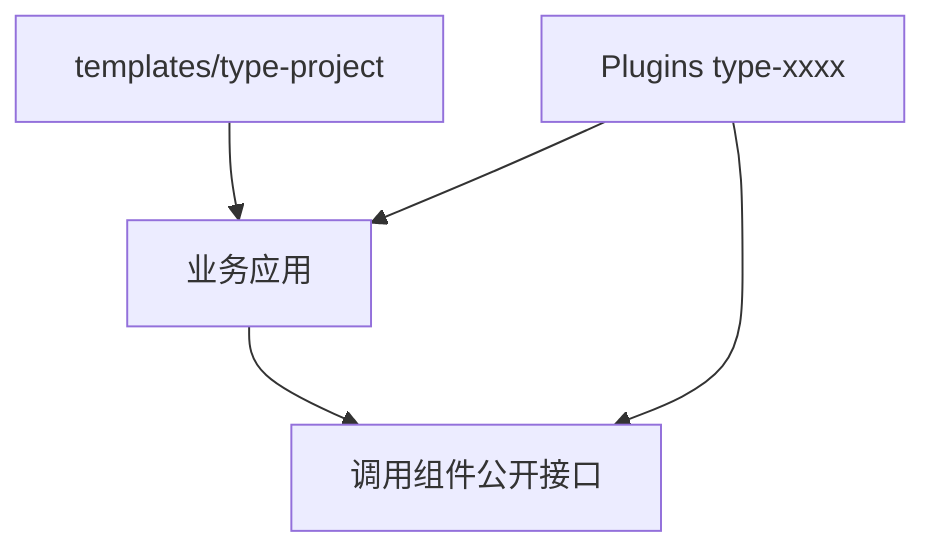

# 应用结构

TypeApp 的业务应用、Plugins 和生成代码分开维护。新业务用 `type-project` 创建，按需用 Composer 安装组件；TypePHP 编译生产 PHP 实现，原生运行库随应用交付，详见[系统架构](architecture.md)。先按实际职责组织代码，再在构建配置中明确声明入口与生产源码。物联中心是成品案例，其目录见[物联网中心](iot-center.md)。



组件不反向依赖根应用；新业务从模板创建，不复制整份物联中心。

## 业务目录

独立应用的常见布局：

```text
app/
  main.php                    原生应用入口
  common/
    bootstrap/                配置、应用角色与 HTTP 装配
    database/                 数据库工厂和迁移
    middleware/               关联日志与错误响应
  controller/                 一级控制器
  <module>/                   按职责分组的控制器、服务与模型
config/
  app.php                     应用配置声明
  database.php                数据库配置声明
  route.php                   路由声明
.env.example                  无秘密的环境示例
type-app.json                 构建声明
```

目录使用小写的 `app\` PSR-4 层级，类名使用 PascalCase。组件继续保留 `Type\...` 命名空间及原有目录大小写。

| 职责 | 放什么 |
| --- | --- |
| controller | 请求输入、授权上下文、服务调用和响应 |
| service | 业务规则、业务状态变化和事务边界 |
| model | 字段、持久化、查询入口和输出投影 |
| middleware | 请求级策略、关联日志和错误转换 |
| bootstrap | 配置快照、组件组合与应用角色选择 |

可以同时存在多个业务模块。Composer PSR-4 管理类与文件的映射，目录层数不会自动创建路由或接口。

## 显式声明

生产源码进入构建配置的 `sources`。带路由注解的生产控制器，或 `config/route.php` 中的 `routes` 表，才会进入生成结果。创建文件并不等于启用入口，路由和模型不会在生产请求中扫描目录。

独立模板使用自己的 `type-app.json`。本仓库成品案例的构建配置位于 `docs/build-config/type-app.json`，通过 `project-root` 指向仓库根；基础构建夹具使用 `type-foundation.json`。入口、源码和产物路径以各自声明的项目根为基准。

## 手写业务与生成结果

开发准备和 AOT 构建分别生成配置、模型、路由及操作组合类。生成代码放在 `build/`，由声明重新生成；业务类放在 `app/`。不要修改生成文件。

`#[Transactional]`、`#[Cacheable]` 等声明生成普通组合对象；调用者显式使用该对象。直接调用原始服务不会自动触发事务或缓存。

## 仓库与应用模板

本仓库中的 `plugin/type-*/` 集中维护 Plugins，业务应用通过 Composer 安装。组件不反向依赖应用。

`type-project` 是其他业务系统的起点：创建自己的应用目录，按需安装 `type-xxxx`。它不要求复制本仓库的测试、内部文档或全部组件，也不默认包含物联网业务与管理端。通常只把实际生产组件放入 `require`，构建和测试工具放入 `require-dev`。

继续阅读：[配置与环境](configuration.md) · [HTTP 与路由](routing.md)。
