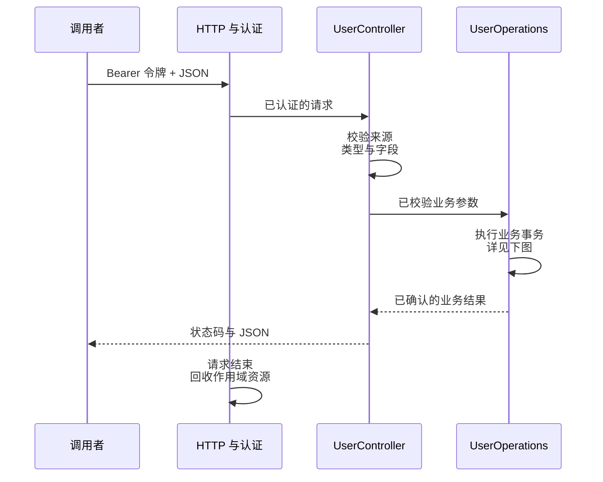
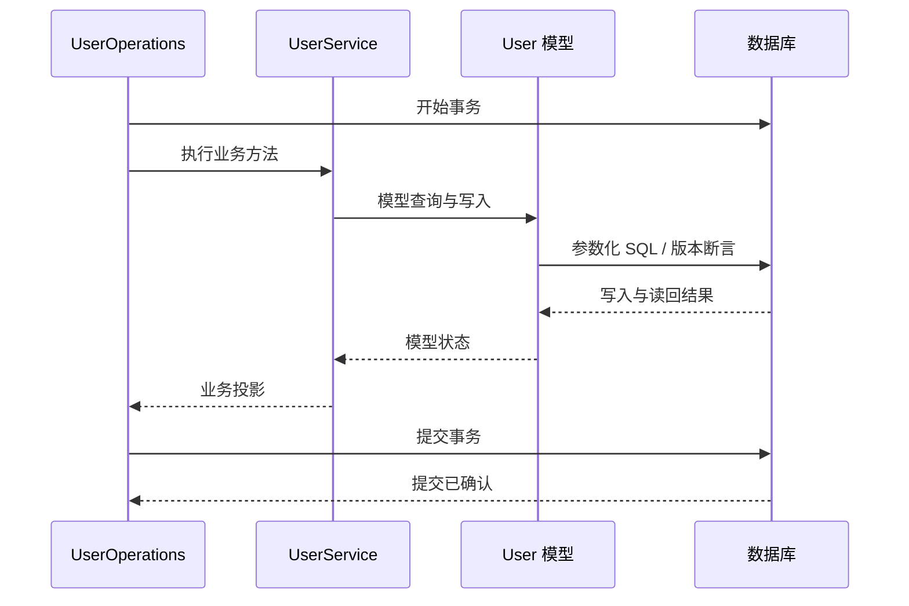

# 应用开发实战

本教程从独立应用模板出发，完成数据库迁移、带认证的用户接口、局部更新、冲突处理和构建。使用模板现有的真实用户模块；执行后可以沿控制器、服务与模型继续扩展业务。

练习使用 SQLite 和专用新目录。先按[环境与依赖](environment.md)准备 PHP CLI、Composer、Swoole 和 `pdo_sqlite`。本页 shell 与停止命令适用于 Linux/macOS；Windows 使用对应终端和已验收的控制方式，平台实现与运行证据见[平台与验收](platforms.md)。


## 1. 创建并检查应用

下面使用模板和组件子仓的 `main` 开发分支。在准备存放项目的目录执行；需要复现已发布批次时，先完成[按版本创建与安装](releases.md#composer-按版本安装)，再从本教程的配置与迁移步骤继续，不重复创建项目：

```bash
composer create-project --no-install --no-plugins --no-scripts zoujingli/type-project my-app dev-main
cd my-app
php configure.php sqlite
composer install --no-plugins --no-scripts
cp .env.example .env
php dev.php help
php dev.php check
```

`--no-install` 让你先选择数据库再安装依赖。`configure.php` 只允许在没有 `vendor/` 和 `composer.lock` 时运行；它调整驱动依赖与数据库工厂。改用 MySQL 或 PostgreSQL 时分别选择 `mysql`、`pgsql`，再按驱动指南准备专用数据库及账号。

`help` 列出实际命令，`check` 检查应用装配；它们不连接业务数据库。开发入口生成配置、路由、模型和操作包装后执行应用。生成目录可以重建，业务代码修改在 `app/` 中完成。提交应用的 `composer.lock`，固定本次安装的开发分支提交。

## 2. 初始化数据结构

```bash
php dev.php migrate run
php dev.php migrate status
```

迁移成功后，状态列表显示已执行的迁移。显式 `migrate run` 为 SQLite 准备父目录，再由驱动创建数据库文件；目录必须可写。`serve` 与 `migrate status` 不隐式建库。数据库文件是应用数据，不随程序重新构建覆盖。MySQL 的 DDL 有隐式提交行为，不能把失败的结构迁移当作已整体回滚；生产迁移前应备份并检查实际结构。

模板中的模型位于 `app/system/model/User.php`，表映射声明如下：

```php
#[Table('users', softDelete: 'deleted_at', version: 'version')]
```

这是已有类上的声明片段。该类包含 `id`、`name`、`age`、可空的 `email`、`version` 与 `deleted_at` 类型属性；`present()` 只投影对外字段。构建器生成模型状态钩子，运行时不扫描 Attribute。完整代码可直接阅读模板中的模型文件，查询和事务用法见[数据库与模型](database.md)。

## 3. 启动 HTTP 服务

以下 POSIX shell 命令在同一个终端执行。临时令牌只用于这次练习，不写入仓库：

```bash
export APP_API_TOKEN="$(php -r 'echo bin2hex(random_bytes(32));')"
mkdir -p var
php dev.php serve >var/tutorial-http.log 2>&1 &
tutorial_pid=$!
```

用下面的探针确认服务已就绪，启动失败时查看 `var/tutorial-http.log`；正常启动时日志可能为空。默认地址为 `127.0.0.1:9501`；端口被占用时先修改本应用配置，不停止不属于本练习的服务。

```bash
curl --fail-with-body http://127.0.0.1:9501/livez
curl --fail-with-body http://127.0.0.1:9501/readyz
```

这两个地址是部署探针，不证明数据库已经迁移。用户接口使用 Bearer 令牌；模板展示的是一个受信任应用身份，完整登录、人员账号和权限模型需要由具体业务实现。

请求先经过 HTTP 认证与输入校验，再由生成的 `UserOperations` 调用业务服务。下面拆成入口与事务两个视角，展示同一次成功写入：



`UserOperations` 管理声明的事务，`UserService` 通过 `User` 模型完成读写；数据库确认提交后才返回成功结果。



## 4. 创建与读取用户

创建时 `age` 必须是 JSON 整数，不能传字符串 `"28"`：

```bash
curl --fail-with-body -X POST http://127.0.0.1:9501/users \
  -H "Authorization: Bearer $APP_API_TOKEN" \
  -H 'Content-Type: application/json' \
  -d '{"name":"示例用户","age":28,"email":"reader@example.com"}' \
  -o var/tutorial-user.json
cat var/tutorial-user.json
```

预期 HTTP 201，响应的 `data` 包含数据库实际分配的 `id` 与 `version`。不要假设第一条记录的 ID 必定为 1；从本次响应取值：

```bash
tutorial_user_id=$(php -r '$r=json_decode(file_get_contents("var/tutorial-user.json"),true,512,JSON_THROW_ON_ERROR); echo $r["data"]["id"];')
tutorial_version=$(php -r '$r=json_decode(file_get_contents("var/tutorial-user.json"),true,512,JSON_THROW_ON_ERROR); echo $r["data"]["version"];')
curl --fail-with-body "http://127.0.0.1:9501/users/$tutorial_user_id" \
  -H "Authorization: Bearer $APP_API_TOKEN"
curl --fail-with-body 'http://127.0.0.1:9501/users?page=1&sort=name&direction=ASC' \
  -H "Authorization: Bearer $APP_API_TOKEN"
```

单条响应使用 `data`；列表还返回 `total` 和 `page`，模板每页固定 20 条。排序字段经过白名单映射，不把客户端字符串直接拼入 SQL。查询默认排除软删除记录。

## 5. 局部更新与冲突

以下补丁只改名称并清空邮箱，未提供的年龄保持不变：

```bash
curl --fail-with-body -X PATCH "http://127.0.0.1:9501/users/$tutorial_user_id" \
  -H "Authorization: Bearer $APP_API_TOKEN" \
  -H 'Content-Type: application/json' \
  -d "{\"name\":\"更新后的用户\",\"email\":null,\"version\":$tutorial_version}"
```

预期 HTTP 200，返回新的 `version`。再执行一次相同命令会使用旧版本，预期 HTTP 409；重新读取并确认业务意图后才能提交新版本，不应无条件重试覆盖他人修改。

`UserService` 使用 `#[Transactional]` 声明写事务，控制器调用生成的 `UserOperations` 才会执行该包装。直接 `new UserService()` 调用不自动触发事务。模型通过当前协程作用域获取连接，业务入口无需手动传递 Connection；嵌套调用仍须遵守同一连接和事务所有权。

## 6. 删除与失败验证

```bash
curl --fail-with-body -X DELETE "http://127.0.0.1:9501/users/$tutorial_user_id" \
  -H "Authorization: Bearer $APP_API_TOKEN"
curl -i "http://127.0.0.1:9501/users/$tutorial_user_id" \
  -H "Authorization: Bearer $APP_API_TOKEN"
```

删除成功返回 `{"deleted":true}`；随后查询预期 404。模板使用软删除，数据库保留该记录，公开投影不暴露 `deleted_at`。实际业务的保留期限和物理清理需要另行定义。

| 练习输入 | 预期结果 | 如何处理 |
| --- | --- | --- |
| 用户接口不带令牌 | 401 | 提供本应用认可的身份 |
| `age` 为字符串或超出 0–150 | 422 | 修正字段类型或范围 |
| 请求体不是合法 JSON | 400 | 修正编码格式 |
| 写接口 Content-Type 不是 application/json | 415 | 使用 JSON 内容类型 |
| PATCH 使用旧版本 | 409 | 重新读取并处理冲突 |
| 查询已软删除的用户 | 404 | 按业务不存在处理 |

错误响应和日志用于定位，不应把认证令牌记录进日志。更多输入场景见[type-validate](plugins/type-validate.md)，事务与数据一致性见[type-orm](plugins/type-orm.md)。

## 7. 结束练习并构建

停止本次保存的服务进程，保留数据库供继续练习：

```bash
kill -TERM "$tutorial_pid"
wait "$tutorial_pid"
unset APP_API_TOKEN tutorial_pid tutorial_user_id tutorial_version
```

确认进程退出与端口释放后，可删除本次练习响应文件和日志。不要把迁移回滚或删除数据库当作日常停止步骤。

准备好匹配的构建 SDK 后，在应用根执行：

```bash
php vendor/bin/type doctor type-app.json build
composer build
composer package
build/release/run verify-runtime
build/release/run help
```

TypePHP 编译业务、Plugins、生成代码及实际生产 PHP 依赖；`type-build` 选择并校验内置 Swoole 和其他实际原生依赖。部署者无需再安装 PHP CLI、Composer、Swoole 开发环境或编译 SDK，数据库服务和业务配置仍按所选能力准备。

当前 `composer package` 生成需要整体部署的目录包，不能只复制其中的主程序。最终单程序加配置、启动不释放运行库的交付目标及尚未完成的静态链接工作，统一见[构建与部署](deployment.md)。

继续学习：[配置](configuration.md) · [路由与中间件](routing.md) · [组件教程](components.md) · [TypePHP 全量编译](typephp.md)。
