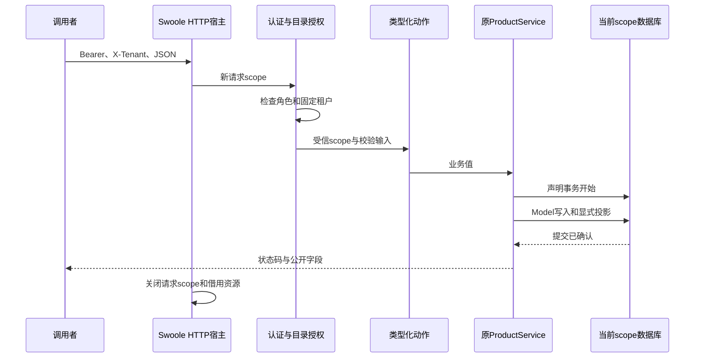
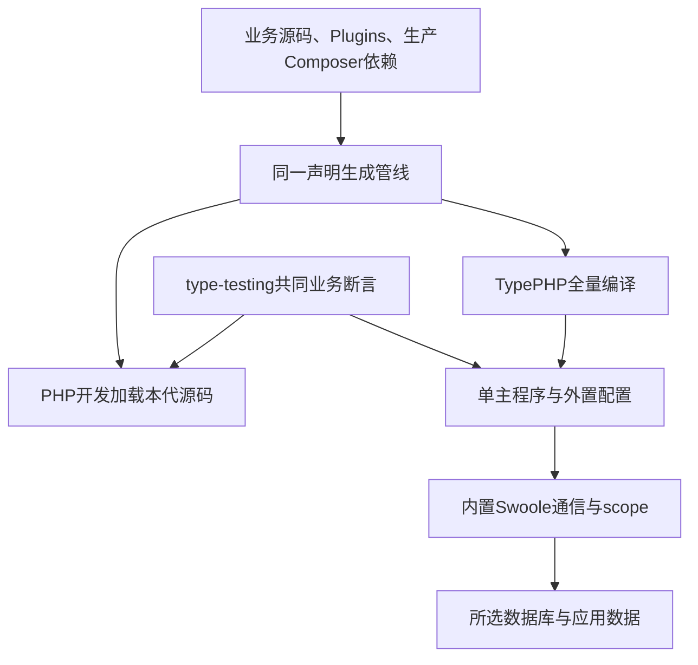

# 应用开发实战

本页是**开发通道的连续目录应用教程**，从全新独立应用开始，通过 `make` 增加模板之外的商品模块。当前接口尚未包含 RC14；使用 RC14 请阅读[发布通道的教程](https://iots.top/#/guide/tutorial)，不要把本页代码混入旧组件。开发候选的源码、模板、组件和锁文件必须作为一组保存；本地 path 安装是开发消费，公开批次的原样安装另由发布门禁验证。

先准备[开发环境](environment.md)：PHP、Composer、Swoole 及所选 PDO 驱动。完整教程还使用 Redis、PHP Redis 扩展，以及测试控制端的 Node.js/OpenSSL；后台依赖与启动步骤见[可靠性续篇](catalog-reliability.md)。SQLite 使用独占可写文件；MySQL/PostgreSQL 先准备专属数据库与账号。示例 shell 适用于 Linux/macOS；Windows 使用相应终端并遵守已验收的平台能力。目录业务不依赖物联中心。


```mermaid
flowchart LR
  Source[固定开发候选] --> Create[创建新应用与选择驱动]
  Create --> Install[按模板约束安装并保存锁]
  Install --> Make[make 第二模块]
  Make --> Schema[填写业务源码并冻结新迁移]
  Schema --> HTTP[迁移和真实HTTP验证]
  HTTP --> Build[同一应用全量AOT并重跑验证]
```

## 1. 固定候选并创建

从[开发文档通道](https://iots.top/next/)的 `site-manifest.json` 取得明确源码身份，在已准备开发依赖的对应主仓检出中执行。不要使用未核对的移动分支覆盖一次练习：

```bash
# 当前目录必须是已核对源码身份的 typeapp 开发候选。
tutorial_source=$(pwd)
php examples/catalog/create.php '../catalog application' sqlite
php examples/catalog/use-development-sources.php '../catalog application'
cd '../catalog application'
composer install --no-scripts --no-plugins
composer check-platform-reqs
cp .env.example .env
php dev.php help
php dev.php check
```

[create.php 完整源码](https://github.com/zoujingli/typeapp/blob/main/examples/catalog/create.php)复用 `ProjectCreator`，保留所选模板的约束并以同批约束增加 `type-redis`、`type-cache`、`type-queue`、`type-scheduler`。显式 `use-development-sources.php` 才把组件来源指向当前检出的复制安装；公开批次消费不执行此步骤。使用 `mysql` 或 `pgsql` 替换创建命令最后的 `sqlite`，在安装前确定驱动，随后填写 `.env` 的数据库地址、库名和账号；不要使用 `--ignore-platform-reqs`。

提交 `composer.json`、`composer.lock` 和后续的 `catalog-candidate.json`。候选报告记录完整教程源码摘要、实际组件版本/参考提交、锁摘要和原迁移登记器摘要。包约束不会在教程准备时被偷偷改写。帮助和检查不连接外部数据库，不要求 API 令牌有效。

## 2. 用 make 建立第二模块

应用已安装依赖后，从任意工作目录执行准备脚本，参数始终是明确的应用配置：

```bash
php "$tutorial_source/examples/catalog/setup.php" "$PWD/type-app.json"
php vendor/bin/type inspect-application type-app.json
php vendor/bin/type inspect-application type-app.json --json
php vendor/bin/type dev type-app.json migrate run
php vendor/bin/type dev type-app.json migrate history
```

[setup.php](https://github.com/zoujingli/typeapp/blob/main/examples/catalog/setup.php)首先执行以下正式脚手架命令，然后把本教程列出的完整业务文件复制到应用中，登记中间件和后续新迁移，调用正式 `schema:prepare` 冻结三库 SQL。它是可核对的开发编辑步骤，生产程序不会加载该脚本。已有 `app/catalog` 会明确拒绝；已执行准备脚本后不要再重复运行下面的单独命令。

```bash
php vendor/bin/type make type-app.json module 'app\catalog\Product' \
  --table=catalog_products --route=/products --role=users --version=002_catalog_products \
  '--migration-registry=app\common\database\Schema'
```

完整源码与应用落点一一对应：

| 应用内位置 | 职责与可运行源码 |
| --- | --- |
| `app/catalog/model/Product.php`、`Label.php` | [可信租户、版本、自动时间与关系](https://github.com/zoujingli/typeapp/tree/main/examples/catalog/model) |
| `app/catalog/input/ProductInput.php`、`SearchInput.php` | [JSON/query 来源、必需字段与可空备注](https://github.com/zoujingli/typeapp/tree/main/examples/catalog/input) |
| `app/catalog/service/ProductService.php` | [原 Service 的 CRUD、搜索、关系和冲突写入](https://github.com/zoujingli/typeapp/blob/main/examples/catalog/service/ProductService.php) |
| `app/catalog/controller/ProductController.php` | [类型化动作、状态码与授权](https://github.com/zoujingli/typeapp/blob/main/examples/catalog/controller/ProductController.php) |
| `app/catalog/middleware/CatalogTenant.php` | [模板身份到固定租户的授权映射](https://github.com/zoujingli/typeapp/blob/main/examples/catalog/middleware/CatalogTenant.php) |
| `app/catalog/database/` | [独立 Schema 与冻结快照路径](https://github.com/zoujingli/typeapp/tree/main/examples/catalog/database) |
| `tests/catalog.php`、`tests/tutorial.php` | [同一套 PHP/AOT 真实请求断言](https://github.com/zoujingli/typeapp/blob/main/examples/catalog/test.php) |

`001_users` 的历史 SQL 不变。`002_catalog_products` 建商品与 `(tenant_id, code)` 唯一身份，`003_catalog_labels` 建标签与关系对，`004_catalog_note` 用新的 `add-column` 给已有表增加可空备注。续篇使用的新迁移 `005_catalog_delivery` 和 `006_catalog_outbox` 也一次登记。商品、关系及后台效果使用逻辑命名源 `catalog`；模板用户继续使用 `default`，教程显式将两源指向选定数据库。准备快照不连接数据库；`migrate run` 才应用冻结 SQL。每个声明和对应 `snapshots/*.json` 都应审查并提交，已发布快照不可重写。

MySQL DDL 非事务，失败可部分生效，必须核对状态和真实结构再按迁移控制台显式恢复；不能直接再跑整个业务。SQLite 增列使用真实原生语义，不隐式重建表。执行过迁移的目录不要当成全新练习重复准备。

## 3. 启动、认证与可信租户

```bash
export APP_API_TOKEN="$(php -r 'echo bin2hex(random_bytes(32));')"
mkdir -p var
php vendor/bin/type dev type-app.json serve >var/catalog-http.log 2>&1 &
tutorial_pid=$!
curl --fail-with-body http://127.0.0.1:9501/readyz
```

启动失败查看本项目 `var/catalog-http.log`，不要停止其他服务解决端口占用。模板认证认可应用 Bearer 令牌；目录中间件进一步确认身份及 `users` 角色，只允许选择 `catalog-a`。`X-Tenant` 是待授权选择值，成功后被移除，再把受信常量绑定到当前 scope。正文 `tenant_id`、`id`、版本和自动时间不会进入可写输入。生产业务应把固定映射换成自己的受信账号与授权资料，不能直接把任意头或消息追踪字段当权限。


```mermaid
sequenceDiagram
  participant Client as 调用者
  participant HTTP as Swoole HTTP宿主
  participant Auth as 认证与目录授权
  participant Action as 类型化动作
  participant Service as 原ProductService
  participant DB as 当前scope数据库
  Client->>HTTP: Bearer、X-Tenant、JSON
  HTTP->>Auth: 新请求scope
  Auth->>Auth: 检查角色和固定租户
  Auth->>Action: 受信scope与校验输入
  Action->>Service: 业务值
  Service->>DB: 声明事务开始
  Service->>DB: Model写入和显式投影
  DB-->>Service: 提交已确认
  Service-->>Client: 状态码与公开字段
  HTTP->>HTTP: 关闭请求scope和借用资源
```

认证失败为 401；缺失租户、选择 `catalog-b` 或访问 `/catalog-admin` 为 403。当前示例应用身份没有 `catalog.admin` 角色；提供客户端“role”字段不会改变结果。数据库租户条件是模型本身的执行边界，与 HTTP 选择授权共同生效。

## 4. 创建、查询与 PATCH

```bash
curl --fail-with-body -H "Authorization: Bearer $APP_API_TOKEN" -H 'X-Tenant: catalog-a' \
  -H 'Content-Type: application/json' -d '{"code":"first","name":"目录商品","note":"保留备注"}' \
  http://127.0.0.1:9501/products -o var/product.json
catalog_id=$(php -r '$r=json_decode(file_get_contents("var/product.json"),true,512,JSON_THROW_ON_ERROR); echo $r["id"];')
curl --fail-with-body -H "Authorization: Bearer $APP_API_TOKEN" -H 'X-Tenant: catalog-a' \
  "http://127.0.0.1:9501/products/$catalog_id"
curl --fail-with-body --get -H "Authorization: Bearer $APP_API_TOKEN" -H 'X-Tenant: catalog-a' \
  --data-urlencode 'name=目录商品' http://127.0.0.1:9501/products
```

创建返回 201 和 `id/code/name/note/version/created_at/updated_at`，查询返回 200。自动时间由 Model 统一管理；输出不包含租户凭据或活动 Model。搜索使用声明的 `name` 搜索器和参数绑定，排序固定为 `id`，列表最多二十条。

```bash
curl --fail-with-body -X PATCH -H "Authorization: Bearer $APP_API_TOKEN" -H 'X-Tenant: catalog-a' \
  -H 'Content-Type: application/json' -d '{}' "http://127.0.0.1:9501/products/$catalog_id"
curl --fail-with-body -X PATCH -H "Authorization: Bearer $APP_API_TOKEN" -H 'X-Tenant: catalog-a' \
  -H 'Content-Type: application/json' -d '{"note":null}' "http://127.0.0.1:9501/products/$catalog_id"
```

第一个请求保留备注，第二个明确清空备注并保留名称；`{"name":null}` 返回 422。Service 检查字段存在性而非用 `??` 代替 PATCH 语义。`code` 是创建身份，更新路径不允许改变。记录不存在返回 404 `record_not_found`，事务结果 UNKNOWN 不自动重试。

## 5. 关系、并发创建与批量冲突

```bash
curl --fail-with-body -X POST -H "Authorization: Bearer $APP_API_TOKEN" -H 'X-Tenant: catalog-a' \
  -H 'Content-Type: application/json' -d '{}' "http://127.0.0.1:9501/products/$catalog_id/labels"
curl --fail-with-body -X POST -H "Authorization: Bearer $APP_API_TOKEN" -H 'X-Tenant: catalog-a' \
  -H 'Content-Type: application/json' -d '{"code":"contended","name":"竞争创建"}' http://127.0.0.1:9501/products/ensure
curl --fail-with-body -X POST -H "Authorization: Bearer $APP_API_TOKEN" -H 'X-Tenant: catalog-a' \
  -H 'Content-Type: application/json' -d '{}' http://127.0.0.1:9501/products/import
```

关系动作先预加载，再通过 `$product->relation('labels')->attach($label->id)` 写入。返回 `invalidated:true` 证明本实例旧结果失效；显式 `loadMissing` 后才输出最新标签。关系目标与中间表均限制到可信租户。

两个并发 `/products/ensure` 请求使用同一 code 会返回同一个数据库身份。`firstOrCreate` 依赖真实非空唯一索引，竞争只恢复已证明的目标冲突，不重跑事务外部副作用。不要把先查询再手写插入当成相同保证。

`/products/import` 使用固定示范批次。PostgreSQL/SQLite 调用 `Product::upsert($rows, ['tenant_id','code'], ['name','note'])`，MySQL 显式调用 `upsertAnyUnique` 并审查全部可能冲突的唯一键。首次插入影响一行；重复调用推进版本，PostgreSQL/SQLite 为一，MySQL 实际更新为二。批量操作不触发逐实例事件，也不猜测生成主键；数据库不同的冲突和行数语义原样保留。

## 6. 运行同一验证并构建

先按[可靠性续篇的基础设施步骤](catalog-reliability.md#1-后台角色与基础设施)启动本次专用 Redis，并在当前终端设置 `TYPE_REDIS_HOST`、`TYPE_REDIS_PORT` 和 `CATALOG_NAMESPACE`。共同入口同时验证下一章的缓存、队列、调度与 HTTPS；测试控制端需要 Node.js 和 OpenSSL。

```bash
kill -TERM "$tutorial_pid"
wait "$tutorial_pid"
export DB_SQLITE_FILE=var/catalog-test.sqlite
php vendor/bin/type test type-app.json
```

上面 SQLite 命令切换到新的测试文件；每次重复测试使用另一个新文件。MySQL/PostgreSQL 则先创建专属空测试库并设置 `DB_DATABASE`。测试创建固定示范身份；不要指向生产库或已经运行过同一测试的数据。公开 `type test` 调用 `type-testing`，串联原模板、第二模块与可靠性断言，包含两进程并发创建、三类授权拒绝、输入错误、关系失效、PATCH 缺失/null、冲突行数、持久投递与正常停止。


```mermaid
flowchart TB
  Source[业务源码、Plugins、生产Composer依赖] --> Generation[同一声明生成管线]
  Generation --> PHP[PHP开发加载本代源码]
  Generation --> AOT[TypePHP全量编译]
  AOT --> Program[单主程序与外置配置]
  Program --> Swoole[内置Swoole通信与scope]
  Swoole --> Data[所选数据库与应用数据]
  Tests[type-testing共同业务断言] --> PHP
  Tests --> Program
```

准备匹配目标平台的静态 SDK 后，设置 `TYPEAPP_BUILD_PROFILE=sqlite`（或安装时选择的 `mysql`/`pgsql`），执行 `php vendor/bin/type doctor type-app.json build`、`composer build`，再设置 `TYPE_APP_BINARY` 为这次实际产物的明确路径，使用新测试数据库运行 `php vendor/bin/type test type-app.json`。生产业务、Plugins 和实际生产 PHP 依赖必须全部编译；源码成功和编译成功都不能代替原生业务验收。`DB_DRIVER` 与安装驱动或编译 profile 不符时，`check`、迁移和服务入口在连接前返回 `runtime_profile_database_mismatch`。

当前主仓入口 `php tests/application-template.php sqlite|mysql|pgsql --tutorial --onboarding` 已在专属三库、含空格新目录和不同工作目录通过上述 PHP 断言；原生组合加 `--native` 并单独记录。本页不据此声明新公开批次或所有平台已通过。候选复用与完整发布门禁见[版本发布](releases.md)。

结束后正常停止本次进程，移除专属数据库与临时应用；保留候选身份、冻结迁移和必要验收摘要。不要以删除生产数据作为正常停止方式。继续学习：[后台与可靠交付](catalog-reliability.md) · [业务脚手架](scaffolding.md) · [ORM 组件](plugins/type-orm.md)。
