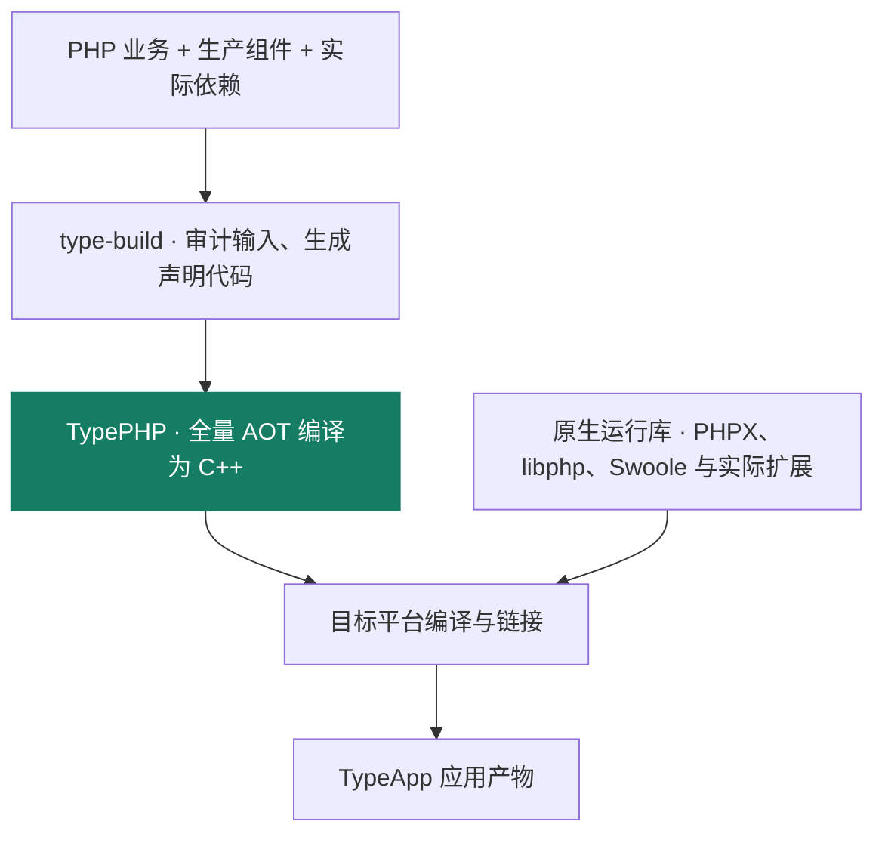

# TypePHP 全量编译

TypePHP 是 TypeApp 的核心编译技术。它把生产 PHP 实现预先编译为 C++，再通过目标平台的原生工具链生成可执行程序。业务代码保留 PHP 的开发方式，生产运行执行编译结果。

## 从 PHP 到原生应用



`type-build` 负责组织构建输入和验证环境，TypePHP 负责语言编译。路由、配置、模型和声明操作在构建期生成显式代码，随后与业务一起编译。这样可以提前完成源码加载、声明发现和装配工作，让运行入口直接进入应用逻辑。

PHPX、libphp 和 Swoole 等原生库提供执行支持或扩展能力，本身不作为 PHP 源码交给 TypePHP 编译。原生编译与完整静态链接是两个条件；当前产物的文件布局见[构建与部署](deployment.md#当前构建状态)。

## 全量编译的范围

| 输入 | 构建要求 |
| --- | --- |
| 框架与业务 PHP | 全部生产实现进入编译清单，包括后台角色和命令入口 |
| 生成代码 | 配置、路由、模型与声明操作的生成结果同样编译 |
| 生产 Composer 依赖 | 根据锁定版本审计实际源码；不支持的输入明确失败 |
| 开发工具与测试 | 留在开发和构建侧，不因安装而进入生产程序 |
| 部署配置与秘密 | 保持外置，不编入程序、源码身份或公开材料 |

全量指生产实现的编译覆盖。构建失败不会退回业务源码解释执行，也不会把旧二进制当作本次成功结果。生产实现不能通过改放开发依赖来避开审计。

固定 Swoole 扩展的官方内置 PHP 库按其官方机制加载，版本、摘要和开关纳入产物身份。这一既定例外不适用于业务、框架组件或其他第三方 PHP 源码。

## 开发与编译共用一套业务

开发阶段使用 PHP CLI 获取快速反馈，生产阶段使用 TypePHP 编译入口。源码应遵守锁定版本的类型、对象和回调规则；PHP 开发运行成功不等于原生编译或行为验收通过。

独立应用在项目根执行：

```bash
php vendor/bin/type doctor type-app.json build
composer build
```

当前主仓锁定 TypePHP 0.9.3、PHPX 2.9.2 和 PHP 8.5.10 ZTS，准确版本以项目锁文件为准。语言约束与适配依据见[TypePHP 语法基线](https://github.com/zoujingli/typeapp/blob/main/docs/standards/typephp.md)，上游编译器见[TypePHP](https://github.com/swoole/typephp)。

## 编译之后还要验证什么

编译成功证明输入可以生成原生产物；应用是否正确，还需要验证协议响应、事务、故障、停止与资源释放。相同源码在不同平台分别构建，验收记录关联准确的源码、工具链、配置和程序摘要。

AOT 与构建期装配为减少运行时开销提供基础，具体收益依赖负载；当前测量方法和证据见[性能与调优](performance.md)。应用能力的验收边界见[基础能力](capabilities.md)。
